import productPreview from './product.jpg';

<ProductCard
  name="Familias de ventanas para Revit"
  eyebrow="Conjunto de familias de Revit"
  description="Ventanas practicables, correderas, de esquina y de otras formas, listas para colocar en Revit."
  image={productPreview}
  imageAlt="Vista previa del conjunto de ventanas para Revit"
  buyUrl="https://bimcore.one/products/windows"
  ecwidProductId="794237685"
  buyLabel="Comprar"
  shopLabel="Ir a la tienda"
/>

## 1. INFORMACIÓN GENERAL

- Nombre del conjunto Ventanas
- Versión del conjunto descrita en la instrucción original 1.0.1
- Versión de Revit 2019

### Descripción

Este conjunto de familias permite modelar ventanas de distintas formas, conjuntos de puerta y ventana para balcones, ventanas de cubierta, correderas, de esquina y de mirador, con paños superiores o inferiores, en Autodesk Revit.

Está pensado para diseñadores de interiores. La geometría del marco, las hojas, el vidrio y los demás elementos está simplificada y se ha creado con las herramientas de Revit.

### Carga y colocación

Para ver y cargar las familias, abre el proyecto de ventanas, copia las que necesites con Ctrl+C y pégalas en tu proyecto con Ctrl+V. La familia se añadirá a la lista del navegador de proyectos, pero no quedará colocada.

También puedes abrir la carpeta de archivos de familia y arrastrarlos al proyecto.

Coloca las ventanas únicamente en planta, no en 3D. De lo contrario, puede aparecer un error que impida colocarlas.

:::note
Las imágenes y los nombres de los parámetros corresponden a la versión inglesa del conjunto, que aparece como 1.1.0 en las capturas. Las explicaciones siguen la instrucción original en ruso de la versión 1.0.1.
:::

## 2. CONTENIDO DEL CONJUNTO

El conjunto incluye estos grupos de la categoría Windows.

- Huecos de ventana (Window openings)
- Ventanas rectangulares, de arco, trapezoidales, triangulares, circulares y poligonales (Windows)
- Conjuntos para balcones (Balcony units)
- Ventanas de esquina y de mirador (Corner and bay windows)
- Ventanas correderas (Sliding windows)
- Ventanas de cubierta (Roof windows)
- Barrotillos (Muntins)
- Hojas (Sashes)
- Etiqueta de ventana (Window tag)

También incluye familias de la categoría Curtain Panels para colocar en un muro cortina.

- Puerta de muro cortina (Curtain door)
- Hoja de muro cortina (Curtain sash)

En total hay unas 170 familias.

## 3. ELEMENTOS COMUNES

Estos elementos se repiten en varias familias.

### Dimensiones

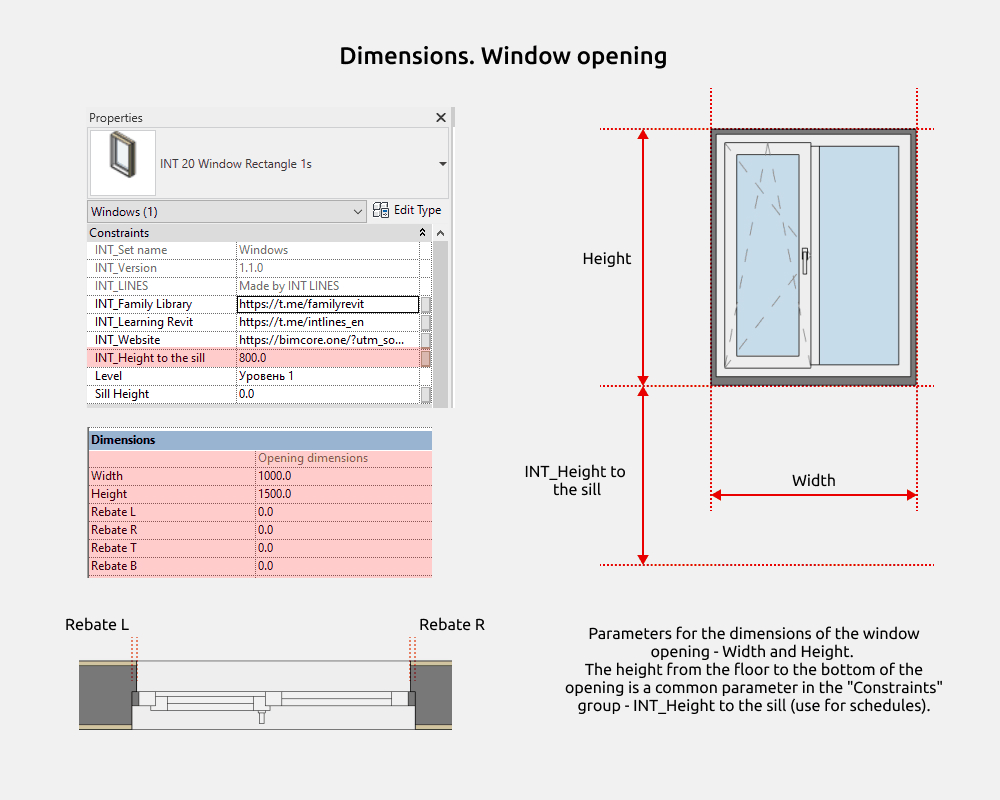

Puedes modificar la anchura, la altura y los rebajes del hueco. **INT_Height to the sill** controla la altura hasta la parte inferior del hueco y se incluye en las tablas de planificación y en la etiqueta.

**Width** y **Height** son las dimensiones del hueco.

**Rough Width** y **Rough Height** son las dimensiones de la ventana, calculadas restando las holguras de montaje. La anchura es **Width** menos **Gap_L** y **Gap_R**; la altura es **Height** menos **Gap_T** y **Gap_B**.

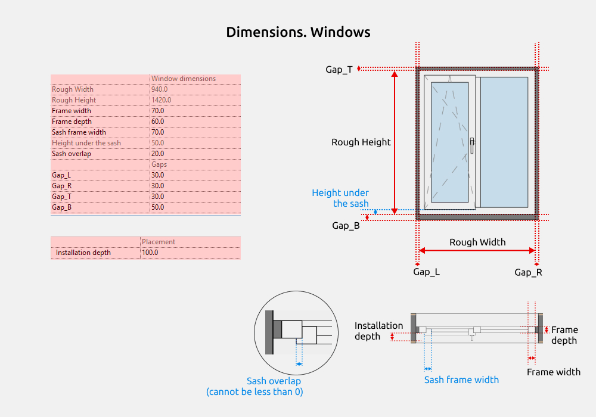

**Installation depth** desplaza el marco hacia el interior del hueco.

Las holguras de montaje pueden reducirse a 0. El solape de la hoja no puede ser negativo.

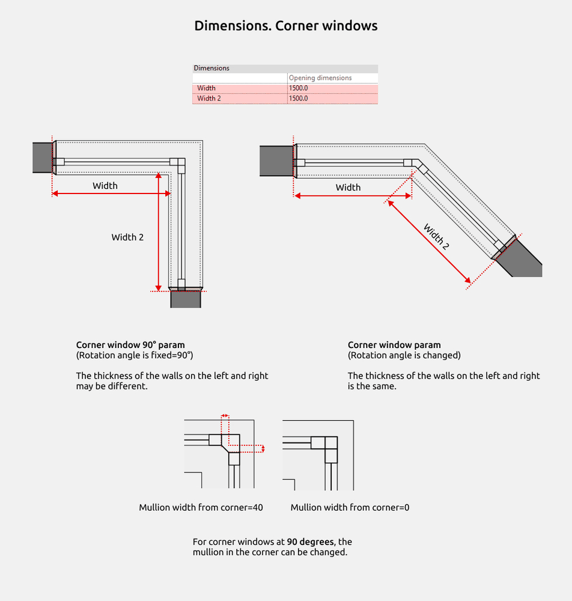

La anchura del hueco en las ventanas de esquina se mide desde el muro principal, por la línea gris discontinua, y no desde los revestimientos del hueco.

En Corner window 90°, el ángulo es fijo y los muros pueden tener distintos espesores. En Corner window, el ángulo se puede modificar y los muros tienen el mismo espesor.

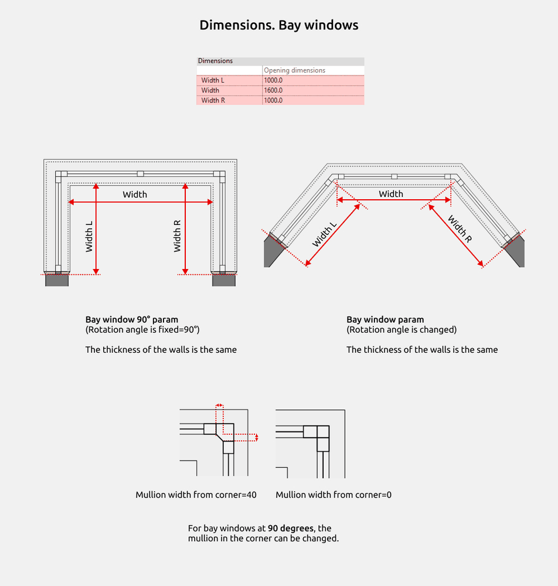

La anchura del hueco en las ventanas de mirador también se mide desde el muro principal, siguiendo la línea gris discontinua.

En Bay window 90°, el ángulo es fijo. En Bay window se puede modificar. En ambos casos, los muros tienen el mismo espesor.

### Acabados

Si los acabados se modelan como muros delgados adicionales unidos al muro principal, la ventana debe desplazarse ese espesor para ajustarse a las dimensiones.

El acabado puede estar en el exterior o en el interior.

Cuando se utiliza un muro adicional para el acabado, introduce un espesor positivo en los parámetros de la ventana. Si el acabado forma parte de un muro de varias capas, introduce un valor negativo.

### Revestimientos del hueco

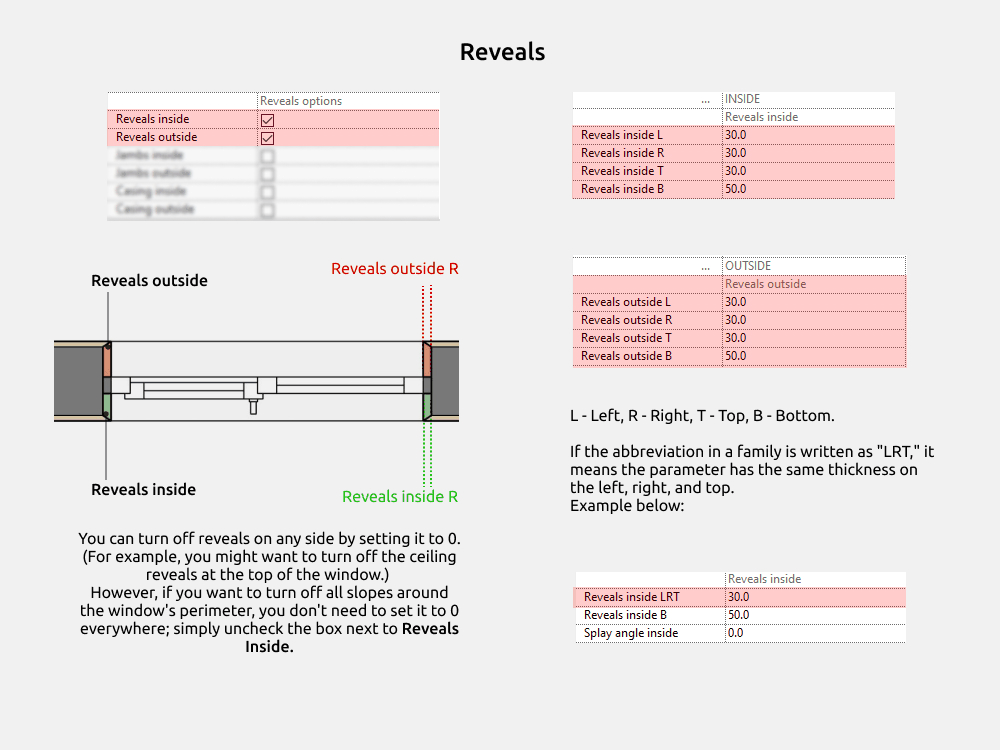

Los revestimientos de jambas, dintel y parte inferior se modelan con familias anidadas compartidas de la categoría Walls. **Reveals outside** y **Reveals inside** permiten activarlos o desactivarlos.

En los nombres, L significa izquierda, R derecha, T arriba y B abajo. LRT indica que el parámetro utiliza el mismo espesor a la izquierda, a la derecha y arriba.

El valor de **Splay angle inside** no puede superar el espesor de los revestimientos laterales y superior, según la limitación mostrada en la imagen.

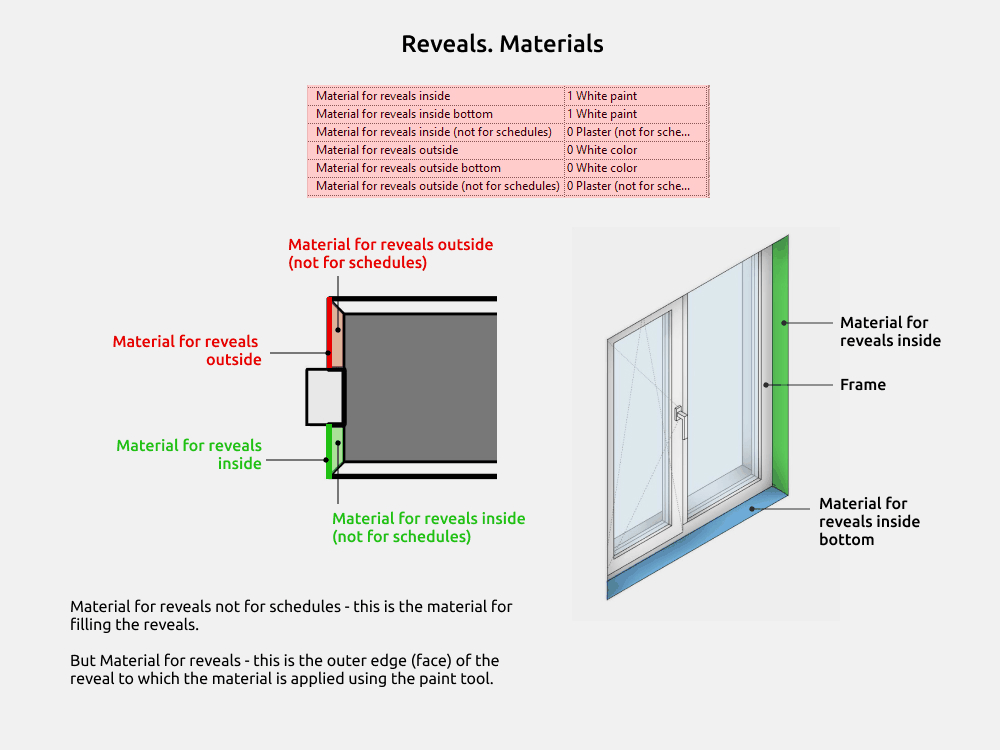

Los materiales están separados para calcular la superficie de una sola cara del revestimiento, en lugar de incluir las demás caras y obtener datos incorrectos en las tablas.

**Reveals material not for schedules** corresponde al cuerpo del revestimiento y no se utiliza para la tabla de planificación.

**Reveals material** corresponde a la cara exterior del revestimiento, donde el material se aplica con la herramienta de pintura. Permite calcular la superficie de esa cara.

### Repisas y vierteaguas

La familia anidada compartida tiene dos tipos.

- Repisa interior (Sill inside)
- Vierteaguas exterior (Sill outside)

Por defecto, el vuelo respecto al muro, la anchura de las prolongaciones laterales y la altura del borde colgante tienen valor 0. En la repisa interior son **Sill inside Overhang from the wall**, **Sill ears inside width** y **Sill nosing inside height**.

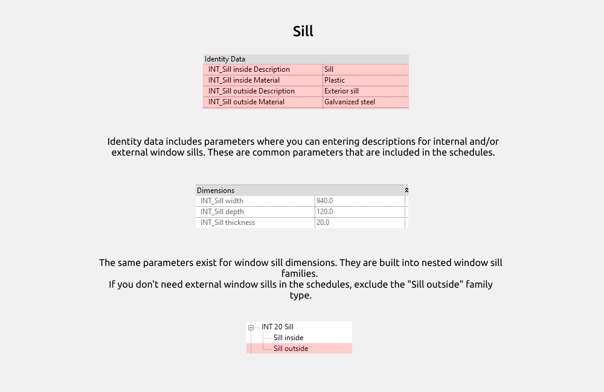

El apartado de identificación incluye parámetros para escribir la descripción de las piezas interiores y exteriores. Son parámetros compartidos que se incluyen en las tablas de planificación.

Las dimensiones también tienen parámetros compartidos dentro de las familias anidadas. Si no necesitas incluir los vierteaguas exteriores en las tablas, excluye el tipo Sill outside.

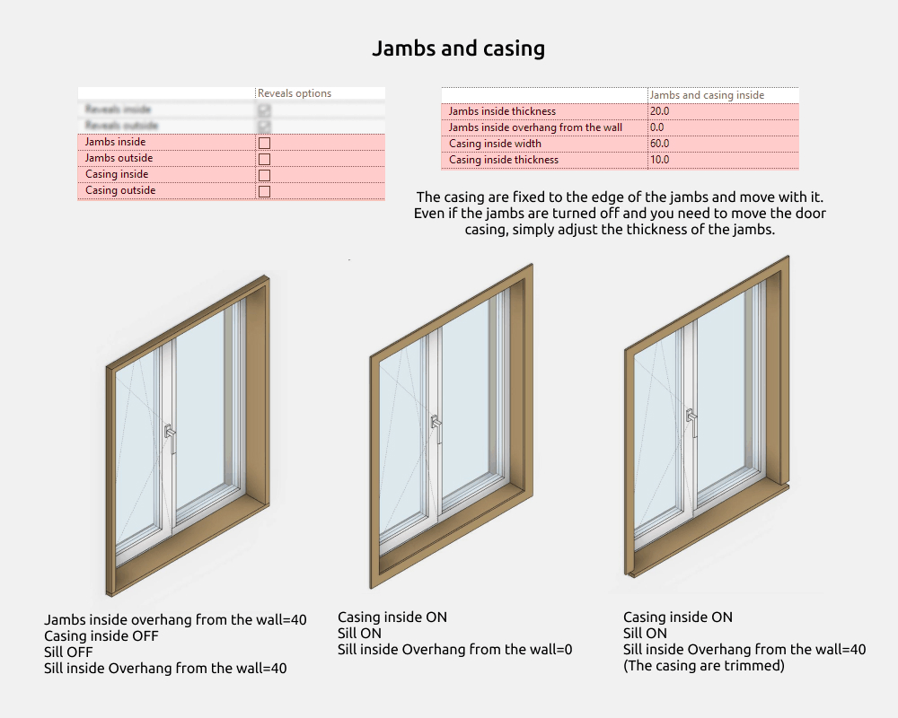

Las molduras están fijadas al borde del suplemento del marco y se desplazan con él. Aunque el suplemento esté desactivado, puedes modificar su espesor para mover las molduras.

### Materiales interiores y exteriores de la ventana

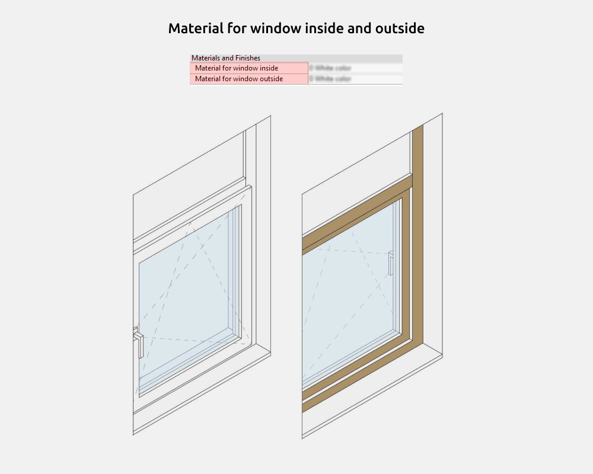

### Hojas

Las familias de hojas se cargan por separado. Por defecto, las ventanas solo contienen la familia Glass.

Si únicamente necesitas mostrar la distribución de los paños, no hace falta cargar una hoja.

Después de cargarla, sustituye Glass por el tipo de apertura en la lista desplegable.

La familia Glass tiene dos tipos.

- Vidrio (01.Glass)
- Hoja opaca sin vidrio (02.Solid sash)

La familia Sash incluye estos tipos.

- Practicable a la izquierda (01.Left handing)
- Practicable a la derecha (02.Right handing)
- Abatible inferior (03.Hopper)
- Oscilobatiente a la izquierda (04.Left tilt-and-turn)
- Oscilobatiente a la derecha (05.Right tilt-and-turn)
- Proyectante superior (06.Top-hung)
- Pivotante de eje vertical (07.Pivot vertical)
- Pivotante de eje horizontal (08.Pivot horizontal)
- Corredera a la izquierda (09.Tilt-and-slide Left)
- Corredera a la derecha (10.Tilt-and-slide Right)

En los dos tipos correderos, el tipo permite desplazar la flecha que se muestra en planta.

La familia Lifting sash tiene dos tipos.

- Sin barrotillos (01.Without muntins)
- Con barrotillos (02.With muntins)

Esta última incluye una sola distribución de barrotillos. Para otra distribución, utiliza las familias de la carpeta 06.Muntins.

### Sentido de apertura

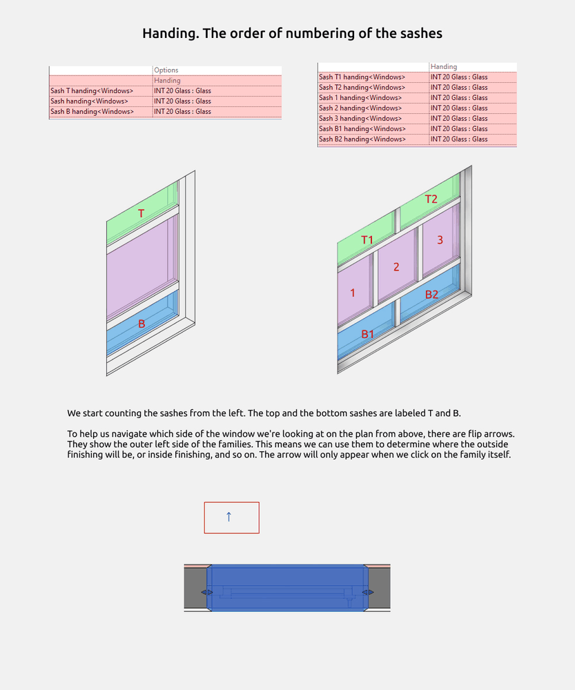

Las hojas se numeran desde la izquierda. T y B identifican las hojas superiores e inferiores; L y R, las izquierdas y derechas.

Las flechas de volteo ayudan a reconocer la orientación en planta. Indican el lado exterior izquierdo de la familia, lo que permite identificar dónde quedarán los acabados exteriores e interiores. La flecha solo aparece al seleccionar la familia.

### Niveles de detalle

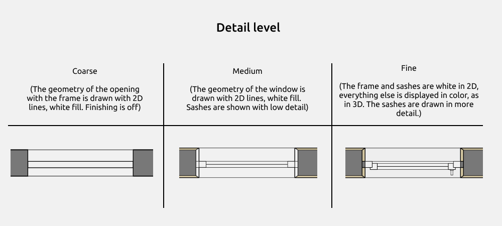

En el nivel bajo se muestra el hueco con las líneas del marco. Conviene ocultar los muros adicionales de acabado, ya que el hueco se representa según el muro principal.

En el nivel medio, la geometría se representa con líneas 2D y relleno blanco. Las hojas están simplificadas. Este nivel resulta más cómodo cuando las ventanas de formas irregulares aparecen recortadas en planta.

En el nivel alto, el marco y las hojas tienen relleno blanco en 2D. El resto se muestra en color, como en 3D, y las hojas tienen más detalle.

### Etiqueta de ventana

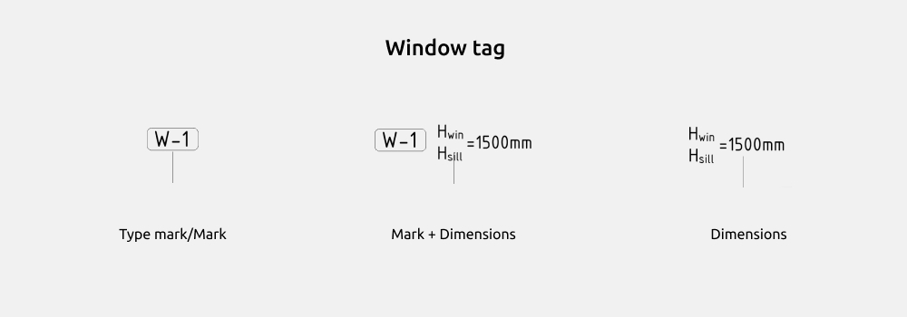

La etiqueta incluye estos tipos.

- Marca de tipo (Type mark)
- Marca de tipo y dimensiones (Type mark + Dimensions)
- Marca de ejemplar (Mark)
- Marca de ejemplar y dimensiones (Mark + Dimensions)
- Dimensiones (Dimensions)

## 4. PRESENTACIÓN

### Ajustes gráficos

Para cambiar el color, el grosor o el patrón de las líneas, abre la ficha Gestionar, selecciona Estilos de objeto y busca Ventanas o Paneles de muro cortina.

También puedes ocultar las líneas de apertura en Reemplazos de visibilidad/gráficos.

<CTA type="guide" />
