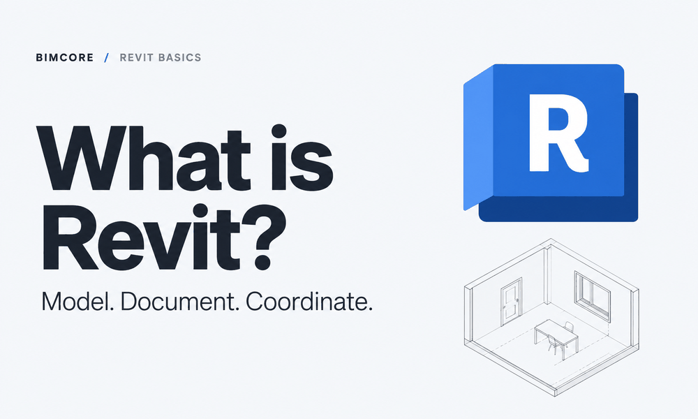
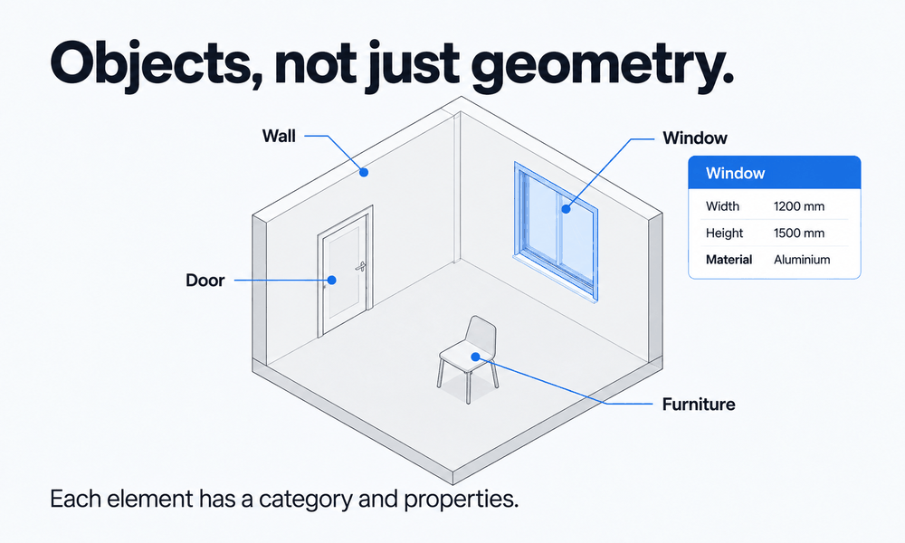
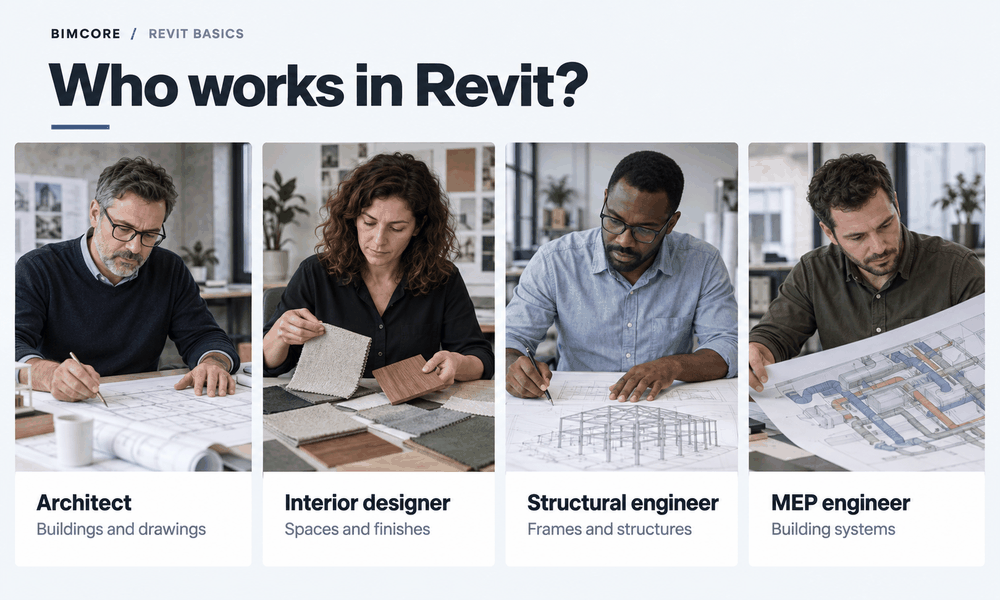
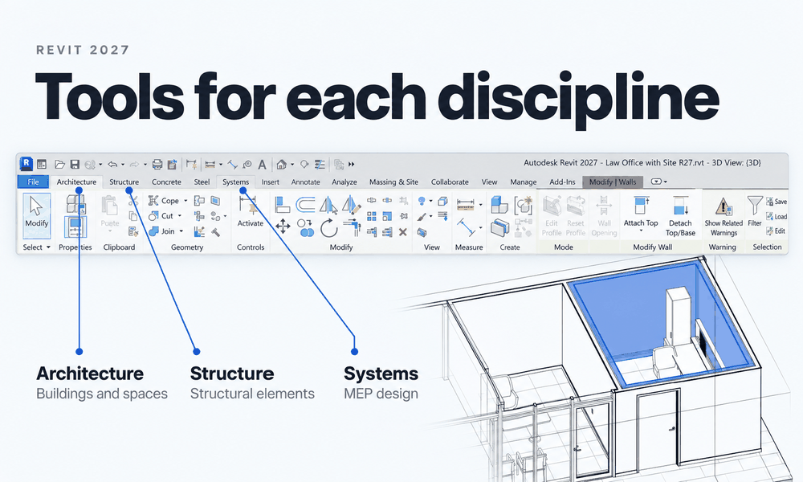
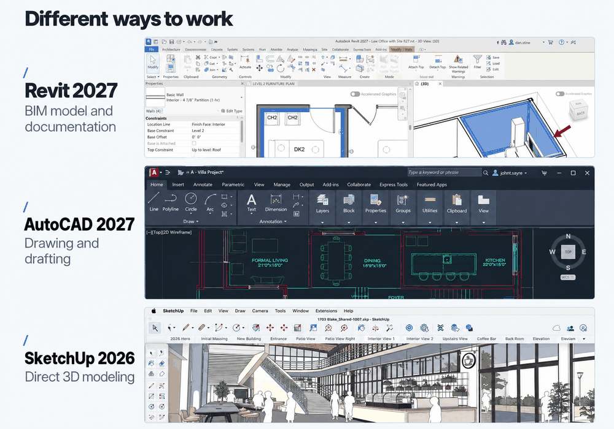
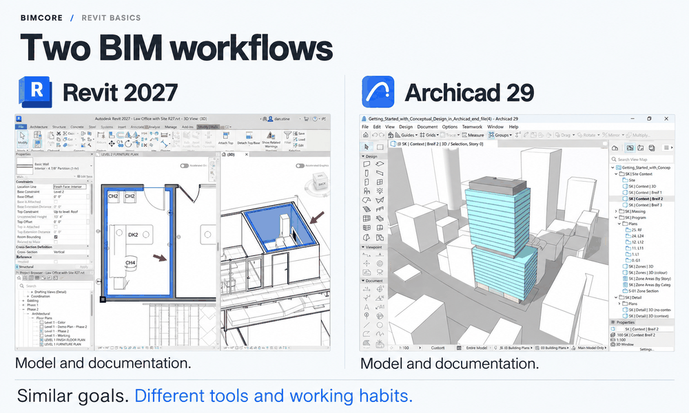
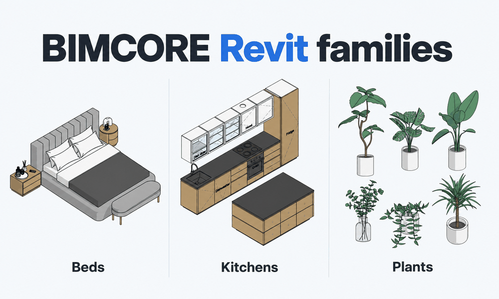
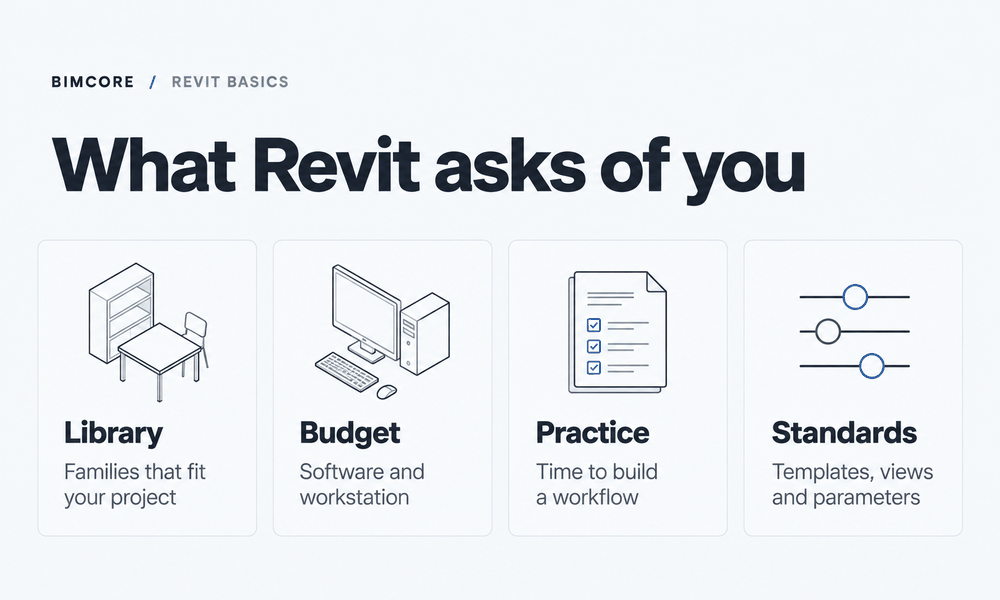
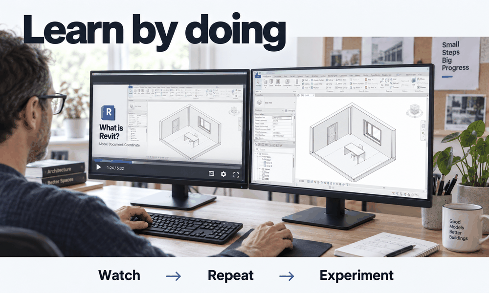

Autodesk Revit es un programa que permite crear el modelo de información de un edificio y generar a partir de él los planos para construirlo. Si eres constructor, arquitecto, diseñador de interiores o ingeniero y esta definición no te dice nada, en este artículo te explicaré el programa con palabras sencillas. ¿Para qué sirve y quién lo necesita? ¿Qué tareas resuelve a la perfección y cuáles a duras penas? ¿Cuánto cuesta aprenderlo, cuánto tiempo lleva y cómo se puede ganar dinero con él? Y, por supuesto, ¿te conviene pasarte a Revit? ¡Vamos a verlo!

## 1. Qué es Revit, explicado de forma sencilla

Revit es un programa para diseñar todo lo que se pueda construir, desde casas particulares hasta rascacielos. Su particularidad es que diseñas directamente en 3D. En la práctica, creas una copia digital a tamaño real del futuro edificio. Revit permite insertar directamente en el proyecto objetos ya preparados, como muros, ventanas y cubiertas. No necesitas usar líneas (AutoCAD) ni crear por tu cuenta geometría 3D desde cero (SketchUp) para que un elemento se parezca a un muro o una ventana. Se parece un poco a Los Sims, pero no te alegres antes de tiempo: diseñar en Revit no es igual de fácil. Diseñar con objetos y no con líneas y geometría 3D es la diferencia clave entre los programas BIM y CAD.

:::info[Qué significa BIM]

**BIM significa Building Information Modeling, es decir, modelado de información de construcción.**

En otras palabras, en estos programas construyes literalmente un modelo de información. La información es lo que aparece después de colocar un objeto, ya sea un muro o una ventana. Incluye las dimensiones, el material y otros atributos que tú decidas añadir. Todos los programas que trabajan con objetos y no con líneas son programas BIM.

:::

:::info[Qué significa CAD]

**CAD significa Computer-Aided Design, es decir, diseño asistido por ordenador.**

Estos programas te ayudan a pasar de crear dibujos a lápiz y a mano a crear planos con líneas y geometría 3D en un ordenador. Es decir, son el primer paso después del dibujo sobre papel.

:::

Después de crear el modelo de información 3D del edificio, Revit utiliza unas entidades especiales llamadas vistas para preparar la documentación. Una vista muestra una proyección determinada del objeto desde arriba, abajo, delante, detrás o un lateral, o bien una sección. La vista cambia al instante cuando cambia el modelo de información, por lo que no es necesario controlar manualmente los cambios en cada plano.

:::note[De dónde viene el nombre Revit]

El nombre Revit procede de la expresión Revise Instantly precisamente porque cualquier cambio en el modelo modifica de inmediato su representación en todas las vistas. Esto es realmente muy cómodo y útil.
:::

En las vistas puedes utilizar herramientas para colocar cotas y etiquetar elementos, de modo que en la obra se entienda cómo y con qué se debe construir nuestro edificio. Estas herramientas se llaman anotaciones y están en la pestaña correspondiente.

## 2. El resultado concreto que puedes obtener en Revit

Al utilizar Revit para diseñar, el resultado es un conjunto de planos a partir de los cuales se construirá el edificio. Entrando en detalle, puedes crear plantas, alzados, secciones y tablas de planificación de mobiliario y equipamiento. Sí, Revit calcula por sí solo las superficies y la cantidad de objetos que componen el proyecto, y después de AutoCAD esto es un auténtico milagro. Y sí, hay que comprobarlo y definir las reglas de cálculo: qué elementos debe contar y qué atributos debe utilizar. No es tan sencillo como parece, pero merece la pena. Una plantilla bien configurada ahorra muchísimo tiempo al calcular las tablas de planificación. En Revit incluso puedes conseguir una visualización arquitectónica de un nivel decente. Pero para visualizar interiores necesitas programas externos, como Enscape y Twinmotion (incluido con la suscripción desde Revit 2023.1 y con instalación independiente), o 3ds Max de Autodesk.

## 3. ¿A quién puede resultarle útil Revit?

Revit puede ser útil para arquitectos, ingenieros estructurales, ingenieros de instalaciones y diseñadores de interiores. Los arquitectos fueron los primeros para quienes se creó Revit, pero tampoco se olvidaron de los ingenieros estructurales ni de los de instalaciones.

Cada profesión tiene sus propias herramientas: los arquitectos trabajan en la pestaña **Arquitectura**, los ingenieros estructurales en **Estructura** y los ingenieros de instalaciones en **Sistemas**.
Pero ¿qué pasa con los diseñadores de interiores? Los diseñadores vieron lo fácil que se había vuelto la vida de los arquitectos, decidieron probar Revit y les salió bien. Sí, no todo funciona a la perfección. A veces hay que inventar una forma de resolver una tarea u otra, pero, en general, la tarea tiene solución y compensa.

## 4. En qué se diferencia Revit de AutoCAD y SketchUp

La principal diferencia entre Revit y AutoCAD o SketchUp es que su modelo de información y su documentación están conectados. Todos los elementos del modelo son objetos perfectamente conocidos y comprensibles tanto para ti como para el programa. Cada cambio dentro de Revit aparece al instante en el 3D, en los planos y en las tablas de planificación. Para explicar por completo las diferencias de trabajo con otros programas hacen falta artículos independientes, y [uno de ellos ya está publicado](/blog/revit-vs-sketchup-interior-design/). Pero puedo explicar aquí las diferencias importantes.

AutoCAD y SketchUp son [programas CAD](#1-qué-es-revit-explicado-de-forma-sencilla). Por eso, todo lo que creas en ellos es un conjunto de líneas o caras. Solo tú sabes que esta parte es una ventana y aquella otra un muro; el programa no lo sabe y —redoble de tambores— no puede contarlo automáticamente. Por eso tienes que contar las ventanas y calcular la superficie y el volumen de los muros a mano. Si mueves o eliminas una línea por accidente y la ventana desaparece de la planta (o lo hace tu malintencionado compañero), la tabla de planificación seguirá mostrando un número incorrecto de ventanas, y en la obra nadie te va a dar una palmadita en la cabeza por ello.

AutoCAD y SketchUp tienen distintos complementos que permiten resolver en parte estos problemas. En AutoCAD puedes crear un grupo a partir de un conjunto de líneas y llamarlo «silla», pero si te equivocas o te olvidas de crear el grupo, nadie te corregirá.

Revit, en cambio, simplemente no te dejará cometer ese error. Si eliminas una ventana por accidente, también desaparece de la tabla de planificación; si mueves un muro, la superficie se vuelve a calcular. Siempre puedes estar seguro de que un cambio introducido en un plano aparecerá en todas partes. Revit te ayuda a no cometer errores, pero ¿qué pide a cambio? Lo explico en el apartado [«Desventajas de Revit»](#6-desventajas-de-revit).

## 5. Competidores directos, o Revit frente a Archicad

Revit me gusta más, pero si ya conoces bien Archicad, solo necesitas Revit para ampliar tu experiencia y aumentar tu sueldo, no para conseguir funciones nuevas. Los programas son muy parecidos y resuelven las mismas tareas por caminos distintos y con herramientas ligeramente diferentes.

Autodesk Revit se toma más en serio las instalaciones y las estructuras. La corporación quiere cubrir todas las necesidades del diseño de edificios. Archicad es más bien un programa de arquitectura.

Una de las diferencias clave es que las vistas cambian al instante en Revit. En Archicad las vistas no cambian de inmediato, y eso cabrea a mucha gente, pero se puede trabajar así; basta con no olvidarse de actualizar las vistas :)

Además, Archicad siguió el camino de «ya lo hago todo yo» y creó más modelos para los usuarios. Revit decidió crear una «caña de pescar» para que los arquitectos fabricaran por sí mismos todos los modelos que necesitaran, y llamó Editor de familias a esa caña. Ya llevo cinco años ganando dinero gracias a ella, creando [familias para diseñadores y arquitectos](https://bimcore.one/). ¡Gracias, Autodesk!

## 6. Desventajas de Revit

En pocas palabras, estas son las desventajas de Revit:

- Pocos modelos incluidos de serie
- Precio elevado
- No hay versión para macOS
- Crear el 3D lleva más tiempo y es más difícil
- Hay que vigilar los parámetros

La primera desventaja es la falta de una gran biblioteca de modelos. Es sencillamente imposible crear un proyecto real solo con las familias —así se llaman los objetos en Revit— que recibes al instalar el programa. Tienes que aprender a crearlas o utilizar familias gratuitas, de las que hay muchísimas en internet. Las hemos reunido en una [selección de fuentes](/es/blog/free-revit-family-websites/). Pero debes entender que, para un proyecto serio, tendrás que pasar mucho tiempo adaptándolas dolorosamente a tus necesidades. De ahí sale la siguiente desventaja para ti y ventaja para mí: las familias profesionales de pago. En ese punto el problema desaparece y Revit incluso supera a Archicad. Diseñar en Revit con modelos profesionales es un auténtico placer.

2. La segunda desventaja es el precio. De verdad tienes que valorar tu situación económica antes de comprar este programa. En septiembre de 2026, Autodesk indica que una suscripción anual a Revit cuesta unos 3000 dólares estadounidenses por usuario si se paga el año completo. El precio depende de la región y de las condiciones de compra, así que compruébalo en el [sitio web de Autodesk](https://www.autodesk.com/solutions/revit-subscription-faq) antes de pagar.

3. La tercera desventaja es que Revit solo funciona en Windows. Para trabajar en serio a nivel profesional, es mejor que no intentes instalarlo en un Mac mediante una máquina virtual como Parallels Desktop. El programa arrancará y podrás trabajar, pero no aguantará proyectos serios y, según las opiniones, se cerrará con frecuencia. Es mejor comprar un ordenador Windows independiente para trabajar con Revit.

4. La cuarta desventaja es que ahora tienes que crear en 3D en lugar de 2D, ¡y eso lleva más tiempo! No es algo exclusivo de Revit, sino de cualquier otro programa BIM. Dedicas más tiempo a crear los planos. Y diga quien diga lo contrario, justo después de aprender Revit no diseñarás más rápido. La velocidad solo llega con la experiencia, una plantilla adaptada a tus tareas y las familias necesarias. Puedes duplicar la velocidad de creación de un proyecto, pero para conseguirlo tienes que configurar el sistema para tus tareas.

:::warning[Advertencia]
Buscar y configurar familias consume el 50 % del tiempo de diseño en Revit. Por eso, si eres diseñador o arquitecto, puedo ofrecerte directamente mi [conjunto completo](https://bimcore.one/) para eliminar esta desventaja. Puedes ver qué incluyen los conjuntos y qué permiten hacer en las [guías de las familias](/es/guides/families/).
:::

5. La quinta desventaja es que hay que controlar los valores de los parámetros. Ahora estás obligado a tener en la cabeza lo que no se ve en los planos: los valores de los parámetros. En AutoCAD bastaba con mirar los planos para comprobar que estaban bien hechos. Aquí también tienes que entrar en Propiedades y comprobar qué marca tiene asignado un muro, según qué regla se oculta el mobiliario en las plantas donde no hace falta y muchas cosas más.

Esto añade carga de trabajo a los proyectistas y obliga a contratar especialistas BIM para organizar el trabajo en Revit.

## 7. Visualización en Revit

La visualización de Revit no es muy buena. Puedes conseguir una visualización decente de un proyecto arquitectónico, pero de un interior, desde luego que no. No he incluido la visualización entre las desventajas de Revit porque no es la función principal de este programa. Puedes obtener un resultado aceptable después de invertir muchísimas horas, pero es mejor utilizar otros programas.

Hay quien utiliza SketchUp, quien utiliza 3ds Max
y quien utiliza Enscape o Twinmotion, pero entonces aparece un problema desagradable:

:::warning[Advertencia]
Los modelos de Revit no sirven para visualización. Son esquemáticos, a menudo toscos y poco realistas. La configuración de texturas es muy limitada; no puedes conseguir que una silla de madera o un sillón tapizado se vean fotorrealistas en una visualización.
:::

Por eso se duplica el trabajo, algo que nadie quiere pero que sigue acompañando a la profesión de arquitecto de interiores. Hay que crear un modelo independiente para la visualización. Y hay que hacerlo ya en la primera fase, durante el concepto. Es una cantidad de trabajo enorme que uno preferiría no tener que rehacer después en Revit, pero toca hacerlo.

Se intenta resolver este problema, aunque sin demasiado entusiasmo. Twinmotion permite sustituir la familia de un sofá por su modelo fotorrealista, pero existe un problema con las dimensiones. Si cambias las dimensiones del sofá en Revit, en Twinmotion conservará el tamaño anterior. Y mantener actualizados dos modelos es todo un trabajo.

A día de hoy no existe una solución para evitar la duplicación del modelado, así que lo aceptamos y seguimos trabajando. La IA, por supuesto, puede ayudar un poco generando una imagen fotorrealista a partir de una vista esquemática de Revit. Pero vigila los detalles y, si quieres introducir cambios, prepárate para entrar en guerra con la IA.

## 8. Revit o Revit LT

Revit LT puede servir para crear un modelo arquitectónico y sus planos si no necesitas complementos, instalaciones ni trabajo colaborativo en un único modelo. Debido al elevado precio de Revit, algunas empresas se plantean usar Revit LT, pero esta versión no admite complementos, y eso supone el 50 % de toda la automatización del trabajo.
También hay otras limitaciones. Según la [comparación oficial de Autodesk](https://www.autodesk.com/products/revit/compare), Revit LT no dispone de las siguientes funciones:

- Complementos de terceros mediante la API ni Dynamo.
- Trabajo colaborativo de varios usuarios en un único modelo mediante subproyectos.
- Modelado completo de instalaciones MEP ni herramientas estructurales avanzadas, como el modelo analítico y las armaduras.
- Trabajo con nubes de puntos.
- Comprobación de interferencias ni herramientas Copiar/Supervisar.
- Renderizado fotorrealista integrado.

Al mismo tiempo, LT cuenta con el Editor de familias, plantas, secciones, alzados, tablas de planificación y planos. Puede ser suficiente para trabajar en solitario con pequeños proyectos arquitectónicos. Pero si tu equipo depende de los complementos o de un modelo compartido, el ahorro en la suscripción puede convertirse en limitaciones para el propio trabajo.

## 9. ¿Es difícil aprender Revit y cuánto tiempo lleva?

Mi respuesta sincera es que, según tus características, puedes dominar las funciones básicas y empezar un trabajo profesional real en un plazo de entre dos semanas y dos meses. Pero tardarás cerca de un año en darte todos los golpes posibles y dejar de hacer preguntas a la IA con desesperación. Durante ese tiempo te enfrentarás a todos los problemas críticos y aprenderás a resolverlos.

:::tip[Cómo aprender de forma más eficaz]

¿Hay algo que acelere el aprendizaje? No. Aquí no existe una pastilla mágica, y aprender no será fácil porque nuestras neuronas se resisten hasta el final y no quieren conectarse. Pero puedo aconsejarte que aprendas de forma interactiva. Repite todo lo que encuentres, experimenta, busca tu propio enfoque, inventa. Esto alargará un poco el proceso de aprendizaje, pero lo hará mucho más eficaz. Puedes empezar por el curso gratuito de Revit para diseñadores de interiores.

:::

Además de crear proyectos, también tendrás que aprender a desarrollar familias. No es obligatorio si en tu equipo hay un desarrollador de familias, pero es una habilidad útil. Se puede dominar en uno o dos meses. Eso es más tiempo que el necesario para aprender a desarrollar un proyecto y es un poco más difícil, pero para algunas personas, como yo, es puro placer :)

## 10. Cómo ganar dinero con Revit y qué profesiones exigen conocerlo
Puedes ganar dinero con Revit tanto en una empresa como por tu cuenta.

Estas son las profesiones de empresa que requieren Revit:

- Arquitecto, diseñador de interiores, ingeniero estructural o ingeniero de instalaciones. Tomas decisiones de diseño en tu especialidad y las documentas en el modelo y en los planos. Revit ayuda a trabajar, pero no sustituye los conocimientos profesionales.
- Modelador BIM, BIM master o especialista BIM. Normalmente levantas modelos 3D, rellenas parámetros, creas familias y preparas vistas, planos y tablas de planificación.
- Coordinador BIM. Compruebas la coordinación entre los modelos de distintas disciplinas, encuentras interferencias, envías observaciones a los responsables y controlas que se resuelvan.
- BIM manager. Organizas el trabajo del equipo con los modelos, desarrollas normas y plantillas, eliges herramientas de automatización y ayudas a los empleados a trabajar según requisitos comunes.

A todas las profesiones cuyo nombre empieza por BIM suelen llegar arquitectos e ingenieros que ya se sienten limitados en su profesión y disfrutan automatizando procesos. Aprenden en la práctica o en cursos muy especializados. Además de Revit, necesitan conocer algunos programas especializados adicionales, como Navisworks.

Estas son algunas formas de utilizar Revit como profesional independiente:

- Levantar un modelo BIM en Revit a partir de planos 2D.
- Desarrollar familias.
- Crear modelos BIM a partir de nubes de puntos.
- Desarrollar planos para diseñadores de interiores y arquitectos.

- Automatizar operaciones repetitivas si conoces Dynamo o sabes programar para Revit.

La forma más sencilla de empezar es crear modelos de información a partir de planos 2D. Pero, si te esfuerzas, puedes aprender cualquiera de estas especialidades.

## 11. Datos breves sobre Revit
Revit está destinado al modelado de información de edificios y a la preparación de documentación de proyectos de construcción. A continuación, los datos puros y duros sobre Revit.

| Dato | Información |
|---|---|
| Primera versión | 2000 |
| Empresa | Autodesk, que adquirió Revit Technology Corporation en 2002 |
| Versión actual | Revit 2027 |
| Sistema operativo | Windows; no existe una versión independiente para macOS |
| .rvt | Archivo de proyecto |
| .rfa | Archivo de familia cargable |
| .rte | Plantilla de proyecto |
| .rft | Plantilla de familia |
| Suscripción anual | Unos 3000 dólares estadounidenses por usuario |
| Para quién | Arquitectos, diseñadores de interiores, ingenieros estructurales, ingenieros de instalaciones y especialistas BIM |

Las fuentes sobre la [suscripción y la versión](https://www.autodesk.com/solutions/revit-subscription-faq), los [formatos de archivo](https://www.autodesk.com/support/technical/article/caas/sfdcarticles/sfdcarticles/Revit-file-types.html) y el [origen del nombre](https://www.autodesk.com/support/technical/article/caas/sfdcarticles/sfdcarticles/How-did-Revit-get-its-name.html) están disponibles en el sitio web de Autodesk.

## ¿Te conviene aprender Revit?

Necesitas aprender Revit si:
1. Quieres trabajar en una gran empresa como arquitecto, diseñador, ingeniero o especialista BIM
2. Quieres automatizar el trabajo de arquitectos, diseñadores y proyectistas
3. Quieres producir documentación constructiva con el mínimo de errores
4. Quieres organizar un trabajo colaborativo cómodo para producir documentación
5. Quieres ganar dinero ofreciendo servicios de Revit por tu cuenta

## Preguntas y respuestas
A continuación encontrarás respuestas breves sobre el precio, el aprendizaje y la elección de una versión de Revit.

### ¿Revit es gratis?

Revit exige una licencia de pago para el trabajo comercial. Autodesk ofrece una versión de prueba y acceso educativo a quienes cumplen sus condiciones, pero la licencia educativa no está destinada a proyectos comerciales.

### ¿Cómo puedo descargar gratis la versión de Revit para estudiantes?

Abre la [página de Revit para estudiantes y docentes en el sitio web de Autodesk](https://www.autodesk.com/education/edu-software/revit), inicia sesión en tu cuenta o crea una, selecciona el acceso para estudiantes y confirma que cumples los requisitos. Tras la confirmación, elige una versión disponible de Revit y descarga el instalador siguiendo las instrucciones de Autodesk.

### ¿Cuánto dura el acceso gratuito para estudiantes?

Autodesk ofrece a los estudiantes y docentes que cumplen las condiciones acceso gratuito durante un año, renovable mientras mantengan su derecho a utilizarlo. Este acceso está destinado a fines educativos, no al trabajo comercial.

### ¿Qué significa la palabra Revit?

El nombre Revit procede de la expresión Revise Instantly, que puede traducirse como «modificar al instante». Está relacionado con la actualización del modelo y de sus representaciones vinculadas cuando se introducen cambios.

### ¿Revit funciona en Mac?

No existe una versión independiente de Revit para macOS. Para ejecutarlo en un Mac hace falta un entorno Windows, y debes comprobar la compatibilidad de la configuración concreta antes de comprar el equipo.

### ¿Revit sirve para diseñar interiores?

Sí. En Revit puedes desarrollar documentación y esquemas 3D de interiores. Para trabajar cómodamente necesitarás [familias adecuadas](https://bimcore.one/), configurar las vistas y disponer de una plantilla para interiores. También tendrás que comprender el enfoque específico del diseño de interiores, que explicamos en nuestras [lecciones](/es/lessons/) y que tenemos previsto desarrollar en un futuro curso sobre creación de interiores en Revit.

### ¿Qué debería elegir, Revit o SketchUp?

Elige según el resultado que necesites. Revit merece la pena para preparar documentación, mientras que SketchUp sirve para modelar volúmenes rápidamente y buscar la forma.

### ¿Cuánto tiempo se tarda en aprender Revit?

Aprender los fundamentos de Revit lleva entre dos semanas y dos meses con práctica regular. El plazo depende de tus conocimientos de diseño, de las tareas y del tiempo que puedas dedicar al aprendizaje.

### ¿Es suficiente Revit LT?

Sí, si tu flujo de trabajo cabe dentro de sus posibilidades. Para utilizar complementos, modelar instalaciones y permitir que el equipo trabaje al mismo tiempo en un único modelo necesitarás Revit completo.

Si todavía tienes preguntas, te esperamos en nuestra comunidad.

<CTA type="lesson" />
