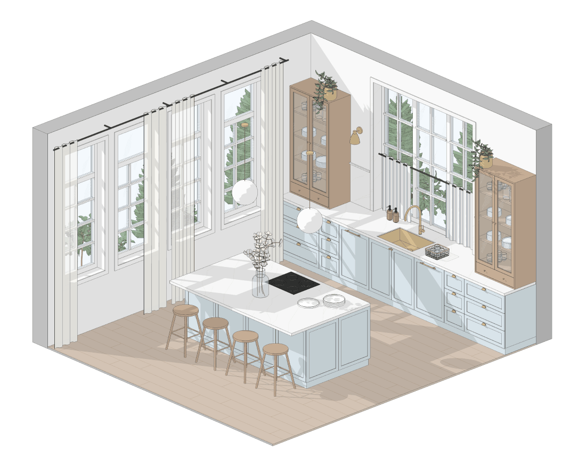
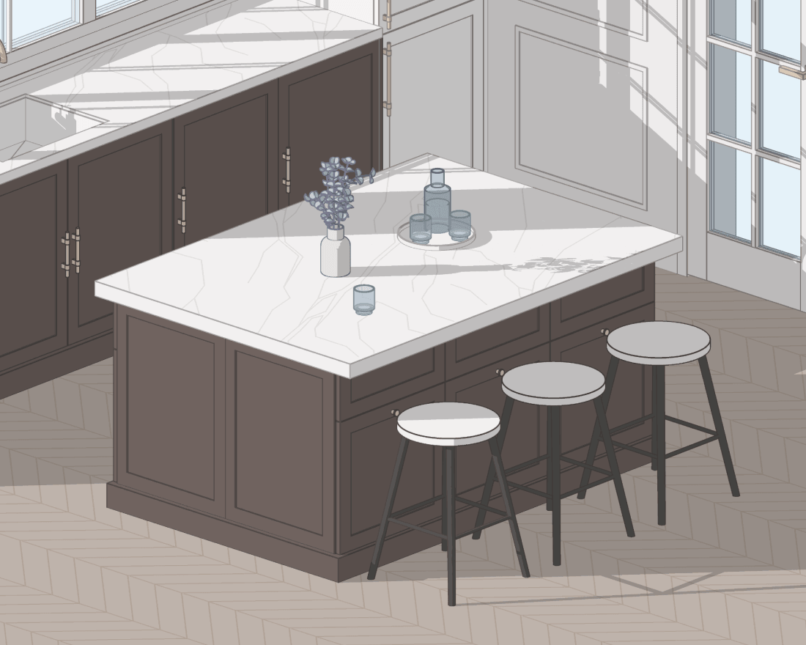

Разные варианты кухни, которые дизайнеры интерьера собрали в Revit из наших семейств «Кухни». Все варианты сделаны из модулей набора по реальным размерам, без ручных доработок. Для создания схем использовались только семейства BIMCORE, Revit и талант дизайнеров интерьера 😊

## 1. Кухня напротив окна

<truncate />

Красиво. Удобно, потому что много света. Приятно готовить и убираться.

:::warning[Важно]

Следите, чтобы открытое окно не пересекалось со смесителем кухонной мойки. Это частая ошибка новичков.

:::

:::info[Информация]
В наборе кухонная мойка вставляется в нижний модуль двумя способами: автоматически, когда она включается в самом модуле по галочке, и вручную, когда вы размещаете отдельное семейство раковины в столешнице. Мойка может быть как накладная, так и с подклейкой снизу.
:::

## 2. Витрины и стеклянные дверцы

Верхние шкафы со стеклянными дверцами со шпросами делают интерьер уютнее и интереснее. Если добавить подсветку и красиво расставить всё внутри, это каждый раз будет эстетическое удовольствие.

Также можно использовать витрины, они делают интерьер более историчным и аутентичным.

:::info[Информация]
В наборе «Кухни» у каждого модуля тип фасада выбирается из списка: стандартный, с рамкой внутри или снаружи, с интегрированной ручкой. Чтобы создать верхний ряд шкафов с рамкой, стеклом и шпросами, как на 3D-схеме, из выпадающего списка выбирайте фасады с рамкой снаружи, задавайте материал заполнения Стекло, а шпросы берите из набора «Окна» или ставьте стеклянный фасад со шпросами из набора «Шкафы».
:::

## 3. Кухня без верхних шкафов

Избавляет от необходимости постоянно тянуться и доставать всё сверху. Визуально разгружает помещение и делает его свободнее.

Хранение в таком варианте уходит в нижние модули и пеналы. В наборе есть нижние модули с одной или двумя распашными дверцами, модули с ящиками и пеналы до шести фасадов, поэтому точно смоделировать размер и положение фасадов можно ещё на стадии проекта.

## 4. Остров с барной зоной

Для многих семей это лучшее решение, если нужно быстро перекусить утром или вернувшись с работы. Не нужно отдельно накрывать на стол, просто присел и поел.

### Эргономика барной зоны острова

#### Высота острова

Если делаете высоту острова 850–900 мм, обратите внимание, что стулья должны быть полубарными, то есть высота сиденья около 600 мм.

Можно пользоваться правилом: 

`Высота сиденья стула = Верх столешницы минус 300 мм.` 

:::info[Информация]
Как определить высоту сиденья при высоте столешницы 900 мм?\
900 мм − 300 мм = 600 мм\
В итоге получаем оптимальную высоту сиденья стула 600 мм.
:::

Это максимально упрощенные рекомендации, но, действуя по ним, вы вряд ли ошибётесь.

#### Учитывайте рост жильцов

Для людей выше 180 см барную зону лучше сделать выше, около 1000–1100 мм. Так им будет заметно удобнее. Для этого зону приёма пищи придётся отделить от рабочей столешницы по высоте.

#### Пространство для ног

Важно не забыть про пространство для ног. Глубина свеса столешницы под колени обычно около 300 мм. Минимальное значение 250 мм. 

С максимальным свесом будьте аккуратны: вес столешницы должен остаться распределённым на кухонные модули или на жесткие боковые опоры, которые тоже можно реализовать из материала столешницы, сформировав П-образную арку.

:::info[Информация]
В наборе «Кухни» для острова есть отдельное семейство «Столешница островная», а сам остров собирается из обычных кухонных нижних модулей. Размеры столешницы и свес регулируются параметрами, поэтому вы легко создадите остров нужного размера.
:::

Набор «Кухни» для Revit нужен, чтобы собрать кухню в проекте интерьера и посчитать её с минимальными усилиями.

<ProductCard ecwidProductId="543629545" guideButton />

