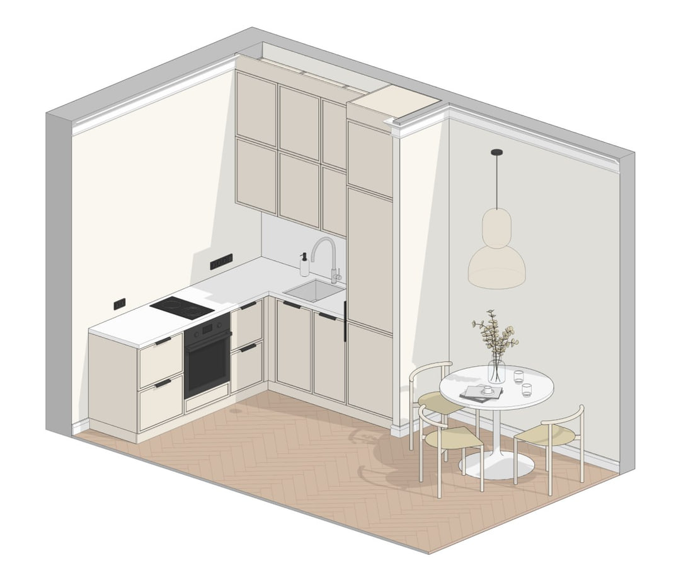
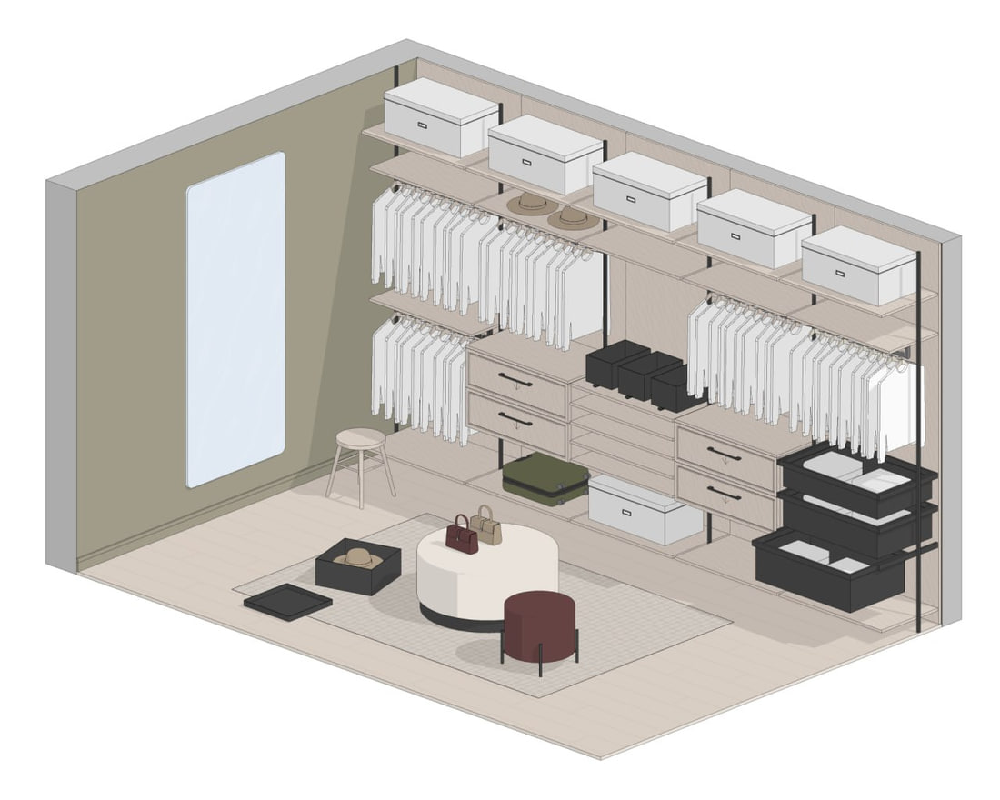
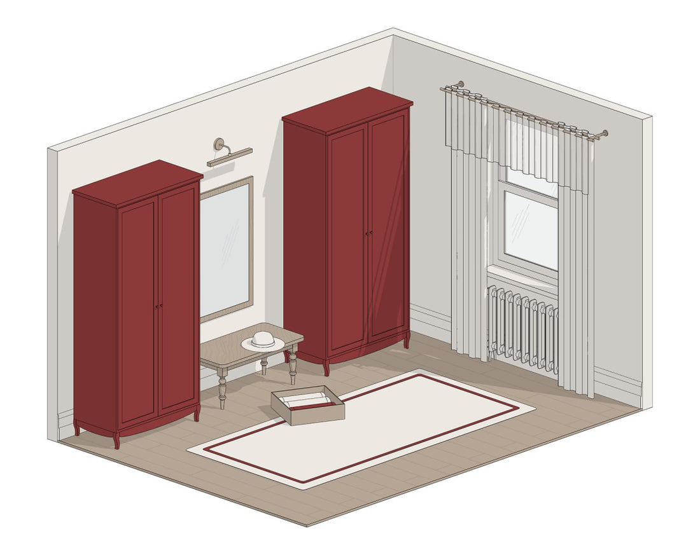

Самостоятельное моделирование мебели для интерьерного проекта в Revit с нуля занимает значительное время. Ниже пять популярных наборов семейств Revit
из магазина BIMCORE.ONE, которые закрывают базовые потребности дизайнера интерьера в Revit.

<truncate />

## 1. Кухни

Пожалуй, самое востребованное семейство для дизайнеров интерьера в Revit. Позволяет без труда создавать даже самые сложные кухни со встроенной техникой, разными типами ручек и способами открывания благодаря продуманной параметризации. Легко меняются размеры кухонного шкафа, настраиваются количество дверей и ящиков, размещение ручки. Есть возможность добавить интегрированную ручку или систему профилей Gola для фасадов без видимых ручек.

:::note[Примечание]
В США и Европе используют названия Gola profile system и Gola handleless system.
:::

Выгодно отличается от других семейств большим количеством разных типов дверей с настраиваемой рамкой, стеклом с разным креплением к раме двери.

Самое продаваемое семейство в BIMCORE.

**[Смотреть набор «Кухни» →](/guides/families/kitchen-for-revit)**

## 2. Гардеробы

Универсальный набор семейств для создания гардеробной комнаты в Revit. В набор включены две разные гардеробные системы:

- с открытыми полками с креплениями на направляющих;
- корпусная система в виде шкафа с дверцами или без них.

В семействах учли различное наполнение шкафов, пантографы, вешалки для одежды разной длины, выдвижные ящики в открытом и закрытом состоянии и много антуража для наполнения гардероба деталями.

Сделайте ваш проект гардероба понятным заказчику :)

**[Смотреть набор «Гардеробы» →](/guides/families/wardrobe-for-revit)**

## 3. Шкафы

Встраиваемые и отдельно стоящие шкафы и витрины удобно размещаются на планах в Revit. Полностью параметрические. Выбор типа ножек, способа размещения дверей, типа дверей, материала как внутри, так и снаружи шкафа.\
Всё это доступно в нашем параметрическом наборе шкафов для проектирования жилых помещений (квартир и домов).

**[Смотреть набор «Шкафы» →](/guides/families/storage-cabinets-for-revit)**

## 4. Сантехника

Один из самых крупных наборов семейств в [полной библиотеке BIMCORE](https://bimcore.one/). Параметрические ванны разной формы, включая ванну-яйцо, пристенную и отдельно стоящую ванну на ножках. Разные формы и стили смесителей как для ванны, так и для раковины. Параметрические душевые системы с интегрированным в поддон сливом. Отдельная возможность разместить слив в стене. Стеклянные ограждения душевых. Душевые системы с тропическим душем. Все материалы и размеры меняются, форма настраивается, а в спецификацию семейство попадает в правильной категории. Экономит десятки рабочих часов на поиске нужного семейства для ванной.

**[Смотреть набор «Сантехника» →](/guides/families/bathroom-for-revit)**

## 5. Кровати

Ультрапараметрическое семейство кровати. Настраивается абсолютно всё! Тип изголовья, наличие «ушек», ширина изголовья. Возможно отключить изголовье и использовать специальные мягкие панели с креплением на стену. Всё то, что нужно в реальных проектах. Вишенкой на торте является красивый внешний вид, отсутствие лишних линий на плане и настраиваемая форма подушек в 3D.\
В набор добавлена прикроватная тумба и банкетка, чтобы вы могли запроектировать всё помещение спальни из одного набора семейств для Revit.

**[Смотреть набор «Кровати» →](/guides/families/beds-for-revit)**

## Чем хороши наши семейства?

Созданы с одинаковыми параметрами в единой системе параметров BIMCORE. У общих параметров есть префикс INT (Интерьеры). Легко посчитать и увидеть габариты каждого семейства, не переживая об ошибках. Функционал именно для проектирования интерьеров. Никакого импорта из других программ, перегружающего Revit. Всё сделано только для того, чтобы сэкономить ваше время на проектировании в Revit.

<CTA type="guide" />
