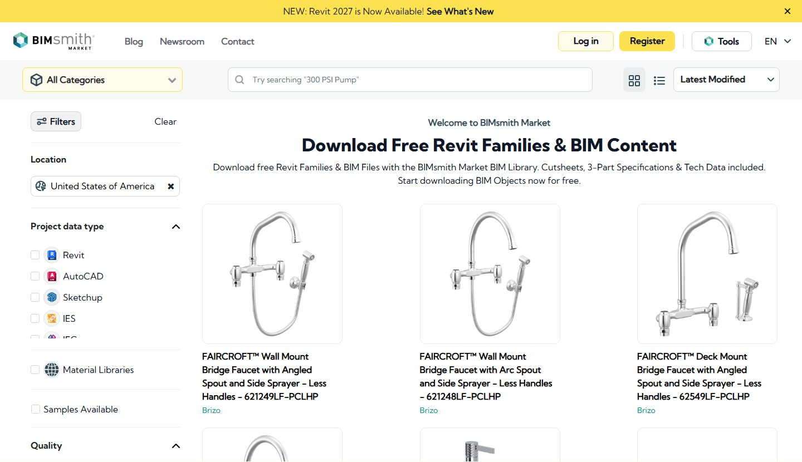
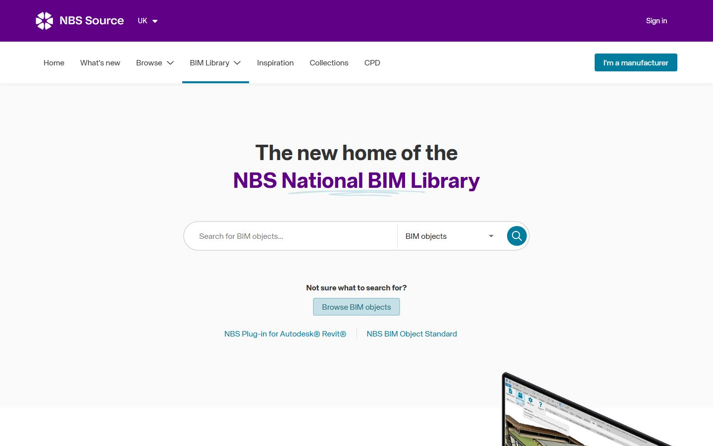
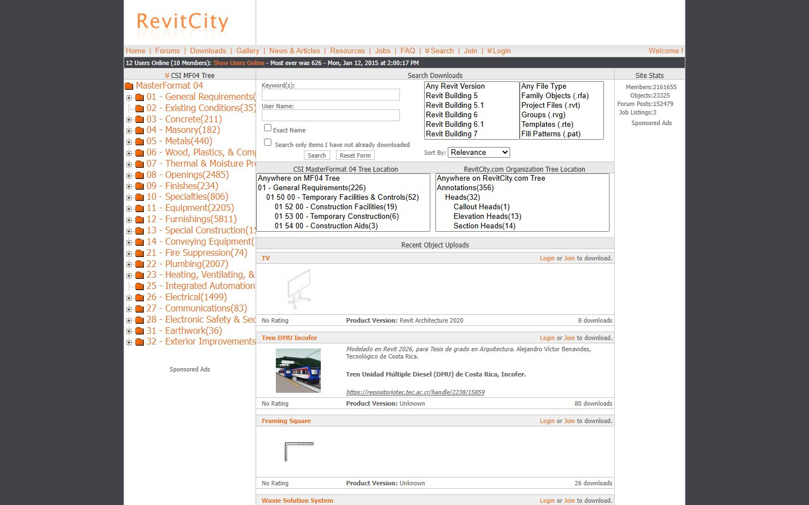
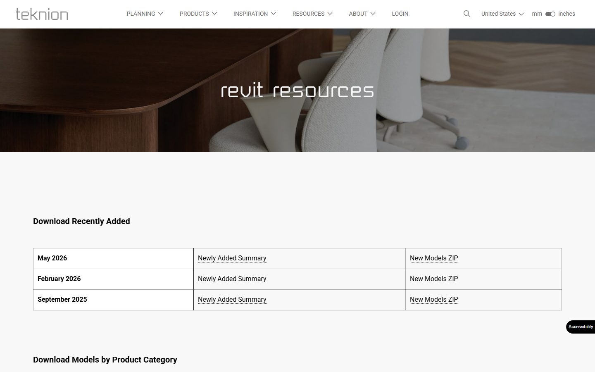
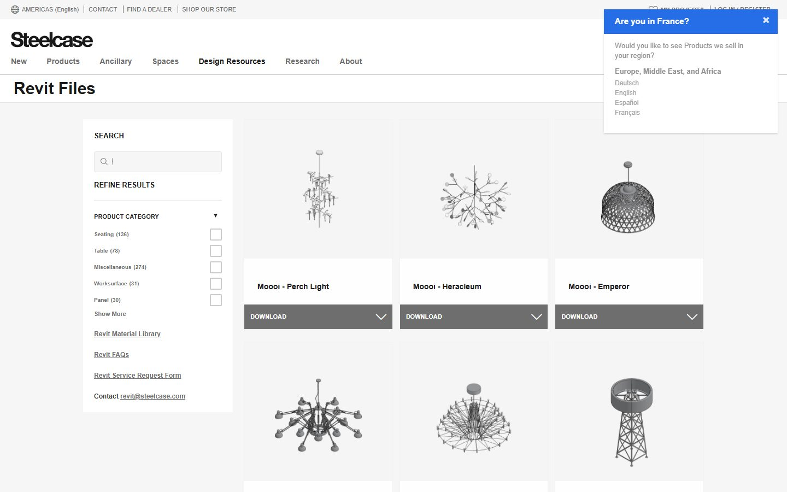
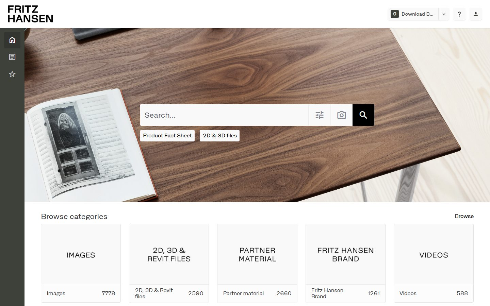
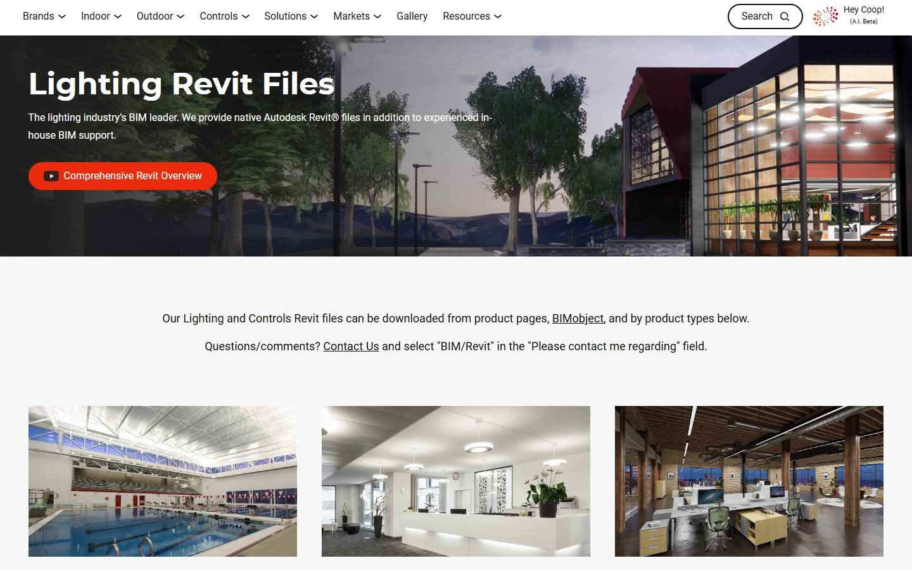
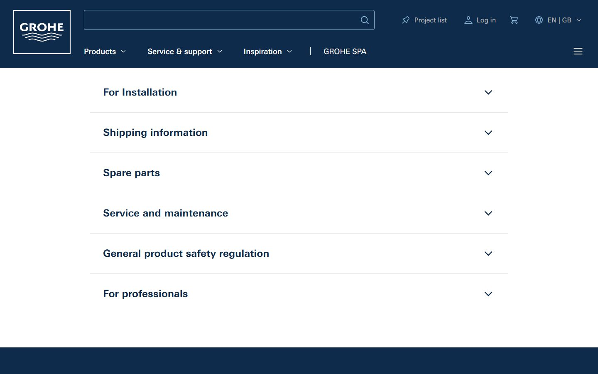

Бесплатные семейства Revit в 2026 году проще всего искать в трёх местах:
крупные BIM-каталоги, российские и международные библиотеки моделей, а также
сайты производителей. Ниже собран 31 источник от BIMCORE и BIMLIB до BIMobject,
Herman Miller, ERCO, Roca и Sub-Zero & Wolf. Все ссылки проверялись в июле 2026
года. У каждого сайта своя польза: где-то удобнее брать мебель, где-то свет,
сантехнику, двери, инженерные элементы или редкие пользовательские семейства.

<truncate />

## Быстрое сравнение

| Сайт | Что можно скачать | Где искать файлы |
|---|---|---|
| [BIMCORE](https://bimcore.one) | Бесплатные примеры из одной из лучших библиотек параметрических интерьерных семейств Revit для дизайнеров | Бесплатный аккаунт в плагине, затем инструкция по набору кухни |
| <a href="https://bimlib.pro/revit/" rel="nofollow">BIMLIB</a> | Российские BIM-модели и семейства Autodesk Revit по стандарту BIM 2.0 | Раздел «Семейства Ревит», фильтры по производителю, типу файла и категории |
| <a href="https://www.bimobject.com/ru-ua/Selfservice/Search/SearchHome.aspx" rel="nofollow">BIMobject</a> | BIM-объекты производителей: мебель, сантехника, двери, свет, кухня, инженерные элементы | Поиск, категории, фильтры формата и страница продукта |
| <a href="https://www.archiproducts.com/en/products/bim" rel="nofollow">Archiproducts</a> | Дизайнерская мебель, свет, ванная и кухня в BIM/CAD | BIM-раздел или Revit-плагин, затем фильтр по продукту или формату |
| <a href="https://www.archdaily.com/catalog/us/bim" rel="nofollow">ArchDaily</a> | BIM-объекты из каталога ArchDaily: мебель, отделка, оборудование | Каталог BIM, категории и страницы продуктов |
| <a href="https://www.arcat.com" rel="nofollow">ARCAT</a> | BIM/CAD-объекты производителей, спецификации, двери, сантехника, отделка | BIM Objects по категории или производителю |
| <a href="https://market.bimsmith.com" rel="nofollow">BIMsmith Market</a> | Бесплатные Revit-ready продукты американских брендов | Поиск или категории, затем страница продукта |
| <a href="https://source.thenbs.com" rel="nofollow">NBS Source</a> | Объекты NBS BIM Library и продукты производителей | Страница продукта, затем Download BIM/Revit object |
| <a href="https://www.bimandco.com" rel="nofollow">BIM&CO</a> | Объекты производителей и типовые BIM-объекты в RFA, IFC, SKP и других форматах | Поиск по BIM-библиотеке, затем выбор формата на странице объекта |
| <a href="https://www.mepcontent.com" rel="nofollow">MEPcontent</a> | Revit, AutoCAD и IFC для MEP, света, сантехники, HVAC | Производители или категории, затем скачивание продукта |
| <a href="https://www.caddetails.com/BIM-Models/" rel="nofollow">CADdetails</a> | Revit BIM-модели плюс CAD-детали и спецификации | BIM Models, затем производитель или категория |
| <a href="https://www.bimstore.co" rel="nofollow">bimstore</a> | Бесплатные BIM-объекты производителей для Revit, в основном для британского рынка | Поиск или категории, затем скачивание на странице продукта |
| <a href="https://www.revitcity.com/downloads.php" rel="nofollow">RevitCity</a> | Пользовательские семейства, редкие объекты и старые модели мебели | Раздел Downloads, затем страница объекта; нужен бесплатный аккаунт |
| <a href="https://www.modlar.com" rel="nofollow">Modlar</a> | Смешанный каталог BIM/CAD по категориям, брендам и форматам | Поиск по библиотеке и фильтры форматов |
| <a href="https://www.hermanmiller.com/resources/3d-models-and-planning-tools/product-models/" rel="nofollow">Herman Miller</a> | Официальные модели Revit, SketchUp и AutoCAD для кресел, столов и систем хранения | Раздел Product Models, затем категория или продукт |
| <a href="https://www.knoll.com/design-plan/resources/furniture-symbols" rel="nofollow">Knoll</a> | Мебельные символы для AutoCAD, Revit и SketchUp, включая Womb, Saarinen и Barcelona | Раздел Furniture Symbol Library или Revit Add-In |
| <a href="https://www.teknion.com/can/fr/tools/tools/revit-symbols-library2" rel="nofollow">Teknion</a> | Revit-библиотеки офисных систем, кресел, столов и хранения | Раздел Revit resources, затем полная библиотека или ZIP по продуктам |
| <a href="https://www.steelcase.com/resources/revit/" rel="nofollow">Steelcase</a> | Revit-модели офисной мебели: кресла, столы, рабочие места | Страница Revit Files, затем поиск или фильтр по категории |
| <a href="https://www.haworth.com/na/en/design-resources/revit.html" rel="nofollow">Haworth</a> | Официальные Revit-файлы для офисной мебели, лаунж-зон, панелей и рабочих пространств | Revit-раздел Haworth Design Resources; прямые загрузки без регистрации |
| <a href="https://professionals.muuto.com/toolbox/product-information/download-ad-files/" rel="nofollow">Muuto</a> | 2D, 3D и Revit-файлы мебели, света и аксессуаров | Раздел для профессионалов, затем 2D, 3D и Revit-файлы |
| <a href="https://downloads.fritzhansen.com/" rel="nofollow">Fritz Hansen</a> | 2D, 3D и Revit-файлы датской дизайнерской мебели | Портал загрузок, затем папки 2D, 3D и Revit |
| <a href="https://download.erco.com/en/planning_luminaire/revit2015" rel="nofollow">ERCO</a> | Revit-семейства архитектурных светильников | Раздел Planning luminaire Revit, затем продукт или артикул |
| <a href="https://www.trilux.com/en/service/downloads/software/revit/" rel="nofollow">TRILUX</a> | Revit-файлы и ZIP-каталоги светильников | Раздел Service downloads, затем Software и Revit |
| <a href="https://www.zumtobel.com/com-en/downloads.html" rel="nofollow">Zumtobel</a> | 3D BIM-данные в формате Autodesk Revit для линеек светильников | Раздел Downloads, затем ZIP с Revit BIM Data |
| <a href="https://www.cooperlighting.com/global/revit-files" rel="nofollow">Cooper Lighting</a> | Нативные Autodesk Revit-файлы для внутренних и наружных светильников | Страница Revit Files, затем бренд, категория или продукт |
| <a href="https://www.studiokohler.com/en-us/resources/technical-specifications/" rel="nofollow">Kohler</a> | CAD-блоки, Revit-файлы, 3D и спецификации для кухни и ванной | Studio KOHLER technical specifications; может понадобиться аккаунт |
| <a href="https://www.geberit-global.com/sanitary-piping-systems/digital-tools-software/geberit-bim-plug-in/" rel="nofollow">Geberit</a> | BIM-контент для Revit: санитарные системы, инсталляции, керамика, мебель для ванной | BIM-плагин Geberit или онлайн-каталог |
| <a href="https://pro.hansgrohe.com/consultation/bim-planning-data" rel="nofollow">Hansgrohe / AXOR</a> | BIM-данные и RFA для смесителей, душевых систем и аксессуаров | BIM planning data, затем PRO-страницы или BIMobject |
| <a href="https://www.roca.com/bim" rel="nofollow">Roca</a> | BIM-объекты унитазов, раковин, ванн и сантехники | BIM objects, затем продукт и формат |
| <a href="https://www.grohe.us/products/thermostatic-tub-shower-system" rel="nofollow">Grohe</a> | Revit-файлы для выбранной сантехники, смесителей и душевых систем | Ресурсы на странице продукта, затем Revit Files |
| <a href="https://www.subzero-wolf.com/trade-resources/product-specifications?business=2" rel="nofollow">Sub-Zero & Wolf</a> | CAD-библиотеки и Revit RFA для премиальной кухонной техники | Раздел Product specifications, затем Download CAD Libraries и Revit Files (RFA) |

## 1. BIMCORE

Сразу честно: [BIMCORE](https://bimcore.one) — наш проект, поэтому воспринимай этот пункт как
рекомендацию автора. Мы создаём одни из лучших параметрических интерьерных
семейств для Revit для дизайнеров интерьера: кухни, шкафы, диваны, столы,
двери, окна, растения и другие категории. Сейчас у нас 21 набор, и по каждому
мы написали подробную инструкцию. Вместе это полный интерьерный комплект:
купив всю библиотеку, можно закрыть большую часть задач по мебели и больше не
искать случайные семейства по разным сайтам. Начни с
[инструкции по набору кухни](/guides/families/kitchen-for-revit).

## 2. BIMLIB

<a href="https://bimlib.pro/revit/" rel="nofollow">BIMLIB</a> — российский портал BIM-моделей с отдельным
разделом «Семейства Ревит (Autodesk Revit)». Он полезен именно для русскоязычных
проектов: здесь встречаются локальные производители, инженерные элементы, двери,
светильники, крепёж, мебель для учебных пространств и другие позиции, которые
редко удобно искать в международных каталогах. В разделе есть фильтры по
производителям, типам файлов, категориям и типам объектов.

## 3. BIMobject

<a href="https://www.bimobject.com/ru-ua/Selfservice/Search/SearchHome.aspx" rel="nofollow">BIMobject</a> — один из крупнейших международных каталогов BIM-объектов
производителей. Если нужен реальный продукт с артикулом, например петля Blum,
раковина Villeroy & Boch или предмет из каталога IKEA через Polantis, начинать
стоит здесь. У BIMobject есть русскоязычный интерфейс, но часть данных всё равно
зависит от региона и производителя.

Перед загрузкой смотри размер файла. У производителей бывают красивые, но
тяжёлые семейства: кресло на 40 МБ может замедлить проект быстрее, чем украсить
визуализацию.

## 4. Archiproducts

<a href="https://www.archiproducts.com/en/products/bim" rel="nofollow">Archiproducts</a> — большой итальянский каталог дизайнерской мебели, света и
сантехники. Его BIM-раздел
удобен для поиска узнаваемых европейских брендов, которых часто нет в
строительных BIM-библиотеках.

## 5. Каталог ArchDaily

Каталог <a href="https://www.archdaily.com/catalog/us/bim" rel="nofollow">ArchDaily</a> расположен рядом с
одним из самых читаемых архитектурных сайтов. BIM-раздел группирует продукты по
категориям: мебель, отделка, оборудование. Удобно, когда хочется не только
скачать файл, но и быстро посмотреть продукт в архитектурном контексте.

## 6. ARCAT

<a href="https://www.arcat.com" rel="nofollow">ARCAT</a> — крупная библиотека, где многие файлы можно скачать без регистрации.
Сервис вырос из спецификаций, поэтому сильнее всего здесь строительные категории:
двери, отделка, сантехника, инженерные и архитектурные элементы. Мебели меньше,
чем на BIMobject, зато технические позиции закрыты хорошо.

## 7. BIMsmith Market

<a href="https://market.bimsmith.com" rel="nofollow">BIMsmith Market</a> содержит десятки тысяч бесплатных продуктов, готовых для Revit.
Каталог больше ориентирован на рынок США: двери, потолки, изоляция, отделка,
строительные материалы. Это хороший источник для «слоёв» проекта, но не лучший
вариант, если нужна только мягкая мебель.

## 8. NBS Source

<a href="https://source.thenbs.com" rel="nofollow">NBS Source</a> — дом британской National BIM Library. Здесь есть типовые и
производительские объекты, созданные по NBS BIM Object Standard. Сильная сторона
— единообразные названия и параметры, что особенно полезно для спецификаций.
Для скачивания обычно нужен бесплатный аккаунт.

## 9. BIM&CO

<a href="https://www.bimandco.com" rel="nofollow">BIM&CO</a> — французская платформа с хорошим покрытием европейских производителей.
Семейства часто содержат структурированные данные, которые помогают в
спецификациях. Если проект использует европейскую сантехнику, радиаторы или
инженерные элементы, стоит проверить этот каталог до ручного моделирования.

## 10. MEPcontent

<a href="https://www.mepcontent.com" rel="nofollow">MEPcontent</a> от Trimble — библиотека для инженерных систем: воздуховоды, трубы,
фитинги, HVAC, сантехника, свет. Для интерьеров полезны две зоны: светильники и
сантехническое оборудование реальных брендов.

## 11. CADdetails

<a href="https://www.caddetails.com/BIM-Models/" rel="nofollow">CADdetails</a> — североамериканский агрегатор, где Revit-модели лежат рядом с CAD
деталями и спецификациями. Полезно для проектов, где важен не только 3D-объект,
но и комплект чертежей вокруг него.

## 12. bimstore

<a href="https://www.bimstore.co" rel="nofollow">bimstore</a> — британская библиотека BIM-объектов производителей. Хороший выбор,
если проект связан с британским рынком или использует британские продукты. Для
международного интерьера это скорее дополнительная остановка, а не главный
источник.

## 13. RevitCity

<a href="https://www.revitcity.com/downloads.php" rel="nofollow">RevitCity</a> — старая пользовательская библиотека. Уровень файлов очень разный:
попадаются и аккуратные семейства, и модели, которые лучше не загружать в
рабочий проект. Зато здесь иногда находится то, чего нет у производителей:
пианино, редкое кресло, парикмахерское кресло или декоративные объекты. Поиск
устаревший, скачивание через бесплатный аккаунт.

## 14. Modlar

<a href="https://www.modlar.com" rel="nofollow">Modlar</a> совмещает BIM/CAD-каталог и медиа про архитектуру и интерьер. Внутри есть
как брендовый контент, так и пользовательские загрузки, поэтому проверяй каждый
файл перед использованием. Сильная сторона — открытие новых продуктов и брендов.

Дальше идут производители, которые публикуют собственные Revit-файлы. Обычно это
самый надёжный тип источника: размеры совпадают с реальным продуктом, а метаданные
не потеряны при перепаковке.

## 15. Herman Miller

У <a href="https://www.hermanmiller.com/resources/3d-models-and-planning-tools/product-models/" rel="nofollow">Herman Miller</a> один из лучших порталов среди мебельных брендов. В разделе
Product Models доступны Revit, SketchUp и AutoCAD-файлы для кресел, столов и систем хранения,
включая Eames и Sayl. Если в проекте задан конкретный дизайнерский предмет,
лучше брать его у производителя.

## 16. Knoll

В разделе Furniture Symbol Library на сайте <a href="https://www.knoll.com/design-plan/resources/furniture-symbols" rel="nofollow">Knoll</a> есть каталог в Revit, AutoCAD и SketchUp, плюс Revit Add-In. Womb,
Saarinen, Barcelona и другие классические позиции приходят напрямую от бренда.

## 17. Teknion

В разделе Revit resources <a href="https://www.teknion.com/can/fr/tools/tools/revit-symbols-library2" rel="nofollow">Teknion</a> публикует офисную мебель как семейства, часть моделей упакована в ZIP.
Хороший источник для рабочих мест, переговорных столов и офисных кресел.

## 18. Steelcase

У <a href="https://www.steelcase.com/resources/revit/" rel="nofollow">Steelcase</a> есть отдельная страница Revit Files: можно искать или
фильтровать по категориям, затем скачивать семейства напрямую. Покрытие офисной
мебели глубокое, включая партнёрские бренды.

## 19. Haworth

<a href="https://www.haworth.com/na/en/design-resources/revit.html" rel="nofollow">Haworth</a> публикует официальные Revit-файлы на собственной странице Design Resources.
Скачивать можно напрямую, без регистрации. Покрытие широкое: офисная мебель,
лаунж-зоны, панели и системы рабочих пространств.

## 20. Muuto

<a href="https://professionals.muuto.com/toolbox/product-information/download-ad-files/" rel="nofollow">Muuto</a>
даёт Revit и CAD-файлы для скандинавской мебели и света. Полезно, когда в
проекте нужны узнаваемые предметы вроде Rest, Coltre и похожих коллекций.

## 21. Fritz Hansen

У <a href="https://downloads.fritzhansen.com/" rel="nofollow">Fritz Hansen</a> есть собственный
портал загрузок для Series 7, Egg, Swan и
других датских классических предметов. Доступны Revit и другие форматы.

## 22. ERCO

<a href="https://download.erco.com/en/planning_luminaire/revit2015" rel="nofollow">ERCO</a>, производитель архитектурного света, публикует
семейства Revit для своих светильников с корректной фотометрией.

## 23. TRILUX

<a href="https://www.trilux.com/en/service/downloads/software/revit/" rel="nofollow">TRILUX</a> предлагает свою линейку как нативные Revit-файлы. На
странице с Revit-данными есть ZIP с каталогом .rfa и фотометрическими данными.

## 24. Zumtobel

<a href="https://www.zumtobel.com/com-en/downloads.html" rel="nofollow">Zumtobel</a> публикует 3D BIM-данные в формате Autodesk Revit на
странице загрузок, рядом с ArchiCAD и 2D CAD. Хороший источник для
архитектурного и фасадного света.

## 25. Cooper Lighting

<a href="https://www.cooperlighting.com/global/revit-files" rel="nofollow">Cooper Lighting</a> публикует нативные Autodesk Revit-файлы для внутренних и
наружных светильников. Скачать их можно на странице Revit Files и на страницах
отдельных продуктов.

## 26. Kohler

Профессиональная страница загрузок
<a href="https://www.studiokohler.com/en-us/resources/technical-specifications/" rel="nofollow">Kohler</a> содержит Revit, CAD и 3D-файлы для раковин, ванн, смесителей и унитазов.
Это сильный источник для проектов с североамериканской сантехникой.

## 27. Geberit

<a href="https://www.geberit-global.com/sanitary-piping-systems/digital-tools-software/geberit-bim-plug-in/" rel="nofollow">Geberit</a>
даёт BIM-контент для санитарных систем, инсталляций, керамики и ванной мебели
через Revit-плагин и онлайн-каталог.

## 28. Hansgrohe / AXOR

<a href="https://pro.hansgrohe.com/consultation/bim-planning-data" rel="nofollow">Hansgrohe и AXOR</a> публикуют Revit-файлы LOD 300 для смесителей, душевых систем и
аксессуаров через
страницу BIM planning data
и PRO-страницы продуктов. У моделей есть реальные артикулы.

## 29. Roca

Раздел BIM objects на сайте <a href="https://www.roca.com/bim" rel="nofollow">Roca</a> позволяет скачать семейства
унитазов, раковин и ванн в Revit и других форматах. Полезный европейский
источник для санузлов.

## 30. Grohe

У <a href="https://www.grohe.us/products/thermostatic-tub-shower-system" rel="nofollow">Grohe</a> нет одной глобальной BIM-библиотеки. Revit-файлы лежат на выбранных
страницах продуктов:
открой продукт, разверни ресурсы и ищи Revit Files среди технических загрузок.
Покрытие смесителей и душевых систем хорошее, но не у каждого продукта есть RFA.

## 31. Sub-Zero & Wolf

<a href="https://www.subzero-wolf.com/trade-resources/product-specifications?business=2" rel="nofollow">Sub-Zero и Wolf</a> не держат единую центральную библиотеку. Revit-файлы лежат на
страницах продуктов в CAD Libraries рядом с другими форматами: открой модель в
разделе Product specifications и выбери Revit. Это источник премиальной
кухонной техники.

## Как проверить бесплатное семейство перед загрузкой в проект

Плохое семейство экономит минуту на скачивании и забирает часы на исправления.
Проверяй каждую загрузку так:

1. **Открой семейство в пустом проекте.** Не тестируй чужие файлы в рабочем
   проекте клиента.
2. **Проверь параметры.** Измени ширину и высоту. Нормальное семейство
   перестроится чисто, плохое выдаст ошибки или сломает геометрию.
3. **Посмотри размер файла.** Мебель больше 2–3 МБ уже повод насторожиться, а
   больше 10 МБ требует очень веской причины.
4. **Проверь категорию.** Диван в категории Generic Model не попадёт в
   спецификацию мебели.
5. **Прочитай лицензию.** У производителей обычно всё понятно, у пользовательских
   библиотек условия зависят от автора.

Подробнее о том, [что проверить в бесплатном семействе Revit перед использованием в интерьере](/ru/blog/free-revit-families-risks/), я рассказал в отдельной статье с примерами изменения размеров и проверки отображения.

## Когда платные семейства всё-таки выгоднее

Бесплатные библиотеки закрывают много задач, но часто оставляют проблемы:
разный уровень детализации, тяжёлая геометрия, отсутствие метрических размеров,
ошибочные категории. Если проекту нужен единый проверенный набор, платная
библиотека экономит больше, чем стоит. Посмотри
[какие наборы семейств чаще всего используют дизайнеры интерьера](/blog/best-revit-families-interior-design)
или [инструкцию по набору кухни BIMCORE](/guides/families/kitchen-for-revit),
чтобы сравнить, что входит в протестированный комплект.

## FAQ

### Где скачать бесплатные семейства Revit для интерьера?

Начни с BIMCORE и BIMLIB: первый полезен для интерьерных семейств, второй — для
российских BIM-моделей и локальных производителей. Для дизайнерской мебели
проверь Herman Miller, Knoll, Muuto, Fritz Hansen, Archiproducts и BIMobject.
Редкие объекты иногда проще найти на RevitCity.

### Можно ли использовать бесплатные семейства в коммерческих проектах?

У производителей и официальных каталогов обычно да: они публикуют BIM-модели,
чтобы их продукты закладывали в проекты. На пользовательских сайтах условия
нужно проверять отдельно у автора.

### Безопасны ли бесплатные семейства Revit?

Главный риск обычно не вирусы, а плохая модель: неправильные размеры, слишком
тяжёлая геометрия, сломанные параметры и неверная категория.
Поэтому сначала открывай файл в пустом проекте.

### Почему проект Revit стал тормозить после загрузки семейств?

Чаще всего из-за слишком тяжёлых семейств. Найди крупные загруженные семейства,
удали лишние, очисти проект и замени их лёгкими аналогами. Лучше проверять
размер до загрузки.

<CTA type="blog" />
