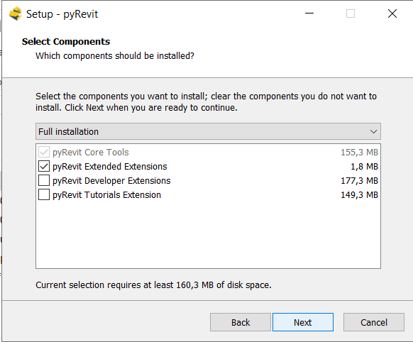
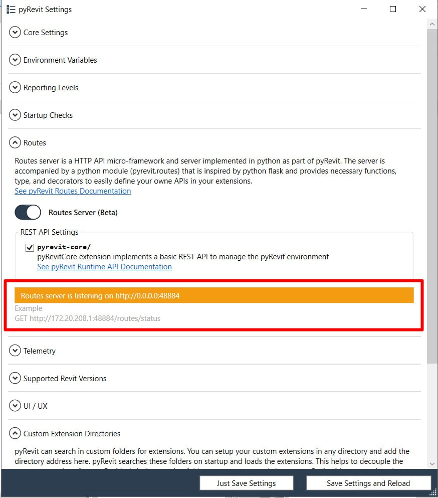
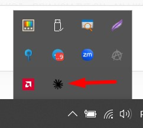

Как подключить Claude к Revit 2019? Вчера я задался этим вопросом и сегодня решил написать инструкцию, потому что все готовые решения работают начиная с версии Revit 2020. Из существующих способов подключения ИИ к Revit выбрал способ через pyRevit, потому что сам им пользуюсь и это очень популярный и бесплатный плагин для Revit.

Эта инструкция подойдёт вам, только если вы работаете в Revit 2019. Чтобы её повторить, вам не нужно разбираться в программировании на Python. Если вы не понимаете каких-то терминов, не пугайтесь — просто повторяйте шаг за шагом и наслаждайтесь результатом.


<truncate />


## Что вы получите в итоге

В результате выполнения инструкции вы получите настроенный рабочий процесс: **отправляете запрос в Claude Desktop и получаете результат в Revit**.

Цепочка взаимодействия будет такой: Claude Desktop → MCP-сервер на Python у вас на компьютере → Routes-сервер внутри Revit → проект Revit.

:::info[Информация]
Для чего в этой цепочке нужен pyRevit? Он предоставляет:

- Routes — HTTP-сервер внутри Revit
- IronPython — движок внутри Revit, без него код не запустится
- Extensions — возможность создать свою кнопку в Revit
:::

:::info[Что такое MCP]
**MCP-сервер** — отдельная небольшая программа, через которую ИИ может отправлять в Revit запросы.

**MCP-инструменты** — заранее заготовленные скрипты, с помощью которых ИИ может работать в Revit, ничего не выдумывая и выдавая стабильный результат.

:::

Чтобы не разочароваться, важно понимать:\
**MCP-инструментов для Revit 2019 нет**, но мы с вами создадим самый главный — тот, который позволит ИИ отправлять в Revit 2019 чистый код для выполнения задачи.

В конце статьи у вас будет три инструмента:

- Получить имя открытого проекта
- Получить список выделенных элементов
- Выполнение любого кода в проекте.
  
Благодаря выполнению кода в Revit вы можете делать даже больше, чем базовые инструменты Revit, но чтобы сделать повторение задачи предсказуемым, нужно создать свой MCP-инструмент — вы можете попросить об этом ИИ.

## Что понадобится

- **Revit 2019** (проверялось на 2019.2).
- **pyRevit 4.8.16** — последняя версия, работающая с 2019.
- **Python 3.10–3.14**  Проверялось на 3.13.
- **Claude Desktop** — <a href="https://claude.ai/download" rel="nofollow">скачать с сайта Anthropic</a>. Подойдёт и другой ИИ-клиент с поддержкой MCP, но команды в статье написаны под Claude Desktop.
- **PowerShell** — все команды в статье для него.

:::note[Где взять PowerShell]
Устанавливать PowerShell не нужно, он уже есть в Windows. Нажмите **Пуск**, наберите `PowerShell` и запустите **Windows PowerShell**.

Вставлять команды в обычную командную строку `cmd` не стоит: часть из них там не сработает.

Команды из статьи копируйте целиком **Ctrl+C** и вставляйте в окно **правой кнопкой мыши** или **Ctrl+V**. Потом нажмите **Enter**, чтобы запустить выполнение задачи.
:::

### Устанавливаем Python

Python нужен для MCP-сервера, который мы соберём на шаге 4. Внутри Revit он не используется — там работает свой движок из pyRevit.

Вставьте в PowerShell:

```powershell
winget install -e --id Python.Python.3.13
```


Закройте окно PowerShell и откройте новое — иначе консоль не увидит только что установленную программу. Проверьте:

```powershell
python --version
```

Должна появиться строка вида `Python 3.13.x`.

:::note[Если ставите Python вручную]
Можно скачать установщик с <a href="https://www.python.org/downloads/windows/" rel="nofollow">python.org</a> и провести установку обычным способом. Тогда на первом экране обязательно поставьте галочку **Add python.exe to PATH**. Без неё Windows не будет знать, где лежит Python, и команды из шага 4 не сработают.

Признак пропущенной галочки: вместо номера версии открывается Microsoft Store или появляется сообщение, что `python` не является внутренней или внешней командой.
:::

:::note[Если Python уже стоит, и не один]
Удалять ничего не нужно. Посмотрите, что установлено:

```powershell
py --list
```

`py` — это встроенный в Windows переключатель версий Python. На шаге 4 можно явно указать нужную, написав `py -3.13 -m venv .venv` вместо `python -m venv .venv`.
:::


## Шаг 1 — ставим pyRevit 4.8.16

**1. Скачайте установщик** со [страницы релиза pyRevit 4.8.16 на GitHub](https://github.com/pyrevitlabs/pyRevit/releases/tag/v4.8.16.24121%2B2117). Нужен файл **pyRevit 4.8.16.24121 Installer** — обычный, не Admin. Вариант Admin нужен только для установки на всех пользователей компьютера.


Более поздние версии не будут работать в Revit 2019.

:::danger[Опасность]
По умолчанию все версии pyRevit устанавливаются в одну папку `%APPDATA%\pyRevit-Master`. Если у вас уже установлена более поздняя версия pyRevit, файлы смешаются и Revit выдаст ошибку при запуске.


У меня эта ошибка была, и я принял решение временно удалить новую версию pyRevit через **Пуск / Установка и удаление программ**.

Не повторяйте мою ошибку: новую версию можно сохранить целиком, если сделать это **до** установки. Как — в разделе [Вопросы и ответы](#как-сохранить-уже-установленную-версию-pyrevit).
:::

**2. Проверьте, что папка `%APPDATA%\pyRevit-Master` пуста или отсутствует.** Вставьте этот адрес в проводник.

**3. Закройте Revit** и запустите установщик. В списке компонентов ничего не меняйте. Должны остаться галочки:

- pyRevit Core Tools
- pyRevit Extended Extensions




**4. Запустите Revit 2019.** В ленте должна появиться вкладка **pyRevit**.


:::warning[Вкладки нет, но и ошибок нет]
pyRevit установился, но не подключился к Revit 2019. Так бывает, когда Revit поставили позже плагина. Что делать — в разделе [Вопросы и ответы](#в-revit-2019-нет-вкладки-pyrevit-хотя-он-установлен).
:::

## Шаг 2 — включаем Routes

**Что делаем:** включаем внутри Revit Routes — это HTTP-сервер, программа, которая принимает запросы по сети и отвечает на них. Через него MCP-сервер будет разговаривать с проектом.

**1. Откройте pyRevit → Settings.**


**2. В разделе Routes включите тумблер Routes Server (Beta) и поставьте галочку pyrevit-core/.** Галочка не обязательна, но даёт готовый адрес для проверки.


**3. Нажмите Save Settings and Reload и перезапустите Revit.** Routes-сервер поднимается только при запуске Revit.

**4. Вернитесь в тот же раздел.** Оранжевая плашка показывает адрес сервера.



:::danger[Опасность]
`0.0.0.0` означает, что Revit принимает команды с любого устройства в вашей сети — офисной или домашней. Любой, кто сидит в том же Wi-Fi, может обратиться к вашему открытому проекту.

:::

**5. Закройте доступ. Вставьте в PowerShell:**

```powershell
pyrevit configs routes:host 127.0.0.1
```

Команда меняет одну строку в файле настроек pyRevit и при успехе ничего не выводит.

:::note[Если в PowerShell нет команды pyrevit]
Команда `pyrevit` появляется вместе с плагином из шага 1. Окно PowerShell, открытое до установки, о ней не знает — закройте его и откройте новое.
:::

**6. Проверьте, что записалось:**

```powershell
Select-String -Path "$env:APPDATA\pyRevit\pyRevit_config.ini" -Pattern "^host"
```

Команда ищет в файле настроек строку `host` и печатает её. Должно быть `host = 127.0.0.1`. Тот же файл можно открыть Блокнотом: `%APPDATA%\pyRevit\pyRevit_config.ini`.

**7. Снова перезапустите Revit.** Адрес читается при запуске.

**8. Откройте в браузере:**

```
http://localhost:48884/routes/status
```


Пришёл ответ — это и есть доказательство, что Routes в Revit 2019 работает. Текст в фигурных скобках — это формат JSON, с помощью него Revit и будет передавать ответы ИИ.

:::warning[Страница не открылась]
Revit не перезапускали после включения Routes — или открыто больше одного окна Revit: порт 48884 занимает то, которое запустилось первым. На время настройки держите открытым одно окно.
:::

## Шаг 3 — создаём MCP-инструменты в pyRevit

**Что делаем?** Создаём 3 MCP-инструмента, которыми сможет воспользоваться Claude. \
**1. Показать как называется открытый проект** \
**2. Показать, что в нём выделено.** \
**3. Выполнить присланный код**

:::note[Примечание]
Именно **выполнение присланного кода** даст Claude реальные возможности в Revit. Первые два инструмента нужны больше для проверки нашей работы.
:::

Создадим мы все эти 3 инструмента одним блоком через вставку одного блока кода в PowerShell.


:::info[Информация]
MCP-инструменты в Revit работают через **транзакцию**.\
Транзакция — это неделимый набор операций в Revit. Если Revit не сможет выполнить одну из этих операций, то отменит их все и вернёт проект Revit в первоначальное состояние до их выполнения. Именно транзакцию мы можем отменить через Ctrl+Z.

Если Claude отправит в Revit код с ошибкой, то Revit отменит его полностью и отправит ответ с описанием ошибки — это поможет ИИ исправить ошибку и попробовать ещё раз. Это делает запросы Claude в Revit чуть более безопасными.
:::

**1. Вставьте в PowerShell:**

```powershell
$ext = "$env:APPDATA\pyRevit\Extensions\MCP.extension"
New-Item -ItemType Directory -Force -Path $ext | Out-Null
@'
import json
from pyrevit import routes

api = routes.API('revit-mcp')


@api.route('/model/')
def get_model(doc):
    return {"title": doc.Title, "path": doc.PathName}


@api.route('/selection/')
def get_selection(uidoc):
    ids = [i.IntegerValue for i in uidoc.Selection.GetElementIds()]
    return {"element_ids": ids}


@api.route('/execute/', methods=['POST'])
def execute_code(uiapp, request):
    from Autodesk.Revit import DB, UI

    data = request.data
    if isinstance(data, str):
        data = json.loads(data)
    source = (data or {}).get('code')
    if not source:
        return {"error": "no code provided"}

    uidoc = uiapp.ActiveUIDocument
    doc = uidoc.Document
    scope = {"uiapp": uiapp, "uidoc": uidoc, "doc": doc,
             "DB": DB, "UI": UI, "result": None}

    transaction = DB.Transaction(doc, "MCP execute")
    transaction.Start()
    try:
        exec(source, scope)
        transaction.Commit()
    except Exception as error:
        if transaction.HasStarted():
            transaction.RollBack()
        return {"error": str(error)}

    return {"result": str(scope.get("result"))}
'@ | Set-Content -Encoding ASCII -Path "$ext\startup.py"
Get-Content "$ext\startup.py"
```

**Что появилось на компьютере:** папка `%APPDATA%\pyRevit\Extensions\MCP.extension`, в ней файл `startup.py`. Последняя строка команды печатает его содержимое — так вы видите, что файл записан.

Имя `startup.py` менять нельзя: pyRevit ищет файл именно с таким именем и выполняет его при запуске Revit. Имя папки может быть любым, важно окончание `.extension`.

:::note[Если хотите руками]
Папку можно создать в проводнике, а текст сохранить Блокнотом. Следите, чтобы файл не превратился в `startup.py.txt`.

Почему расширение лежит внутри папки pyRevit — чтобы не усложнять первые шаги. Когда появятся свои кнопки, его лучше перенести: [Где хранить свои расширения](#где-хранить-свои-расширения-для-pyrevit).
:::

**2. Перезапустите Revit.** Файл читается только при запуске.

**3. Откройте проект и проверьте в браузере:**

```
http://localhost:48884/revit-mcp/model/
http://localhost:48884/revit-mcp/selection/
```


Первый адрес отдаёт имя проекта, второй — выделенные элементы. Выделите что-нибудь и обновите вторую страницу. Третий адрес из браузера не проверить — он принимает код, а не открывается, его проверим через Claude.

:::warning[Адрес отвечает ошибкой или пустой страницей]
Revit не перезапущен · проект не открыт · файла нет по адресу `%APPDATA%\pyRevit\Extensions\MCP.extension\startup.py`.
:::

**Итог:** Revit отвечает по трём адресам. Claude об этом ещё не знает — это шаг 4.

## Шаг 4 — создаём свой MCP-сервер

**Что делаем:** пишем MCP-сервер — небольшую программу на вашем компьютере. Claude обращается к ней, а она отправляет запросы в Revit по адресам из шага 3 и возвращает ответ.


**1. Выберите папку для сервера.** В примере это `C:\RevitMCP`, подойдёт любая ваша — три условия:

- **без пробелов в пути**: путь попадёт в настройки Claude Desktop, а там пробелы приходится экранировать;
- **без кириллицы**: частый источник необъяснимых сбоев Python на Windows;
- **не внутри OneDrive или Dropbox**: синхронизация подхватит служебную папку `.venv` с тысячами мелких файлов.

:::note[Если выбрали другую папку]
Замените `C:\RevitMCP` во всех командах ниже: в этом шаге — первые две строки, в шаге 5 — оба пути в настройках Claude Desktop.
:::

**2. Создайте папку и установите библиотеки. Вставьте в PowerShell:**

```powershell
New-Item -ItemType Directory -Force -Path C:\RevitMCP | Out-Null
Set-Location C:\RevitMCP
python -m venv .venv
.\.venv\Scripts\python.exe -m pip install --quiet --upgrade pip
.\.venv\Scripts\python.exe -m pip install "mcp[cli]" httpx
```

**Что появилось на компьютере:**

- папка `C:\RevitMCP` — её можно создать и в проводнике;
- внутри подпапка `.venv` — отдельная копия Python только для нашего сервера, чтобы его библиотеки ни с чем не пересекались. Вручную её не создать;
- в `.venv` **скачаны из интернета** две библиотеки — готовые куски чужого кода: `mcp` отвечает за разговор с Claude, `httpx` — за запросы в Revit. Пара минут, в конце строка `Successfully installed`.

:::note[Если команды не проходят]
На рабочем компьютере скачивание может блокировать корпоративный прокси или антивирус. Тогда без системного администратора дальше не пройти.
:::

**3. Создаём MCP-сервер. Вставьте в PowerShell:**

```powershell
Set-Location C:\RevitMCP
@'
import os
import httpx
from mcp.server.mcpserver import MCPServer

REVIT_URL = os.environ.get("REVIT_URL", "http://127.0.0.1:48884/revit-mcp")

mcp = MCPServer(
    "revit-mcp",
    instructions=(
        "This server talks to Autodesk Revit 2019.2 through pyRevit Routes. "
        "Any code you send runs on IronPython 2.7 inside Revit, against the Revit 2019 API. "
        "Do not use f-strings or Python 3 syntax. "
        "Do not use API members added after Revit 2019, such as ForgeTypeId or UnitTypeId. "
        "Use DisplayUnitType and BuiltInParameter instead. "
        "When unsure whether a method exists in Revit 2019, prefer the older, simpler API. "
        "A transaction is already open around your code. Never create or start your own "
        "Transaction or TransactionGroup, just modify the elements directly."
    ),
)


async def revit_get(path):
    url = REVIT_URL.rstrip("/") + path
    try:
        async with httpx.AsyncClient(timeout=60) as client:
            response = await client.get(url)
            response.raise_for_status()
            return response.text
    except httpx.ConnectError:
        return "Revit is not reachable. Check Revit is running and pyRevit Routes is on: " + url
    except Exception as error:
        return "Request to Revit failed: {}".format(error)


async def revit_post(path, payload):
    url = REVIT_URL.rstrip("/") + path
    try:
        async with httpx.AsyncClient(timeout=120) as client:
            response = await client.post(url, json=payload)
            return response.text
    except httpx.ConnectError:
        return "Revit is not reachable. Check Revit is running and pyRevit Routes is on: " + url
    except Exception as error:
        return "Request to Revit failed: {}".format(error)


@mcp.tool()
async def get_model_info() -> str:
    """Title and file path of the Revit model currently open."""
    return await revit_get("/model/")


@mcp.tool()
async def get_selection() -> str:
    """Element ids the user has selected right now in Revit."""
    return await revit_get("/selection/")


@mcp.tool()
async def execute_revit_code(code: str) -> str:
    """Run IronPython 2.7 code inside Revit 2019 and return its result.

    The code runs inside one transaction that is already open, committed on
    success and rolled back on error. Never start your own Transaction.
    Available names: doc, uidoc, uiapp, DB, UI.
    Assign anything you want to read back to a variable named `result`.
    Revit 2019 API only: no f-strings, no ForgeTypeId or UnitTypeId,
    use DisplayUnitType. Example:
        levels = DB.FilteredElementCollector(doc).OfClass(DB.Level).ToElements()
        result = [l.Name for l in levels]
    """
    return await revit_post("/execute/", {"code": code})


if __name__ == "__main__":
    mcp.run()
'@ | Set-Content -Encoding ASCII -Path main.py
.\.venv\Scripts\python.exe -c "import importlib.util,asyncio; s=importlib.util.spec_from_file_location('m','main.py'); m=importlib.util.module_from_spec(s); s.loader.exec_module(m); print([t.name for t in asyncio.run(m.mcp.list_tools())])"
```

**Что появилось на компьютере:** файл `C:\RevitMCP\main.py` — это и есть MCP-сервер. Последняя строка блока — проверка: она запускает сервер без Claude и печатает список его инструментов. Должно быть:

```
['get_model_info', 'get_selection', 'execute_revit_code']
```

:::info[Информация]
Два места в коде, о которых стоит знать. Текст в тройных кавычках под каждым инструментом — описание, которое читает Claude, когда решает, чем воспользоваться. Блок `instructions` в начале — инструкция для Claude на всё время работы: без неё он пишет код под современный Revit, и в 2019 этот код будет падать.
:::

**Итог:** три инструмента готовы с обеих сторон — адреса внутри Revit и сервер, который умеет к ним обращаться. Осталось показать сервер Claude.

## Шаг 5 — подключаем Claude Desktop

**Что делаем:** сообщаем Claude Desktop, где лежит наш сервер, и проверяем всю цепочку.

:::note[Примечание]
Если вы используете другой ИИ, этот этап легко пройти в диалоге с ним. Это достаточно простая задача, и любой ИИ должен с этим справиться. Отправьте ему как инструкцию эту статью, и он напишет, как подключить его к созданному MCP-серверу.
:::

**1. Откройте файл настроек:** в Claude Desktop **Settings → Developer → Edit Config**. Программа создаст файл `claude_desktop_config.json`, если его ещё нет, и покажет папку с ним. Откройте его Блокнотом.


**2. Впишите сервер.** Есть два случая.

**Файл пустой или в нём только `{}`** — замените содержимое целиком на:

```json
{
  "mcpServers": {
    "revit": {
      "command": "C:\\RevitMCP\\.venv\\Scripts\\python.exe",
      "args": ["C:\\RevitMCP\\main.py"]
    }
  }
}
```

**В файле уже есть другие серверы** — ничего не удаляйте. Найдите строку `"mcpServers": {` (обычно вторая сверху), поставьте курсор в её конец, нажмите Enter и вставьте:

```json
    "revit": {
      "command": "C:\\RevitMCP\\.venv\\Scripts\\python.exe",
      "args": ["C:\\RevitMCP\\main.py"]
    },
```

Запятая в конце фрагмента уже стоит — она отделяет новый сервер от тех, что были. Пробелы и отступы не важны, важны только скобки, кавычки и запятые.

:::warning[Предупреждение]
Если у вас другой адрес папки MCP-сервера — подставьте его в обе строки. Обратите внимание на двойные слеши `\\` — это требование формата.
:::

:::note[Если не хотите править файл руками]
Тот же результат даёт команда. Она кладёт рядом резервную копию файла с окончанием `.bak`, добавляет запись `revit` и печатает список серверов — в нём должен появиться `revit`.

```powershell
$cfg = "$env:APPDATA\Claude\claude_desktop_config.json"
if (-not (Test-Path $cfg)) { '{ "mcpServers": {} }' | Set-Content $cfg }
Copy-Item $cfg "$cfg.bak" -Force
$j = Get-Content $cfg -Raw | ConvertFrom-Json
if (-not $j.mcpServers) { $j | Add-Member -NotePropertyName mcpServers -NotePropertyValue ([pscustomobject]@{}) }
$srv = [pscustomobject]@{
  command = "C:\RevitMCP\.venv\Scripts\python.exe"
  args    = @("C:\RevitMCP\main.py")
}
$j.mcpServers | Add-Member -NotePropertyName revit -NotePropertyValue $srv -Force
$json = $j | ConvertTo-Json -Depth 30
[System.IO.File]::WriteAllText($cfg, $json, (New-Object System.Text.UTF8Encoding($false)))
(Get-Content $cfg -Raw | ConvertFrom-Json).mcpServers.PSObject.Properties.Name
```
:::

**3. Закройте Claude Desktop через трей и запустите заново.** Крестик окна не закрывает программу — она остаётся в трее и настройки не перечитывает. Нужен значок в трее → Quit.



**4. Откройте новый чат и спросите:**

> Какой проект сейчас открыт в Revit?

Claude спросит разрешение на инструмент — нажмите **Allow**. Ответ с именем файла означает, что цепочка замкнулась.

:::warning[Claude отвечает, что не видит Revit]
Откройте **Settings → Developer**: напротив `revit` должно стоять `running`. Если `failed` — проверьте в проводнике, что файл `C:\RevitMCP\.venv\Scripts\python.exe` существует, и что Claude Desktop закрывали через трей, а не крестиком.


:::

**5. Проверьте универсальный инструмент.** Запрос безопасный, только на чтение:

> Перечисли все уровни в проекте с отметками.

Claude напишет код, выполнит его в Revit и вернёт таблицу уровней. Это и есть рабочий режим: вы описываете задачу словами, код под неё пишет Claude.

:::danger[Что здесь может пойти не так]
Инструмент выполняет любой код в открытом проекте, включая удаление элементов. Транзакция защищает только от незавершённого изменения при ошибке: код, который отработал правильно и удалил не то, будет успешно записан.

Отменить такое изменение можно через Ctrl+Z, пока вы не сохранили файл. После сохранения отмена уже не поможет. Если работаете с центральной моделью, изменения уйдут коллегам при синхронизации, поэтому тренируйтесь только на копии рабочего проекта.
:::

## В каком порядке запускать

Порядок запуска программ значения не имеет. Claude Desktop при старте запускает только ваш `main.py`, а тот сам к Revit не подключается — он ждёт. Соединение возникает в момент вызова инструмента. Поэтому Revit можно открыть позже, и всё заработает без перезапуска Claude.

Реальное ограничение одно, и оно про Revit: **всё, что лежит внутри Revit, читается при его запуске.** Это относится и к Routes-серверу, и к вашим адресам в `startup.py`. 

:::warning[Предупреждение]
Если вы добавите новый MCP-инструмент — Revit нужно будет перезапустить!
:::

:::tip[Что перезапускать]
**Revit:** установка pyRevit, включение и выключение Routes, смена адреса или порта, любая правка `startup.py`.

**Claude Desktop (через трей):** правка `main.py`, изменение конфигурации серверов.

**Ничего:** код, который Claude пишет в диалоге. Он летит как обычные данные по уже готовому адресу — в этом и смысл универсального инструмента.
:::

## Мои рекомендации по использованию

Есть два разных способа использовать связку Claude + Revit:

**1. Claude — это ваши руки в Revit.** \
Вы просите словами, Claude пишет код и выполняет. Результат не повторяем: тот же запрос завтра даст другой код. Это годится для разового — посчитать, найти, проверить, разово почистить.

**2. Claude создаёт инструменты для себя и для вас.** \
Цель не сделать одну операцию в проекте, а получить код, который позволит автоматизировать этот процесс в каждом проекте. Отладили на живом примере, убедились и сохранили как `script.py` в папке расширения для pyRevit:

```
MyTools.extension\MyTab.tab\MyPanel.panel\RenameSheets.pushbutton\script.py
```

После перезапуска Revit в ленте появляется ваша кнопка. Она работает всегда одинаково, без ИИ, без интернета и мгновенно.

Раньше скрипты для Revit писались вслепую: сохранил, запустил, упало, поправил, и так по кругу. Сейчас Claude видит ваш проект, пробует и тут же исправляется, но делает это намного быстрее. Цикл сокращается с минут до секунд. Это и есть настоящая экономия и ресурсов, и вашего времени.

Если до автоматизации руки ещё не дошли, начните с простого: [10 способов быстрее работать в Revit](/blog/work-faster-in-revit/).

:::info[Информация]
Сам подход со связкой pyRevit Routes и MCP я увидел в <a href="https://pyrevit-mcp.learnrevitapi.com/" rel="nofollow">руководстве Эрика Фритса</a>. В этом руководстве есть готовый набор инструментов для Revit 2020+ и готовый MCP-сервер для этих версий.
:::

## Вопросы и ответы

### Есть ли готовые MCP-серверы для Revit 2019?

Нет. Существующие наборы заявляют Revit 2020–2027, у официального облачного сервера Autodesk актуальные версии. Для 2019 придётся собирать самому, как в этой статье.

### Как сохранить уже установленную версию pyRevit?

Это самая частая ситуация: у вас несколько версий Revit, стоит свежий pyRevit со своими инструментами, и терять его не хочется. Просто поставить 4.8.16 рядом не получится — установщик не спрашивает папку и всегда пишет в `%APPDATA%\pyRevit-Master`, поверх того, что там лежит.


Решается это до установки, одной командой. Закройте все Revit и переименуйте папку существующей версии:

```powershell
Rename-Item "$env:APPDATA\pyRevit-Master" pyRevit-new
```

Теперь установщик 4.8.16 создаст чистую папку и ничего не затрёт, а ваша прежняя версия целиком лежит рядом. Из списка установленных программ её удалять не нужно.

Дальше есть два пути.

**Проще:** оставить всё как есть. В Revit работает 4.8.16, а прежняя версия ждёт своего часа. Если она снова понадобится, удалите 4.8.16 и переименуйте папку обратно.

**Сложнее, но обе сразу:** зарегистрировать сохранённую папку как отдельную установку и привязать её к своим версиям Revit. Разработчики pyRevit на своём форуме описывают это так: каждая версия лежит в своей папке и привязывается **своим собственным** `pyrevit.exe` из этой папки — чужим не получится, будет ошибка несовпадения движка. Регистрация папки выглядит так:

```powershell
pyrevit clones add pyrevit-new "$env:APPDATA\pyRevit-new"
```

:::warning[Важно]
Этот второй путь мы не проверяли — в нашем случае он не понадобился. Схема взята из <a href="https://discourse.pyrevitlabs.io/t/using-both-pyrevit-4-8-16-and-5-0/7642" rel="nofollow">темы на форуме pyRevit</a>. Если ваши рабочие проекты зависят от плагина, сначала проверьте на свободном компьютере.
:::

Прежде чем что-то менять, посмотрите, что у вас вообще установлено и к каким версиям Revit подключено:

```powershell
pyrevit clones
pyrevit attached
```

Может оказаться, что защищать нечего: у меня свежая версия не была подключена ни к одному Revit, и я спокойно её удалил.

### Где хранить свои расширения для pyRevit?

Не внутри папок pyRevit. Расширения лежат в `%APPDATA%\pyRevit\Extensions`, а сам плагин в `%APPDATA%\pyRevit-Master`: в разделе про сохранение прежней версии мы переименовываем вторую папку, а при чистой переустановке удаляют или переименовывают обе. Ваши скрипты уедут вместе с папкой.

Держите свою папку отдельно, например `C:\RevitTools\MyTools.extension`, и подключите её кнопкой **Add folder** в разделе **Custom Extension Directories** настроек pyRevit. После этого переустановки плагина вам не страшны.

Расширение из этой статьи я специально положил внутрь pyRevit, чтобы не усложнять первые шаги. Когда появятся свои кнопки — переносите.

### В Revit 2019 нет вкладки pyRevit, хотя он установлен?

Так бывает, когда Revit установили позже pyRevit: подключение плагина к версии Revit происходит в момент установки.


Сначала попробуйте подключить вручную. Закройте Revit и выполните:

```powershell
pyrevit attach master 2712 2019
```

Здесь `2712` — номер движка IronPython 2.7, а `2019` — версия Revit. Запустите Revit и проверьте ленту.

Команда не поможет в одном случае: если установленная у вас версия pyRevit вообще не рассчитана на Revit 2019. Тогда подключение либо не создастся, либо Revit выдаст ошибку при запуске. Лечится только установкой 4.8.16 по шагу 1.

### Нужен ли `uv`, как в других инструкциях?

Нет. `uv` — просто другой способ запустить сервер: он подтягивает библиотеки при каждом старте, вместо того чтобы держать их в своей папке. Результат тот же.

Дело в другом. Библиотека `mcp` недавно переименовала часть своих составляющих, и инструкции, написанные до этого, с ней ломаются — человек получает ошибку импорта на ровном месте. Код в этой статье написан под текущую версию, поэтому работает.

### Безопасно ли давать ИИ выполнять код в проекте?

На учебном файле — да, и это лучший способ разобраться. На боевом проекте относитесь к этому как к запуску чужого скрипта: сохраняйтесь перед запуском, и работайте лучше с копией проекта. Отмена через Ctrl+Z работает, пока файл не сохранён: после сохранения она уже не поможет.

<CTA type="blog" />
