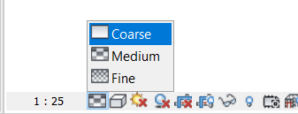
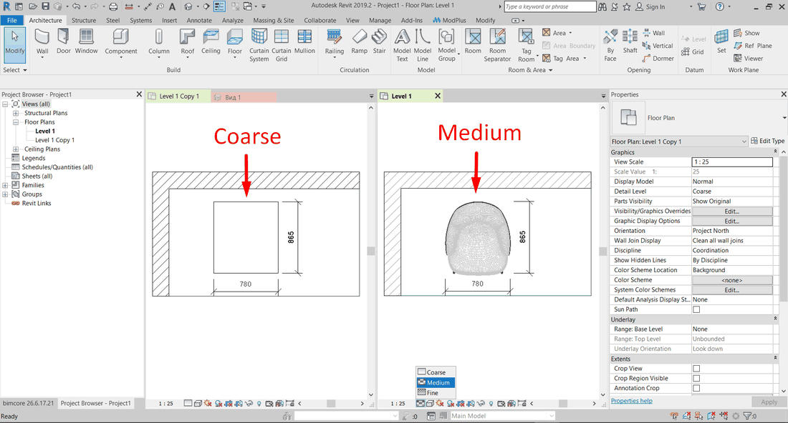
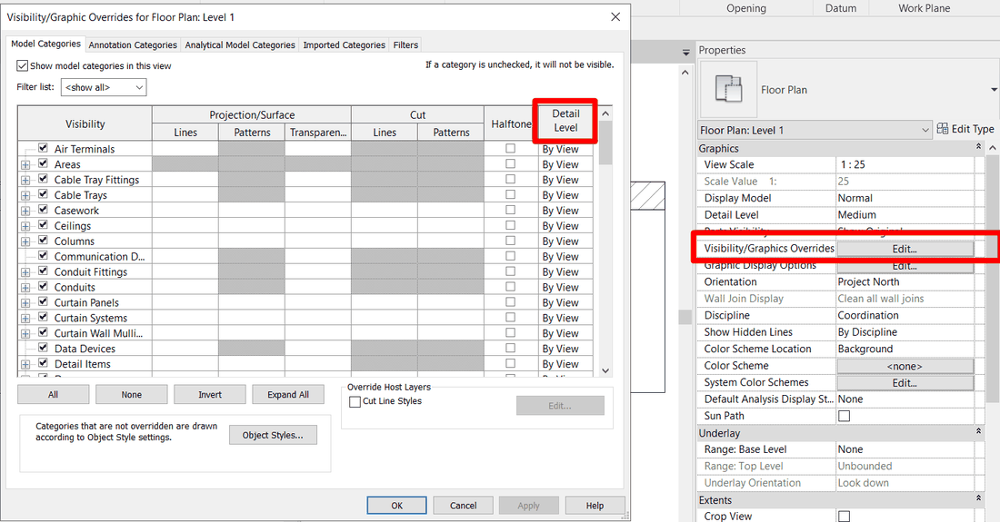
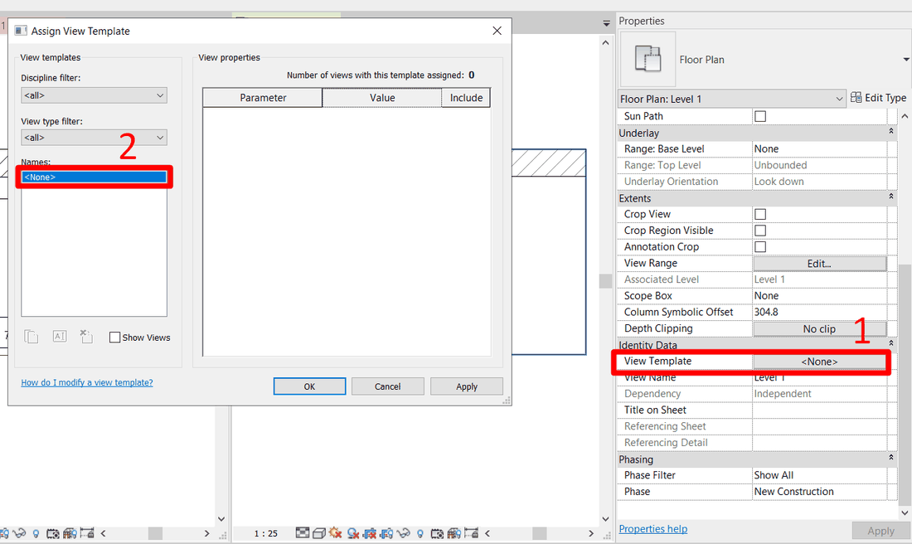
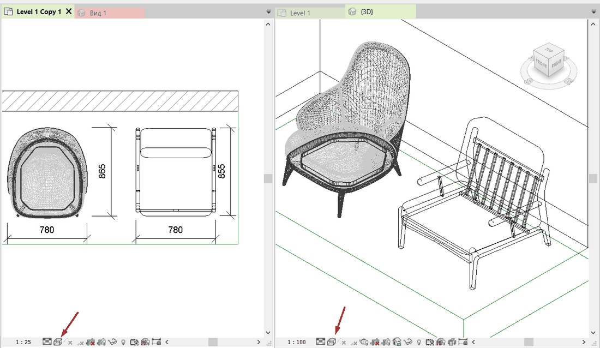
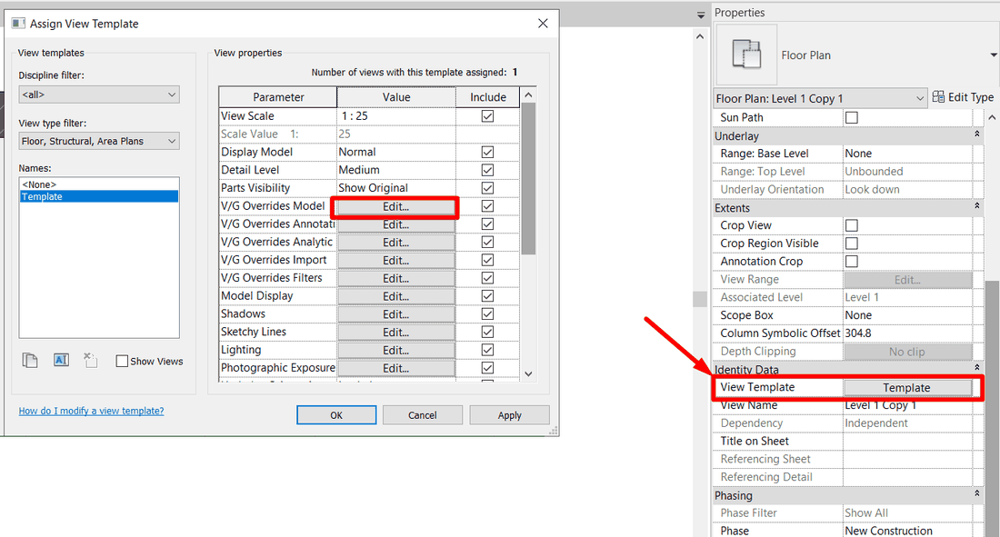
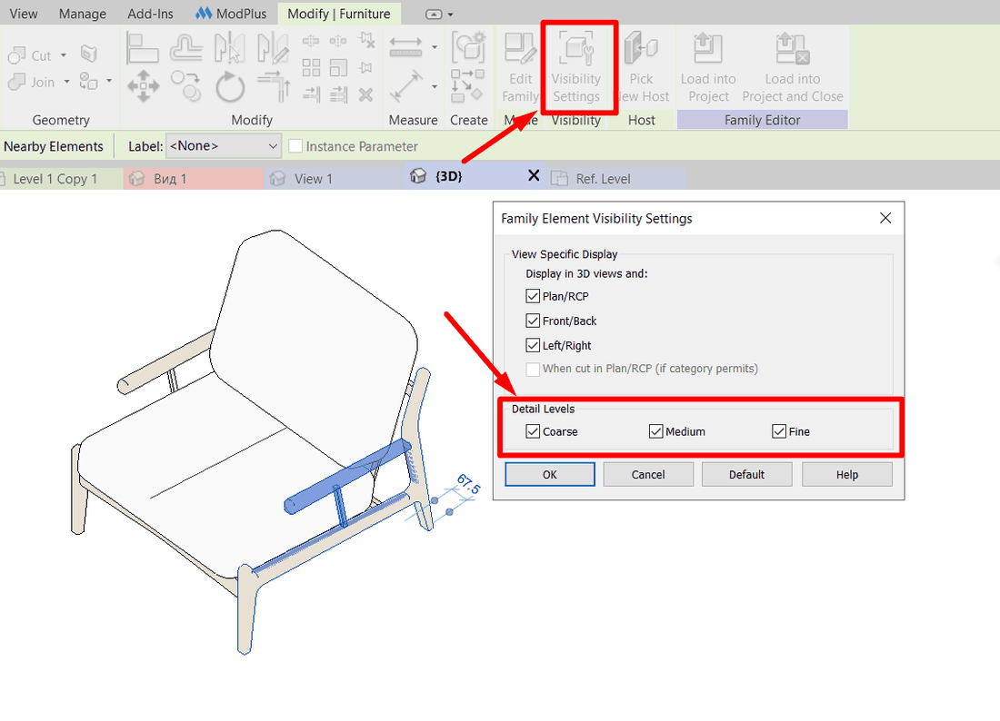
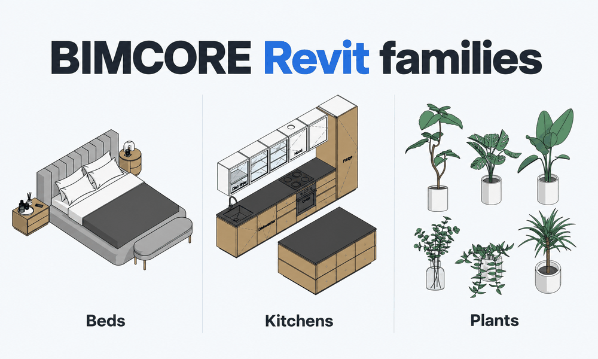

Семейство размещено в Revit и в 3D выглядит красиво, а на плане видны лишние линии, не получается настроить материал, под семейством видно покрытие пола или сплошная белая заливка, которую не получается изменить? Причина почти всегда одна из пяти. Ниже разместил их в том порядке, в котором их удобно проверять в проекте, от импорта и настроек проекта к редактированию семейства.

<truncate />

## 1. Импортированная геометрия

Семейство собрано не из геометрии Revit, а из импортированного файла из AutoCAD, 3ds Max или другой программы. Такие семейства часто раздают бесплатно, и снаружи они выглядят впечатляюще реалистично. Но отображение на плане у таких семейств часто страдает. Из-за большого количества граней на таких моделях образуется сетка из линий, которую убрать очень сложно. Материалы у такого семейства тоже почти нельзя изменить.

Проверка вашего случая. Выберите семейство и откройте его в редакторе семейств. Если геометрия выделяется одним куском и в свойствах видно, что это импорт, перед вами именно этот случай.

:::danger[Опасность]
**Пользуйтесь такими семействами с осторожностью!**

Импортированная геометрия тяжёлая, и файл с ней чаще ломается, его не получается открыть, и из-за этого приходится переделывать всю работу с нуля. Чтобы избежать серьёзных последствий, перед работой с таким семейством нажмите **Сохранить как**, дальше кликните **Опции** и поставьте в поле **Максимум** значение 10. Если файл повредится, у вас останется 10 предыдущих версий проекта.
:::

:::info[Информация]
Предыдущая версия проекта появляется каждый раз, когда вы нажимаете **Сохранить**.
:::

Что еще нужно проверить в бесплатных семействах до загрузки в проект, я разобрал в статье о [рисках бесплатных семейств Revit](/ru/blog/free-revit-families-risks/).

## 2. Низкий уровень детализации

У большинства семейств три варианта отображения на плане. На низком уровне детализации часто видна упрощённая геометрия семейства, на среднем и высоком появляется модель целиком. Если настройка у плана стоит на низком уровне, шкаф превращается в прямоугольник, а сложная мебель может исчезнуть совсем.

Переключите **Уровень детализации** на панели управления видом внизу окна на **Средний** или **Высокий** и посмотрите на семейство ещё раз. Если отображение изменилось, то проблема решена.

:::note[Примечание]
Если для категории назначен фиксированный уровень детализации в окне **Переопределения видимости/графики**, то семейство может не изменить отображение при смене уровня детализации. Проверьте настройки в этом окне до того, как решить, что это не ваш случай.
:::

Если плану назначен шаблон вида, уровень детализации может быть закреплён шаблоном. Тогда меняйте настройку в шаблоне или снимите его с этого плана.

## 3. Визуальный стиль «Каркас»

В стиле **Каркас** Revit показывает только рёбра модели, всё семейство при этом прозрачное. На плане все элементы становятся прозрачными, заливки пропадают, а сквозь мебель видно всё, что находится под ней. Стиль легко включить случайно и потом искать проблему в семействе.

Откройте **Визуальный стиль** на панели управления видом и выберите **Невидимые линии** или **Заливка**. В первом случае мебель получит непрозрачный контур, во втором ещё и цвет материалов. Для чертежей обычно достаточно стиля **Невидимые линии**, для 3D лучше использовать **Заливка**.

## 4. Прозрачность

Прозрачность назначают категории, фильтру или отдельному элементу, и она сохраняется в виде, пока её не снять. Обычно её ставят на время, чтобы увидеть элементы под мебелью, и забывают вернуть.

Откройте **Переопределения видимости/графики** и проверьте столбец **Прозрачность** у категорий мебели, оборудования и обобщённых моделей. Затем проверьте вкладку с фильтрами. 

Если прозрачно только одно семейство, щёлкните по нему правой кнопкой, выберите **Переопределить графику на виде**, затем **По элементу** и верните прозрачность поверхности в 0.

:::tip[Совет]

Если прозрачность стоит на нескольких планах сразу и вы не можете её изменить, проверьте, не назначен ли виду шаблон вида. Одно исправление в шаблоне снимет её со всех планов, к которым он применён.
:::

## 5. В семействе настроено 2D-обозначение вместо 3D

Часть семейств сделана так, что на плане вместо модели показывается 2D-обозначение из символических линий и области маскировки. Объёмная геометрия на плане при этом выключена. Обозначение рисовали под один размер и одну форму, поэтому после изменения параметров оно расходится с моделью, а при масках закрывает заливку и материалы.

Откройте семейство в редакторе семейств и посмотрите план. Если на нём лежат символические линии или область маскировки, а модель не видна, у вас есть два пути.

**Первый способ:** удалите 2D-обозначение целиком, выделите объёмную геометрию, нажмите **Параметры видимости** и включите показ на планах. Revit будет показывать на плане реальную форму семейства. Если категория относится к разрезаемым, геометрия также будет отображаться в сечении секущей плоскостью.

**Второй способ:** оставьте обозначение для одного уровня детализации, например для **Низкий**, а для среднего и высокого включите объёмную геометрию. Для этого в окне **Параметры видимости** у символических линий оставьте только низкий уровень, а у геометрии включите план и уровни **Средний** и **Высокий**. Загрузите семейство обратно в проект и проверьте план на всех трёх уровнях.

## Что проверить, если коротко

| Что вы видите на плане | Что проверить | Что получите |
|---|---|---|
| Клубок линий, нет заливки, не режется | Импорт в редакторе семейств, резервные копии | Понимание, что семейство нужно заменить или перестроить |
| Прямоугольник вместо мебели или пустое место | Уровень детализации вида или категории | Модель появляется на среднем и высоком уровне |
| Прозрачны все элементы вида | Визуальный стиль | Непрозрачный контур и заливка на всём плане |
| Прозрачны отдельные категории или один предмет | Столбец «Прозрачность» в окне «Переопределения видимости/графики», переопределение элемента | Прозрачность снята там, где её забыли |
| Модель есть в 3D, на плане плоское обозначение | Символические линии и Параметры видимости в семействе | План показывает реальную форму и материалы |

## Если не хотите настраивать каждое семейство

Мы разработали [полную библиотеку семейств для дизайнеров интерьера](https://bimcore.one/). В ней отображение на плане уже настроено. Геометрия сделана средствами Revit, на низком уровне показывается упрощённая схема, на среднем и высоком реальная форма, а материалы и заливки работают без дополнительных правок. Посмотреть, как это устроено, можно на примере [семейств кухни](/ru/guides/families/kitchen-for-revit/).

## Вопросы и ответы

### Семейство на плане только белое и не реагирует на настройки материала

Здесь две причины. Либо у вида стоит визуальный стиль **Невидимые линии**, который на плане не показывает цвета материалов, либо в семействе на плане лежит область маскировки, которая закрывает модель. В первом случае переключите стиль на **Заливка**. Во втором откройте семейство и исправьте его как в пункте 5.

### Семейство на плане показано только линиями, без заливки

Скорее всего, на плане показывается 2D-обозначение из символических линий. Сначала переключите уровень детализации и проверьте прозрачность, как описано в пунктах 2 и 4. Если это не помогло, откройте семейство и поступите как в пункте 5.

<CTA type="guide" />
