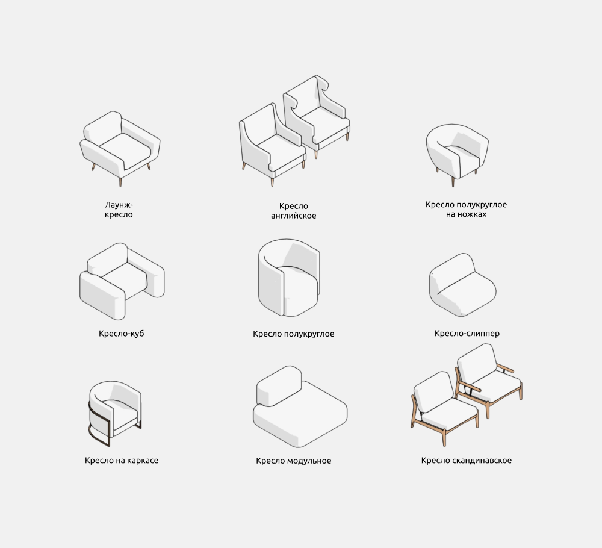
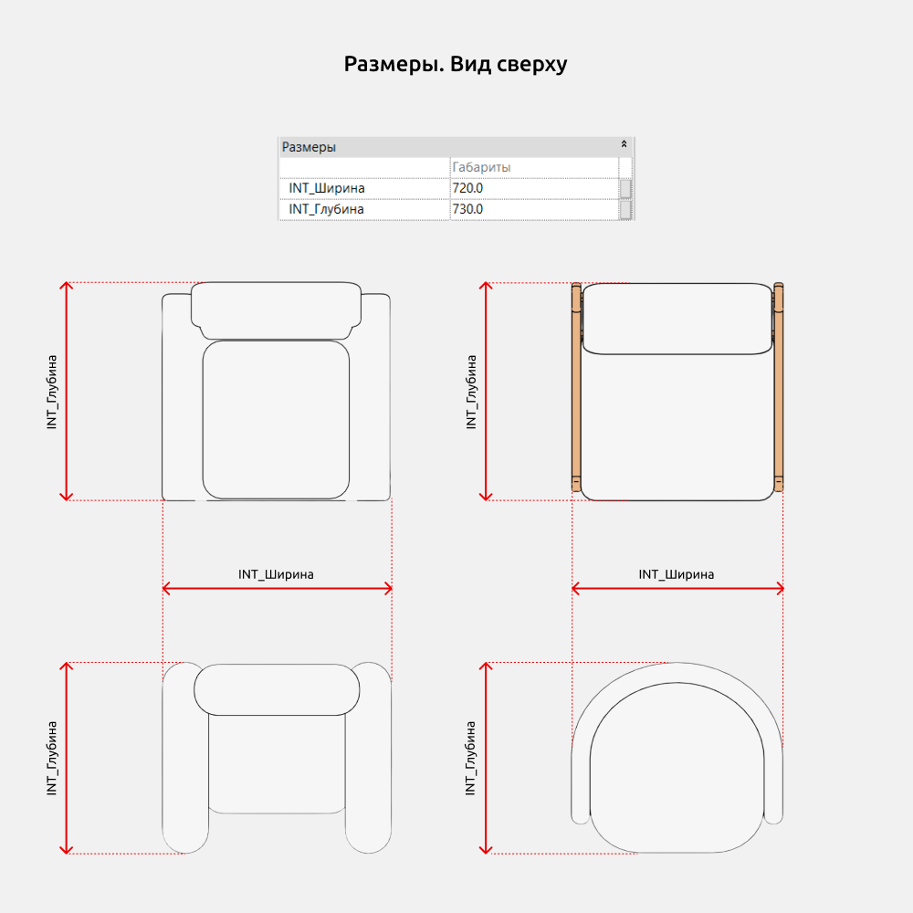
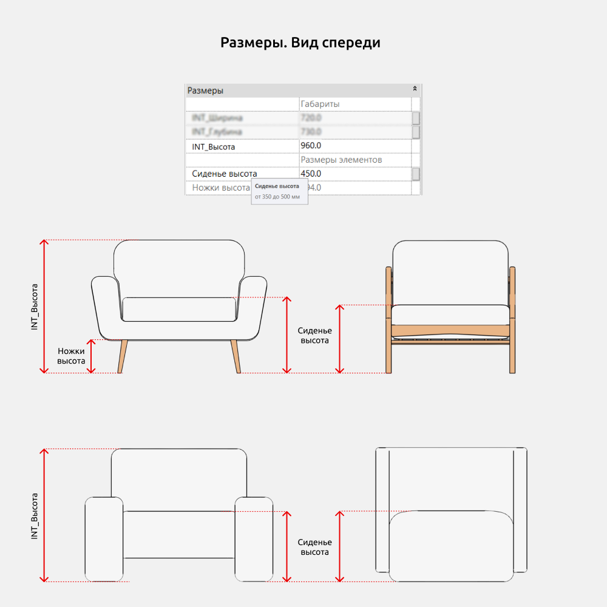
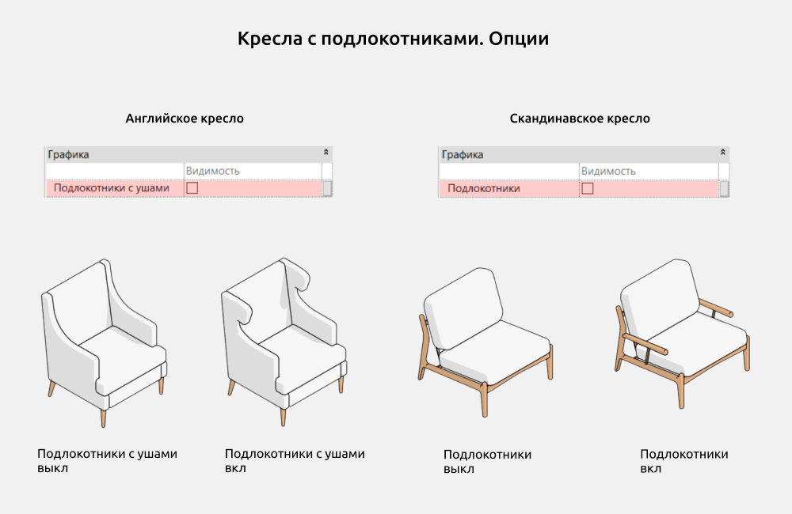
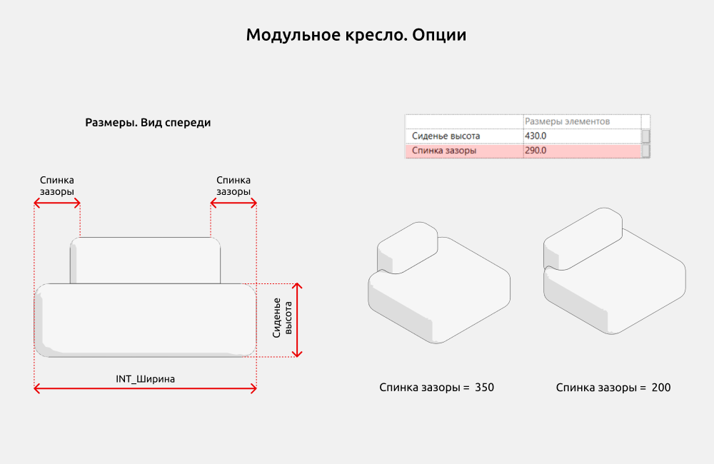

import productPreview from '@site/docs/guides/families/armchairs-for-revit/product.jpg';

<ProductCard
  name="Кресла для Revit"
  eyebrow="Набор семейств Revit"
  description="Коллекция кресел в разных стилях — готовы к вставке в проект Revit."
  image={productPreview}
  imageAlt="Кресла для Revit — превью набора"
  buyUrl="https://bimcore.one/products/armchair-revit-families"
  ecwidProductId="577113367"
  buyLabel="Купить"
  shopLabel="В магазин"
/>

<YouTube id="PUxdExP5g-s" title="Кресла для Revit" />

## 1. ОБЩИЕ ДАННЫЕ

- Название набора: Кресла
- Версия набора 1.0.0
- Версия Revit: 2019

### Описание

Этот набор семейств для Revit предназначен для использования кресел в Autodesk Revit в архитектурных и интерьерных шаблонах.

С помощью семейств можно создать по точным размерам классические прямые, полукруглые и модульные кресла.

Подходит дизайнерам интерьера и архитекторам.

### Загрузка и размещение

Для того чтобы посмотреть и загрузить нужные семейства из набора, можно открыть **Проект с креслами** и скопировать семейства при помощи комбинации клавиш Ctrl+C, а затем вставить в свой проект Ctrl+V. Или открыть папку с файлами семейств и перетащить мышкой в проект.

## 2. СОСТАВ НАБОРА

В состав набора входят следующие семейства:

- Лаунж-кресло
- Кресло английское
- Кресло полукруглое на ножках
- Кресло-куб
- Кресло полукруглое
- Кресло-слиппер
- Кресло на каркасе
- Кресло модульное
- Кресло скандинавское

## 3. СЕМЕЙСТВА

### Размеры кресел

Параметры **INT_Ширина**, **INT_Глубина** и **INT_Высота** управляют общими размерами кресел.

При изменении параметра **Сиденье высота** изменяется расстояние сиденья от уровня чистого пола. Он ограничен размерами, которые указаны в подсказке.

Чтобы увидеть подсказку, необходимо навести мышку на название параметра (как на изображении).

Есть параметры серого цвета, которыми нельзя управлять (например, **Ножки высота**). Они нужны для понимания расчётов размеров и корректной работы формул и не предназначены для пользовательского редактирования.

### Опции кресел

У английского и скандинавского типов кресел предоставлена возможность управления видимостью подлокотников.

У английского кресла видимость подлокотников с ушами управляется параметром **Подлокотники с ушами**.
У скандинавского кресла видимость подлокотников управляется параметром **Подлокотники**.

Параметр **Спинка зазоры** позволяет изменять ширину спинки модульного кресла, симметрично регулируя расстояние от спинки до боковых краев сиденья.

<CTA type="guide" />
