import productPreview from '@site/docs/guides/families/beds-for-revit/product.png';

<ProductCard
  name="Кровати для Revit"
  eyebrow="Набор семейств Revit"
  description="Параметрическое семейство кровати с разными изголовьями — готовы к вставке в проект Revit."
  image={productPreview}
  imageAlt="Кровати для Revit — превью набора"
  buyUrl="https://bimcore.one/products/bed-revit-families"
  ecwidProductId="602815169"
  buyLabel="Купить"
  shopLabel="В магазин"
/>

<YouTube id="pYFo-6O6Qf4" title="Кровати для Revit" uploadDate="2023-11-08" duration="1005" description="Семейства кроватей для Revit с прикроватными тумбами, скамьями и мягкими панелями: устройство набора и размещение в проекте." />

## 1. ОБЩИЕ ДАННЫЕ

-   Название набора: Кровати
-   Версия набора 1.0.0
-   Версия Revit: 2019

### Описание

Этот набор семейств для Revit предназначен для моделирования кроватей, прикроватных тумб, банкеток и мягких стеновых панелей в Autodesk Revit.

С помощью семейств можно оформить спальную комнату в интерьере.

Подходит дизайнерам интерьера и архитекторам. Геометрия кроватей сделана упрощенно инструментами программы Revit.

### Загрузка и размещение

Для того чтобы посмотреть и загрузить нужные семейства из набора, можно открыть **Проект с кроватями** и скопировать семейства при помощи комбинации клавиш Ctrl+C, а затем вставить в свой проект Ctrl+V. Или открыть папку с файлами семейств и перетащить мышкой в проект.

## 2. СОСТАВ НАБОРА

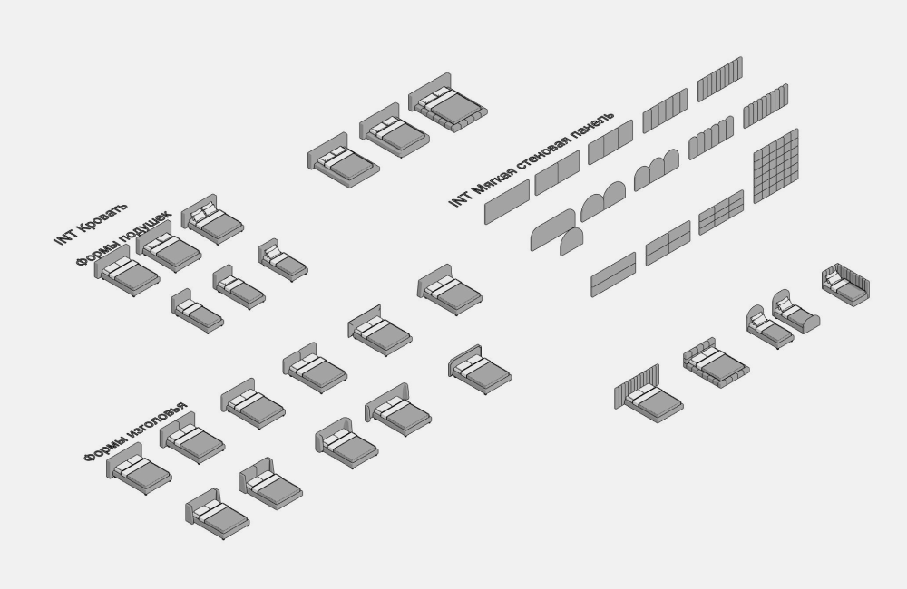

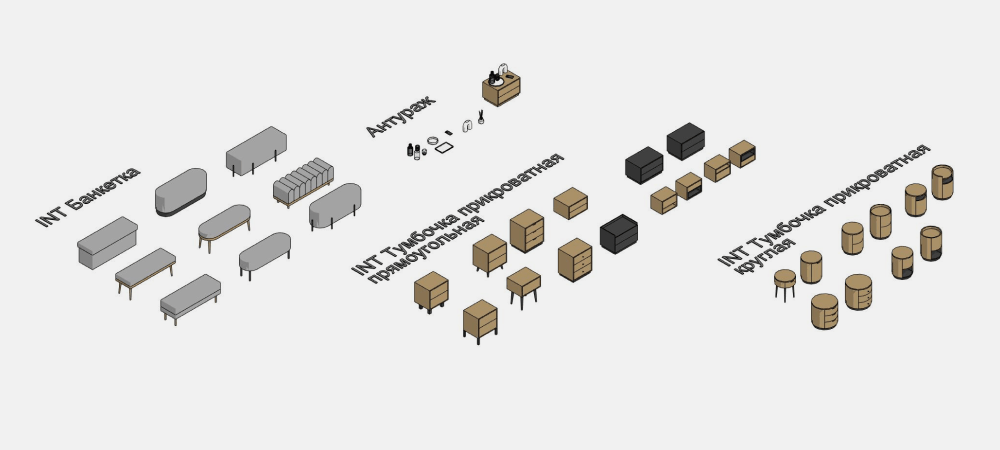

В состав набора входят следующие семейства категории Мебель:

-   Кровать
-   Мягкая стеновая панель
-   Банкетка
-   Тумбочка прикроватная прямоугольная
-   Тумбочка прикроватная круглая

Категория Антураж:

-   Графин
-   Ваза П-образная
-   Диффузор
-   Поднос
-   Стакан
-   Телефон

## 3. СЕМЕЙСТВА

### Кровать

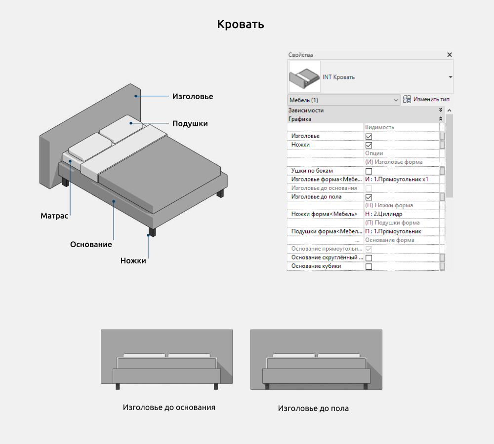

В семействе Кровать можно включить/выключить следующие элементы:

-   Изголовье
-   Ножки

Опции изголовья кровати: Изголовье до основания и Изголовье до пола.

**Размеры**

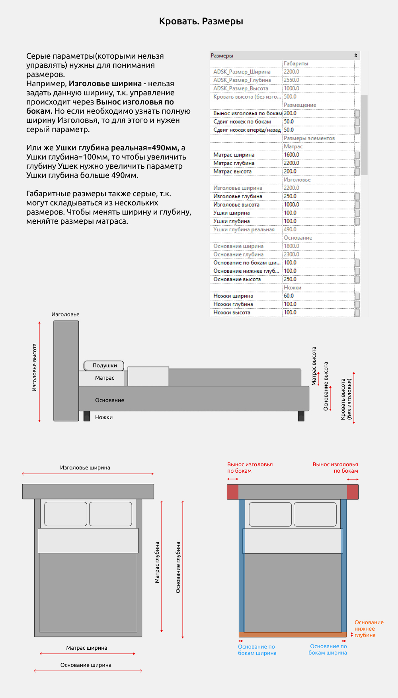

Серые параметры(которыми нельзя управлять) нужны для понимания размеров. Например, Изголовье ширина - нельзя задать данную ширину, т.к. управление происходит через Вынос изголовья по бокам. Но если необходимо узнать полную ширину Изголовья, то для этого и нужен серый параметр.

Или же Ушки глубина реальная=490мм, а Ушки глубина=100мм, то чтобы увеличить глубину Ушек нужно увеличить параметр Ушки глубина больше 490мм.

Габаритные размеры также серые, т.к. могут складываться из нескольких размеров. Чтобы менять ширину и глубину, меняйте размеры матраса.

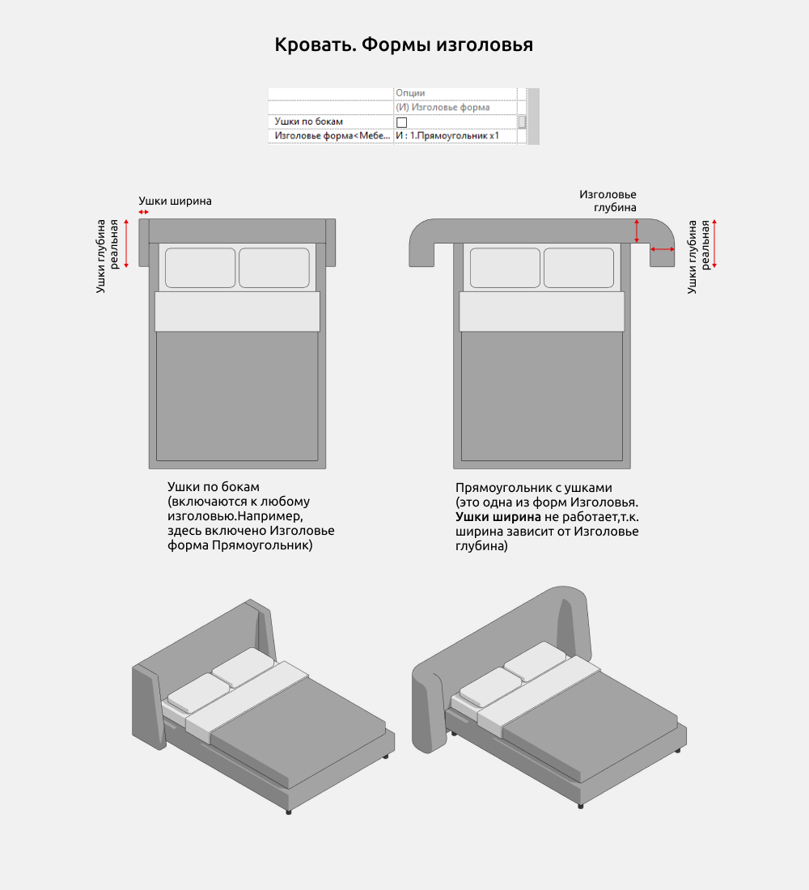

Ушки по бокам(включаются к любому изголовью.Например, здесь включено Изголовье форма Прямоугольник)

Прямоугольник с ушками(это одна из форм Изголовья.

Ушки ширина не работает,т.к. ширина зависит от Изголовье глубина)

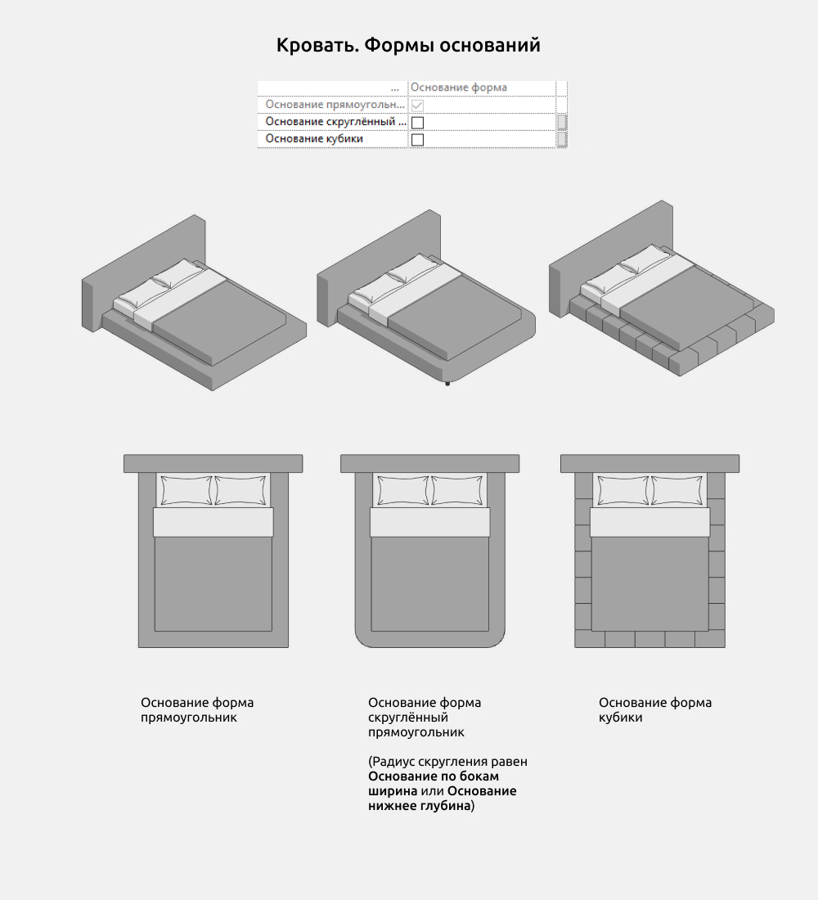

Формы оснований кровати:

-   Прямоугольник
-   Скруглённый прямоугольник (Радиус скругления равен Основание по бокам ширина или Основание нижнее глубина)
-   Кубики

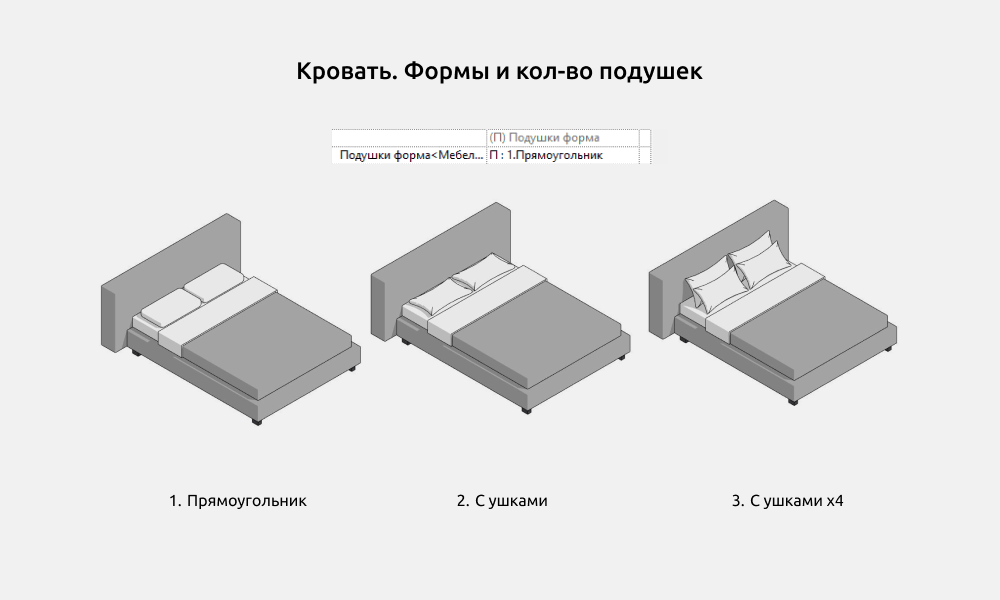

Формы и количество подушек:

-   Прямоугольник
-   С ушками
-   С ушками х4

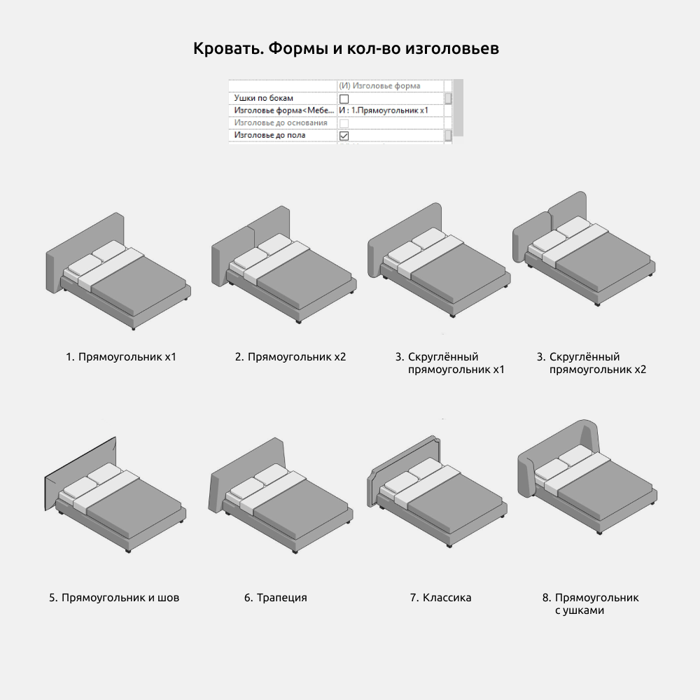

Формы и количество изголовьев:

-   Прямоугольник х1
-   Прямоугольник х2
-   Скруглённый прямоугольник х1
-   Скруглённый прямоугольник х2
-   Прямоугольник и шов
-   Трапеция
-   Классика
-   Прямоугольник с ушками

### Мягкая стеновая панель

Семейство мягкой стеновой панели можно использовать как изголовье для кровати или как декор для стен.

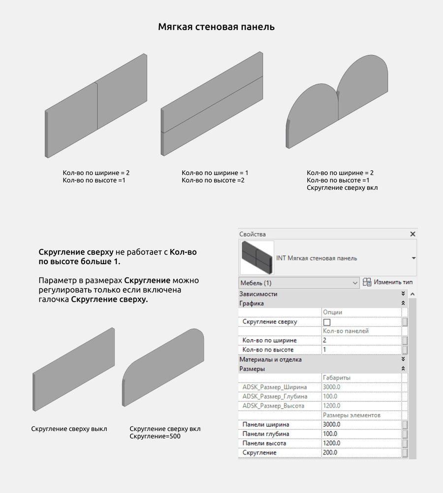

Скругление сверху не работает с Кол-во по высоте больше 1.

Параметр в размерах Скругление можно регулировать только если включена галочка Скругление сверху.

### Банкетка

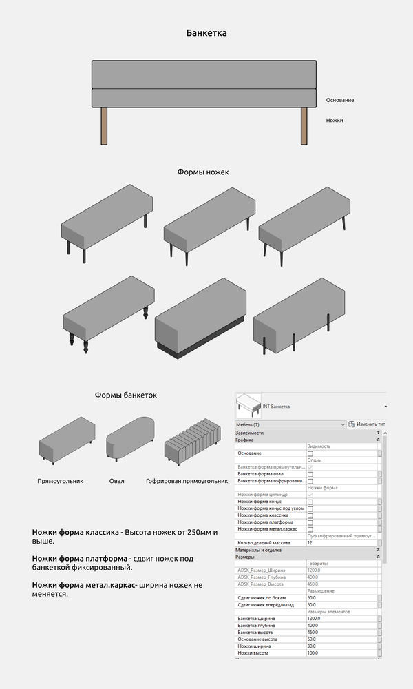

Формы банкеток:

-   Прямоугольник
-   Овал
-   Гофрированный прямоугольник

Формы ножек:

-   Цилиндр
-   Конус
-   Конус под углом
-   Классика
-   Платформа
-   Металлический каркас

Ножки форма классика - Высота ножек от 250мм и выше.

Ножки форма платформа - сдвиг ножек под банкеткой фиксированный.

Ножки форма метал.каркас- ширина ножек не меняется.

### Тумбочка прикроватная прямоугольная

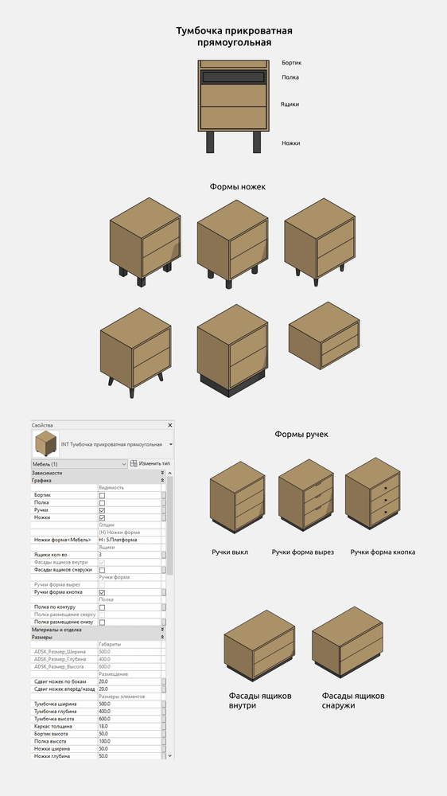

### Тумбочка прикроватная круглая

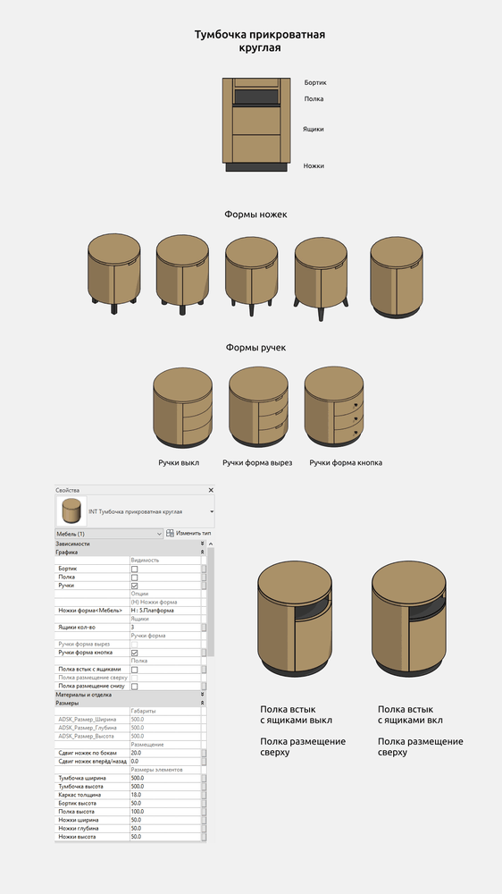

### Антураж

Данная группа семейств сделана категорией Антураж и нужна для декорирования интерьера.

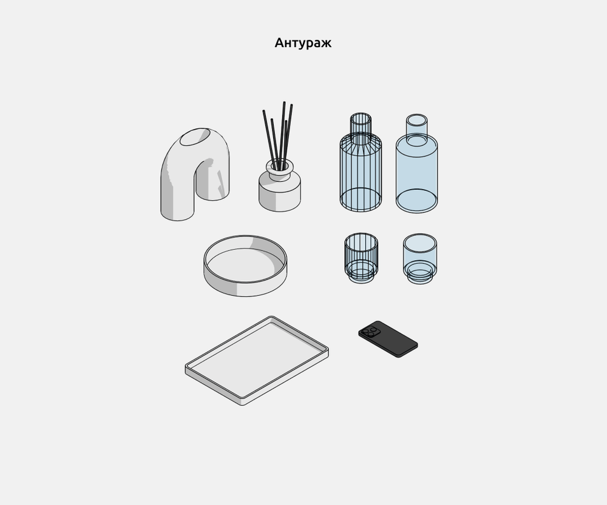

<CTA type="guide" />
