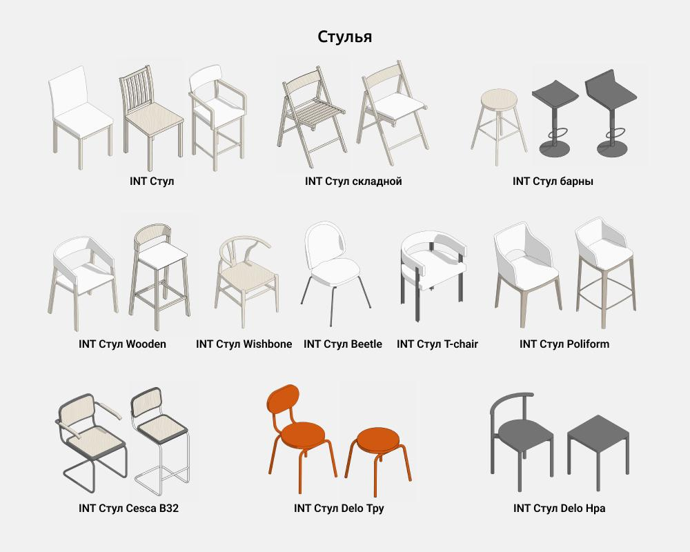
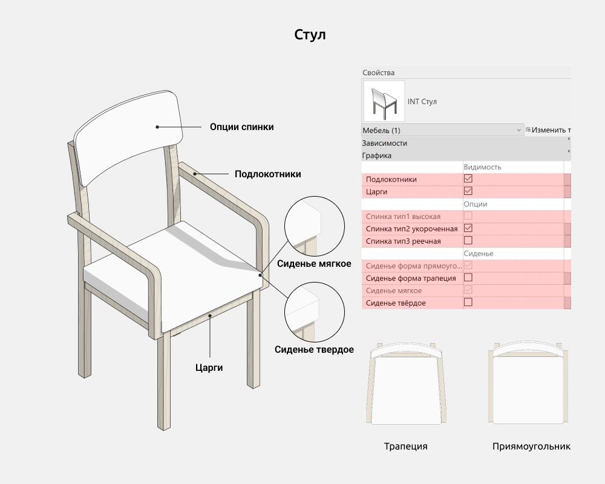
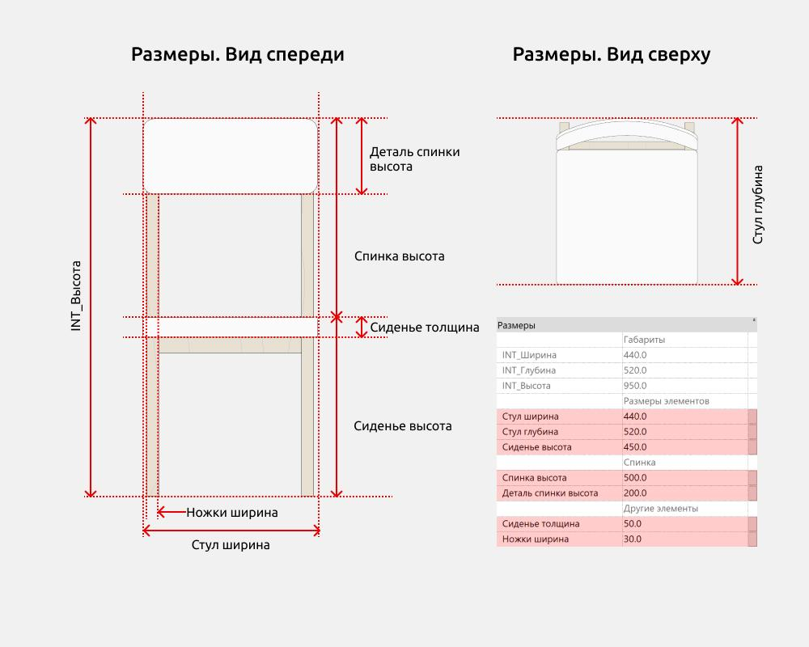
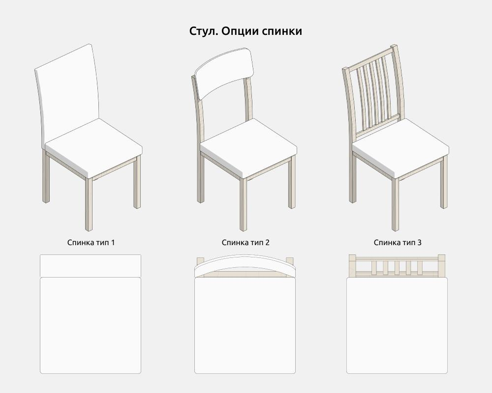
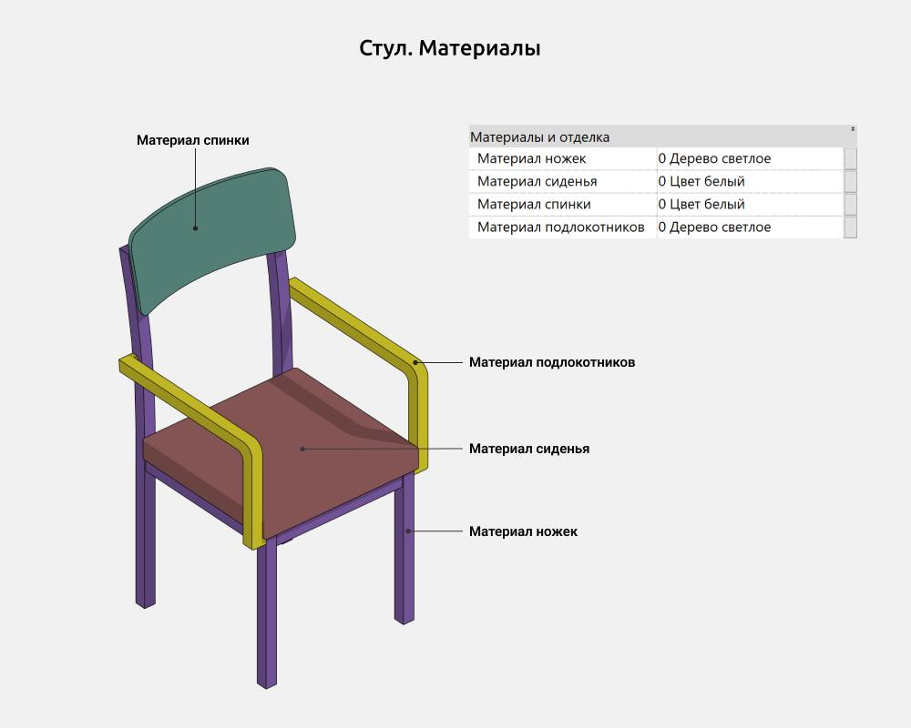
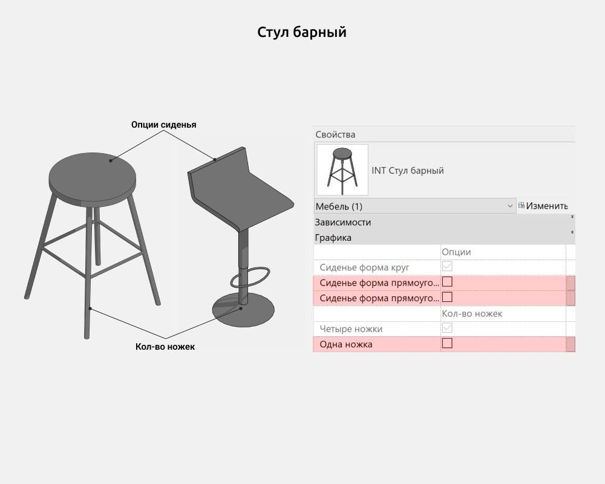
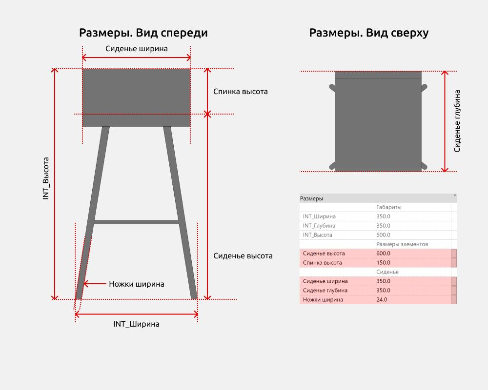
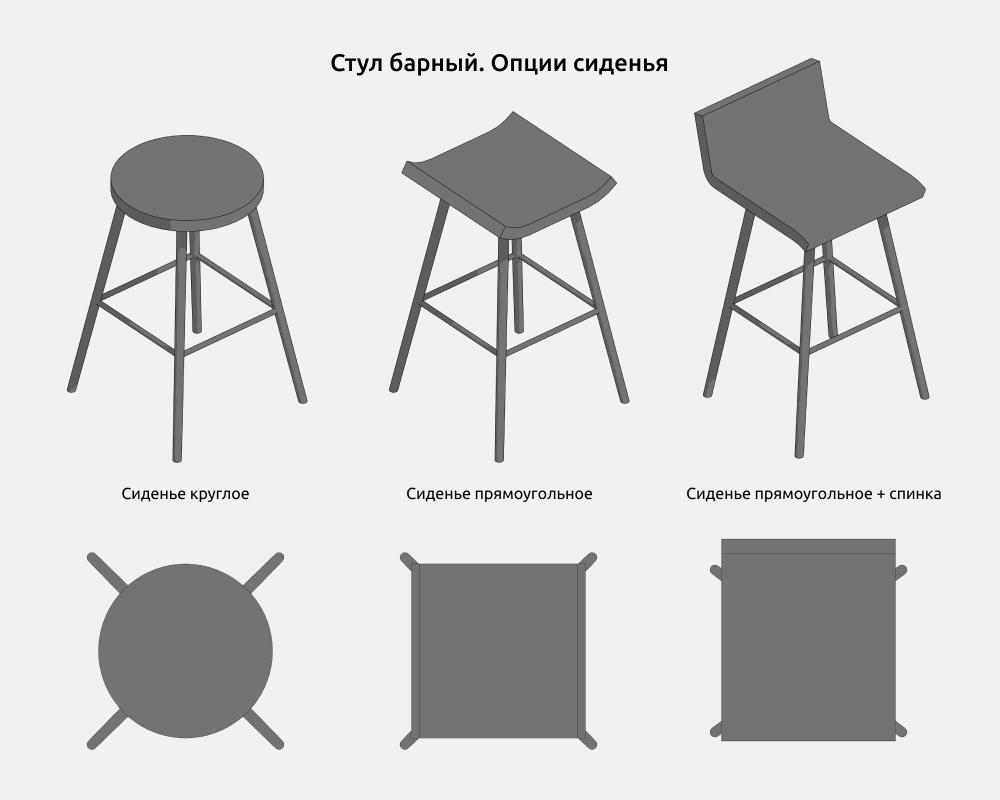
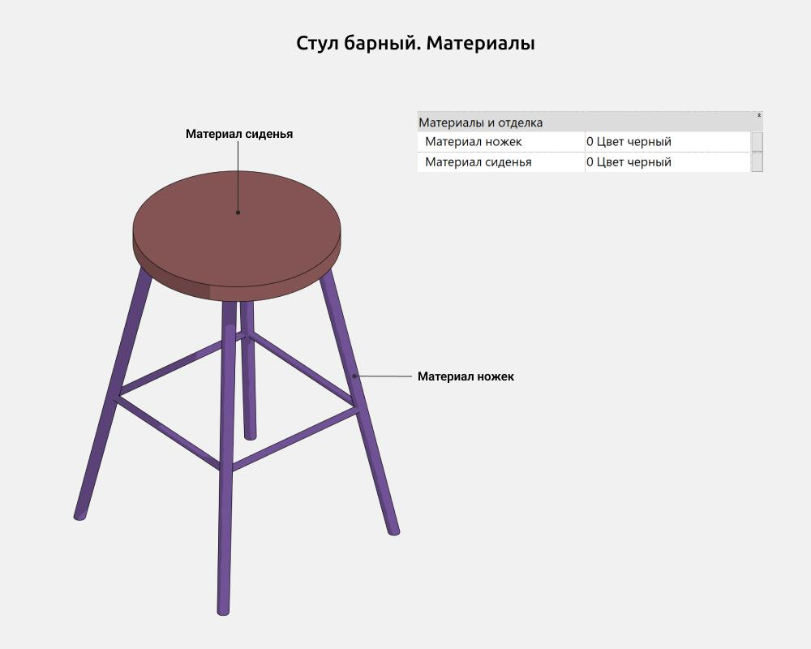
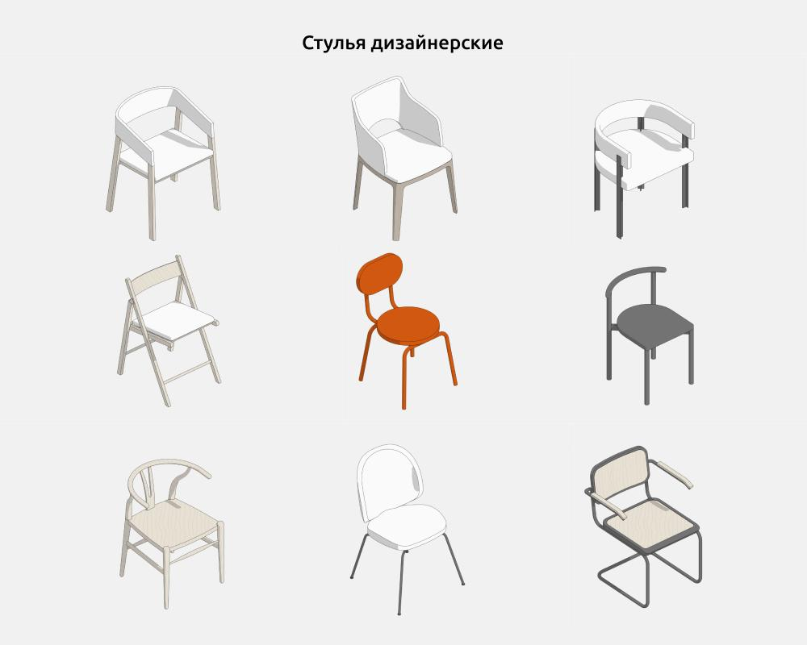

import productPreview from '@site/docs/guides/families/chairs-for-revit/product.jpg';

<ProductCard
  name="Стулья для Revit"
  eyebrow="Набор семейств Revit"
  description="Коллекция стульев в разных стилях — готовы к вставке в проект Revit."
  image={productPreview}
  imageAlt="Стулья для Revit — превью набора"
  buyUrl="https://bimcore.one/products/chair-revit-families"
  ecwidProductId="582492458"
  buyLabel="Купить"
  shopLabel="В магазин"
/>

<YouTube id="OJ5eNcMWfF0" title="Стулья для Revit" />

## 1. ОБЩИЕ ДАННЫЕ

- Название набора: Стулья
- Версия набора 1.0.0
- Версия Revit: 2019

### Описание

Этот набор семейств для Revit предназначен для моделирования стульев в Autodesk Revit.

С помощью семейств можно создать стулья и барные стулья базовых форм и видов, а также популярные дизайнерские модели.

Подходит дизайнерам интерьера и архитекторам. Для моделирования стульев мебельщиками семейства недостаточно детализированные.

### Загрузка и размещение

Для того чтобы посмотреть и загрузить нужные семейства из набора, можно открыть Проект стульев и скопировать семейства при помощи комбинации клавиш Ctrl+C, а затем вставить в свой проект Ctrl+V. Или открыть папку с файлами семейств и перетащить мышкой в проект.

## 2. СОСТАВ НАБОРА

В состав набора входят следующие параметрические семейства:

- Стул
- Стул барный

Стулья дизайнерские:

- Стул Beetle
- Стул Cesca B32
- Стул Delo Нра
- Стул Delo Тру
- Стул Poliform
- Стул T-chair
- Стул Wishbone
- Стул Wooden
- Стул складной

## 3. СЕМЕЙСТВА

### Стул

Семейство Стул используется для построения базовых форм и видов стульев.

Здесь можно включить/выключить следующие элементы:

- Подлокотники
- Царги (это горизонтальные планки-перекладины, соединяющие ножки сиденья по периметру)
- Спинка тип 1
- Спинка тип 2
- Спинка тип 3
- Сиденье форма прямоугольник
- Сиденье форма трапеция
- Сиденье мягкое
- Сиденье твердое

#### Размеры

INT_Высота - это параметр общей высоты стула, который складывается из параметров Спинка высота и Сиденье высота, которыми можно управлять.

#### Опции спинки

Количество типов спинок ограничено тремя, самыми распространенными вариантами.

Включить возможно тип 2 или тип 3. Если оба этих типа выключены - включается тип 1.

#### Материалы

### Стул барный

Семейство Стул барный используется для построения базовых форм и видов барных стульев.

Здесь можно включить/выключить следующие элементы:

- Сиденье форма круг
- Сиденье форма прямоугольник
- Сиденье форма прямоугольник + Спинка
- Четыре ножки
- Одна ножка

#### Размеры

INT_Высота - это параметр общей высоты барного стула, который складывается из параметров Спинка высота и Сиденье высота, которыми можно управлять.

#### Опции сиденья

Количество типов сиденья ограничено тремя, самыми распространенными вариантами.

Включить возможно Сиденье прямоугольное или Сиденье прямоугольное + спинка. Если оба этих типа выключены - Сиденье круглое.

#### Материалы

### Дизайнерские стулья

Все семейства группы Дизайнерские стулья используется для построения существующих моделей дизайнерских стульев.

Имеют схожую логику настройки по габаритам и отображению элементов (подлокотников, спинки итд) как и основные семейства Стул и Стул барный.

<CTA type="guide" />
