## 1. ОБЩИЕ ДАННЫЕ

-   Название набора: Шторы и жалюзи
-   Версия набора 1.0.1
-   Версия Revit: 2019

### Описание

Этот набор семейств для Revit предназначен для использования в архитектурных и интерьерных проектах для представления различных вариантов оформления окон. Включает в себя параметры для настройки внешнего вида, размещения, размеров и материала штор или жалюзи.

### Загрузка и размещение

Для того чтобы посмотреть и загрузить нужные семейства из набора, можно открыть **Проект с шторами и жалюзи** и скопировать семейства при помощи комбинации клавиш Ctrl+C, а затем вставить в свой проект Ctrl+V. Или открыть папку с файлами семейств и перетащить мышкой в проект.

## 2. СОСТАВ НАБОРА

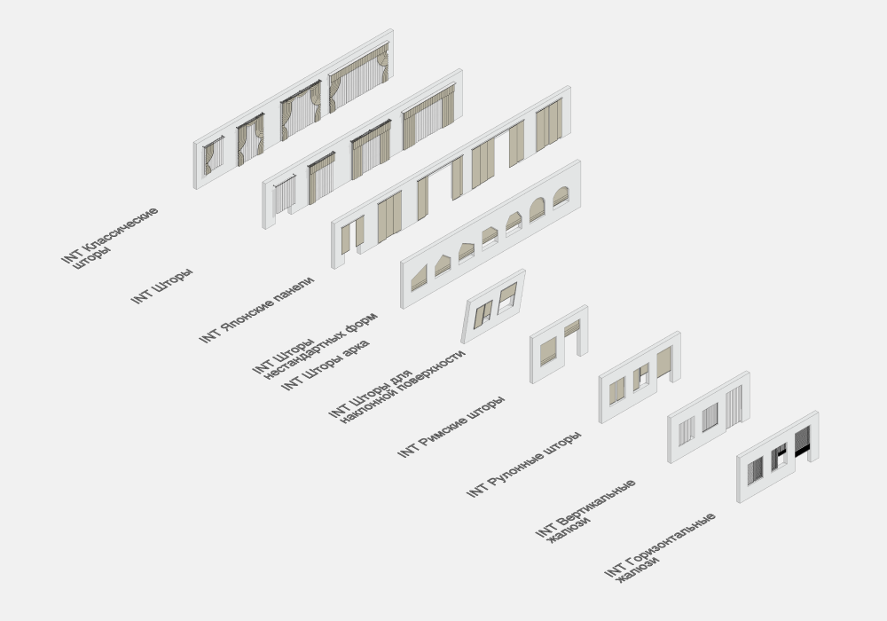

В состав набора входят следующие семейства категории Мебель:

-   Японские панели
-   Шторы
-   Классические шторы
-   Горизонтальные жалюзи
-   Вертикальные жалюзи
-   Рулонные шторы
-   Римские шторы
-   Шторы для наклонной поверхности
-   Шторы нестандартной формы
-   Шторы арка

## 3. СЕМЕЙСТВА

### Размещение штор и жалюзи

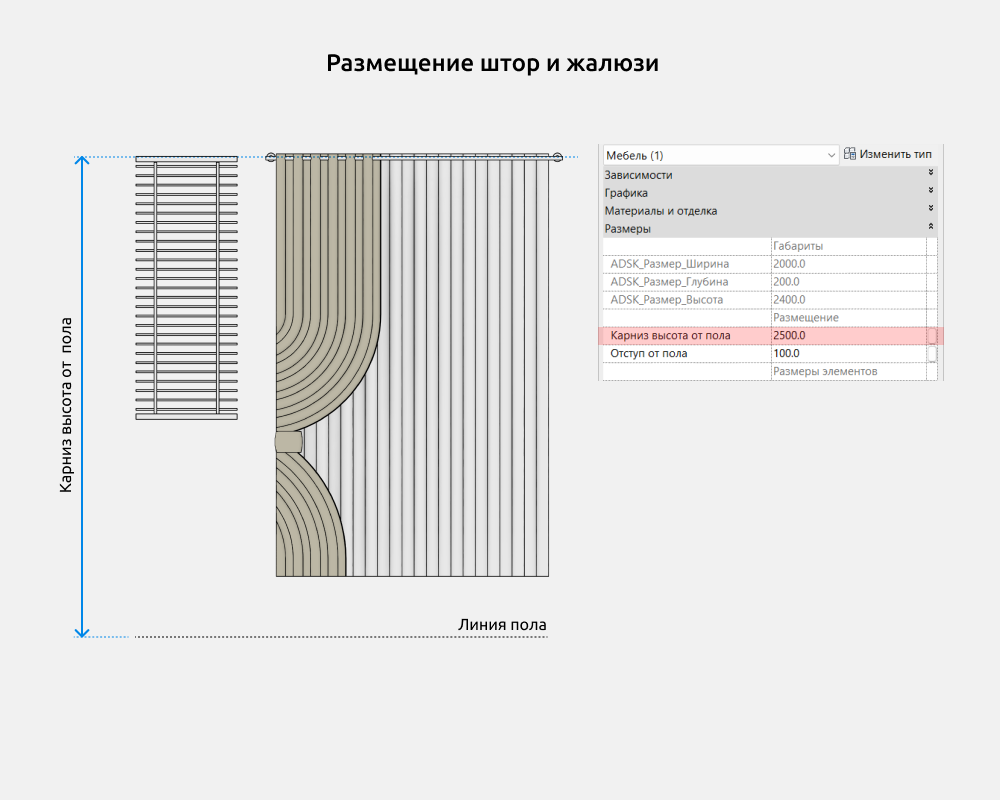

Универсальный параметр, используемый в большинстве семейств набора. Измеряет расстояние от пола до верхней точки семейства (до верха жалюзи или шторы).

### Японские панели

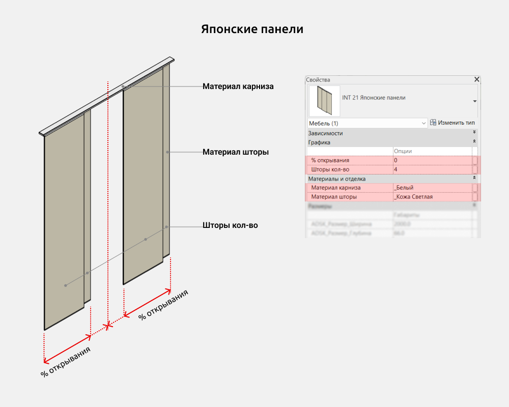

В семействах с японскими панелями можно изменить значения следующим параметрам:

-   % открывания
-   Шторы кол-во

Параметр “% открывания” встречается в многих семействах данного набора и отвечает за закрытие/ открытие. Значение “% открывания” не влияет на параметры Размеры элементов.

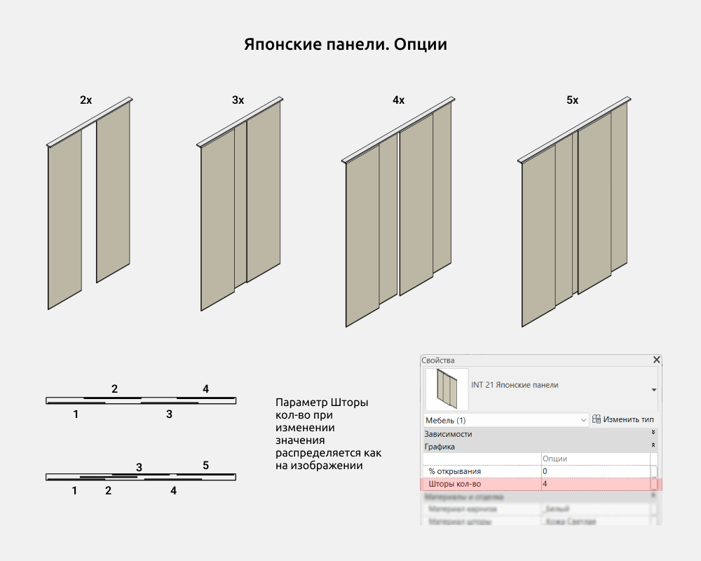

В семействах есть параметр “Шторы кол-во”, значение которого меняется от ввода цифр в строку.

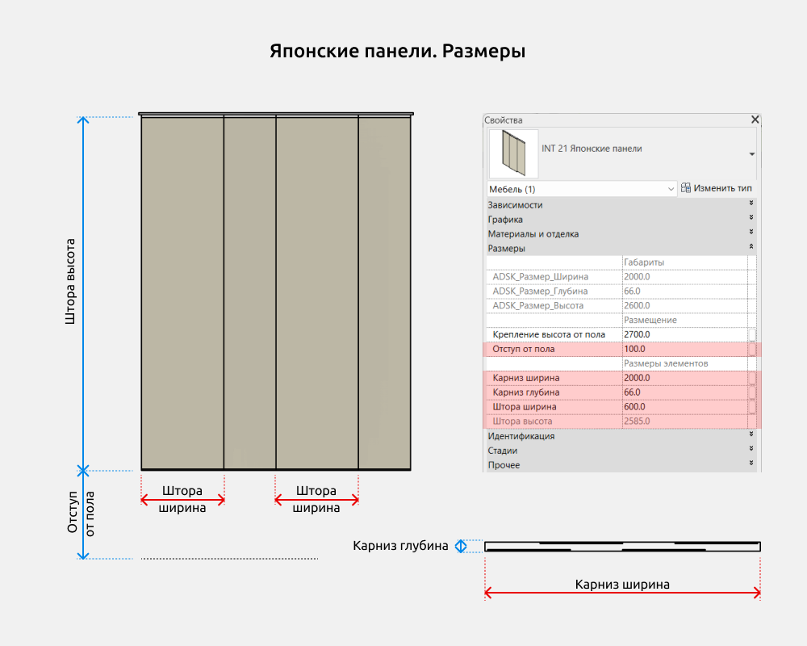

Отступ от пола встречается в многих семействах данного набора, измеряет от уровня пола до нижней точки семейства.

Карниз высота имеет фиксированное значение в 15 мм.

Карниз ширина, Карниз глубина - это габариты семейства.

Штора ширина, Штора высота- параметры одной панели.

Есть параметры серого цвета, которыми нельзя управлять. Но они нужны для понимания расчётов размеров. Например, Штора высота. Параметр отнимает Карниз высота и показывает высоту полотна панели.

### Шторы

В семействах шторы можно включить/выключить следующие элементы:

-   Тюль
-   Шторы
-   Ламбрекен

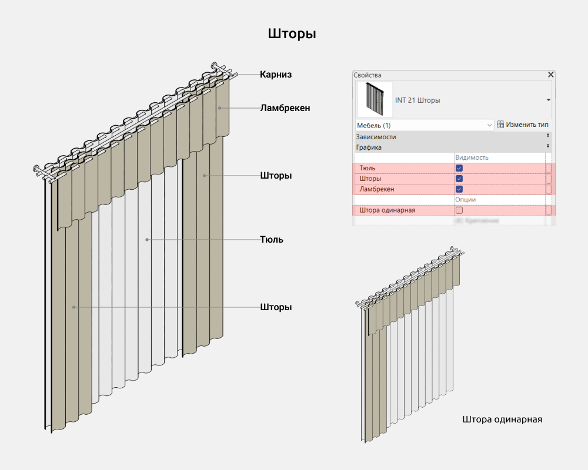

Опция “Штора одинарная” выключает штору с правой стороны.

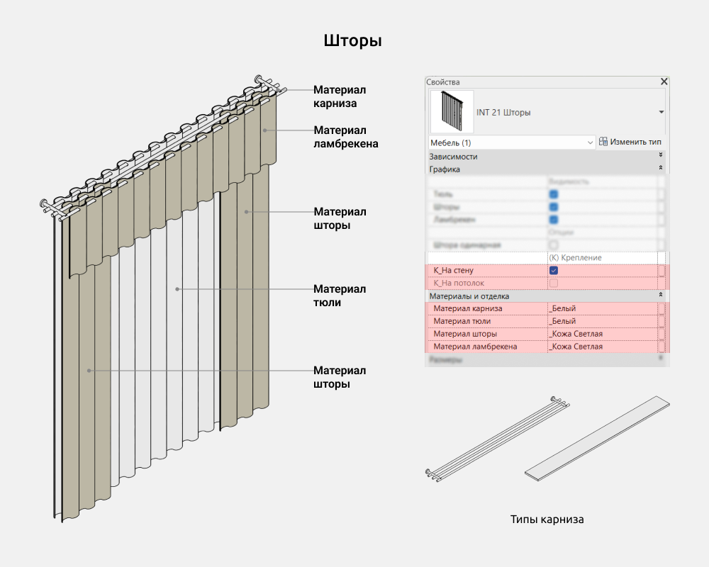

Типы карнизов:

-   К_На стену - карниз размещается с отступом от потолка и крепится к вертикальной поверхности.
-   К_На потолок - карниз фиксируется непосредственно к потолку. Подходит для скрытого или встроенного монтажа.

Содержит несколько параметров для задания материалов, что позволяет гибко настраивать внешний вид изделия. В «Материалы и отделка» доступны следующие параметры:

-   Материал карниза
-   Материал тюли
-   Материал шторы
-   Материал ламбрекена

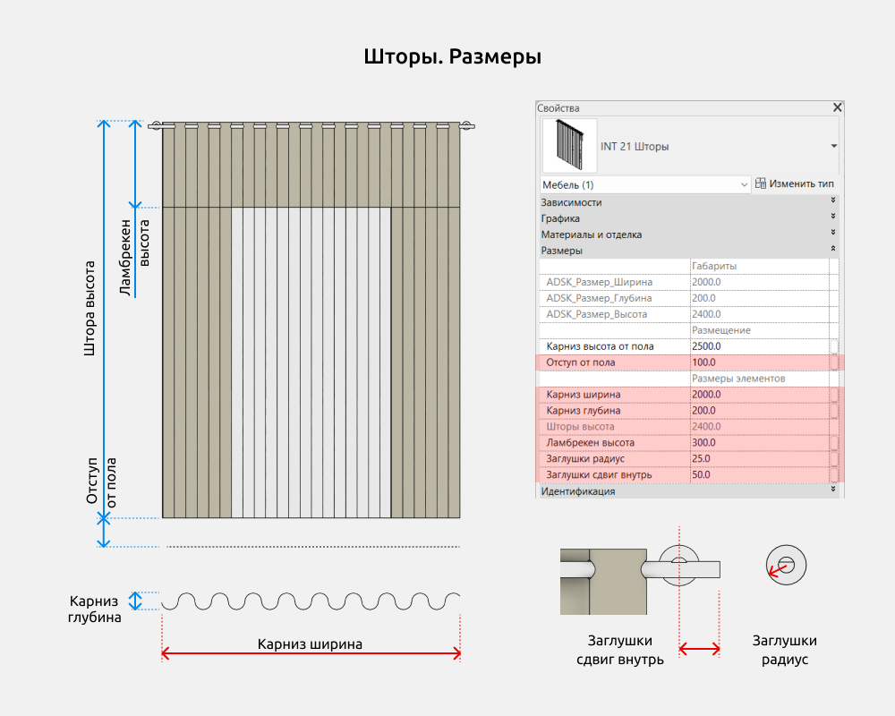

Отступ от пола встречается в многих семействах данного набора, измеряет от уровня пола до нижней точки семейства.

Карниз ширина, Карниз глубина, Штора высота - это габариты семейства.

Ламбрекен высота, Заглушки радиус, Заглушки сдвиг внутрь – отдельные параметры.

Есть параметры серого цвета, которыми нельзя управлять. Но они нужны для понимания расчётов размеров. Например, Штора высота. Параметр отнимает Отступ от пола и показывает габаритную высоту.

### Классические шторы

В семействах шторы можно включить/выключить следующие элементы:

-   Тюль
-   Шторы
-   Ламбрекен

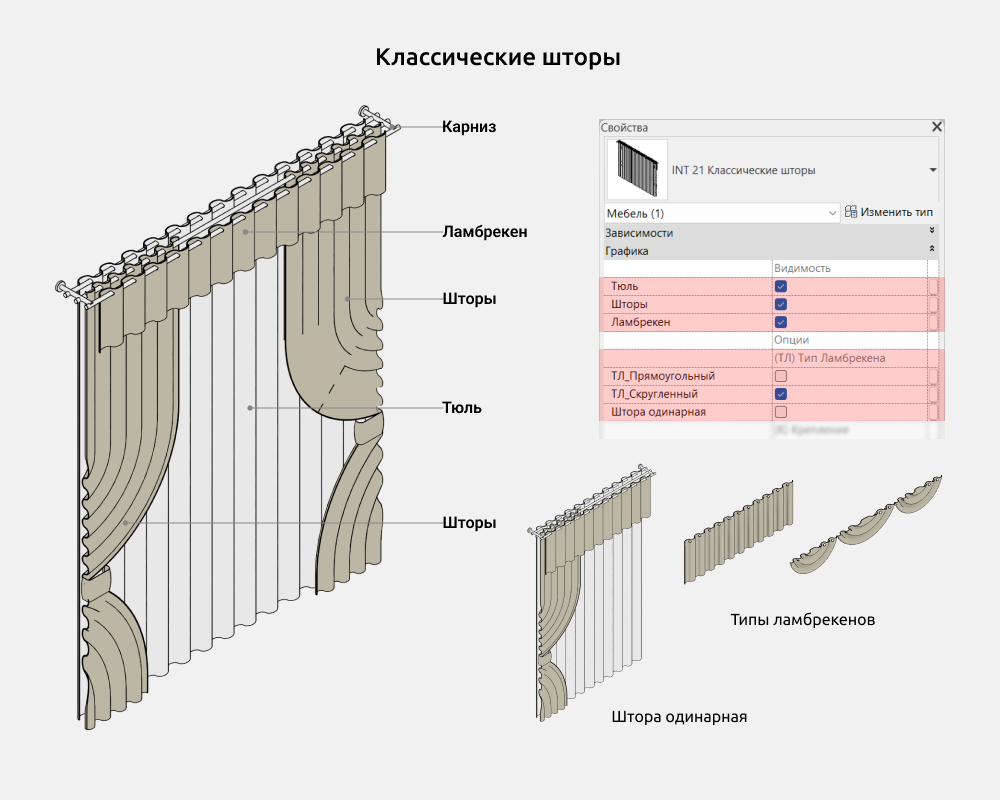

Ламбрекены двух типов: ТЛ_Прямоугольный,ТЛ_Скругленный.

Опция “Штора одинарная” выключает штору с правой стороны.

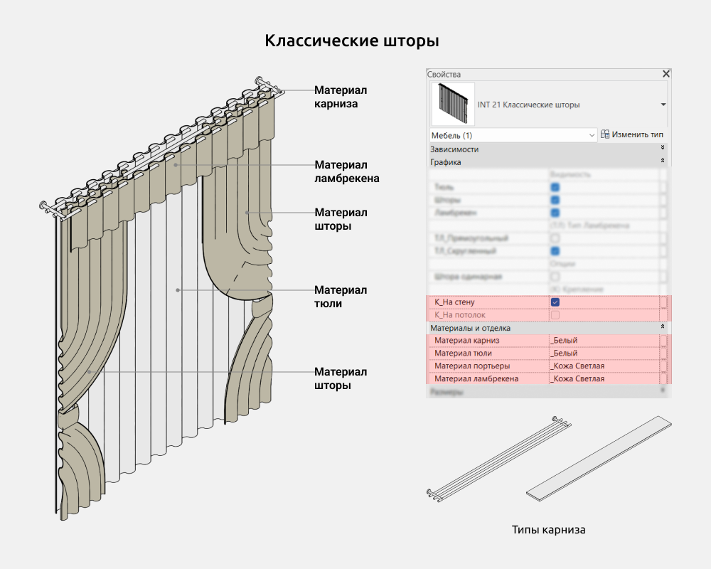

Типы карнизов:

-   К_На стену - карниз размещается с отступом от потолка и крепится к вертикальной поверхности.
-   К_На потолок - карниз фиксируется непосредственно к потолку. Подходит для скрытого или встроенного монтажа.

Содержит несколько параметров для задания материалов, что позволяет гибко настраивать внешний вид изделия. В «Материалы и отделка» доступны следующие параметры:

-   Материал карниза
-   Материал тюли
-   Материал портьеры
-   Материал ламбрекена

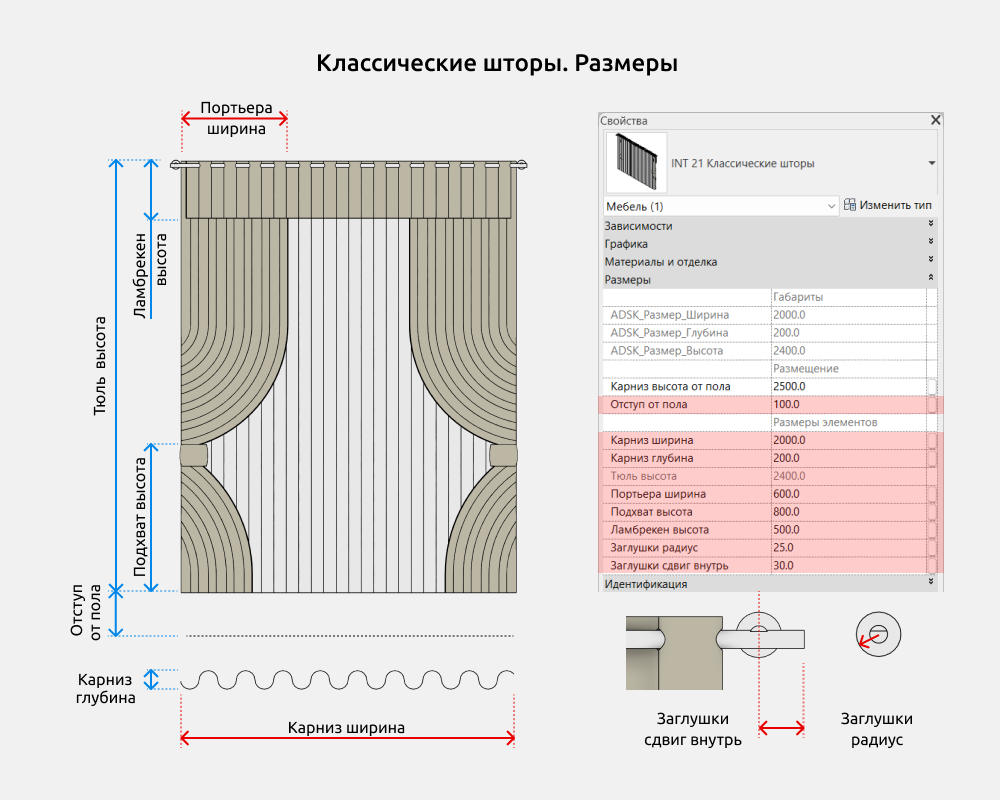

Отступ от пола встречается в многих семействах данного набора, измеряет от уровня пола до нижней точки семейства.

Карниз ширина, Карниз глубина, Штора высота - это габариты семейства.

Портьера ширина, Подхват высота, Ламбрекен высота, Заглушки радиус, Заглушки сдвиг внутрь – отдельные параметры.

Портьера ширина- ширина одного полотна портьеры.

Подхват высота- расположение декоративного подхвата относительно низа шторы.

Есть параметры серого цвета, которыми нельзя управлять. Но они нужны для понимания расчётов размеров. Например, Штора высота. Параметр отнимает Отступ от пола и показывает габаритную высоту.

### Горизонтальные жалюзи

В семействах шторы можно включить/выключить следующие элементы:

-   Рамки вертикальные

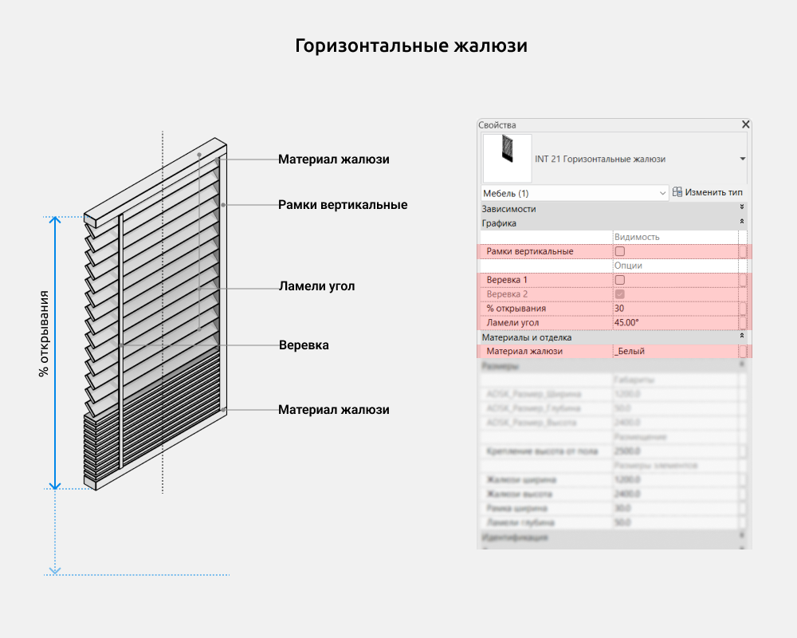

В подразделе “Опции” можно выбрать тип веревки при выключенном элементе Рамки вертикальные, можно поменять Ламели угол.

Параметр “% открывания” встречается в многих семействах данного набора и отвечает за закрытие/ открытие. Значение “% открывания” не влияет на параметры Размеры элементов.

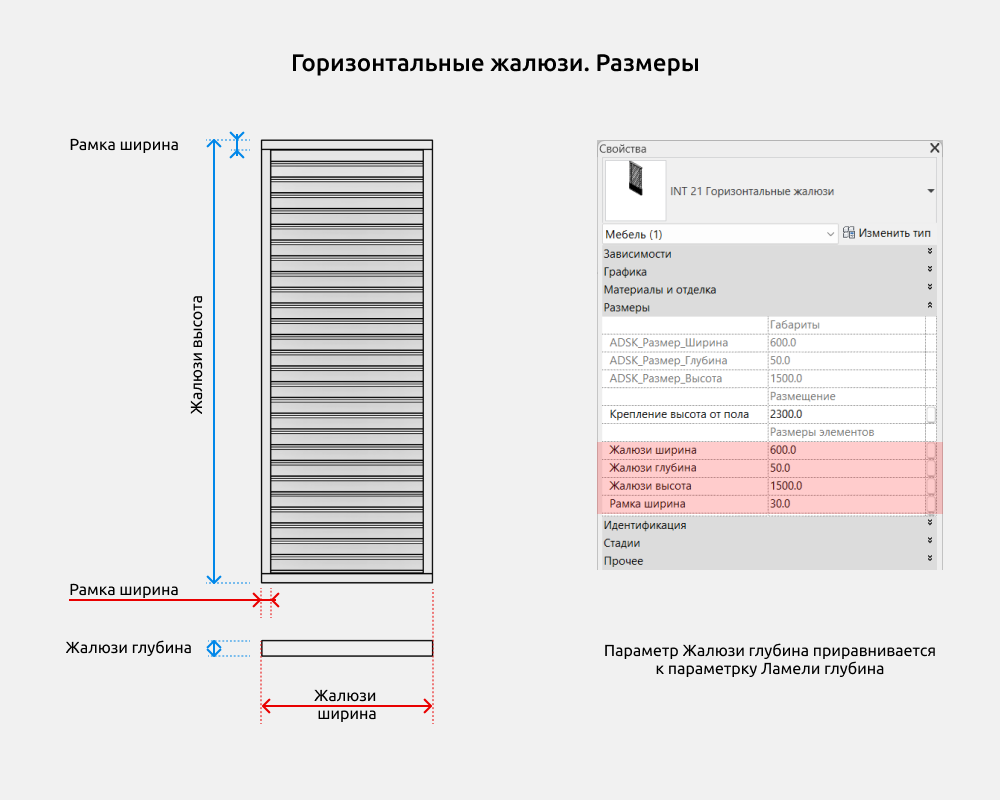

Жалюзи ширина, Жалюзи глубина, Жалюзи высота - это габариты семейства.

Рамка ширина отдельный параметр.

Есть параметры серого цвета, которыми нельзя управлять (например, ADSK_Размер_Ширина). Они нужны для понимания расчётов размеров и корректной работы формул и не предназначены для пользовательского редактирования.

### Вертикальные жалюзи

В семействах шторы можно включить/выключить следующие элементы:

-   Рамки

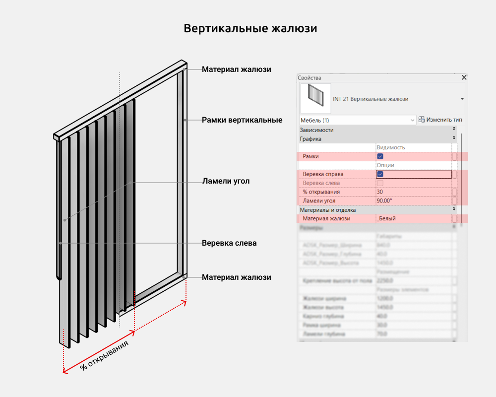

В подразделе “Опции” можно выбрать тип веревки при выключенном элементе Рамки, можно поменять Ламели угол.

Параметр “% открывания” встречается в многих семействах данного набора и отвечает за закрытие/ открытие. Значение “% открывания” не влияет на параметры Размеры элементов.

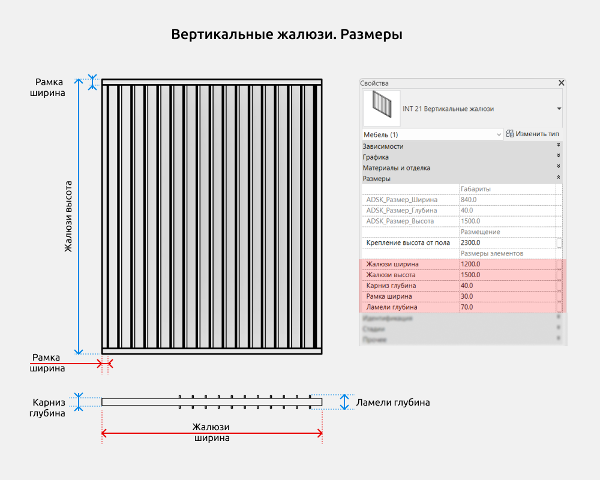

Жалюзи ширина, Карниз глубина, Жалюзи высота - это габариты семейства.

Рамка ширина, Ламели глубина отдельные параметры.

Есть параметры серого цвета, которыми нельзя управлять (например, ADSK_Размер_Ширина). Они нужны для понимания расчётов размеров и корректной работы формул и не предназначены для пользовательского редактирования.

### Рулонные шторы

В семействах шторы можно включить/выключить следующие элементы:

-   Карниз крышка

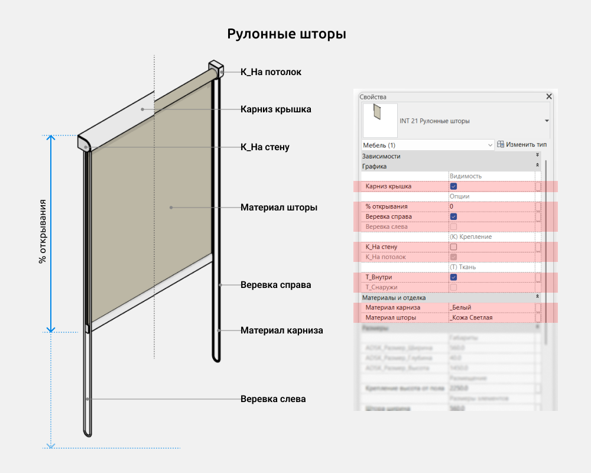

В подразделе “Опции” можно выбрать тип веревки, поменять крепление на стену или к потолку и выбрать размещение ткани шторы внутри или снаружи.

Параметр “% открывания” встречается в многих семействах данного набора и отвечает за закрытие/ открытие. Значение “% открывания” не влияет на параметры Размеры элементов.

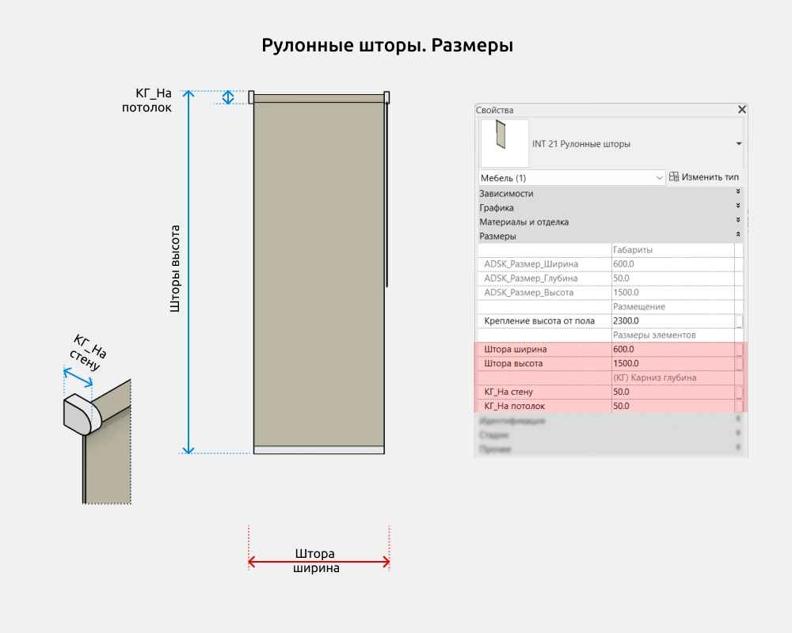

Штора ширина, Штора высота, КГ_на стену - это габариты семейства.

КГ_на стену параметр работает при включении опции К_На стену. Если эта опция отключена габарит глубины карниза равен 40 мм.

КГ_На потолок параметр, который работает при включении опции К_На потолок.

Есть параметры серого цвета, которыми нельзя управлять (например, ADSK_Размер_Ширина). Они нужны для понимания расчётов размеров и корректной работы формул и не предназначены для пользовательского редактирования.

### Римские шторы

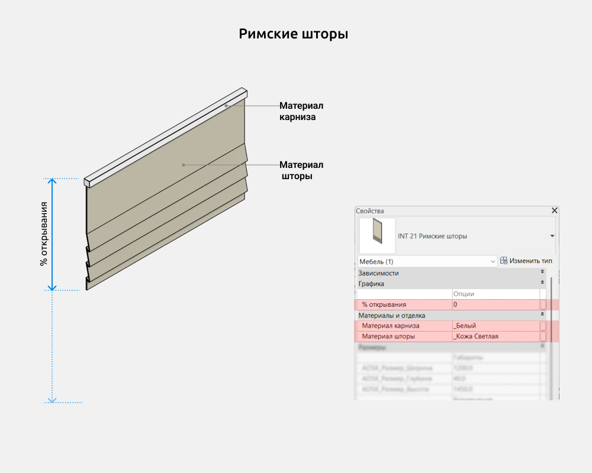

Параметр “% открывания” встречается в многих семействах данного набора и отвечает за закрытие/ открытие. Значение “% открывания” не влияет на параметры Размеры элементов.

Содержит несколько параметров для задания материалов, что позволяет гибко настраивать внешний вид изделия. В «Материалы и отделка» доступны следующие параметры:

-   Материал карниза
-   Материал шторы

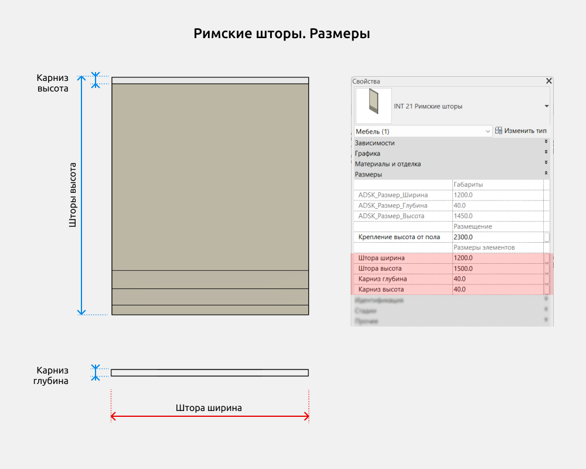

Штора ширина, Карниз глубина, Штора высота - это габариты семейства.

Карниз высота отдельный параметр.

Есть параметры серого цвета, которыми нельзя управлять (например, ADSK_Размер_Ширина). Они нужны для понимания расчётов размеров и корректной работы формул и не предназначены для пользовательского редактирования.

### Шторы для наклонной поверхности

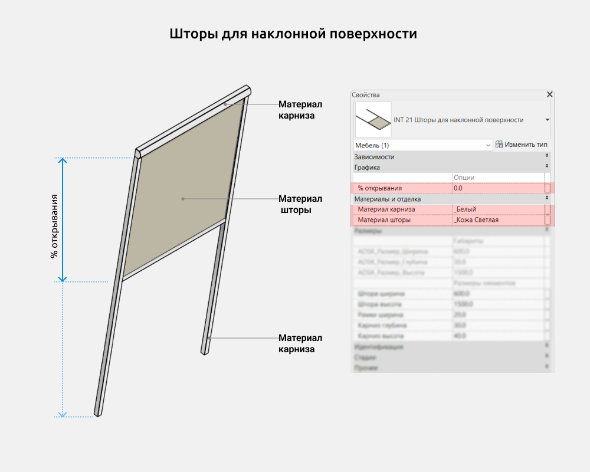

Параметр “% открывания” встречается в многих семействах данного набора и отвечает за закрытие/ открытие. Значение “% открывания” не влияет на параметры Размеры элементов.

Содержит несколько параметров для задания материалов, что позволяет гибко настраивать внешний вид изделия. В «Материалы и отделка» доступны следующие параметры:

-   Материал карниза
-   Материал шторы

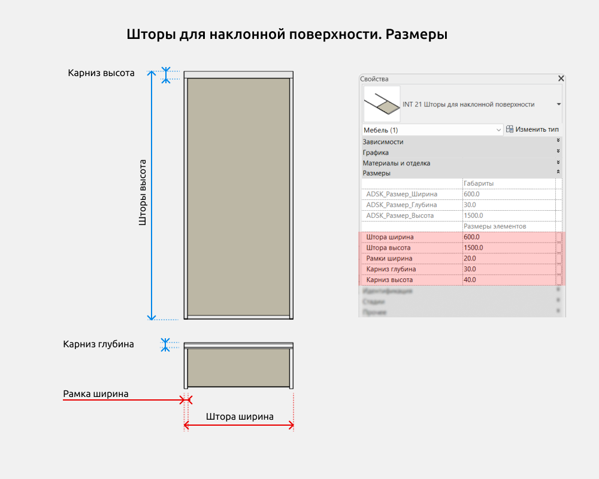

Штора ширина, Карниз глубина, Штора высота - это габариты семейства.

Рамки ширина, Карниз высота отдельные параметры.

Есть параметры серого цвета, которыми нельзя управлять (например, ADSK_Размер_Ширина). Они нужны для понимания расчётов размеров и корректной работы формул и не предназначены для пользовательского редактирования.

### Шторы нестандартной формы

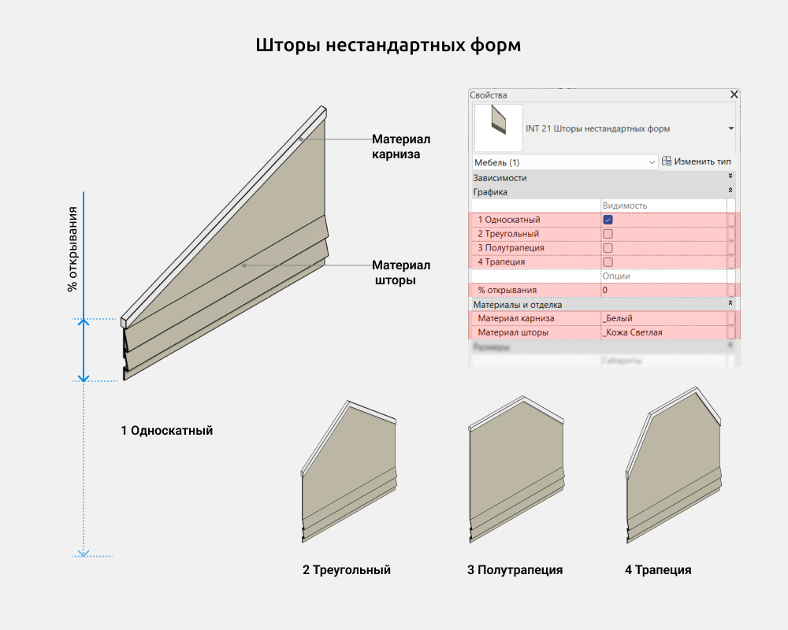

В семействах шторы можно включить/выключить следующие элементы:

-   1 Односкатный
-   2 Треугольный
-   3 Полутрапеция
-   4  Трапеция

Параметр “% открывания” встречается в многих семействах данного набора и отвечает за закрытие/ открытие. Значение “% открывания” не влияет на параметры Размеры элементов.

Содержит несколько параметров для задания материалов, что позволяет гибко настраивать внешний вид изделия. В «Материалы и отделка» доступны следующие параметры:

-   Материал карниза
-   Материал шторы

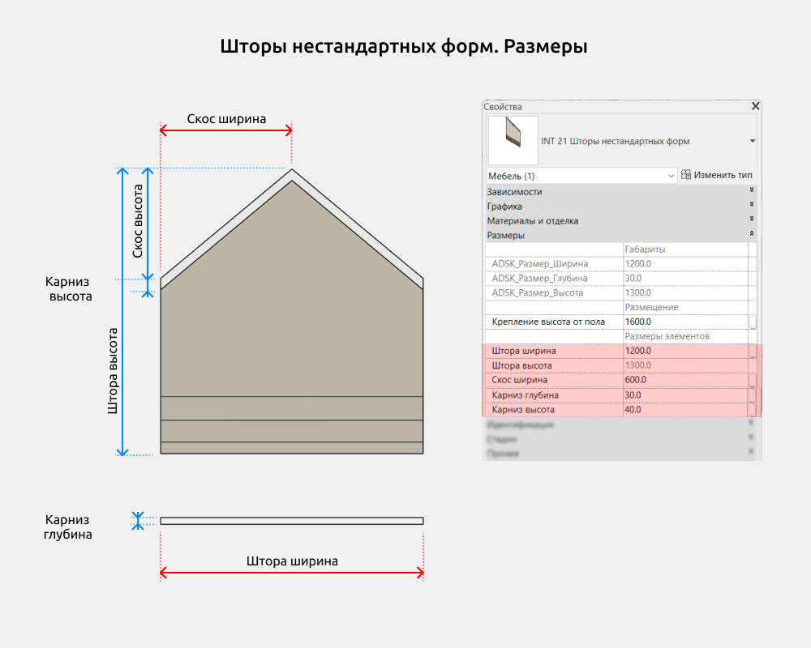

Штора ширина, Карниз глубина, Штора высота - это габариты семейства.

Скос ширина, Скос высота, Карниз высота, Карниз глубина отдельные параметры.

Есть параметры серого цвета, которыми нельзя управлять (например, ADSK_Размер_Ширина). Они нужны для понимания расчётов размеров и корректной работы формул и не предназначены для пользовательского редактирования.

### Шторы арка

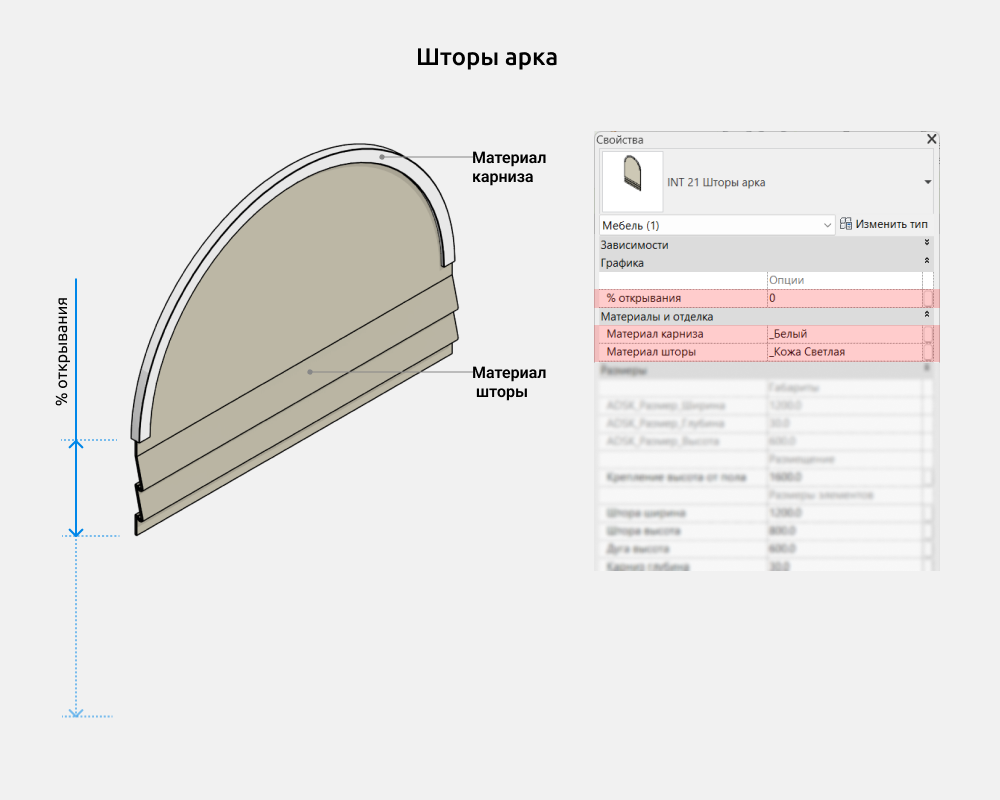

Параметр “% открывания” встречается в многих семействах данного набора и отвечает за закрытие/ открытие. Значение “% открывания” не влияет на параметры Размеры элементов.

Содержит несколько параметров для задания материалов, что позволяет гибко настраивать внешний вид изделия. В «Материалы и отделка» доступны следующие параметры:

-   Материал карниза
-   Материал шторы

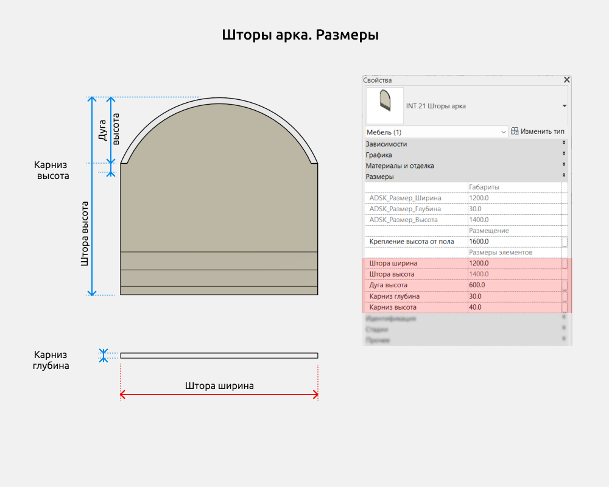

Штора ширина, Карниз глубина, Штора высота - это габариты семейства.

Дуга высота, Карниз высота, Карниз глубина отдельные параметры.

Есть параметры серого цвета, которыми нельзя управлять (например, ADSK_Размер_Ширина). Они нужны для понимания расчётов размеров и корректной работы формул и не предназначены для пользовательского редактирования.

## 4. ОФОРМЛЕНИЕ

### Настройка графики

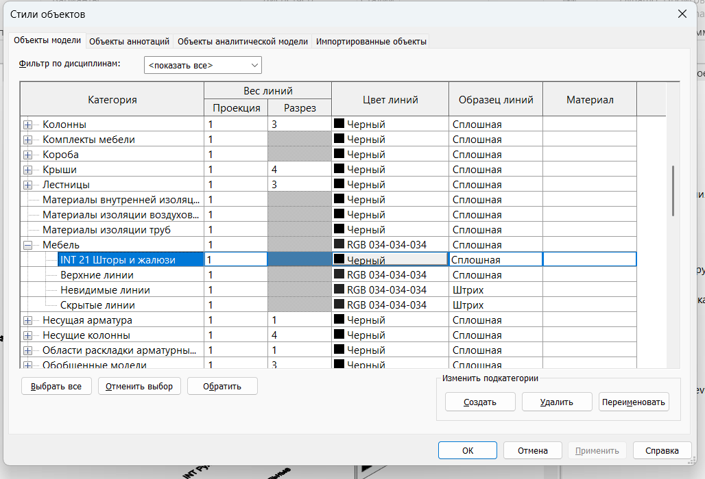

Чтобы поменять цвет/вес/тип линий семейств, нужно перейти в Управление - Стили объектов - Мебель/INT 21 Шторы и жалюзи

В семействах Шторы и Классические шторы, чтобы поменять УГО на планах этажей нужно изменить цвет штриховки.

<CTA type="guide" />
