import productPreview from '@site/docs/guides/families/kitchen-for-revit/product.png';

<ProductCard
  name="Кухни для Revit"
  eyebrow="Набор семейств Revit"
  description="Шкафы, техника и столешницы — семейства кухни для вашего проекта Revit."
  image={productPreview}
  imageAlt="Кухни для Revit — превью набора"
  buyUrl="https://bimcore.one/products/kitchen-revit-families-v-3"
  ecwidProductId="543629545"
  buyLabel="Купить"
  shopLabel="В магазин"
/>

<YouTube id="OfIxAAWaW1g" title="Кухни для Revit" />

## 1. ОБЩИЕ ДАННЫЕ

-   Название набора: Семейства Кухня
-   Версия набора 3.2.1
-   Версия Revit: 2019

### Описание

Этот набор семейств для Revit предназначен для моделирования кухни в Autodesk Revit.

С помощью семейства можно создать кухню по точным размерам и посчитать количество модулей кухни.

Подходит дизайнерам интерьера и архитекторам. Для моделирования кухни мебельщиками семейства недостаточно детализированные.

### Загрузка и размещение

Для того чтобы посмотреть и загрузить нужные семейства из набора, можно открыть Проект с кухней и скопировать семейства при помощи комбинации клавиш Ctrl+C, а затем вставить в свой проект Ctrl+V. Или открыть папку с файлами семейств и перетащить мышкой в проект.

## 2. СОСТАВ НАБОРА

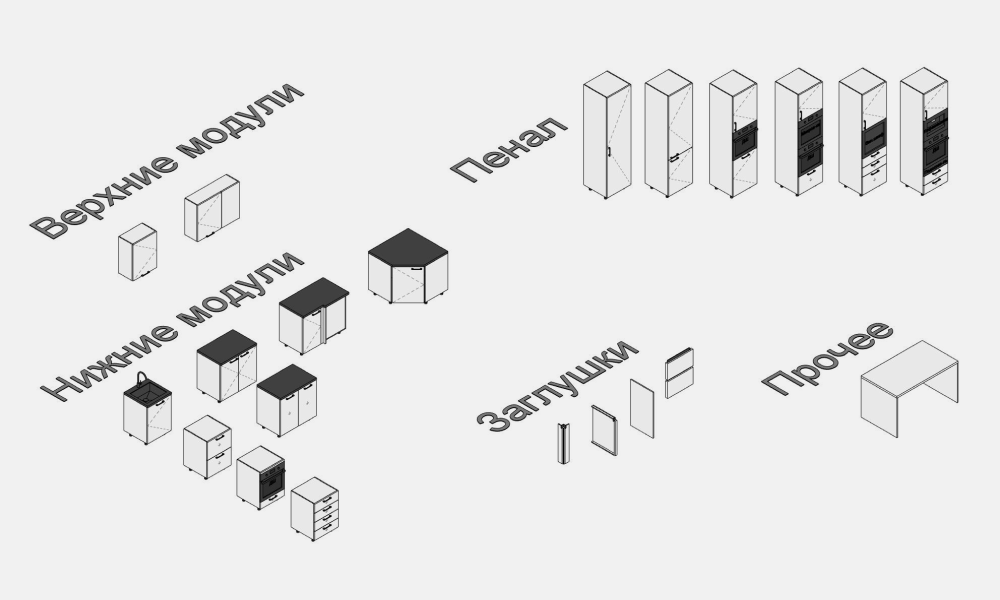

В состав набора входят следующие семейства:

Нижние модули

-   Нижний модуль (х1,х2,х3,х4)
-   Нижний модуль 2 дверцы (2 дверцы, 2 ящика)
-   Нижний модуль L-форма
-   Нижний модуль V-форма

Верхние модули

-   Верхний модуль
-   Верхний модуль L-форма

Пенал

-   Пенал (х1,х2,х3,х4,х5,х6)

Заглушки

-   Заглушка
-   Заглушка угловая
-   Панель
-   Панель с Gola

Прочее

-   Столешница островная

## 3. ОБЩИЕ ЭЛЕМЕНТЫ

В этом разделе вы узнаете из каких элементов состоят модули и как их настраивать.

### Общие элементы

Общие элементы - элементы, которые повторяются в каждом кухонном модуле.

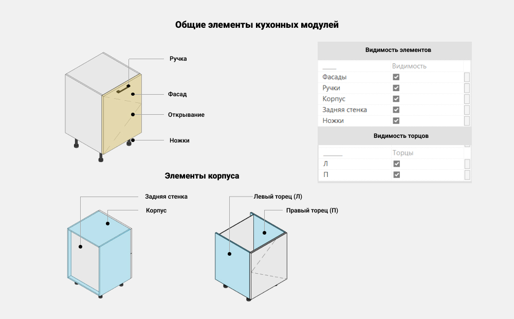

Общими элементами всех кухонных модулей являются:

-   Фасады
-   Ручки
-   Ножки
-   Открывание
-   Корпус
-   Задняя стенка (часть корпуса)
-   Левый торец (часть корпуса)
-   Правый торец (часть корпуса)

### Фасады

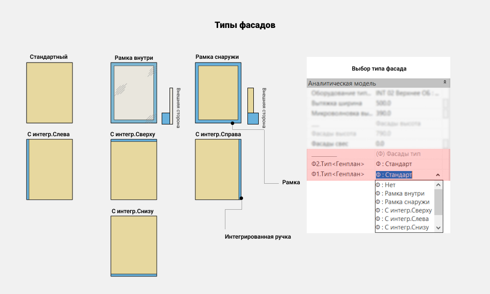

Типы фасадов можно выбрать в выпадающем списке у каждого семейства модуля. Это:

-   Нет фасада
-   Стандарт
-   Рамка внутри
-   Рамка снаружи
-   С интегрированной ручкой сверху
-   С интегрированной ручкой слева
-   С интегрированной ручкой справа
-   С интегрированной ручкой снизу

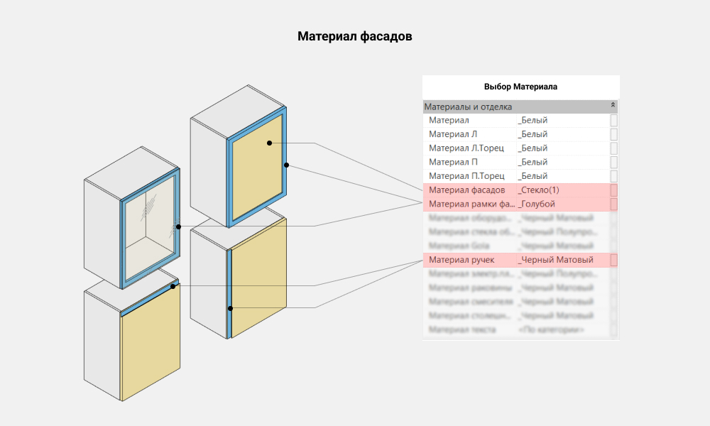

### Ручки

#### Типы ручек

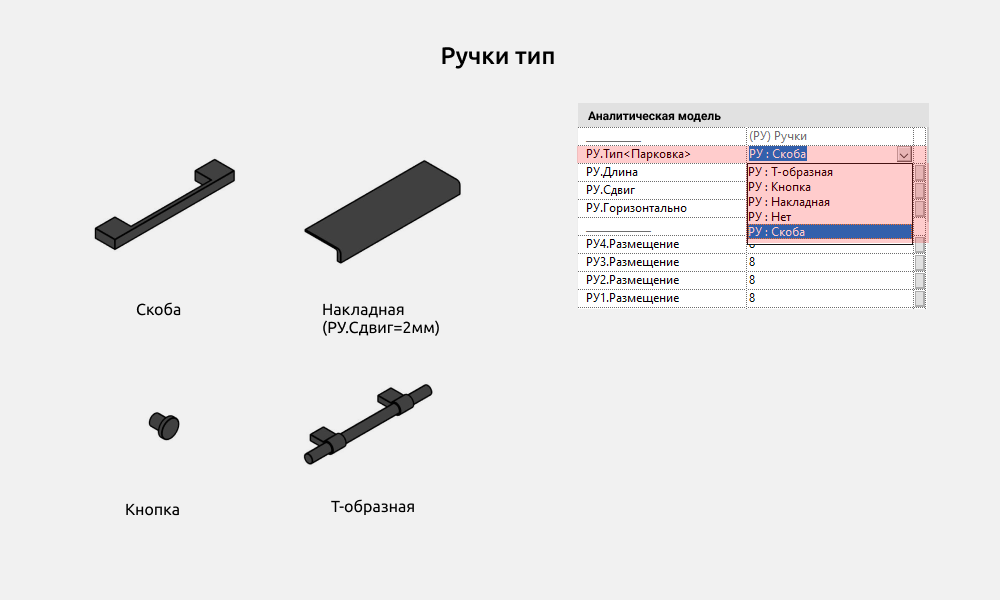

Типы ручек можно выбрать в выпадающем списке у каждого семейства модуля. Это:

-   Нет ручек
-   Скоба
-   Накладная
-   Кнопка
-   Т-образная

Для накладной ручки нужно поставить значение параметра РУ.Сдвиг =2мм, чтобы она сдвинулась на край фасада.

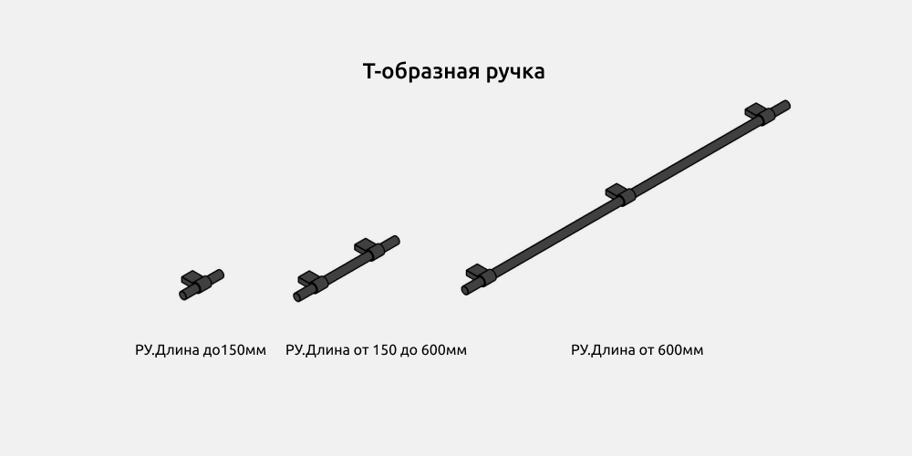

У Т-образной ручки меняется отображение при разной длине ручки (РУ.Длина).

#### Размещение ручек

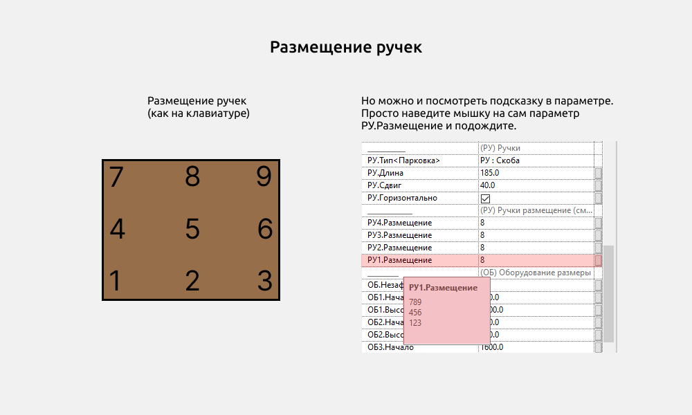

Размещение ручек сделано цифрами от 1 до 9. Визуально это похоже на размещение цифр на клавиатуре.

Ещё можно посмотреть подсказку в самом параметре РУ.Размещение.

Положение ручек может быть горизонтальным и вертикальным. За это отвечает параметр РУ.Горизонтально.

### Открывание

#### Типы открывания

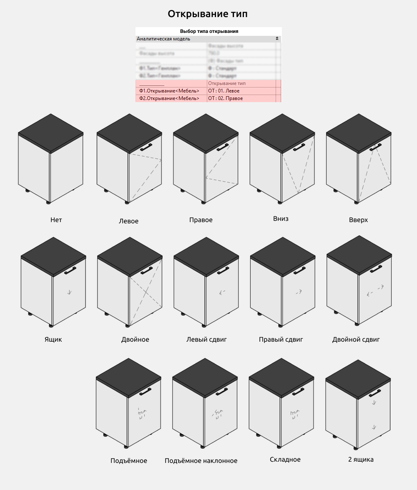

Типы открывания можно выбрать в выпадающем списке у каждого семейства модуля. Это:

-   Нет открывания
-   Левое
-   Правое
-   Вниз
-   Вверх
-   Ящик
-   Двойное
-   Левый сдвиг
-   Правый сдвиг
-   Двойной сдвиг
-   Подъемное
-   Подъемное наклонное
-   Складное
-   2 ящика

Открывание фасадов не зависит от положения ручек.

#### Разные виды открывания RU / ENG

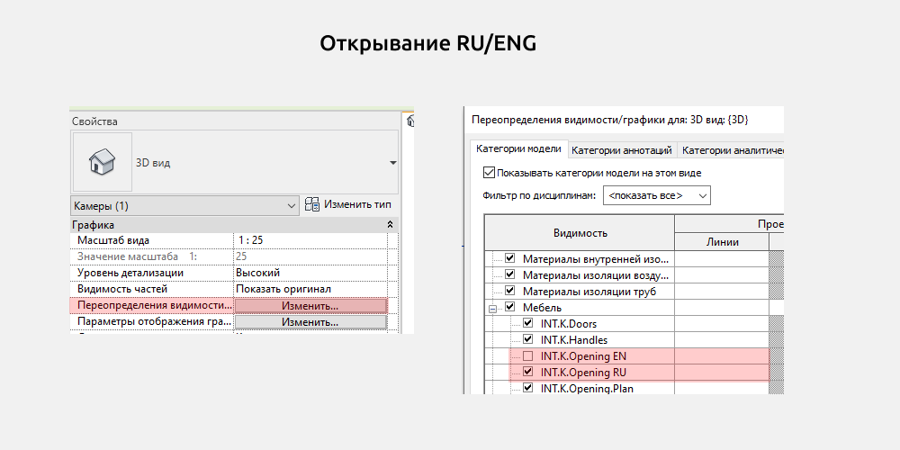

Чтобы включить Открывание RU или ENG, необходимо зайти в Видимость вида, далее в Мебель и там выбрать нужный вам вид открывания.

### Торцы

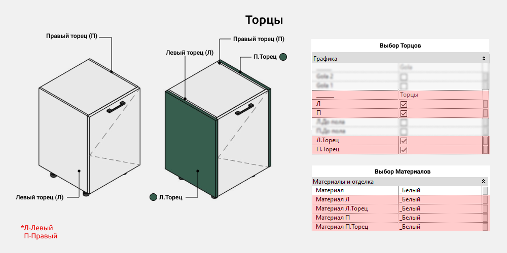

Торцы слева (Л) и справа (П) есть во всех корпусах модулей и их можно выключить, если нужно. Но по умолчанию они включены.

Л.Торец, П.Торец -  добавляют дополнительную панель сбоку и закрывают торец фасада.

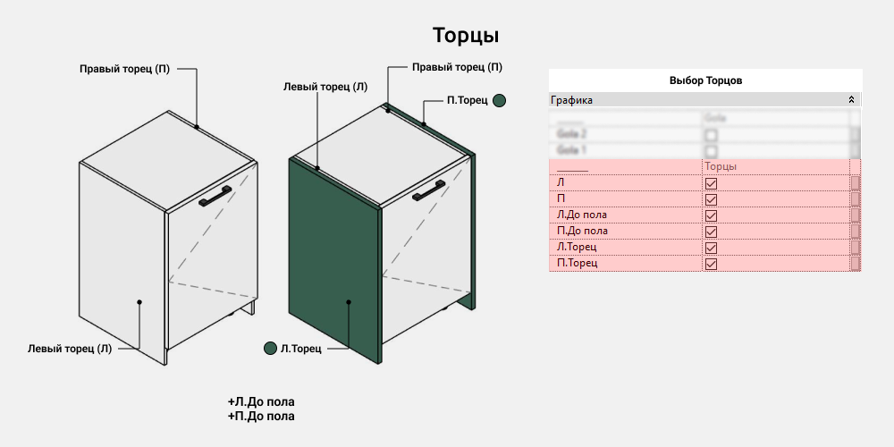

В модулях, которые устанавливаются на пол, добавляются дополнительные параметры к торцам. Это: Л.До пола,П.До пола (что позволяет опустить торцы до пола) и Л.Торец, П.Торец.

## 4. СЕМЕЙСТВА

### Нижний модуль

Нижний модуль используется для построения шкафов кухни, которые размещаются на полу и являются рабочей поверхностью при готовке.

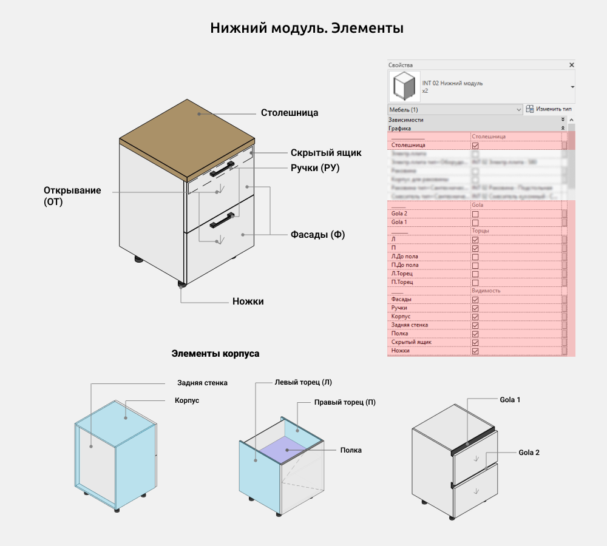

Здесь можно включить/выключить следующие элементы:

-   Столешница
-   Ручки
-   Фасады
-   Корпус
-   Задняя стенка
-   Полка
-   Скрытый ящик (отображается штриховой линией)
-   Ножки
-   ручки Gola
-   разные опции Торцов, про которые говорилось ранее

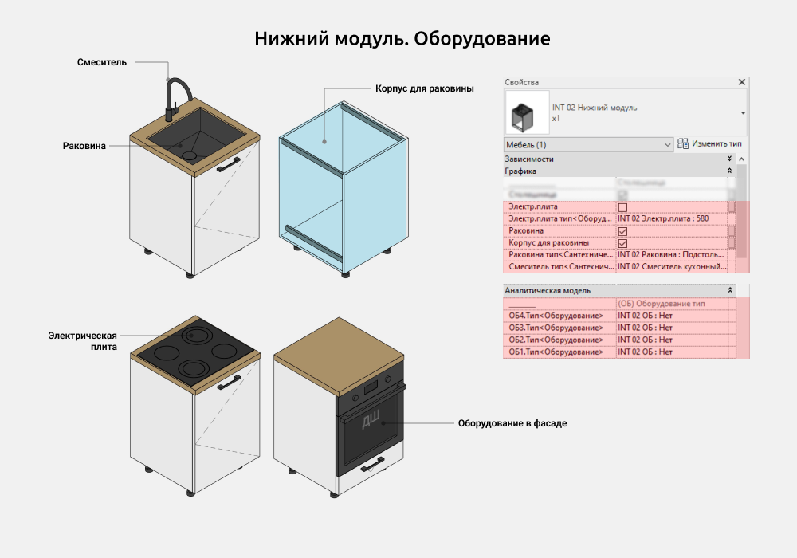

Также есть Оборудование:

-   Электрическая плита
-   Раковина (с ней автоматически включается Смеситель)
-   Оборудование в фасаде

#### Типоразмеры

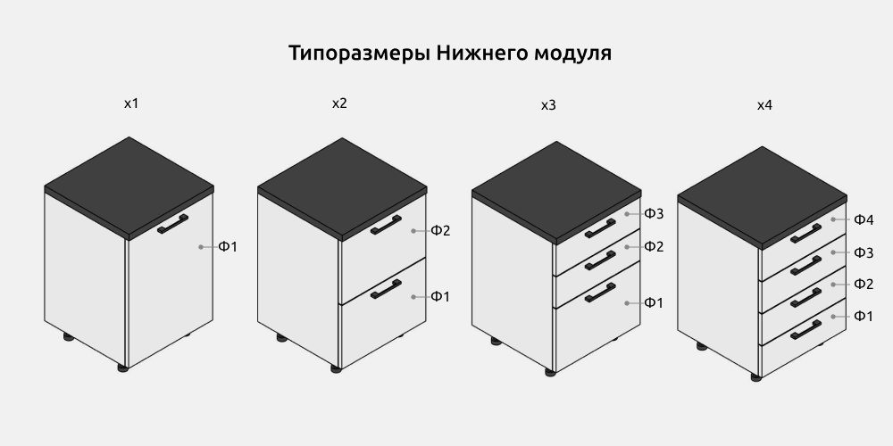

Типоразмеры названы по количеству фасадов в модуле:

-   х1
-   х2
-   х3
-   х4

Номера фасадов идут по порядку снизу вверх, где Ф1 это нижний фасад, а Ф4 - верхний фасад.

Чтобы изменять количество фасадов в нижнем модуле, нужно выбирать соответствующие типоразмеры,а не параметры-экземпляры.

Если один фасад, то выбираем х1. Если два фасада - х2. И так до четырёх фасадов, это максимальное значение в данном семействе.

#### Размеры

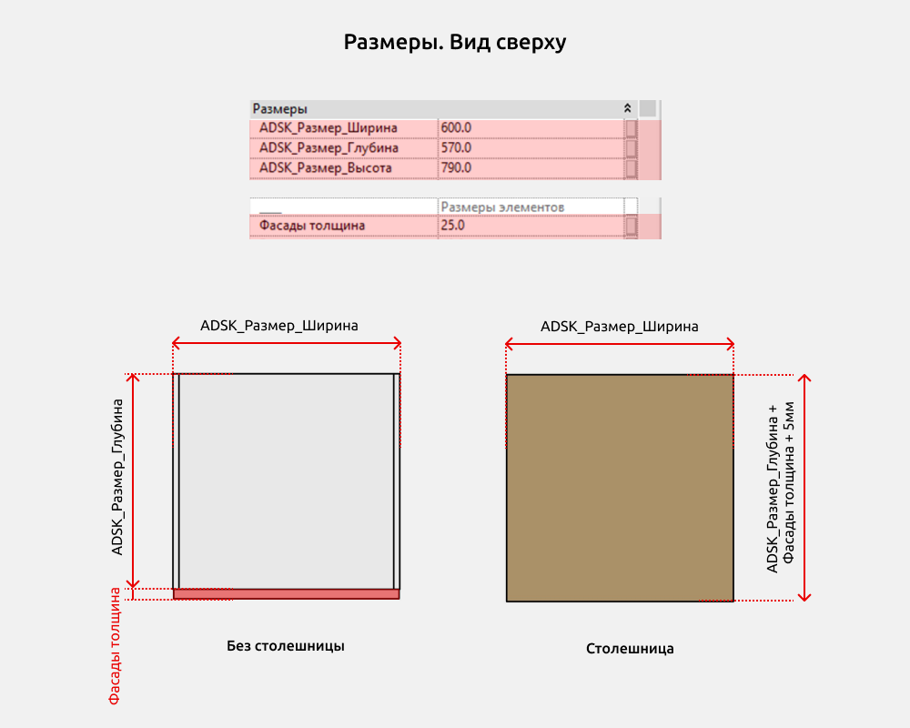

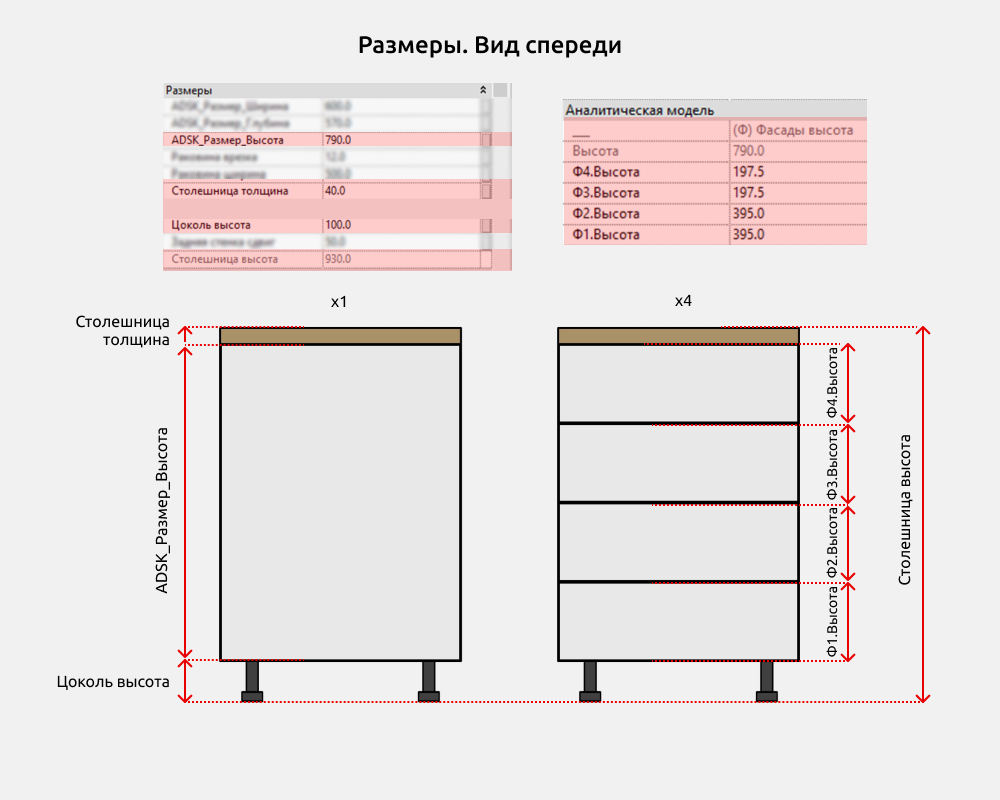

Ширина, Глубина, Высота модуля - это габариты именно корпуса. Фасады толщина, Столешница толщина, Цоколь высота - отдельные параметры.

Глубина столешницы на виде сверху имеет фиксированное значение и  состоит из размеров: Глубина+Фасады толщина+5мм.

Есть параметры серого цвета, которыми нельзя управлять. Но они нужны для понимания расчётов размеров. Например, Столешница высота. Параметр складывает все высоты и показывает важную крайнюю точку рабочей плоскости, когда включена Столешница. (см. картинки)

Т.к. в семействе есть 4 типоразмера, а это значит есть 4 фасада, можно менять конкретно для каждого отдельные параметры.

Если выбран типоразмер х1, то меняем все параметры с цифрой 1: Ф1.Высота(в х1 равно высоте корпуса), ОБ1.Тип, ОБ1.Закрыто фасадом, Ф1.Тип, Ф1.Открывание, РУ1.Размещение. Если выбран типоразмер х2, то меняем все параметры с цифрой 1 и 2.

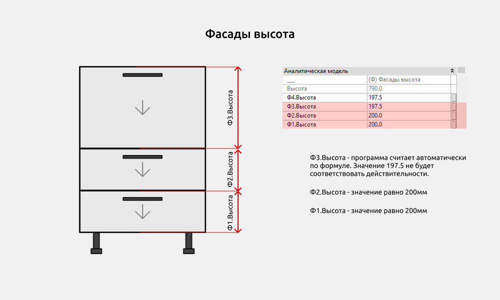

Начинать построение Ф.Высоты лучше с нижнего, первого фасада. Т.к. Ф.Высота последнего,верхнего фасада не работает.

Например, выбран типоразмер х3, Ф1.Высота и Ф2.Высота будут изменяемы, а Ф3.Высота рассчитывается исходя из двух первых высот.

Если Ф.Высоты будут больше Высоты корпуса, то будет ошибка. Если такое произошло, просто вернитесь действием назад и проставьте небольшие значения в Ф.Высота.

#### Электрическая плита

Электрическая плита бывает нескольких типов, которые выбираем в выпадающем списке. Это:

-   300 (2 конфорки)
-   450 (3 конфорки)
-   580 (4 конфорки)
-   880 (6 конфорок)

Обязательно выбираем с начальным заголовком INT 02 Электр.плита. Т.к. в выпадающие списки подгружаются различные другие семейства и их выбирать не нужно.

#### Раковина

Раковина бывает двух типов, которые выбираем в выпадающем списке. Это:

-   Настольная
-   Подстольная

Обязательно выбираем с начальным заголовком INT 02 Раковина. Т.к. в выпадающие списки подгружаются различные другие семейства и их выбирать не нужно.

Смеситель кухонный к раковине:

-   высотой 360
-   высотой 450

Обязательно выбираем с начальным заголовком INT 02 Смеситель кухонный.

Раковину и Электрическую плиту на столешнице можно сдвигать влево или вправо от центральной оси. Также есть параметр для раковины Раковина ширина.

Если конфигурация данных элементов вам не подходит, выключите их и разместите в проекте отдельное семейство.

#### Ручки Gola

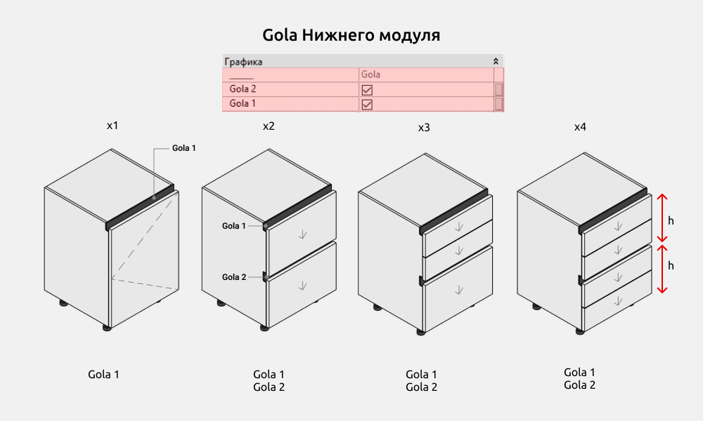

Ручки Gola можно включить сверху корпуса, под столешницей - это Gola 1. А ручка Gola 2 будет между ящиками по центру корпуса. Высота корпуса может быть выше/ниже, но высота отдельных фасадов h в таком случае изменяется равномерно, Gola 2 всегда находится в центре.

#### Оборудование

На место фасада можно установить Оборудование. Для этого нужно выбрать номер фасада и тип оборудования из выпадающего списка.

Оборудование бывает нескольких типов:

-   Встроенное
-   Интегрированное

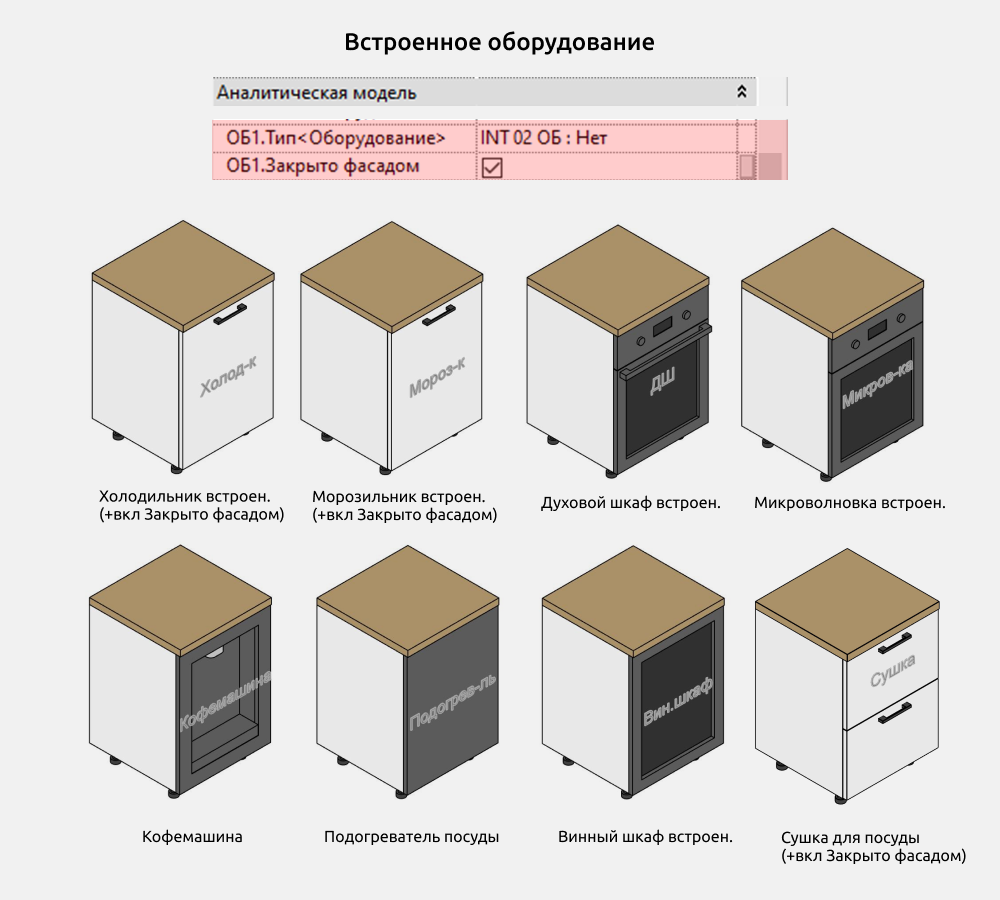

Встроенное оборудование:

-   Винный шкаф встроенный
-   Духовой шкаф встроенный
-   Кофемашина
-   Микроволновка встроенная
-   Морозильник встроенный
-   Подогреватель посуды
-   Холодильник встроенный
-   Сушка для посуды

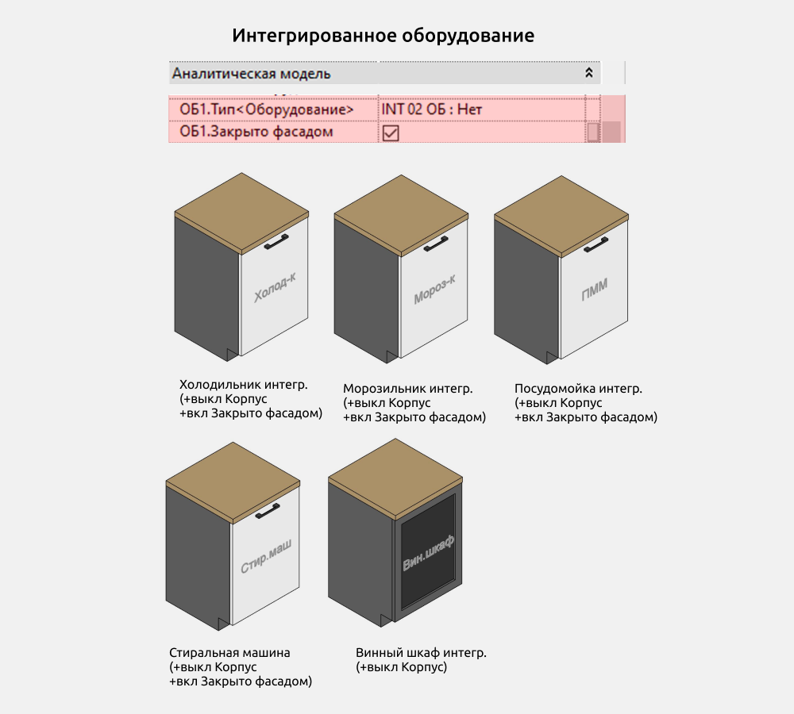

Интегрированное оборудование:

-   Винный шкаф интегрированный
-   Морозильник интегрированный
-   Посудомойка интегрированная
-   Стиральная машина
-   Холодильник интегрированный

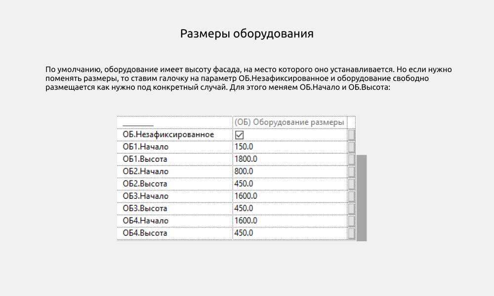

#### Материалы

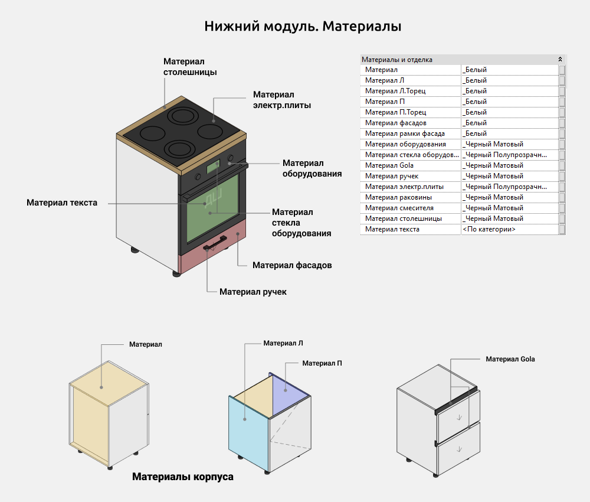

### Нижний модуль 2 дверцы

*Нижний модуль 2 дверцы* используется для построения шкафов кухни, которые размещаются на полу и являются рабочей поверхностью при готовке. В отличие от *Нижнего модуля*, здесь нет оборудования в фасадах, а количество фасадов только 2.

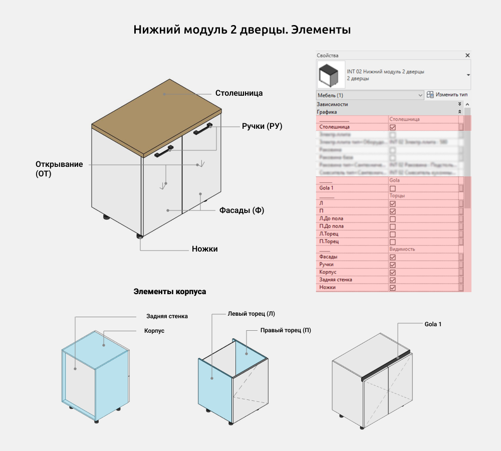

Здесь можно включить/выключить следующие элементы:

-   Столешница
-   Ручки
-   Фасады
-   Корпус
-   Задняя стенка
-   Ножки
-   ручки Gola
-   разные опции Торцов, про которые говорилось ранее

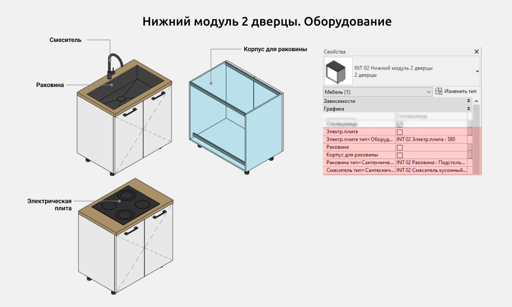

Также есть Оборудование:

-   Электрическая плита
-   Раковина (с ней автоматически включается Смеситель)

#### Типоразмеры

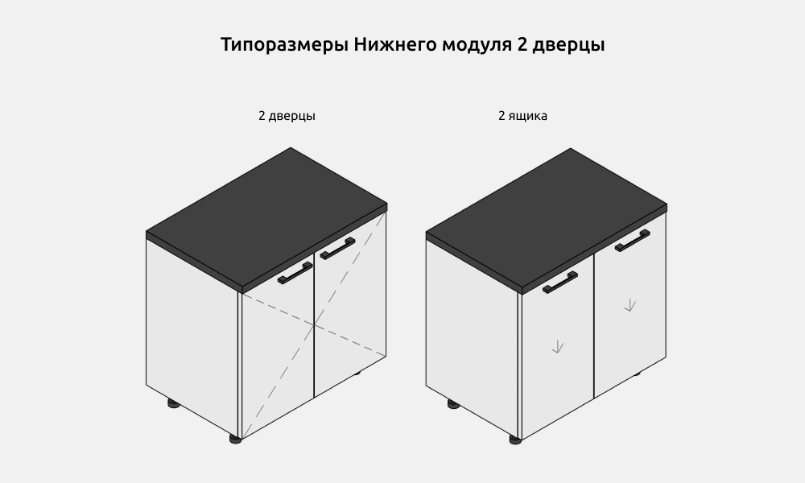

Типоразмеры названы по типу открывания фасадов в модуле:

-   2 дверцы
-   2 ящика

#### Размеры

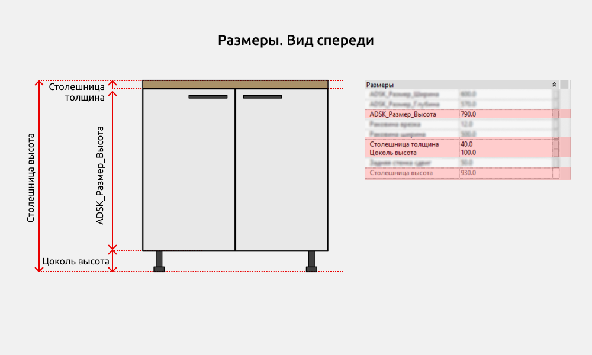

Ширина, Глубина, Высота модуля - это габариты именно корпуса. Фасады толщина, Столешница толщина, Цоколь высота - отдельные параметры.

Глубина столешницы на виде сверху имеет фиксированное значение и  состоит из размеров: Глубина+Фасады толщина+5мм.

Есть параметры серого цвета, которыми нельзя управлять. Но они нужны для понимания расчётов размеров. Например, Столешница высота. Параметр складывает все высоты и показывает важную крайнюю точку рабочей плоскости, когда включена Столешница. (см. картинки)

В данном семействе высоту и ширину фасадов не нужно проставлять, всё считается автоматически по габаритным размерам модуля.

#### Электрическая плита

Электрическая плита бывает нескольких типов, которые выбираем в выпадающем списке. Это:

-   300 (2 конфорки)
-   450 (3 конфорки)
-   580 (4 конфорки)
-   880 (6 конфорок)

Обязательно выбираем с начальным заголовком INT 02 Электр.плита. Т.к. в выпадающие списки подгружаются различные другие семейства и их выбирать не нужно.

#### Раковина

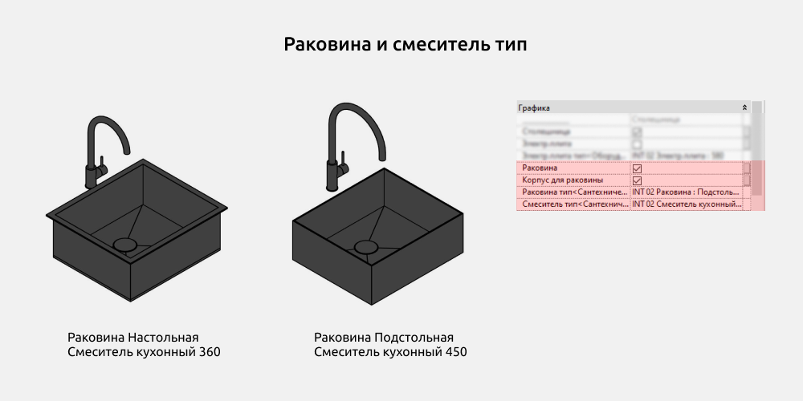

Раковина бывает двух типов, которые выбираем в выпадающем списке. Это:

-   Настольная
-   Подстольная

Обязательно выбираем с начальным заголовком INT 02 Раковина. Т.к. в выпадающие списки подгружаются различные другие семейства и их выбирать не нужно.

Смеситель кухонный к раковине:

-   высотой 360
-   высотой 450

Обязательно выбираем с начальным заголовком INT 02 Смеситель кухонный.

Раковину и Электрическую плиту на столешнице можно сдвигать влево или вправо от центральной оси. Также есть параметр для раковины Раковина ширина.

Если конфигурация данных элементов вам не подходит, выключите их и разместите в проекте отдельное семейство.

#### Ручка Gola

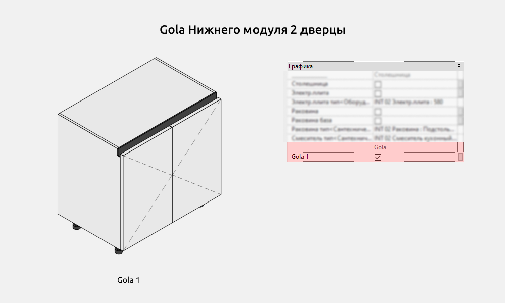

Ручку Gola можно включить сверху корпуса, под столешницей - это Gola 1.

#### Материалы

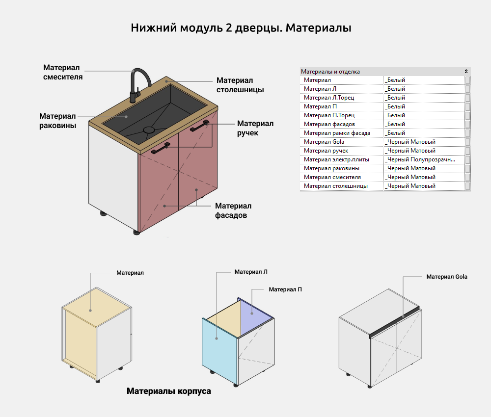

### Нижний модуль L-форма

Нижний модуль L-форма используется для построения угловых шкафов кухни, которые размещаются на полу и являются рабочей поверхностью при готовке. В отличие от Нижнего модуля, здесь нет оборудования в фасадах, а количество фасадов только 1.

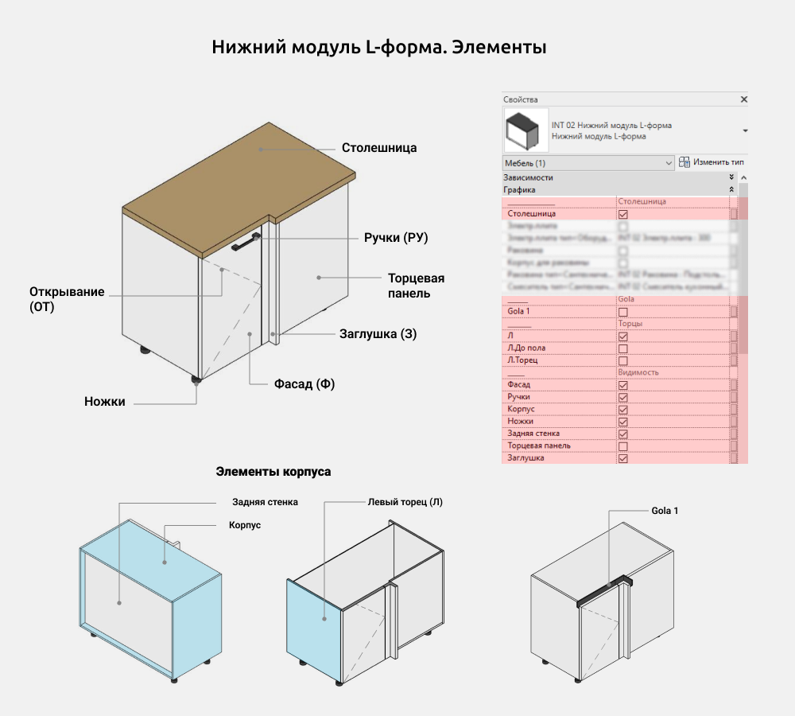

Здесь можно включить/выключить следующие элементы:

-   Столешница
-   Ручки
-   Фасад
-   Корпус
-   Задняя стенка
-   Торцевая панель
-   Заглушка
-   Ножки
-   ручка Gola
-   разные опции Торцов, про которые говорилось ранее

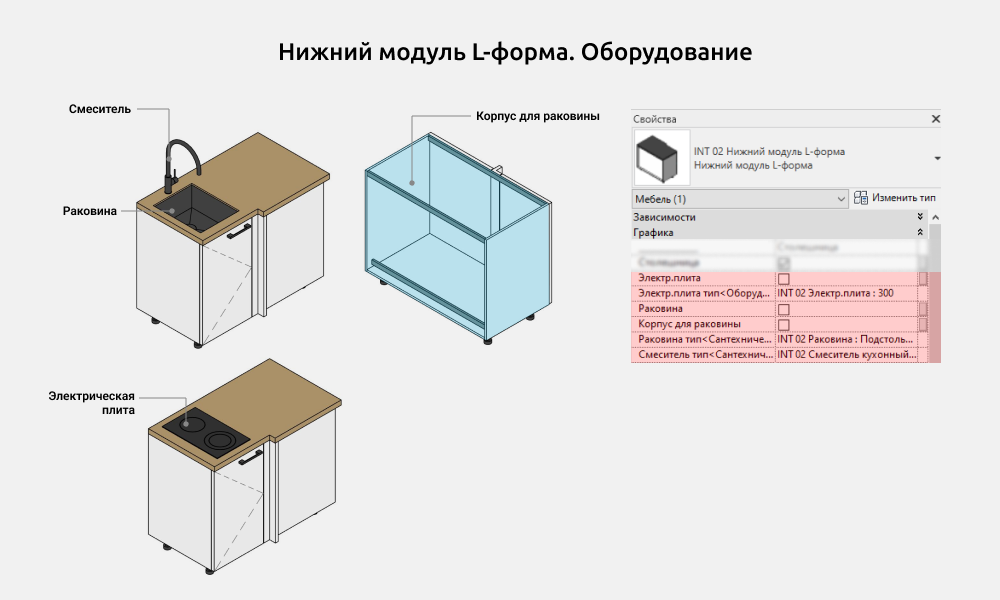

Также есть Оборудование:

-   Электрическая плита
-   Раковина (с ней автоматически включается Смеситель)

Типоразмеров нет.

#### Размеры

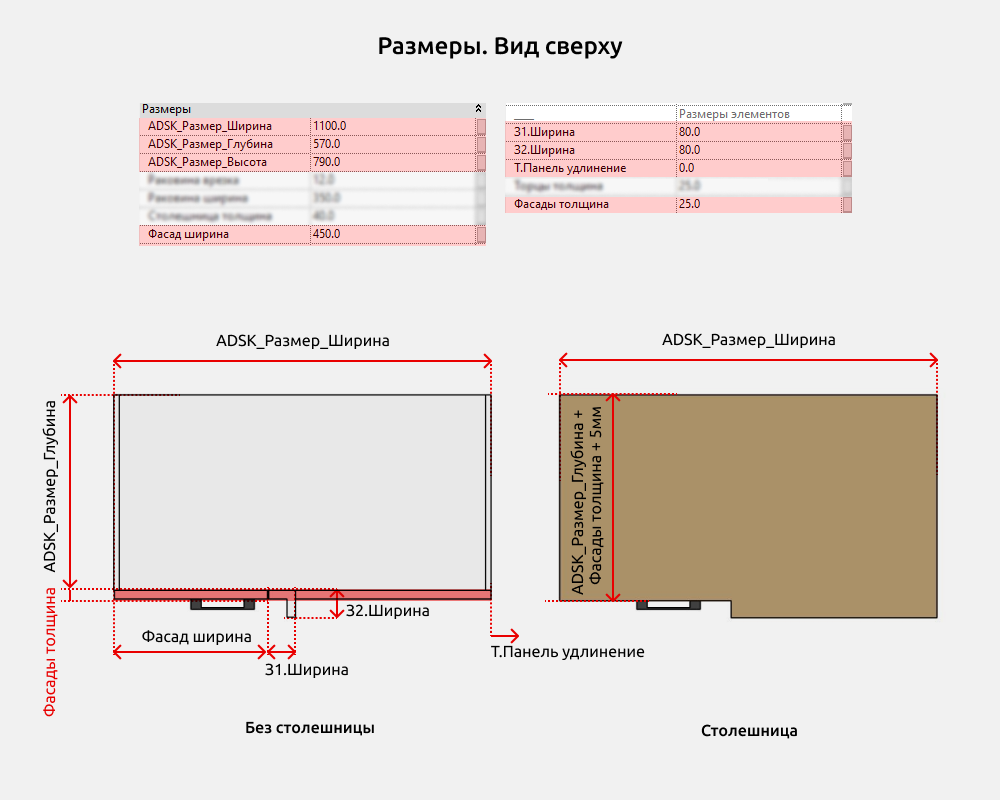

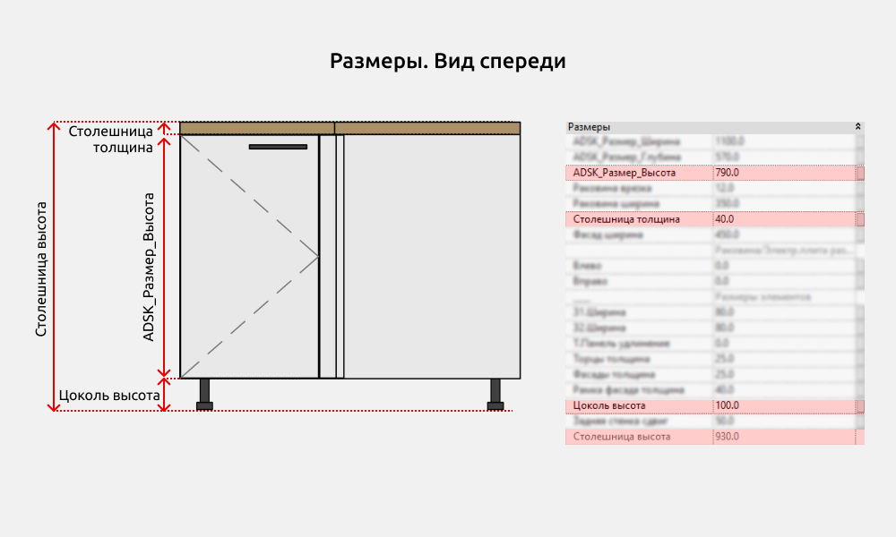

Ширина, Глубина, Высота модуля - это габариты именно корпуса. Фасады толщина, Столешница толщина, Цоколь высота - отдельные параметры.

Глубина столешницы на виде сверху имеет фиксированное значение и  состоит из размеров: Глубина+Фасады толщина+5мм.

Есть параметры серого цвета, которыми нельзя управлять. Но они нужны для понимания расчётов размеров. Например, Столешница высота. Параметр складывает все высоты и показывает важную крайнюю точку рабочей плоскости, когда включена Столешница. (см. картинки)

В данном семействе высоту и ширину фасадов не нужно проставлять, всё считается автоматически по габаритным размерам модуля.

#### Электрическая плита

Электрическая плита бывает нескольких типов, которые выбираем в выпадающем списке. Это:

-   300 (2 конфорки)
-   450 (3 конфорки)
-   580 (4 конфорки)
-   880 (6 конфорок)

Обязательно выбираем с начальным заголовком INT 02 Электр.плита. Т.к. в выпадающие списки подгружаются различные другие семейства и их выбирать не нужно.

#### Раковина

Раковина бывает двух типов, которые выбираем в выпадающем списке. Это:

-   Настольная
-   Подстольная

Обязательно выбираем с начальным заголовком INT 02 Раковина. Т.к. в выпадающие списки подгружаются различные другие семейства и их выбирать не нужно.

Смеситель кухонный к раковине:

-   высотой 360
-   высотой 450

Обязательно выбираем с начальным заголовком INT 02 Смеситель кухонный.

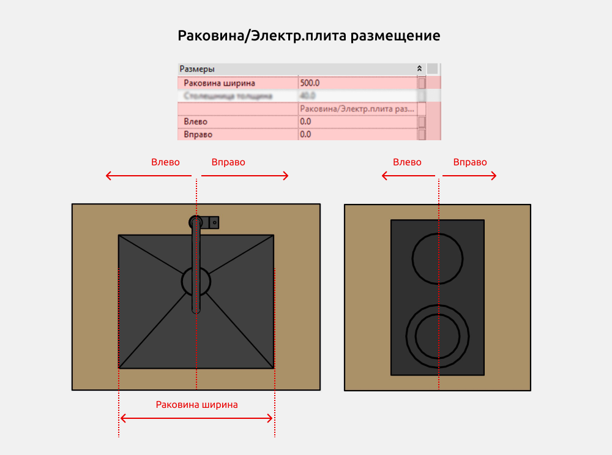

Раковину и Электрическую плиту на столешнице можно сдвигать влево или вправо от центральной оси. Также есть параметр для раковины Раковина ширина.

Если конфигурация данных элементов вам не подходит, выключите их и разместите в проекте отдельное семейство.

#### Ручка Gola

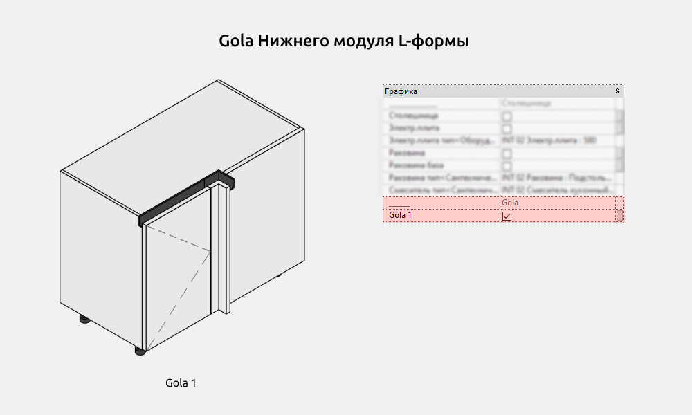

Ручки Gola можно включить сверху корпуса, под столешницей - это Gola 1.

#### Материалы

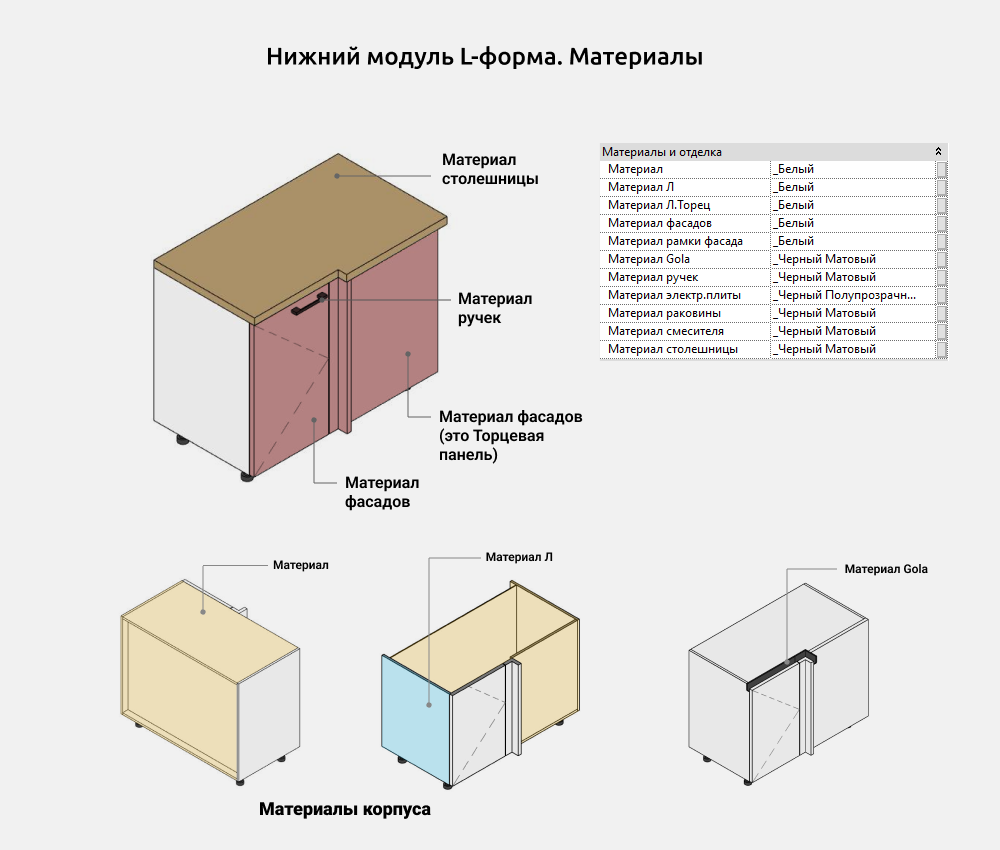

### Нижний модуль V-форма

Нижний модуль V-форма используется для построения угловых шкафов кухни, которые размещаются на полу и являются рабочей поверхностью при готовке. В отличие от Нижнего модуля, здесь нет оборудования в фасадах, а количество фасадов только 1.

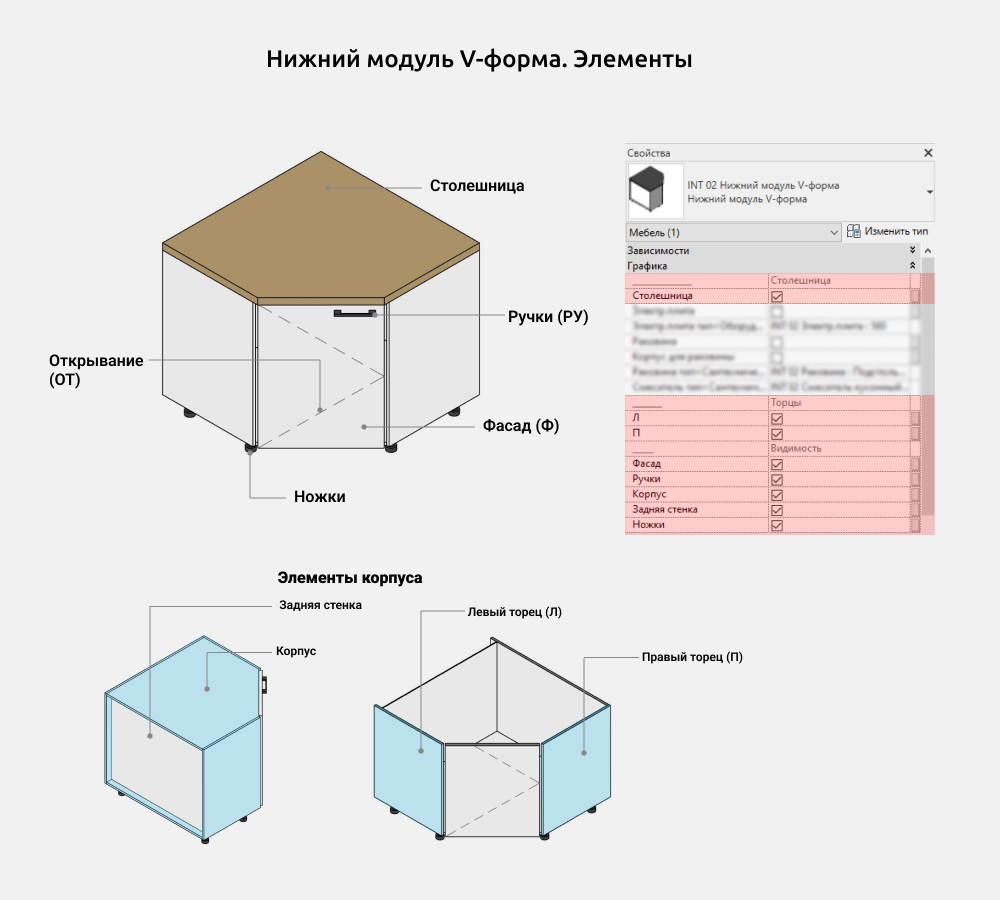

Здесь можно включить/выключить следующие элементы:

-   Столешница
-   Ручки
-   Фасад
-   Корпус
-   Задняя стенка
-   Ножки
-   Торцы: Левый, Правый

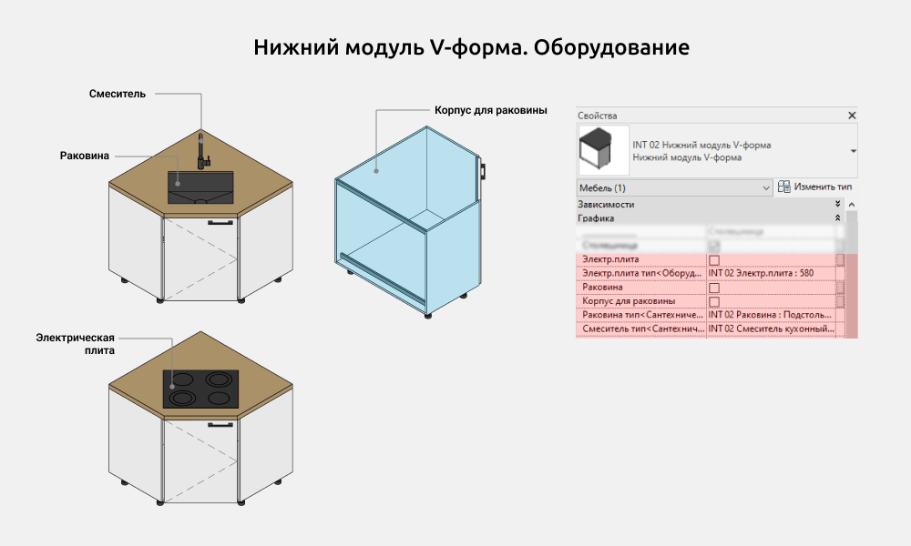

Также есть Оборудование:

-   Электрическая плита
-   Раковина (с ней автоматически включается Смеситель)

Типоразмеров нет.

#### Размеры

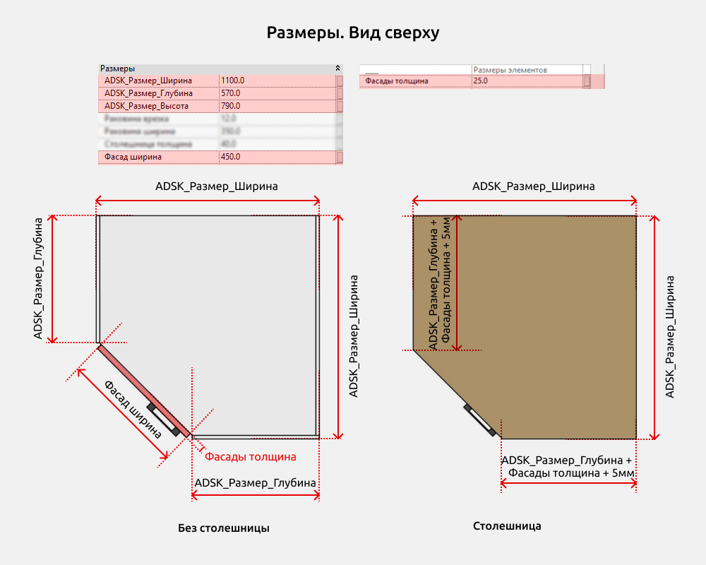

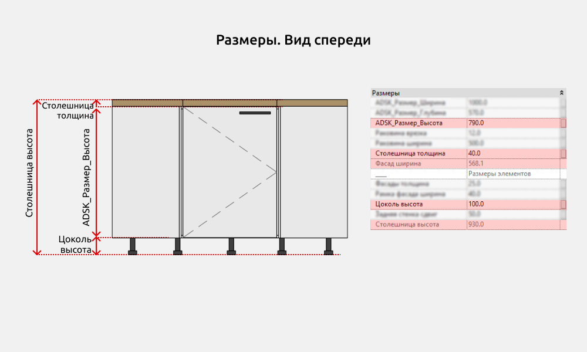

Ширина, Глубина, Высота модуля - это габариты именно корпуса. Фасады толщина, Столешница толщина, Цоколь высота - отдельные параметры.

Глубина столешницы на виде сверху имеет фиксированное значение и  состоит из размеров: Глубина+Фасады толщина+5мм.

Есть параметры серого цвета, которыми нельзя управлять. Но они нужны для понимания расчётов размеров. Например, Столешница высота. Параметр складывает все высоты и показывает важную крайнюю точку рабочей плоскости, когда включена Столешница. (см. картинки)

В данном семействе высоту и ширину фасадов не нужно проставлять, всё считается автоматически по габаритным размерам модуля.

#### Электрическая плита

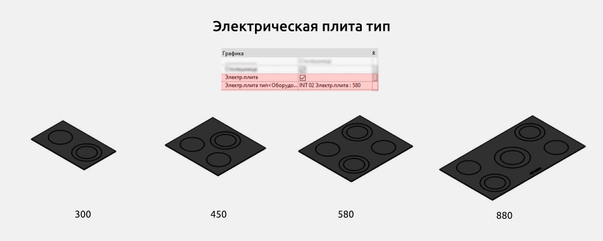

Электрическая плита бывает нескольких типов, которые выбираем в выпадающем списке. Это:

-   300 (2 конфорки)
-   450 (3 конфорки)
-   580 (4 конфорки)
-   880 (6 конфорок)

Обязательно выбираем с начальным заголовком INT 02 Электр.плита. Т.к. в выпадающие списки подгружаются различные другие семейства и их выбирать не нужно.

#### Раковина

Раковина бывает двух типов, которые выбираем в выпадающем списке. Это:

-   Настольная
-   Подстольная

Обязательно выбираем с начальным заголовком INT 02 Раковина. Т.к. в выпадающие списки подгружаются различные другие семейства и их выбирать не нужно.

Смеситель кухонный к раковине:

-   высотой 360
-   высотой 450

Обязательно выбираем с начальным заголовком INT 02 Смеситель кухонный.

Раковина и Электрическая плита на столешнице размещаются по центральной оси и НЕ сдвигаются влево/вправо. Также есть параметр для раковины Раковина ширина.

Если конфигурация данных элементов вам не подходит, выключите их и разместите в проекте отдельное семейство.

#### Материалы

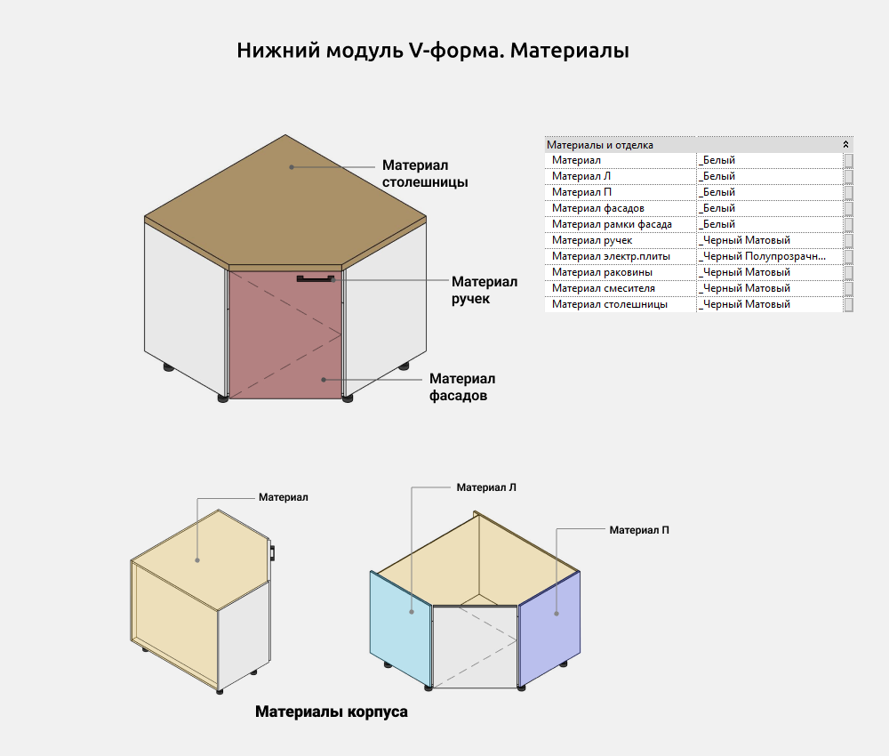

### Пенал

Пенал используется для построения напольных шкафов-колонн для кухни. С встроенной техникой или без.

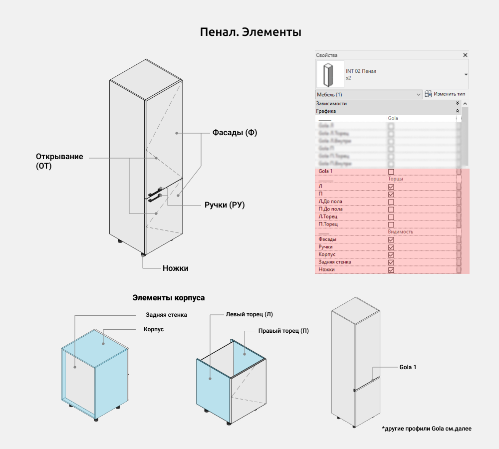

Здесь можно включить/выключить следующие элементы:

-   Столешница
-   Ручки
-   Фасады
-   Корпус
-   Задняя стенка
-   Ножки
-   ручка Gola
-   разные опции Торцов, про которые говорилось ранее

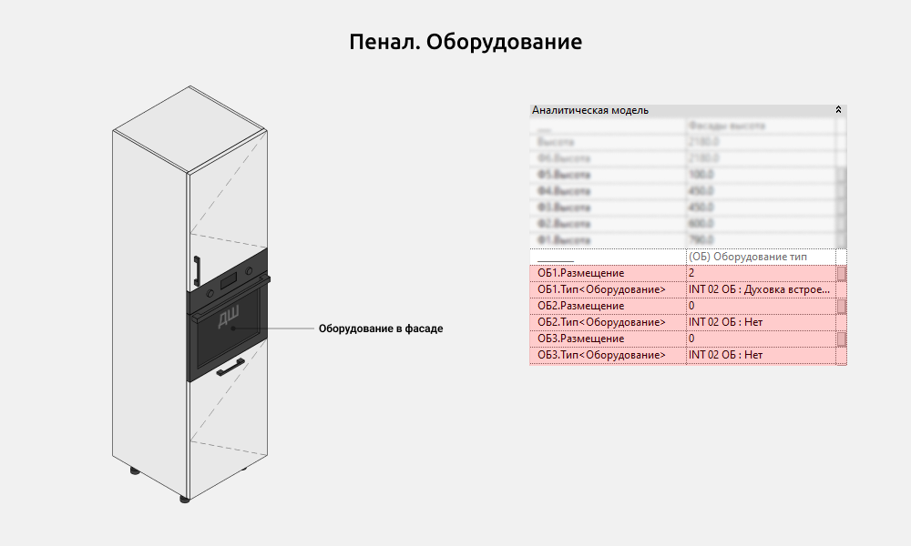

Также есть Оборудование:

-   Оборудование в фасаде

#### Типоразмеры

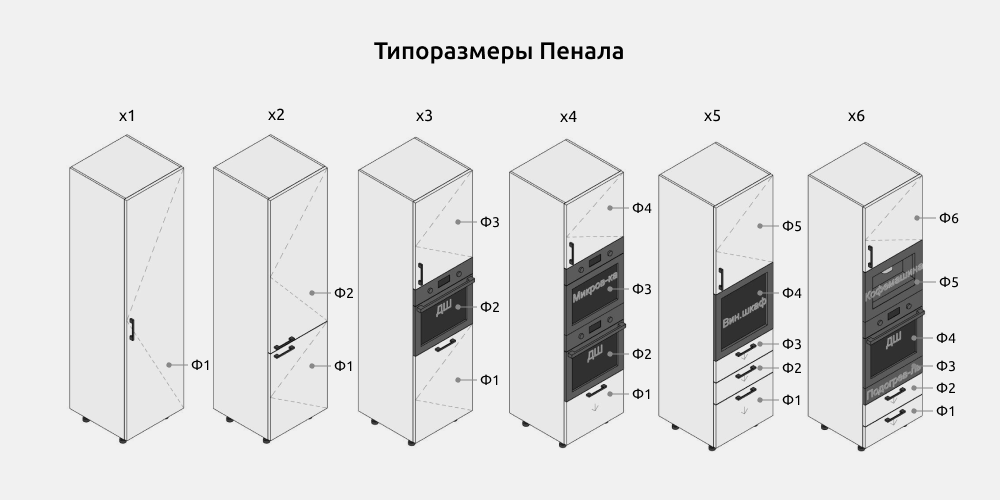

Типоразмеры названы по количеству фасадов в модуле:

-   х1
-   х2
-   х3
-   х4
-   х5
-   х6

Номера фасадов идут по порядку снизу вверх, где Ф1 это нижний фасад, а Ф6 - верхний фасад.

Чтобы изменять количество фасадов в пенале, нужно выбирать соответствующие типоразмеры,а не параметры-экземпляры. Если один фасад, то выбираем х1. Если два фасада - х2. И так до шести фасадов, это максимальное значение в данном семействе.

#### Размеры

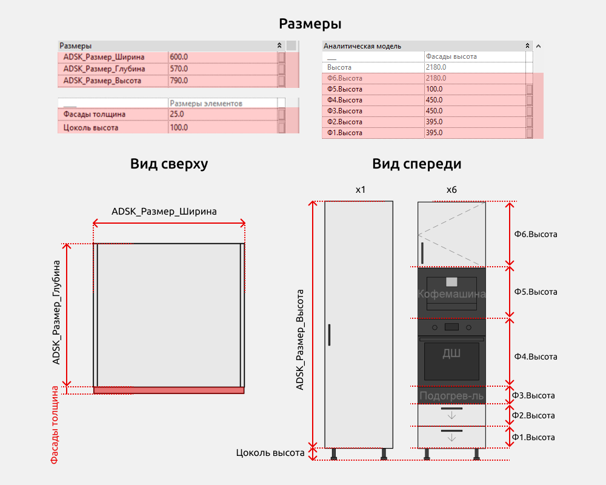

Ширина, Глубина, Высота модуля - это габариты именно корпуса. Фасады толщина, Цоколь высота - отдельные параметры.

Т.к. в семействе есть 6 типоразмеров, а это значит есть 6 фасадов, можно менять конкретно для каждого отдельные параметры.

Если выбран типоразмер х1, то меняем все параметры с цифрой 1: Ф1.Высота(в х1 равно высоте корпуса), Ф1.Тип, Ф1.Открывание, РУ1.Размещение. Если выбран типоразмер х2, то меняем все параметры с цифрой 1 и 2.

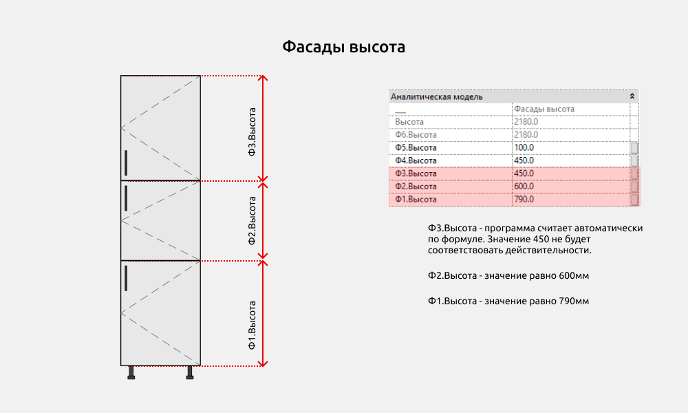

Начинать построение Ф.Высоты лучше с нижнего, первого фасада. Т.к. Ф.Высота последнего,верхнего фасада не работает. Например, выбран типоразмер х3, Ф1.Высота и Ф2.Высота будут изменяемы, а Ф3.Высота рассчитывается исходя из двух первых высот.

Если Ф.Высоты будут больше Высоты корпуса, то будет ошибка. Если такое произошло, просто вернитесь действием назад и проставьте небольшие значения в Ф.Высота.

#### Ручки Gola

Ручки Gola в пенале можно включить Вертикально слева и справа корпуса, а также Горизонтально между Фасадами - это Gola 1, Gola 2, Gola 3, Gola 4.

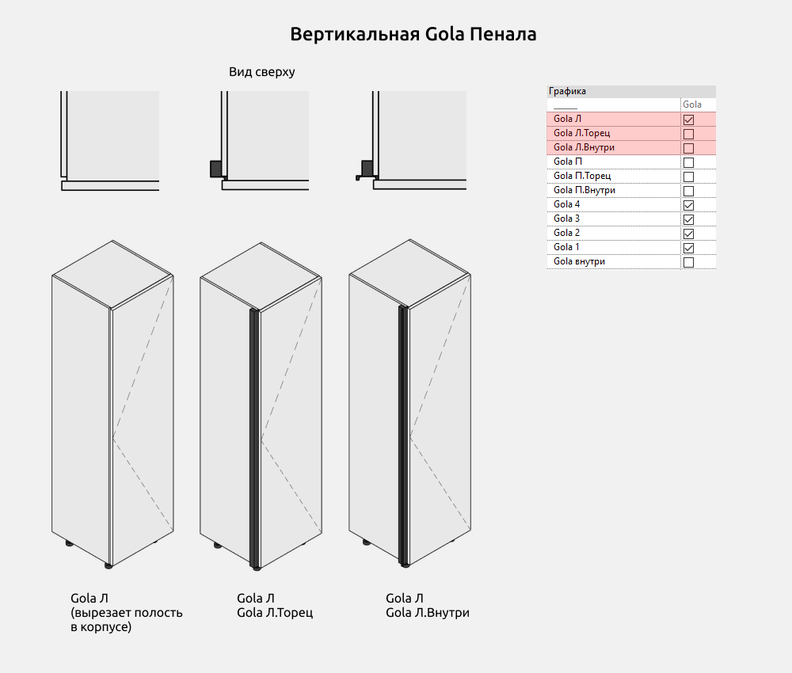

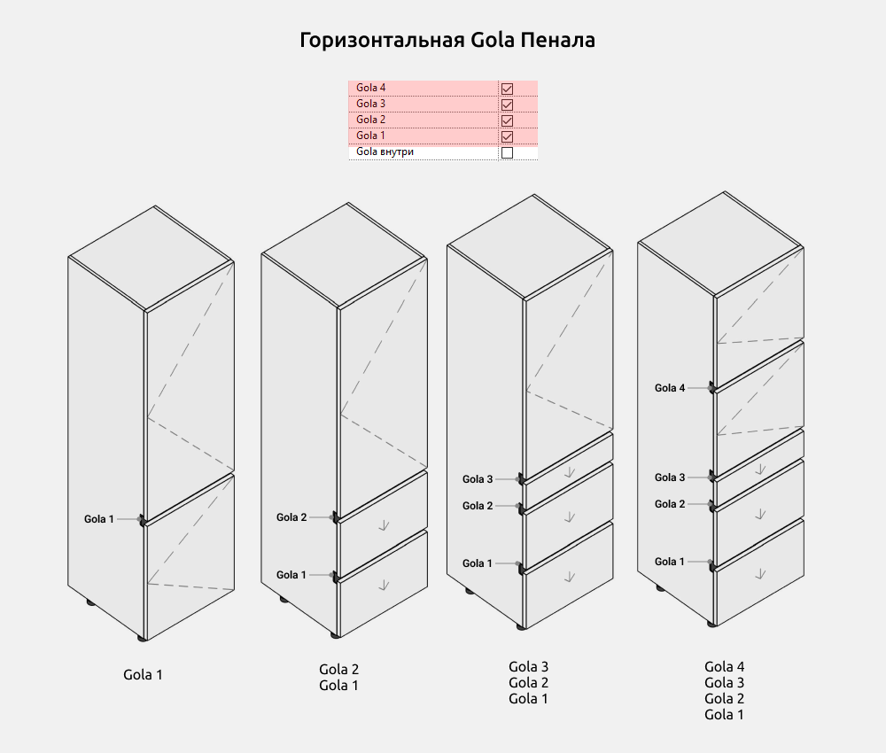

Номера горизонтальных ручек Gola идут по порядку снизу вверх, где Gola 1 это нижняя ручка, а Gola 4 - верхняя

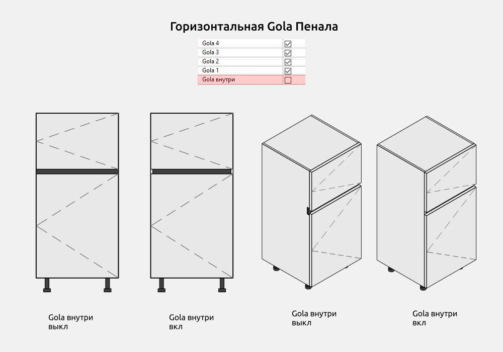

#### Параметр Gola внутри - смещает Gola внутрь корпуса, т.е.становятся видны торцы корпуса.

####

#### Оборудование

На место фасада можно установить Оборудование. Для этого нужно выбрать порядковый номер фасада, куда разместить оборудование (ОБ.Размещение) и тип оборудования из выпадающего списка. Заголовок -  INT 02 ОБ.

Оборудование бывает нескольких типов:

-   Встроенное
-   Интегрированное


Встроенное оборудование:

-   Винный шкаф встроенный
-   Духовой шкаф встроенный
-   Кофемашина
-   Микроволновка встроенная
-   Морозильник встроенный
-   Подогреватель посуды
-   Холодильник встроенный
-   Сушка для посуды


Интегрированное оборудование:

-   Винный шкаф интегрированный
-   Морозильник интегрированный
-   Посудомойка интегрированная
-   Стиральная машина
-   Холодильник интегрированный


По умолчанию, оборудование имеет высоту фасада, на место которого оно устанавливается. Но если нужно поменять размеры, то ставим цифру 0 в параметр **ОБ.Размещение** и оборудование свободно размещается как нужно под конкретный случай. Для этого меняем **ОБ.Начал****о** и **ОБ.Высот****а**.

#### Материалы


### Верхний модуль

Верхний модуль используется для построения настенных/навесных шкафов кухни.


Здесь можно включить/выключить следующие элементы:

-   Ручки
-   Фасады
-   Корпус
-   Задняя стенка
-   Подсветка
-   Полки
-   Торцы: Левый и Правый


Также есть Оборудование:

-   Оборудование в фасаде

#### Количество фасадов


Чтобы изменять количество фасадов в верхнем модуле, нужно выбирать параметры-экземпляры, т.к. в семействе нет типоразмеров.

Фасады бывают:

-   Фасад 1 (установлен по умолчанию)
-   2 дверцы Горизонтально
-   2 дверцы Вертикально( к этому параметру можно добавить Складное открывание и исчезнет верхняя ручка)

#### Количество полок


Количество полок в верхнем модуле может быть от 1 до 3.

#### Размеры


Ширина, Глубина, Высота модуля - это габариты именно корпуса. Фасады толщина - отдельный параметр. Фасады свес смещает фасад вниз от корпуса на заданное расстояние.

#### Оборудование


На место первого/нижнего фасада можно установить Оборудование. Для этого нужно выбрать тип оборудования из выпадающего списка. Оборудование тип, Заголовок -  INT 02 Верхнее ОБ.

Оборудование бывает нескольких типов:

-   Вытяжка интегрированная
-   Вытяжка телескопическая
-   Микроволновка встроенная
-   Сушка для посуды

#### Материалы


### Верхний модуль L-форма

Верхний модуль L-формы используется для построения угловых настенных/навесных шкафов кухни.


Здесь можно включить/выключить следующие элементы:

-   Ручки
-   Фасад
-   Корпус
-   Задняя стенка
-   Подсветка
-   Полки
-   Торцы: Левый и Правый

#### Количество полок


Количество полок в верхнем модуле l-формы может быть от 1 до 3.

#### Размеры


Ширина, Глубина, Высота модуля - это габариты именно корпуса. Фасады толщина - отдельный параметр. Фасады свес смещает фасад вниз от корпуса на заданное расстояние.

#### Материалы


###

## 5. ОФОРМЛЕНИЕ

### Настройка графики


Чтобы поменять цвет/вес/тип линий семейств, нужно перейти в Управление - Стили объектов - Мебель/Оборудование/Сантехнические приборы

### Маркировка


На высоком уровне детализации текстовые символы Оборудования не отображаются на планах этажей. Но если включить средний или низкий уровень детализации -  текст будет виден.


Чтобы поменять текст у оборудования, нужно выбрать через клавишу Tab нужное оборудование в модулях и нажать Изменить тип, затем Комментарии к типоразмеру.

<CTA type="guide" />
