import productPreview from '@site/docs/guides/families/modular-sofa-for-revit/product.jpg';

<ProductCard
  name="Диван-трансформер для Revit"
  eyebrow="Набор семейств Revit"
  description="Собирайте любую конфигурацию из модульных секций дивана — готовы к вставке в проект Revit."
  image={productPreview}
  imageAlt="Диван-трансформер для Revit — превью набора"
  buyUrl="https://bimcore.one/products/modular-sofa-revit-families"
  ecwidProductId="543746540"
  buyLabel="Купить"
  shopLabel="В магазин"
/>

## 1. ОБЩИЕ ДАННЫЕ

-   Название набора: Диван-трансформер
-   Версия набора 1.0.2
-   Версия Revit: 2019

### Описание

Этот набор семейств для Revit предназначен для моделирования диванов свободной конфигурации в Autodesk Revit.

Подходит дизайнерам интерьера и архитекторам.

### Загрузка и размещение

Для того чтобы посмотреть и загрузить нужные семейства из набора, можно открыть **Проект с диваном-трансформером** и скопировать семейства при помощи комбинации клавиш Ctrl+C, а затем вставить в свой проект Ctrl+V. Или открыть папку с файлами семейств и перетащить мышкой в проект.

## 2. СОСТАВ НАБОРА

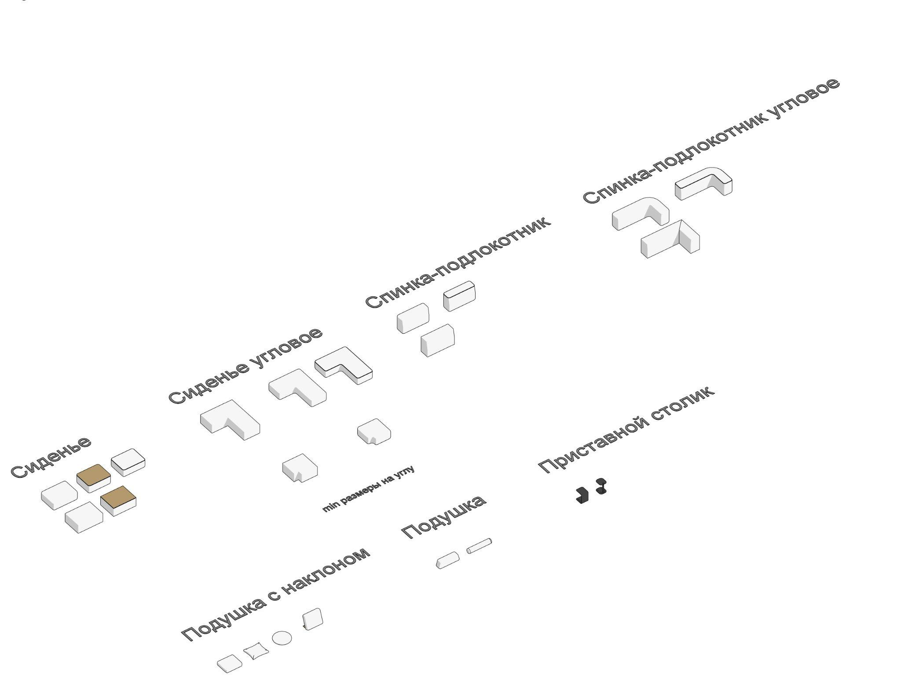

В состав набора входят следующие семейства:

-   Сиденье
-   Сиденье угловое
-   Спинка-подлокотник
-   Спинка-подлокотник угловая
-   Подушка
-   Подушка с наклоном
-   Приставной столик

## 3. СЕМЕЙСТВА

### Сиденье

Семейство предназначено для отображения сидения в модульном диване – это основная часть мебели, предназначенная для комфортного размещения людей.

Здесь можно редактировать следующие параметры:

-   изменять ширину, глубину и высоту, а также материалы;
-   можно включать и выключать параметр «шов»;
-   столешница, которую можно активировать или отключить;
-   существует параметр формы, позволяющий выбрать прямые или закругленные углы.

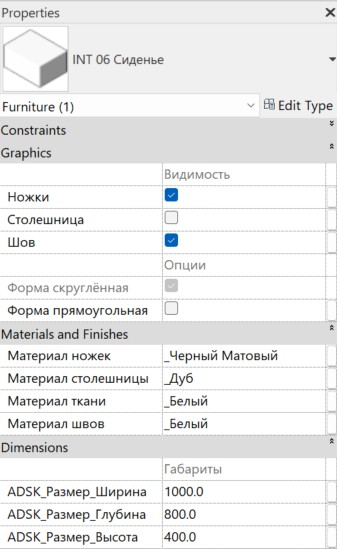

#### Графика

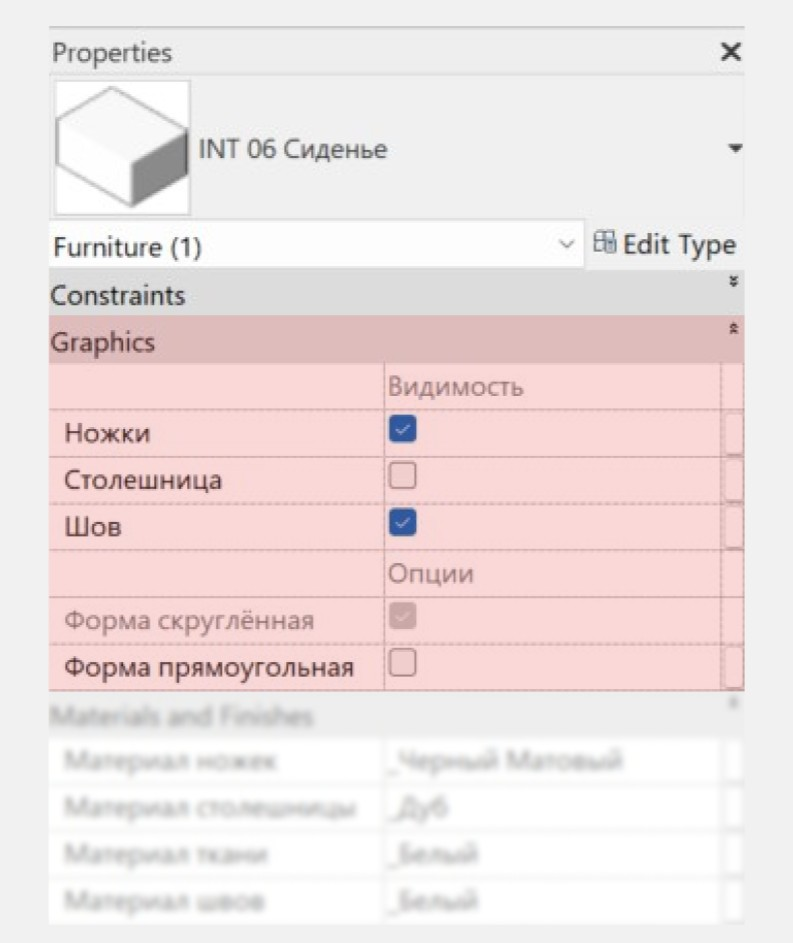

Раздел “Графика” позволяет регулировать следующие элементы:

-   параметр “Ножки” позволяет включать или отключать видимость ножек у сидения;
-   параметр “Столешница” включает или отключает наличие столешницы на верхней грани сидения;
-   параметр “Шов” регулирует отображение шва на сидении;
-   при помощи параметра “Форма прямоугольная” можно переключаться между прямоугольной или более скругленной формами сиденья. При отсутствии галочки в данном параметре сиденье по умолчанию приобретает закругленную форму.

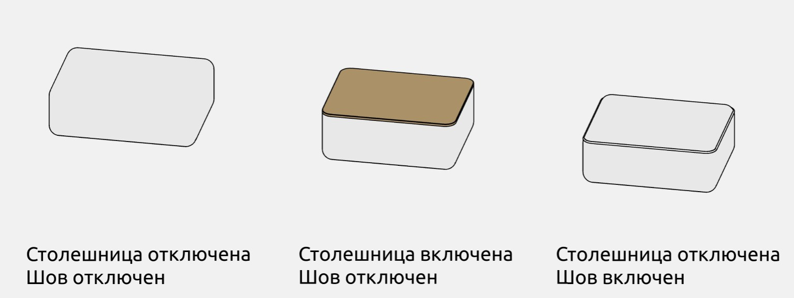

#### Материалы

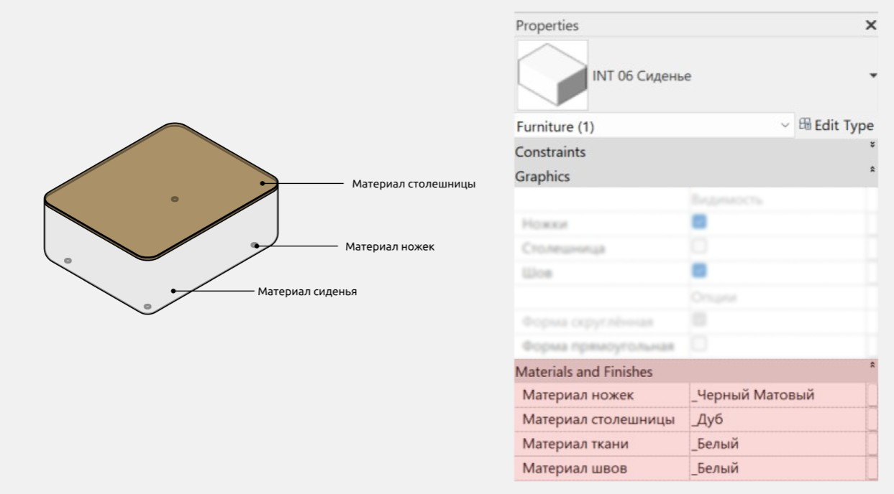

#### Размеры

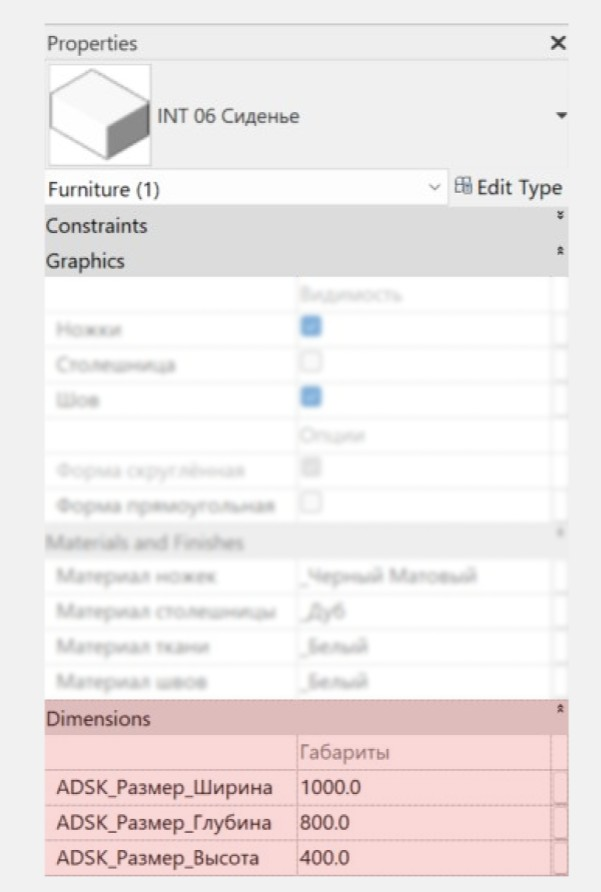

ADSK_Размер_высота - это параметр высоты, в который включена высота столешницы и ножек в случае, если включены параметры “Столешница” и “Ножки” соответственно.

### Сиденье угловое

Семейство Сиденье угловое используется для размещения сидений в угловых решениях.

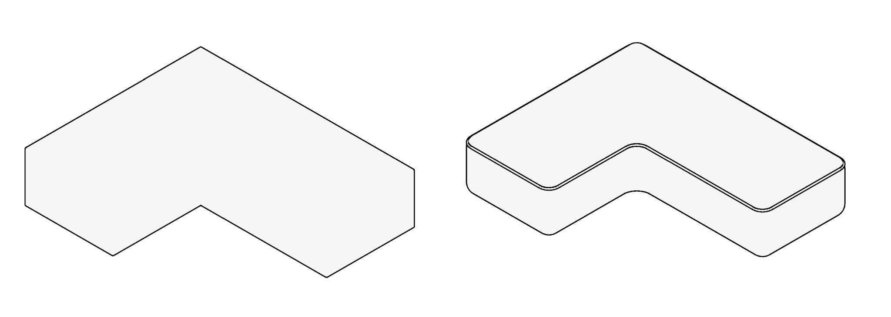

Так же, как и в обыкновенном сидении, здесь поддерживаются следующие параметры:

-   изменение ширины, глубины и высоты, а также материалов;
-   можно включать и выключать параметр «шов»;
-   существует параметр формы, позволяющий выбрать прямые или закругленные углы.

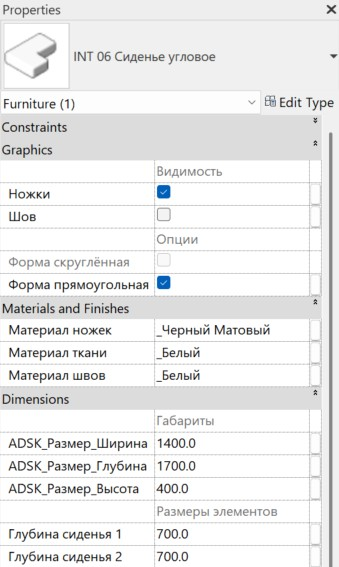

#### Размеры элементов

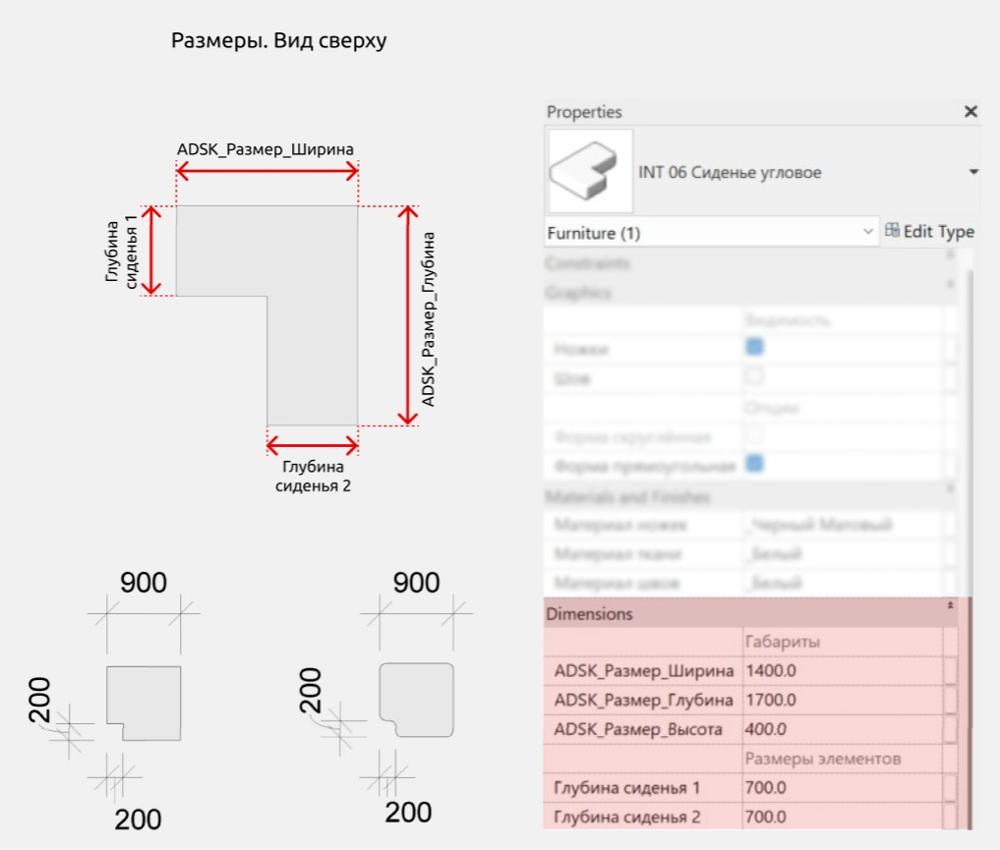

Во вкладке параметров “Размеры” есть раздел “Размеры элементов”, внутри которого осуществляется управление параметрами “Глубина сиденья 1” и “Глубина сиденья 2”. Они позволяют регулировать глубину сидений с обеих сторон модуля.

### Спинка-подлокотник

Семейство “Спинка-подлокотник” используется в случаях, если в диване необходимо создать опору для спины, рук, а также используется как декоративный элемент, позволяющий создавать различные конфигурации дивана.

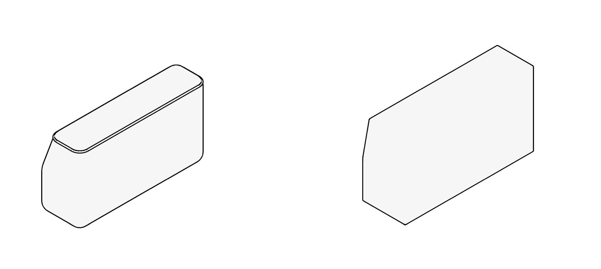

Здесь можно включить/выключить ножки и шов, переключаться между прямоугольной или скругленной формами, а также задавать материалы для всех элементов.

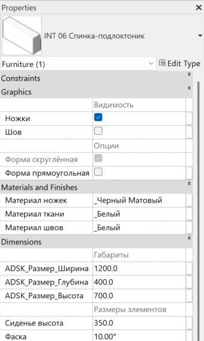

#### Размеры элементов

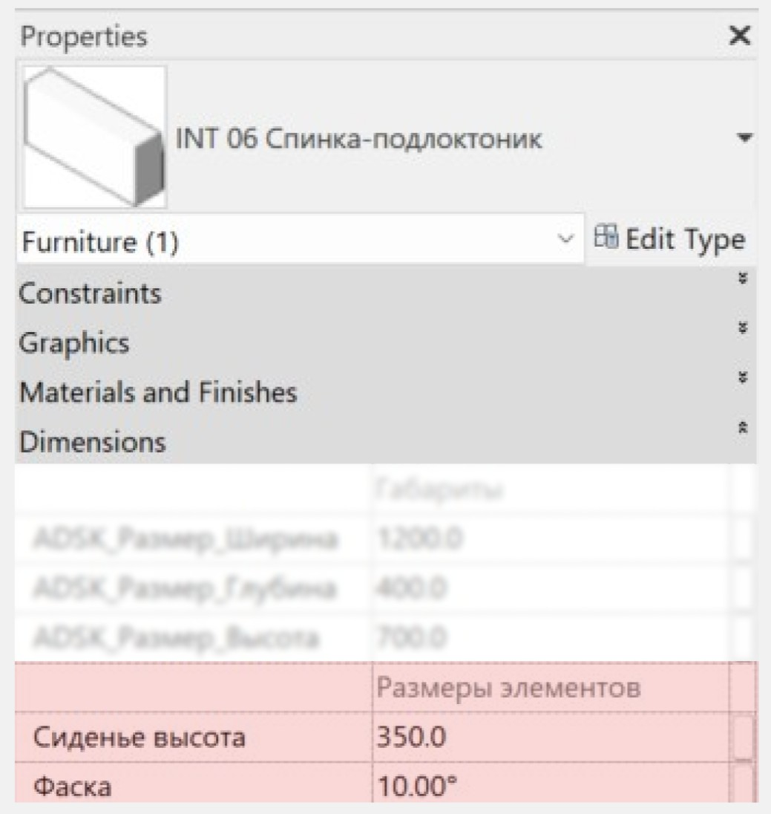

Параметр “Сиденье высота” позволяет отрегулировать высоту сиденья, параметр “Фаска” - изменять угол наклона верхней части модуля.

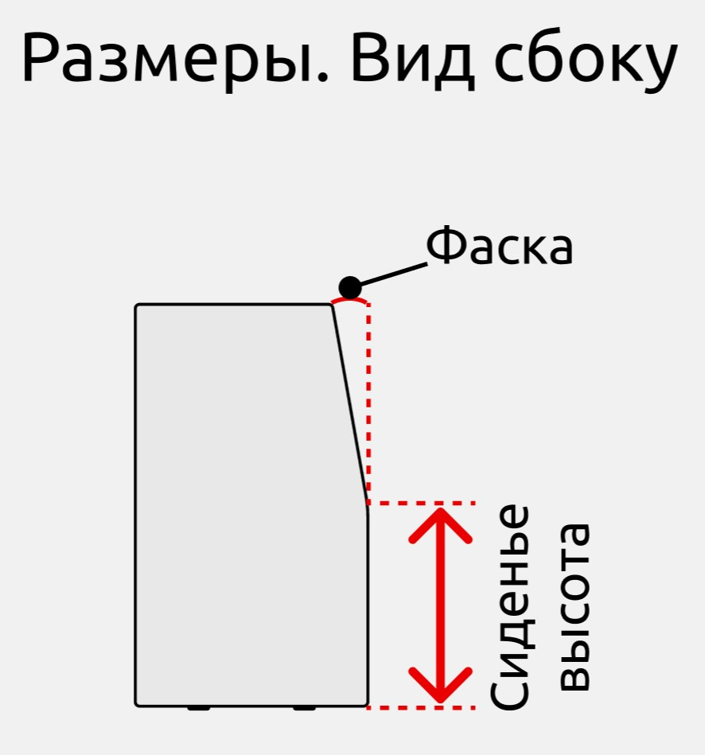

### Спинка-подлокотник угловое

Семейство “Спинка-подлокотник угловое” аналогично обычной спинке-подлокотнику, но предназначено для угловых решений.

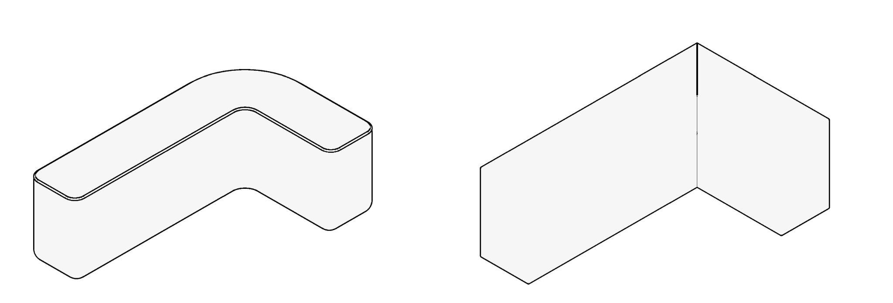

Семейство обладает теми же параметрами, что и спинка-подлокотник, а также параметром “Спинка глубина”, который будет рассмотрен далее.

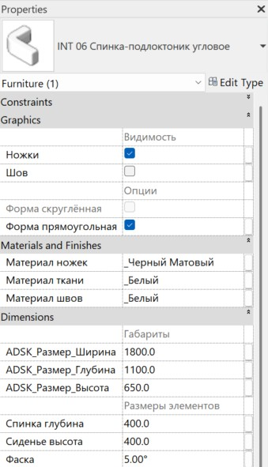

#### Размеры элементов

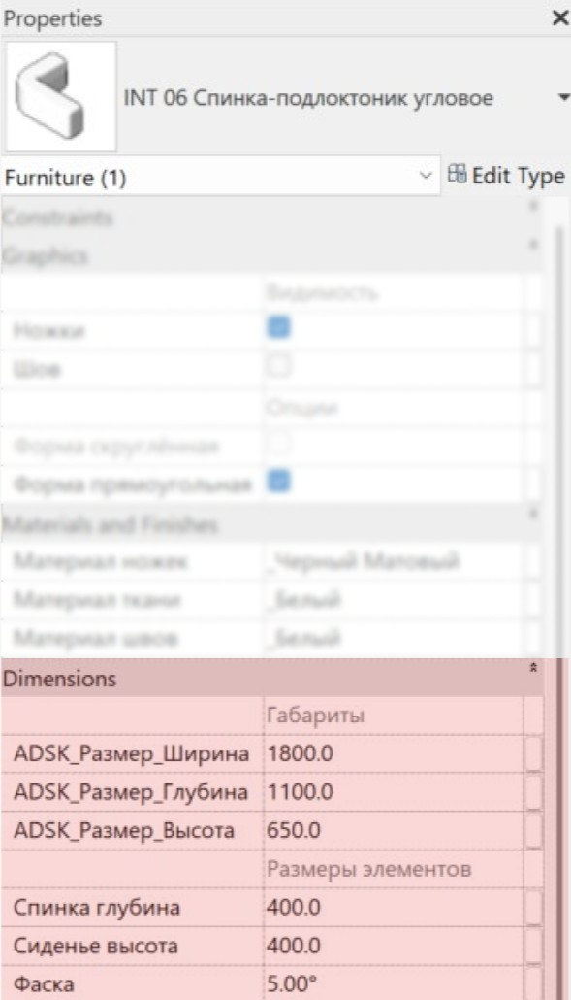

Параметр “ADSK_Размер_Глубина” в разделе “Габариты” регулирует глубину всего семейства, в то время как параметр “Спинка глубина” в разделе “Размеры элементов” позволяет изменять глубину самой спинки.

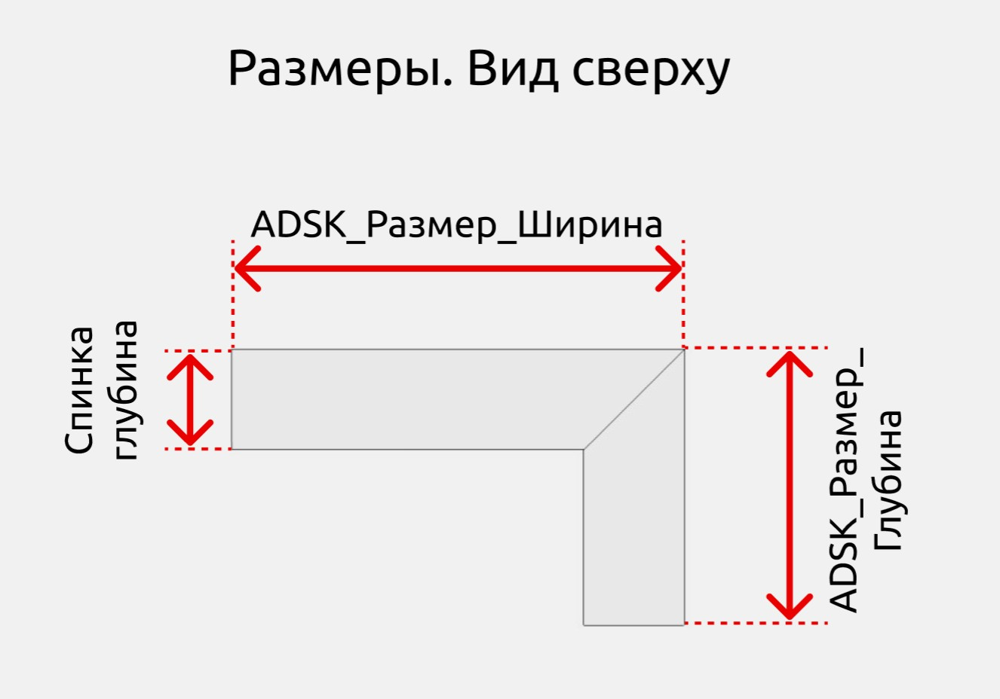

Параметры “Сиденье высота” и “Фаска” работают идентично этим же параметрам в семействе “Спинка-подлокотник”.

### Подушка

Семейство “Подушка” предназначено для декоративных целей.

Параметры семейства позволяют редактировать габариты и материал подушки, а также переключаться между цилиндрической и трапециевидной формами.

### Подушка с наклоном

Семейство “Подушка с наклоном” предназначено для декоративных целей, а также для обозначения поддержки других объектов.

Семейство “Подушка с наклоном” обладает теми же параметрами, что и семейство “Подушка”, а также позволяет:

-   переключаться между 3 формами подушки (круг/прямоугольник/прямоугольник с ушками);
-   включать или отключать подставку (в случае, если подставка включена, ее материал также можно редактировать);
-   регулировать угол наклона подушки.

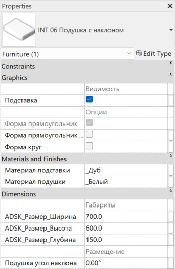

### Приставной столик

Семейство “Приставной столик” предназначено для визуализации журнального стола, рабочей поверхности, места для напитков и закусок, держателя для гаджетов или в качестве декоративного элемента.

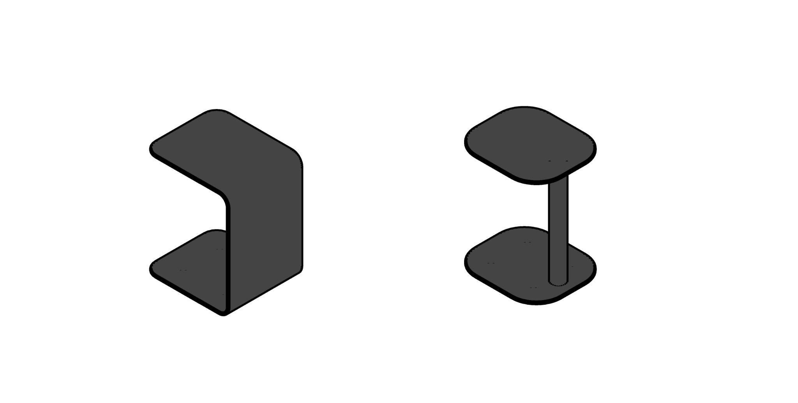

В параметрах семейства можно редактировать его габариты и материал, а также выбирать прямоугольную или скругленную форму.

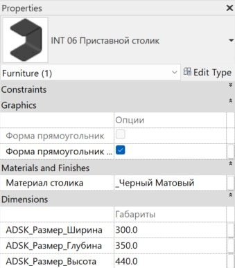

<CTA type="guide" />
