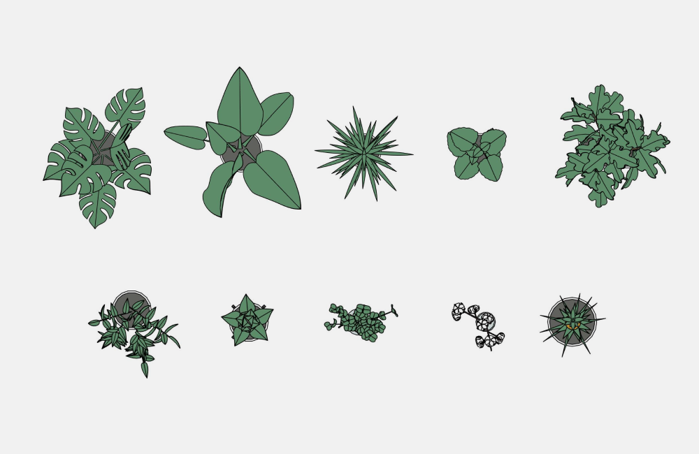
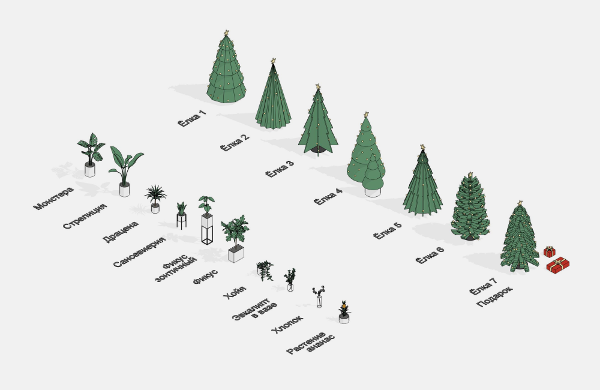
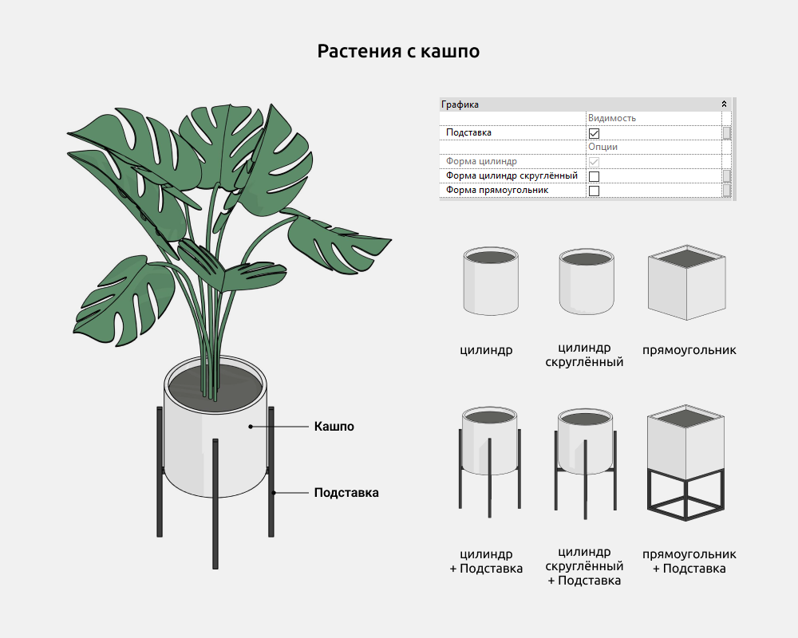
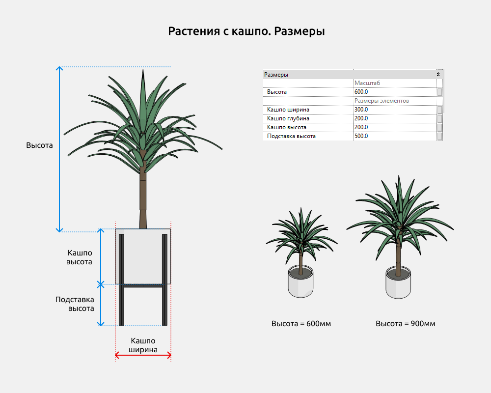
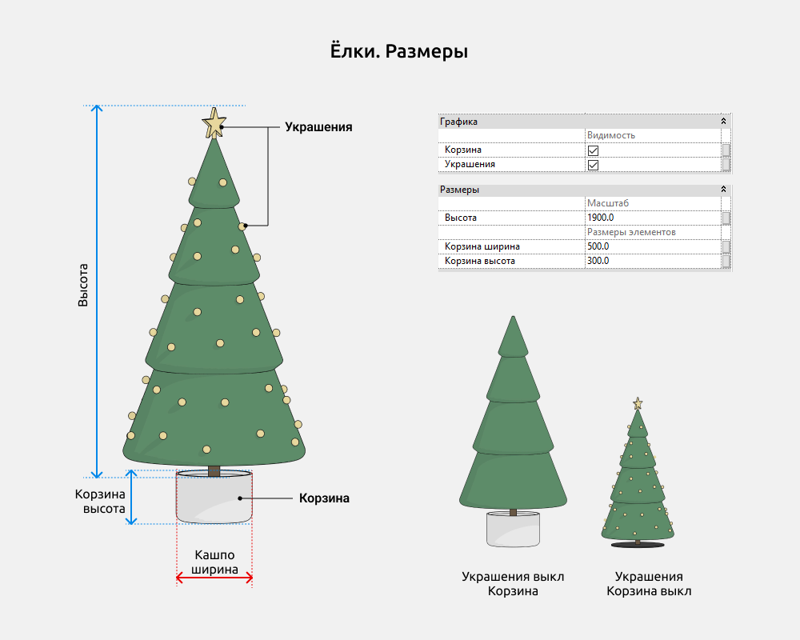
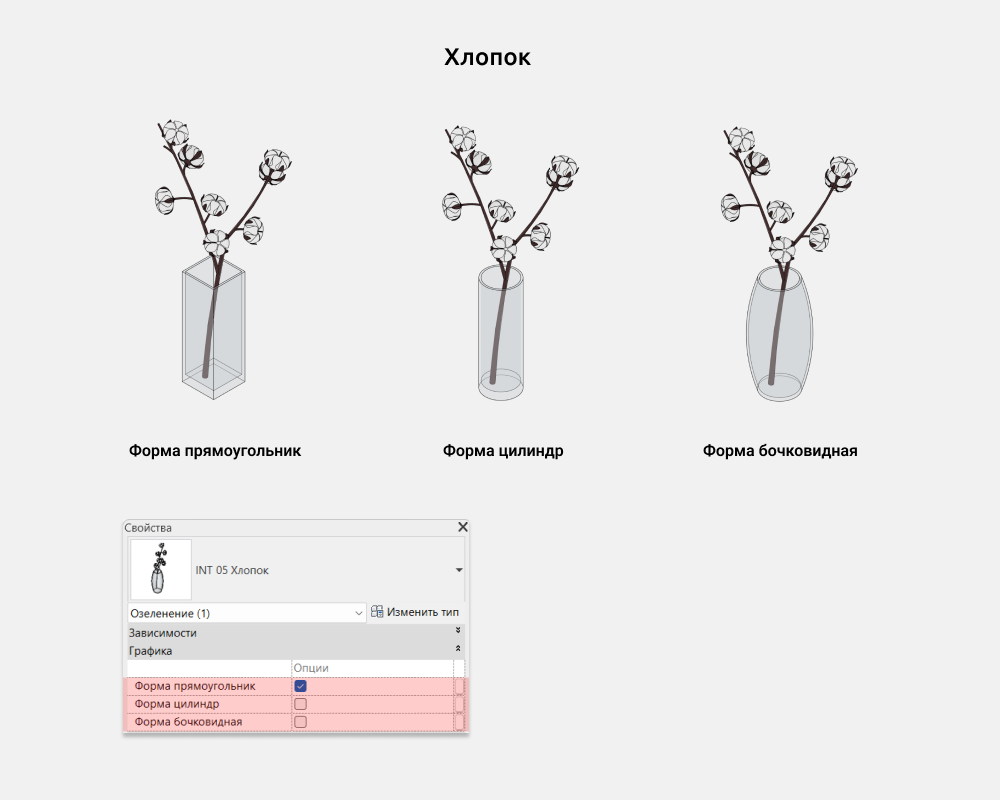
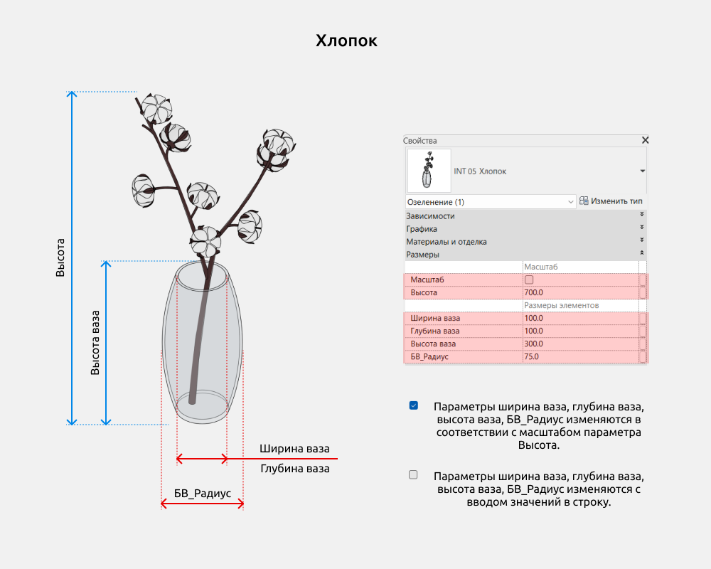

<YouTube id="W4goAjR6Oc8" title="Растения для Revit" />

## 1. ОБЩИЕ ДАННЫЕ

-   Название набора: Растения
-   Версия набора 1.3.0
-   Версия Revit: 2019

### Описание

Этот набор семейств для Revit предназначен для моделирования комнатных растений с кашпо или вазами в Autodesk Revit.

С помощью семейств можно создать озеленение в интерьере.

Подходит дизайнерам интерьера и архитекторам. Геометрия листиков и цветков сделана упрощенно инструментами программы Revit.

### Загрузка и размещение

Для того чтобы посмотреть и загрузить нужные семейства из набора, можно открыть **Проект с растениями** и скопировать семейства при помощи комбинации клавиш Ctrl+C, а затем вставить в свой проект Ctrl+V. Или открыть папку с файлами семейств и перетащить мышкой в проект.

## 2. СОСТАВ НАБОРА

В состав набора входят следующие семейства категории Озеленение:

-   Монстера
-   Стрелиция
-   Драцена
-   Сансевиерия
-   Фикус зонтичный
-   Фикус
-   Хойя
-   Эвкалипт в вазе
-   Хлопок
-   Растение ананас
-   Ёлка 1-7 (7 разных форм)
-   Подарок (под ёлку)

## 3. СЕМЕЙСТВА

### Растения с кашпо

В семействах с кашпо можно включить/выключить следующие элементы:

-   Подставка (для кашпо)

Формы кашпо: цилиндр, цилиндр скругленный снизу, прямоугольник.

В семействах есть параметр “Высота”, который отвечает за масштаб растения.

В форме кашпо прямоугольник можно менять ширину и глубину. А в цилиндрах “Кашпо глубина” не работает, только “Кашпо ширина”.

### Ёлки

В семействах ёлок можно включить/выключить следующие элементы:

-   Корзина
-   Украшения (звезда и огоньки)

В семействах есть параметр “Высота”, который отвечает за масштаб растения.

### Хлопок

Формы вазы: прямоугольник, цилиндр, бочковидная.

Параметр Масштаб позволяет блокировать параметры "Ширина ваза", "Глубина ваза", "Высота ваза", "БВ_Радиус" для изменения габаритов вазы соразмерно растению хлопок.

При снятии галочки "Масштаб" все значения габариты вазы можно вводить вручную.

<CTA type="guide" />
