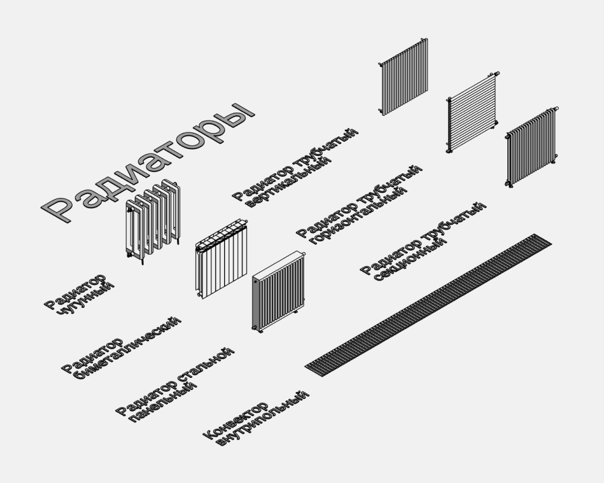
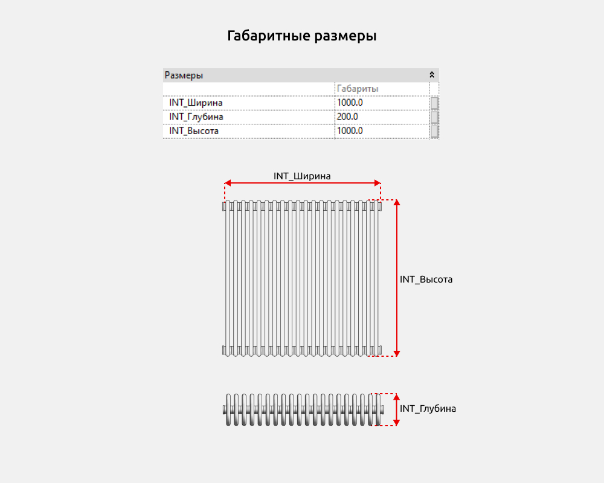
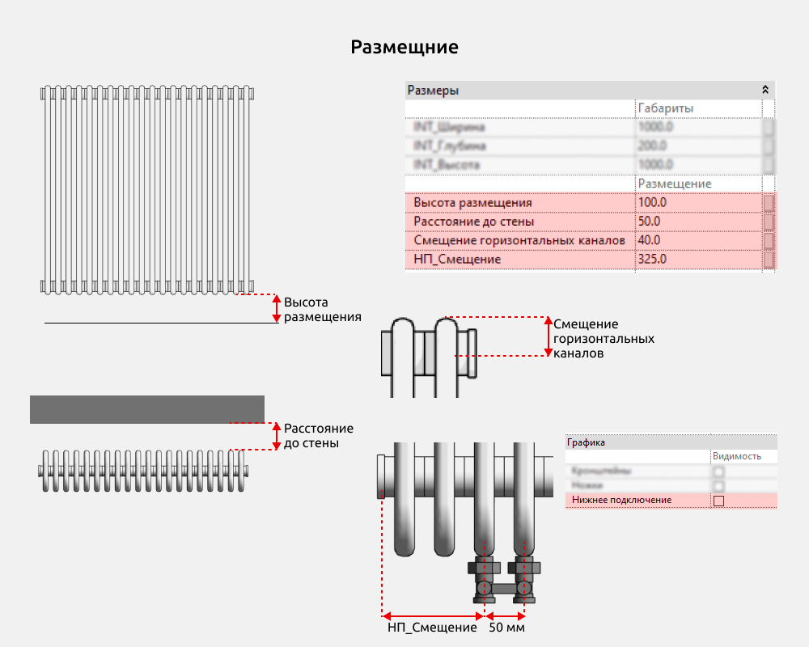
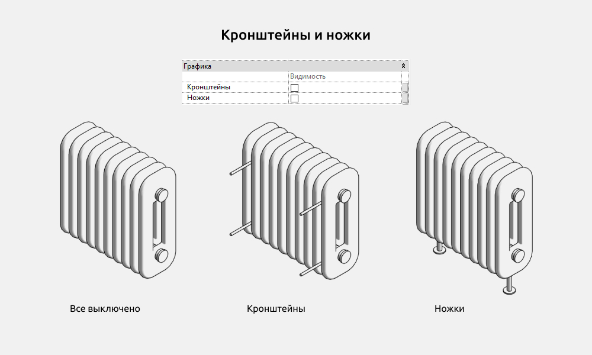
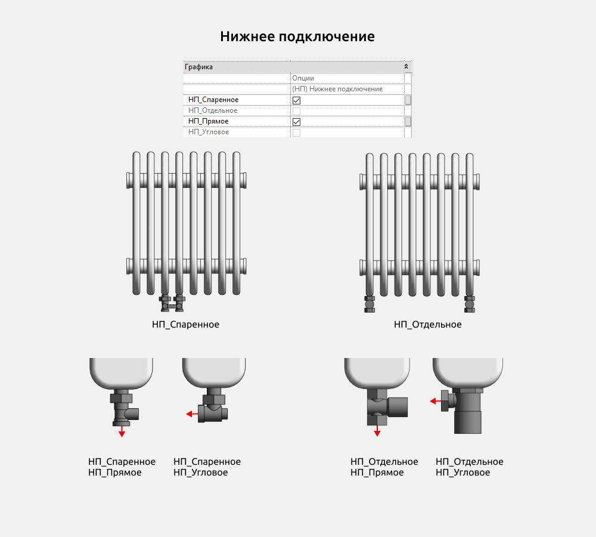
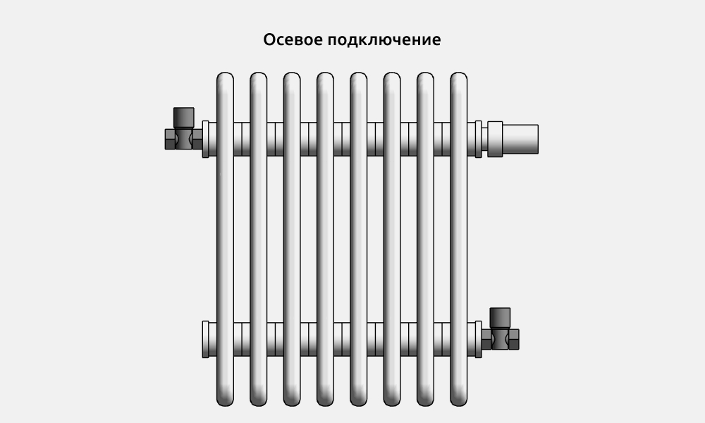
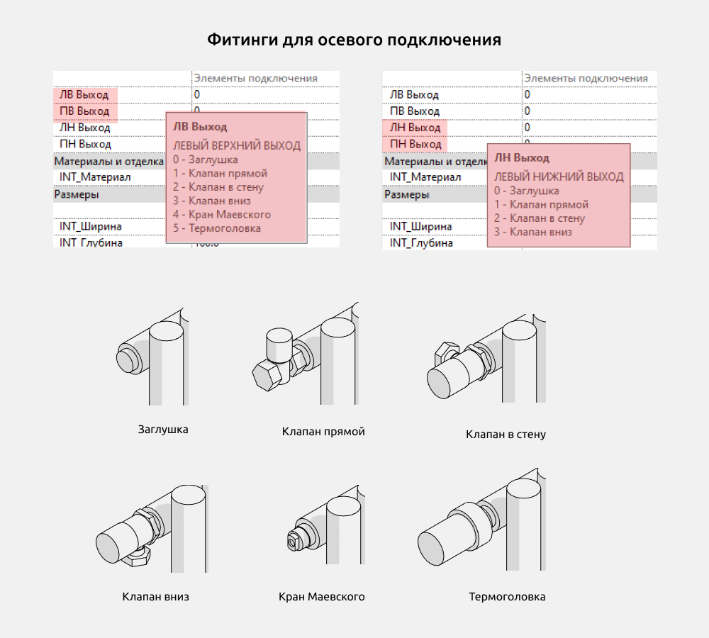
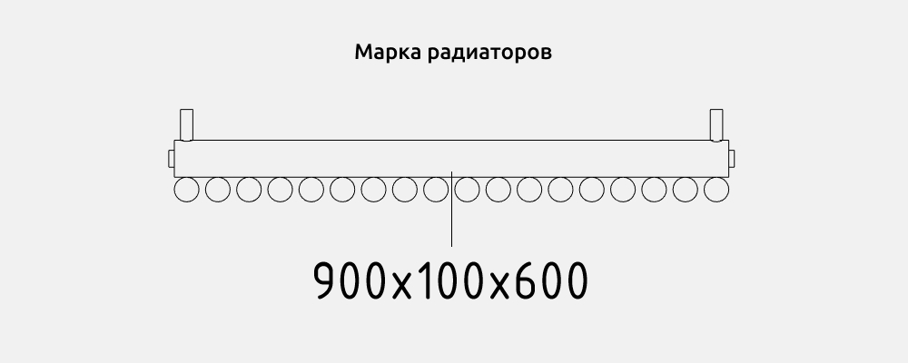
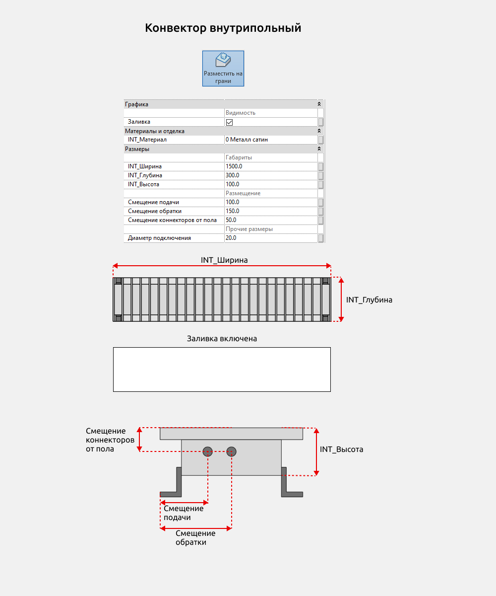
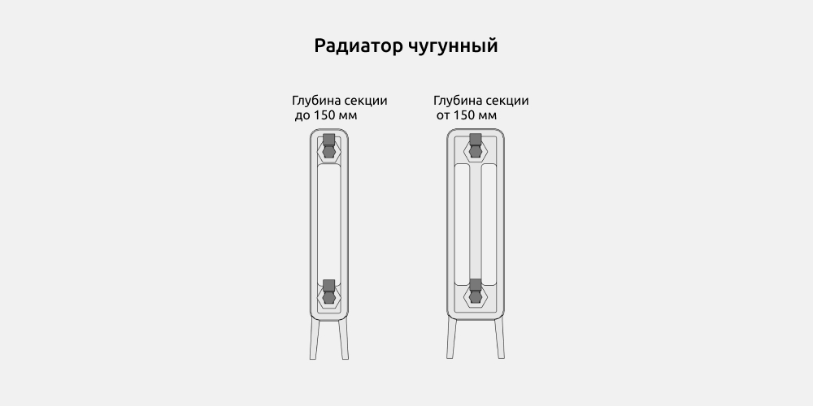

<YouTube id="lRSay6G4htE" title="Радиаторы для Revit" />

## 1. ОБЩИЕ ДАННЫЕ

- Название набора: Радиаторы
- Версия набора 1.1.0
- Версия Revit: 2019

### Описание

Этот набор семейств для Revit предназначен для моделирования радиаторов отопления в Autodesk Revit.

Позволяет создавать радиаторы по точным размерам.

Подходит для дизайнеров интерьера и архитекторов.

### Загрузка и размещение

Для того чтобы посмотреть и загрузить нужные семейства из набора, можно открыть Проект с гардеробом и скопировать семейства при помощи комбинации клавиш Ctrl+C, а затем вставить в свой проект Ctrl+V. Или открыть папку с файлами семейств и перетащить мышкой в проект.

В набор входят семейства категорий Сантехнические приборы и Арматура трубопроводов для подключения.

## 2. СОСТАВ НАБОРА

Семейства:

- Радиатор чугунный
- Радиатор биметаллический
- Радиатор стальной панельный
- Радиатор трубчатый вертикальный
- Радиатор трубчатый горизонтальный
- Радиатор трубчатый секционный
- Конвектор внутрипольный

У семейств есть общие параметры с префиксом INT, которые можно выводить в спецификации. Всем радиаторам можно назначить материал параметром INT_Материал.

## 3. ОБЩИЕ ЭЛЕМЕНТЫ

Общие элементы - элементы, которые часто повторяются в семействах.

### Размеры

У всех радиаторов есть габаритные размеры

INT_Ширина

INT_Глубина

INT_Высота

У семейств

- Радиатор чугунный
- Радиатор биметаллический

габаритные размеры не задаются вручную, а складываются из параметров размера секции и количества секций.

У семейств

- Радиатор трубчатый вертикальный
- Радиатор трубчатый горизонтальный

размер INT_Глубина не задается вручную, а складывается из размеров горизонтальных и вертикальных каналов.

Можно указать высоту размещения и расстояние до стены. Для горизонтальных каналов предусмотрен параметр смещения по вертикали.

У семейств

- Радиатор биметаллический
- Радиатор стальной панельный
- Радиатор трубчатый вертикальный
- Радиатор трубчатый горизонтальный
- Радиатор трубчатый секционный

можно выбрать спаренное нижнее подключение

Для спаренного нижнего подключения указывается смещение от левого края радиатора. Расстояние между клапанами нижнего подключения  равно 50 мм.

### Кронштейны и ножки

У всех радиаторов есть возможность выбрать Кронштейны - их размер настраивается параметром Расстояние до стены

Ножки - настраиваются через параметр Высота размещения. Они могут быть круглыми или квадратными. У чугунного радиатора только один вариант формы ножек.

### Нижнее подключение

В семействах

- Радиатор биметаллический
- Радиатор стальной панельный
- Радиатор трубчатый вертикальный
- Радиатор трубчатый горизонтальный
- Радиатор трубчатый секционный

предусмотрено нижнее подключение, оно может быть спаренным или отдельным, возможны варианты подключения Прямое и Угловое

### Осевое подключение

У радиаторов есть несколько вариантов фитингов для осевого подключения. В параметрах есть так называемые подсказки. Это небольшой текст, помогающий понять работу выбранного параметра. Чтобы его увидеть, необходимо навести мышку на название параметра. У верхних выходов можно выбрать один из шести элементов. У нижних выходов можно выбрать один из четырех элементов

### Марка

В наборе есть семейство марки Марка радиаторы габариты, она позволяет вывести габаритные размеры радиаторов.

## 4. СЕМЕЙСТВА

### Конвектор внутрипольный

Конвектор внутрипольный устанавливается с выбранной командой Разместить на грани. Так он будет корректно вырезаться из пола.

У конвектора можно указать материал, габаритные размеры, размещение подачи и обратки, а также диаметр подключения.

Добавлена опция Заливка, при включенной галочке на плане появляется белый прямоугольник.

### Радиатор чугунный

Радиатор чугунный может быть двух- и трехканальным. При глубине секции до 150 мм - двухканальный, от 150 - трехканальный.

<CTA type="guide" />
