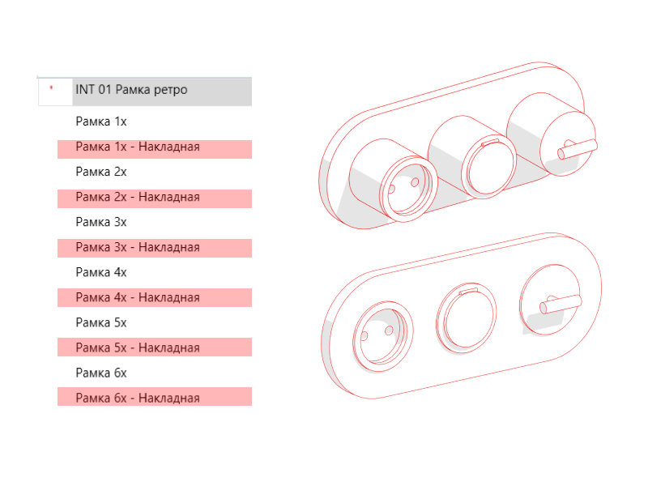
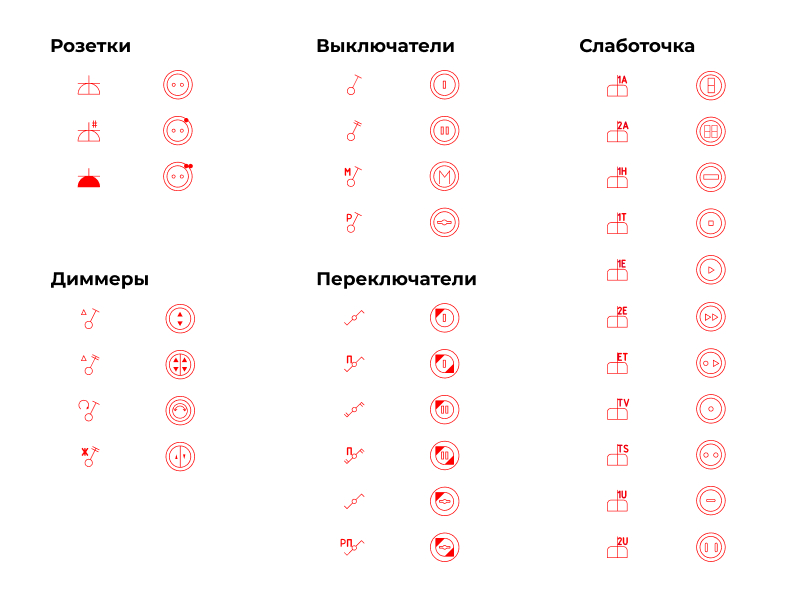
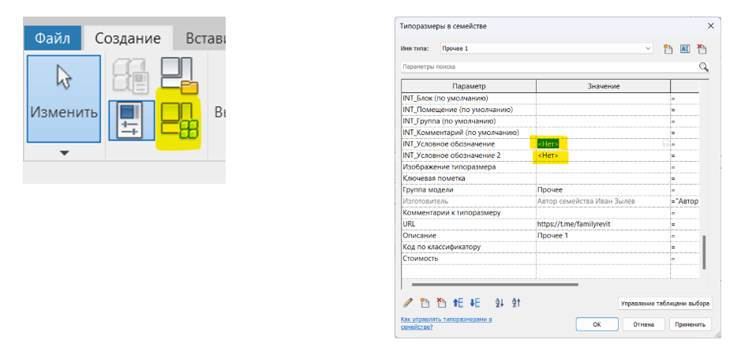

## Введение

Данное семейство является дополнением к набору семейств Розетки. Выполненные в винтажном стиле розетки и выключатели продолжают логику работы с уже знакомыми всем Розетками и используют похожие условные обозначения, что позволяет использовать оба семейства в одном проекте.

## 1. Состав набора

Проект с загруженными семействами и спецификациями

**17 Проект Ретро-Розетки.rvt**

**Загружаемые семейства**

INT 01 Рамка ретро.rfa

INT 01 Рамка грань ретро.rfa

**Марки**

INT 01 Марка розеток.rfa

INT 01 Марка розеток — 21.rfa

## 2. Загрузка семейства

Семейство **INT 01 Рамка ретро** - основное для работы. Размещается на плане этажа или плане потолка вплотную к стене. Ему можно задавать высоту.

Семейство **INT 01 Рамка грань ретро** размещается на плане или в 3Д на поверхности. Чаще всего используется для размещения в полу или потолке. Ему нельзя задать высоту - Рамка грань размещается на выбранной основе без смещения!

Для работы достаточно загрузить в проект семейства  **INT 01 Рамка ретро** и **INT 01 Рамка грань ретро** или скопировать их при помощи комбинаций клавиш Ctrl+C в свой проект из **01 Проект Ретро-Розетки.rvt**

Высота размещения задаётся параметром **INT_Отступ** от пола или, в случае использования семейств **INT 01 Рамка грань ретро**, не задаётся, так как зависит от высоты основы, на которой эти семейства размещены

## 3. Накладные/встроенные рамки

Все рамки представленны в 2х типах - Встроенная и Накладная. Достаточно выбрать нужный типоразмер и рамка станет накладной или встроенной.

Накладные механизмы можно выделить цветом при помощи фильтра видимости/графики, который необходимо скопировать из проекта-примера.

Необходимо открыть ваш проект, в во второй вкладке проект **01 Проект Ретро-Розетки.rvt**, перейти в ваш рабочий файл и использовать функцию Копировать стандарты проекта. Так вы добавите в свой проект необходимые параметры и фильтр Переопределения/Графики

## 4. Механизмы

В набор входят 3 типа розеток, 4 типа выключателей, 6 типов переключателей, 4 типа диммеров и слаботочные механизмы. 

Чтобы выбрать наполнение рамки, нужно выбрать в выпадающем списке напротив параметров 1х, 2х, 3х, 4х, 5х, 6х нужное вам семейство розетки или выключателя с префиксами В (выключатель) или Р (розетка)

## 5. Редактирование УГО

В случае, если вам необходимо изменить УГО прибора в спецификации, вы можете отредактировать векторный файл с изображением электроприбора. Файлы собраны в папке (ссылка на картинки)

Файлы сохранены в формате .svg и вы можете отредактировать их в любом векторном оффлайн или онлайн редакторе (например, в figma)

Просмотр файлов доступен в любом браузере

**Алгоритм замены изображения в проекте**

Чтобы загрузить обновлённое изображение в семейство необходимо найти в диспетчере проекта нужное семейство и нажать Правка

Вы попадёте в редактор семейства

Здесь вам нужно открыть окно **Типоразмеры в семействе** и заменить значения параметров **INT_Условное обозначение** для низкого уровня детализации или **INT_Условное обозначение 2** для среднего уровня.

После этого необходимо заменить загрузить семейство **в проект** и выбрать опцию **Заменить существующую версию и значения параметров**

## 6. Спецификации

В проекте **INT проект розетки** собраны готовые спецификации

Их можно скопировать в свой проект с листа на лист используя сочетания клавиш ctrl+C и Ctrl+V или воспользоваться функцией **Вставить из файла**, затем выбрать проект INT Проект Розетки

### Список спецификаций, заложенных в проект:

- Легенда условных обозначений
- Спецификация рамок
- Спецификация выключателей
- Спецификация розеток

<CTA type="guide" />
