import productPreview from '@site/docs/guides/families/shelving-for-revit/product.jpg';

<ProductCard
  name="Стеллажи для Revit"
  eyebrow="Набор семейств Revit"
  description="Полки и стеллажи в разных конфигурациях — готовы к вставке в проект Revit."
  image={productPreview}
  imageAlt="Стеллажи для Revit — превью набора"
  buyUrl="https://bimcore.one/products/shelving-revit-families"
  ecwidProductId="582497943"
  buyLabel="Купить"
  shopLabel="В магазин"
/>

<YouTube id="wWodTSjF0qI" title="Стеллажи для Revit" />

## 1. ОБЩИЕ ДАННЫЕ

- Название набора: Стеллажи
- Версия набора 1.1.0
- Версия Revit: 2019

### Описание

Набор семейств стеллажей для Revit предназначен для работы в Autodesk Revit и использования в BIM-проектах интерьеров и архитектуры. Библиотека включает параметрические семейства стеллажей и декора.

Набор предназначен для дизайнеров интерьера, архитекторов и проектировщиков, работающих в Autodesk Revit над жилыми и общественными объектами.

### Загрузка и размещение

Для того чтобы посмотреть и загрузить нужные семейства из набора, можно открыть *Проект со стеллажами* и скопировать семейства при помощи комбинации клавиш Ctrl+C, а затем вставить в свой проект Ctrl+V. Или открыть папку с файлами семейств и перетащить мышкой в проект.

## 2. СОСТАВ НАБОРА

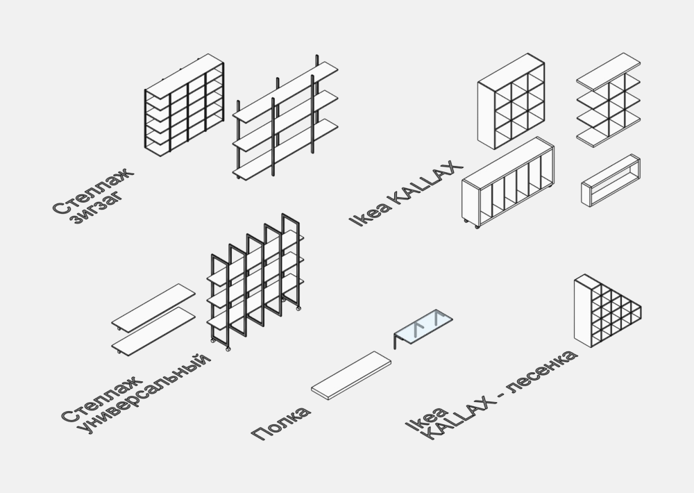

В состав набора входят следующие семейства стеллажей:

- Ikea KALLAX - лесенка
- Ikea KALLAX
- Полка
- Стеллаж зигзаг
- Стеллаж универсальный

Семейства декора:

- Книга
- Накопитель для бумаг
- Папка-регистратор
- Рамка
- Свеча узкая от 10 мм
- Свеча широкая от 100 мм
- Стеллаж универсальный
- Ящик пластиковый
- Ящик

## 3. СЕМЕЙСТВА

### Стеллажи

##### Общее. Размеры

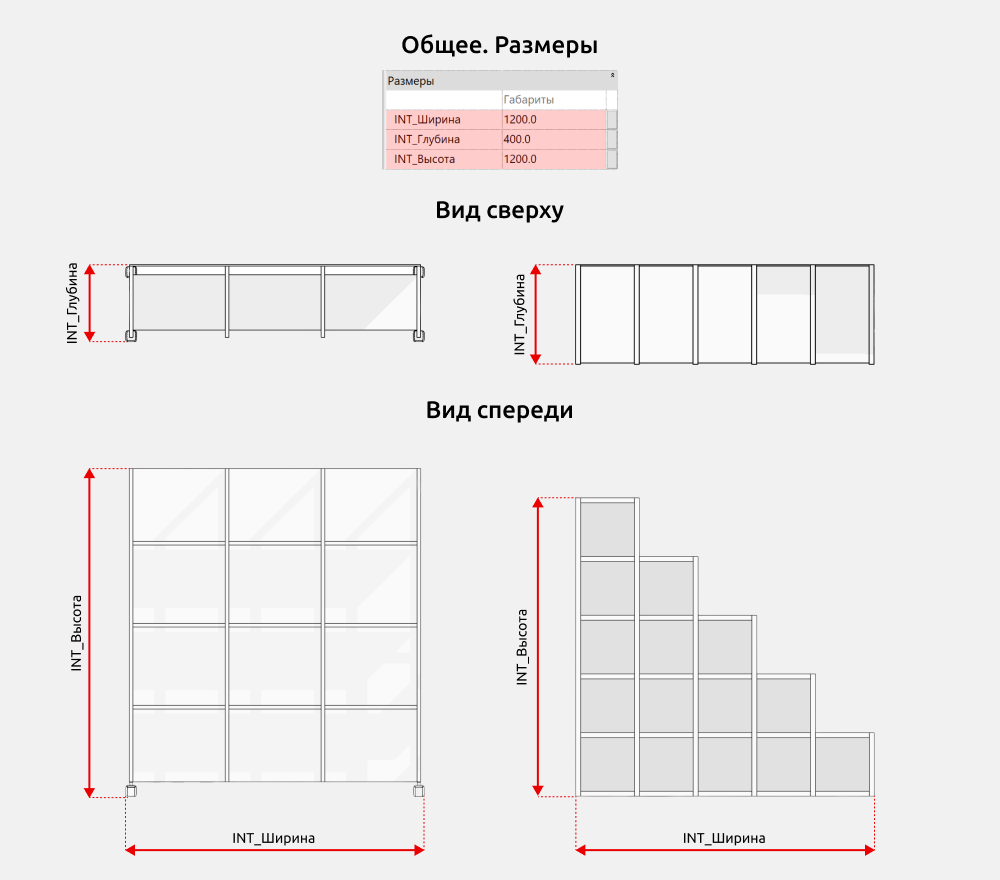

Параметры “INT_Ширина”, “INT_Глубина” и “INT_Высота” управляют габаритами стеллажей.

#### Ikea KALLAX - лесенка

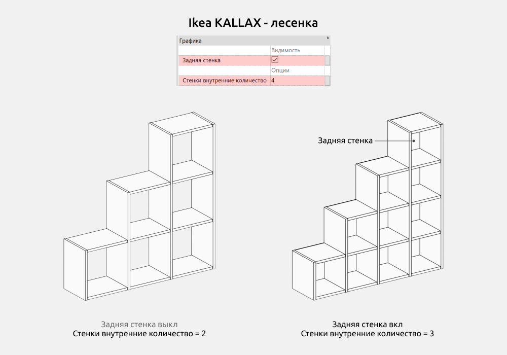

Здесь можно включить/выключить следующие элементы:

- Задняя стенка

Можно изменять количество внутренних стенок с помощью параметра “Стенки внутренние количество”.

#### Ikea KALLAX

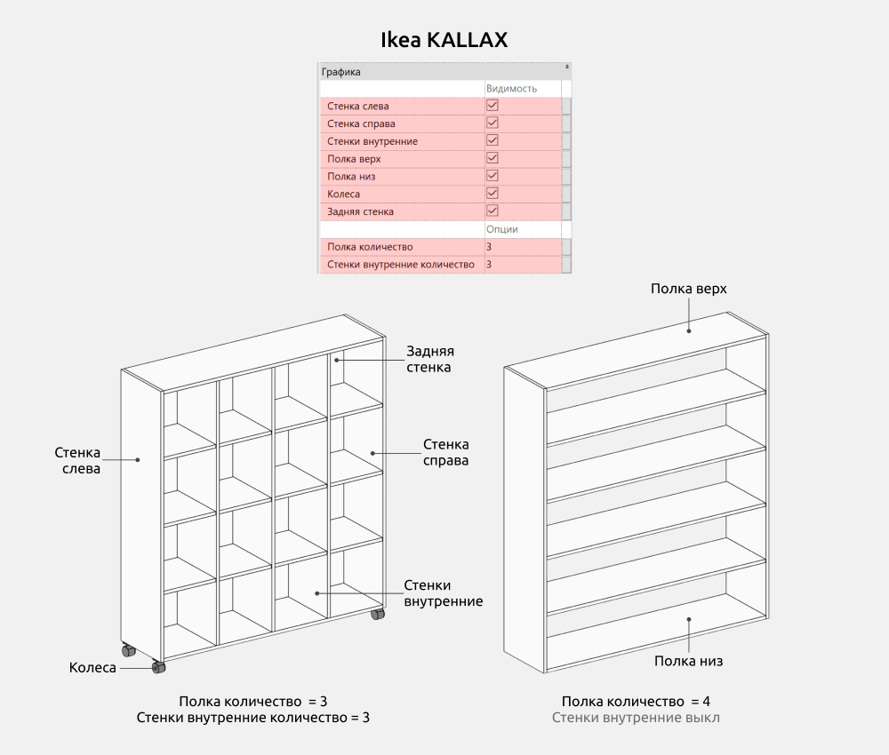

Здесь можно включить/выключить следующие элементы:

- Стенка слева
- Стенка справа
- Стенки внутренние
- Полка верх
- Полка низ
- Колеса
- Задняя стенка

Можно изменять количество полок с помощью параметра “Полка количество”.

Можно изменять количество внутренних стенок с помощью параметра “Стенки внутренние количество”.

##### Размеры

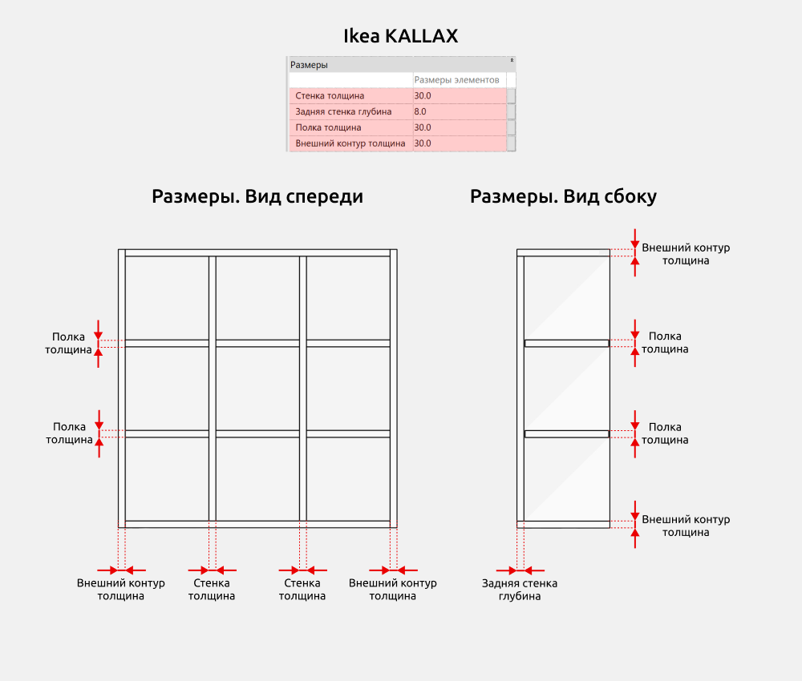

“Стенка толщина”: толщина внутренних стенок.

“Задняя стенка глубина”: глубина задней стенки.

“Полка толщина”: толщина внутренних полок.

“Внешний контур толщина”: толщина боковых стенок (слева/справа) и полок (верх/низ).

#### Полка

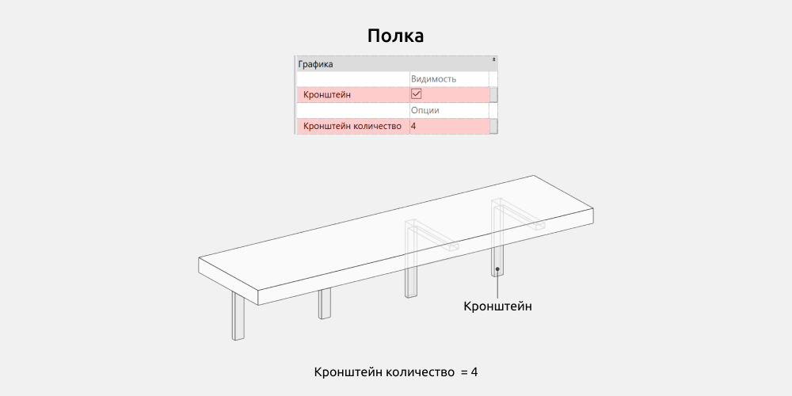

Здесь можно включить/выключить следующие элементы:

- Кронштейн

Можно изменять количество кронштейнов с помощью параметра “Кронштейн количество”.

##### Размеры

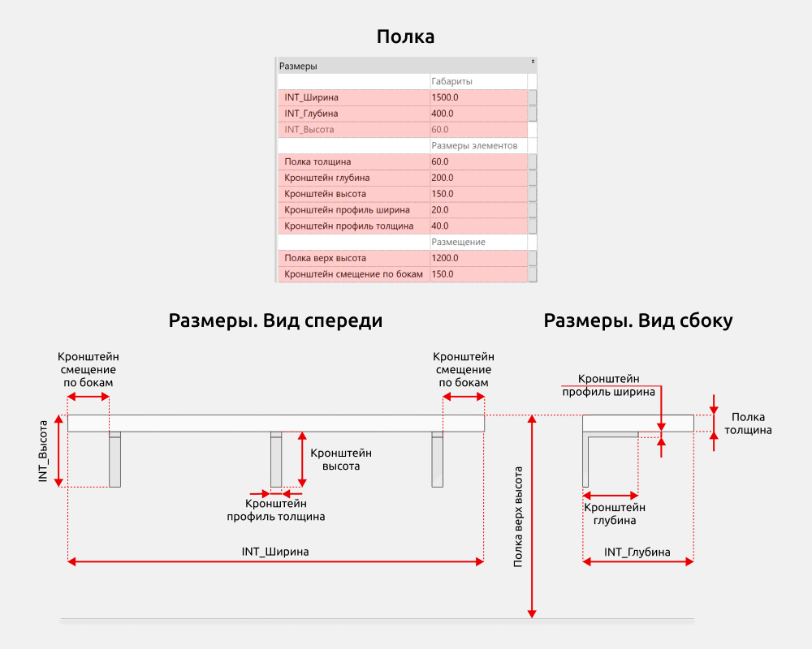

Параметры “INT_Ширина”, “INT_Глубина” и “INT_Высота” управляют габаритами полки.

Есть параметры серого цвета, которыми нельзя управлять. Но они нужны для понимания расчётов размеров. Например, “INT_Высота”. Параметр показывает высоту полки и складывается из толщины полки и высоты кронштейна.

Высотой размещения полки можно управлять с помощью параметра “Полка верх высота”.

Отступом кронштейнов по ширине полки можно управлять с помощью параметра “Кронштейн смещение по бокам”.

#### Стеллаж зигзаг

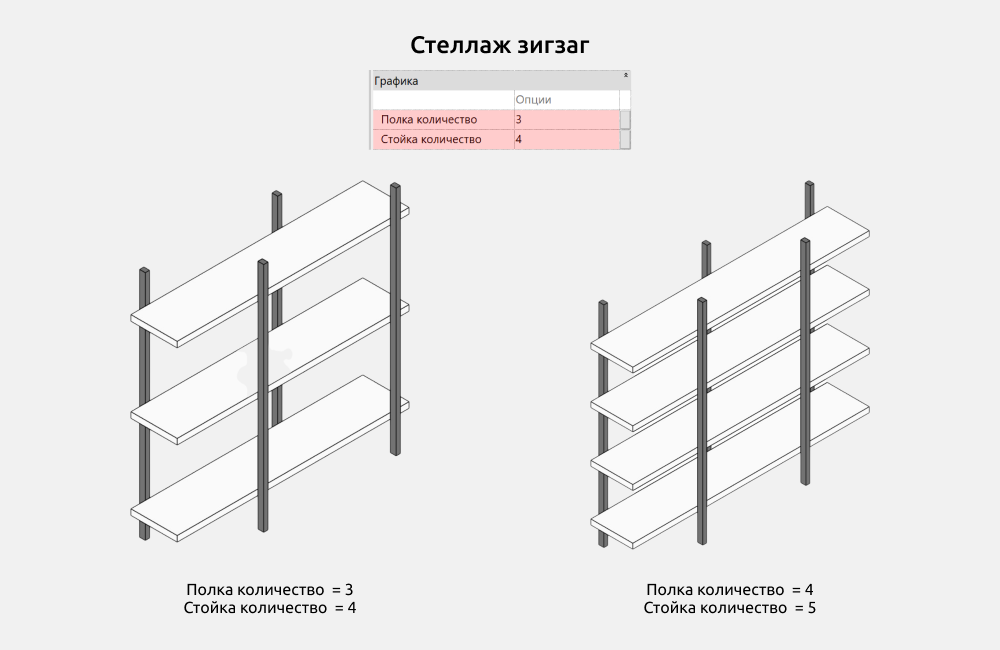

Для стеллажа зигзаг можно изменять количество полок и стоек с помощью параметров “Полка количество” и “Стойка количество”.

##### Размеры

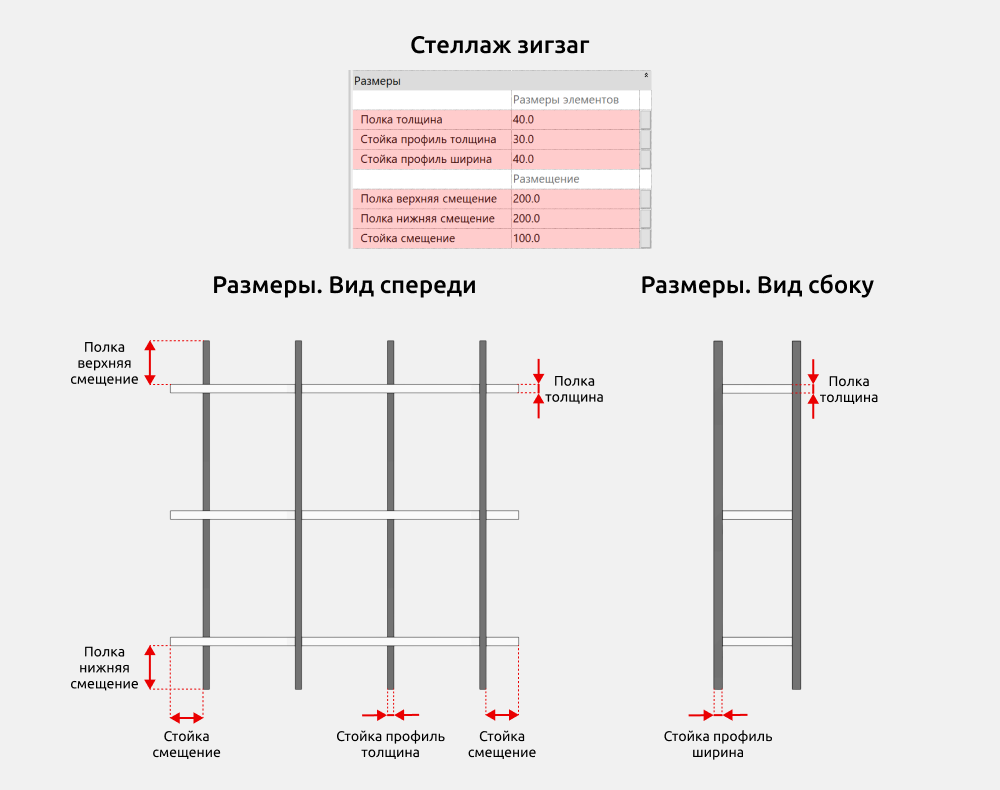

Отступ стоек по ширине стеллажа регулируется параметром «Стойка смещение».

Ширина и толщина профиля стойки задается параметрами «Стойка профиль толщина» и «Стойка профиль ширина».

Смещение верхней и нижней полок изменяется с помощью «Полка верхняя смещение» и «Полка нижняя смещение».

Толщину полки регулирует параметр «Полка толщина».

#### Стеллаж универсальный

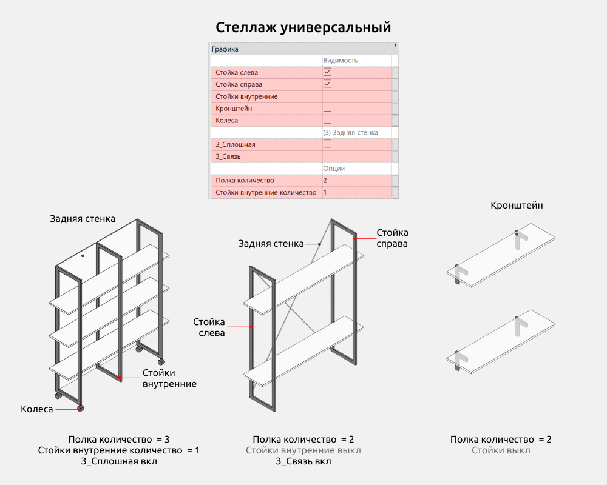

Здесь можно включить/выключить следующие элементы:

- Стойка слева
- Стойка справа
- Стойки внутренние
- Кронштейн
- Колеса

Выбор типа задней стенки:

- З_Сплошная
- З_Связь

Для стеллажа можно изменять количество полок и внутренних стоек с помощью параметров “Полка количество” и “Стойки внутренние количество”.

##### Размеры

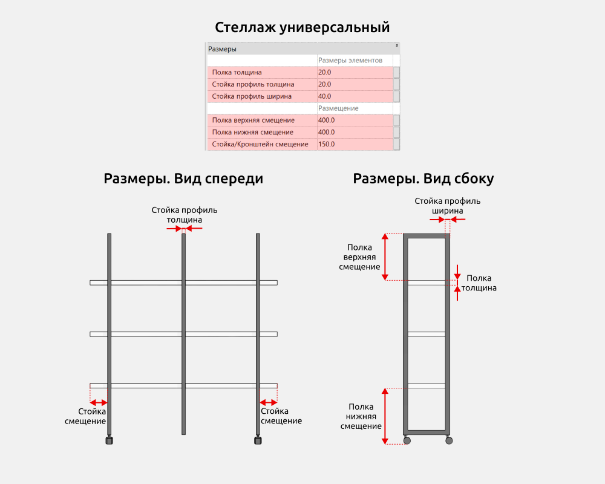

Отступ стоек по ширине стеллажа регулируется параметром «Стойка/кронштейн смещение».

Ширина и толщина профиля стойки задается параметрами «Стойка профиль толщина» и «Стойка профиль ширина».

Смещение верхней и нижней полок изменяется с помощью «Полка верхняя смещение» и «Полка нижняя смещение».

Толщину полки регулирует параметр «Полка толщина».

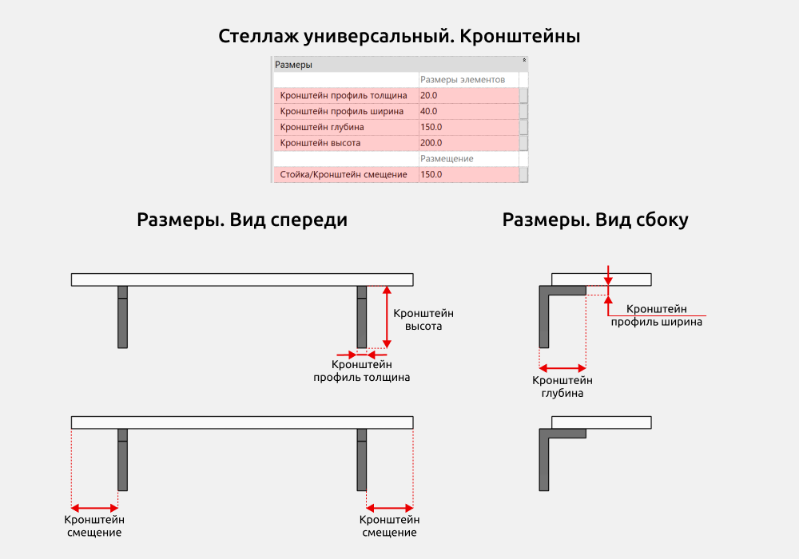

Отступом кронштейнов по ширине стеллажа можно управлять с помощью параметра “Стойка/Кронштейн смещение”.

Размерами кронштейна можно управлять с помощью параметров “Кронштейн глубина”, “Кронштейн высота”, “Кронштейн профиль толщина”, “Кронштейн профиль ширина”.

##### Опции

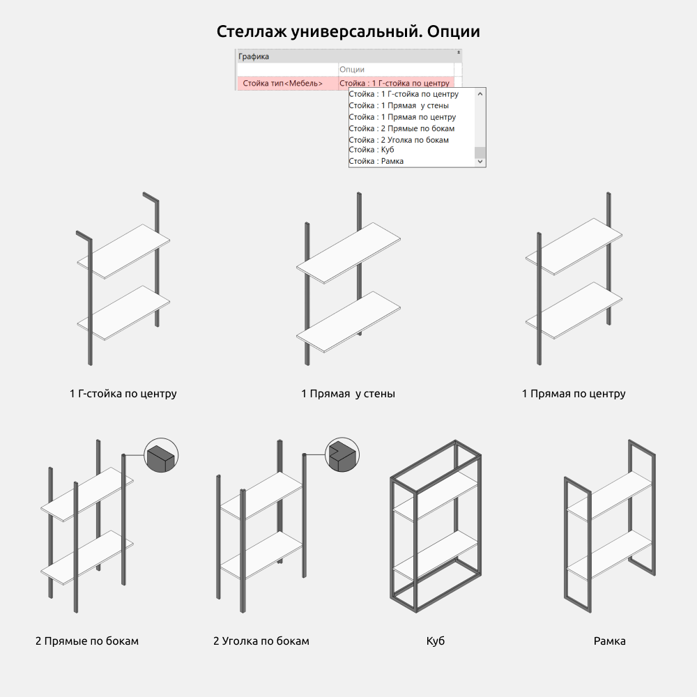

В опциях можно выбрать тип стойки:

- 1 Г-стойка по центру
- 1 Прямая  у стены
- 1 Прямая по центру
- 2 Прямые по бокам
- 2 Уголка по бокам
- Куб
- Рамка

### Декор

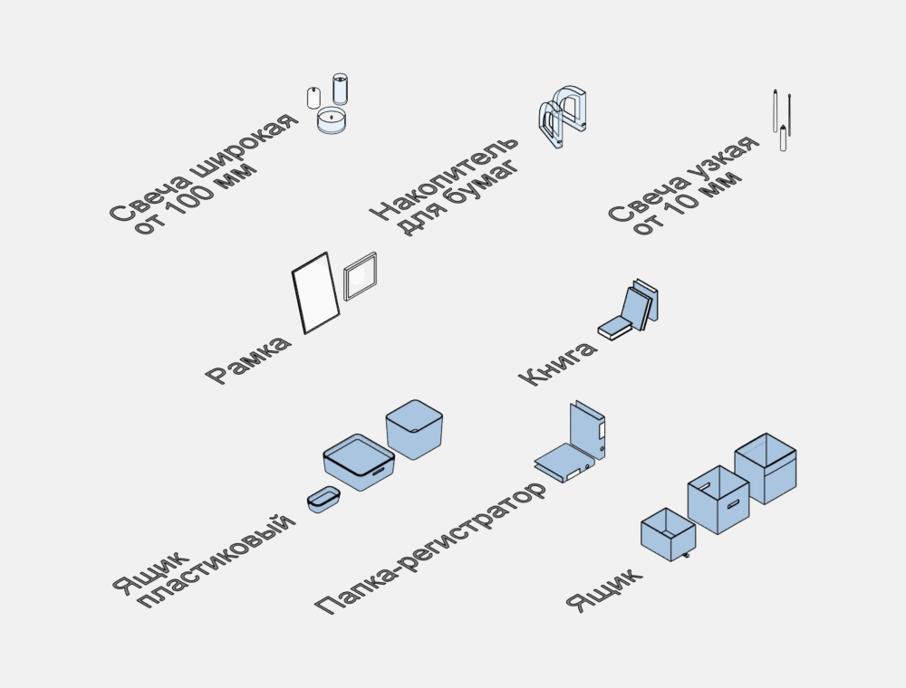

Набор семейств декора позволяют наполнять стеллажи и открытые системы хранения в интерьере под разные сценарии.

Семейства имеют гибкую настройку габаритов (высота, ширина, глубина), позволяющую точно адаптировать наполнение под конкретные высоту, глубину и ширину полок.

<CTA type="guide" />
