import productPreview from '@site/docs/guides/families/sockets-for-revit/product.jpg';

<ProductCard
  name="Розетки для Revit"
  eyebrow="Набор семейств Revit"
  description="Розетки, выключатели и другие механизмы — готовы к вставке в проект Revit."
  image={productPreview}
  imageAlt="Розетки для Revit — превью набора"
  buyUrl="https://bimcore.one/products/socket-revit-families-v-4"
  ecwidProductId="543601734"
  buyLabel="Купить"
  shopLabel="В магазин"
/>

<YouTube id="aPrQODC0NVA" title="Розетки для Revit" />

## 1. ОБЩИЕ ДАННЫЕ

- Название набора: Розетки
- Версия набора 4.2.2
- Версия Revit: 2019

### Описание

Этот набор семейств для Revit предназначен для создания планов электрики и выключателей, а также для подсчёта в спецификациях рамок и механизмов в Autodesk Revit.

Подходит дизайнерам интерьера и архитекторам. Геометрия рамок и механизмов сделана упрощенно инструментами программы Revit.

### Загрузка и размещение

Для того чтобы посмотреть и загрузить нужные семейства из набора, можно открыть **Проект с розетками** и скопировать семейства при помощи комбинации клавиш Ctrl+C, а затем вставить в свой проект Ctrl+V. Или открыть папку с файлами семейств и перетащить мышкой в проект.

Если у вас уже есть старые версии семейств, то их нужно удалить. Разверните список Семейства в Диспетчере проекта, далее Электрические приборы и выделите все семейства относящиеся к розеткам. Нажмите удалить.

Чтобы избежать проблем с картинками в спецификациях, выбирайте опцию <u>Заменить общее семейство подчинённых компонентов вместе со значениями параметров:</u>

## 2. СОСТАВ НАБОРА

В состав набора входят следующие семейства категории Электрические приборы:

- Рамка
- Рамка грань (для размещения розеток на выбранной плоскости)
- Марка розеток
- Легенда (категория Обобщенные модели)

Также в состав набора входит группа семейств Отдельные механизмы, которые размещаются отдельно от рамок:

- WIFI
- Вывод электрический
- Домофоны
- Механизмы
- Механизмы по грани
- Пульты управления
- Розетка силовая 380V
- Терморегуляторы
- Усилитель сотового сигнала

<u>Семейство Рамка</u> - основное для работы. Размещается на плане этажа или плане потолка вплотную к стене. Ему можно задавать высоту.

<u>Семейство Рамка грань</u> размещается на плане или в 3Д на поверхности. Чаще всего используется для размещения в полу или потолке. Ему нельзя задать высоту - Рамка грань размещается на выбранной основе без смещения!

<u>Семейства с префиксами В и Р</u> - вложенные семейства. Они используются ТОЛЬКО внутри рамки. Размещать их отдельно не рекомендуется.

## 3. УРОВНИ ДЕТАЛИЗАЦИИ

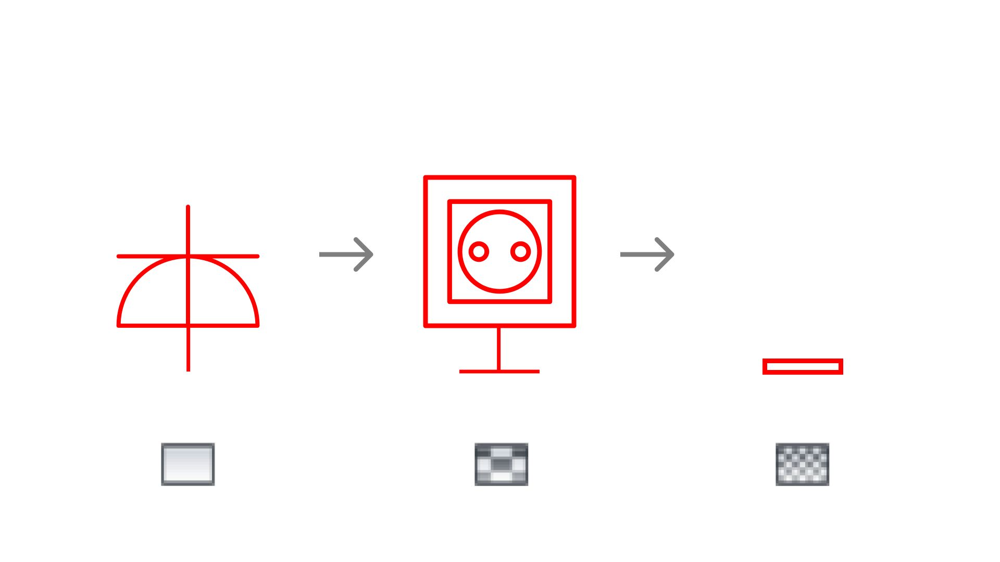

Отображение семейства на плане и фасаде зависит от уровня детализации вида. Для 3д-видов используйте высокий уровень детализации.

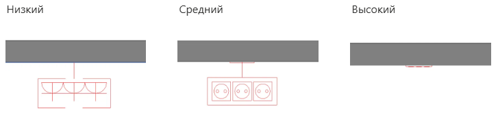

## 4. МАСШТАБ

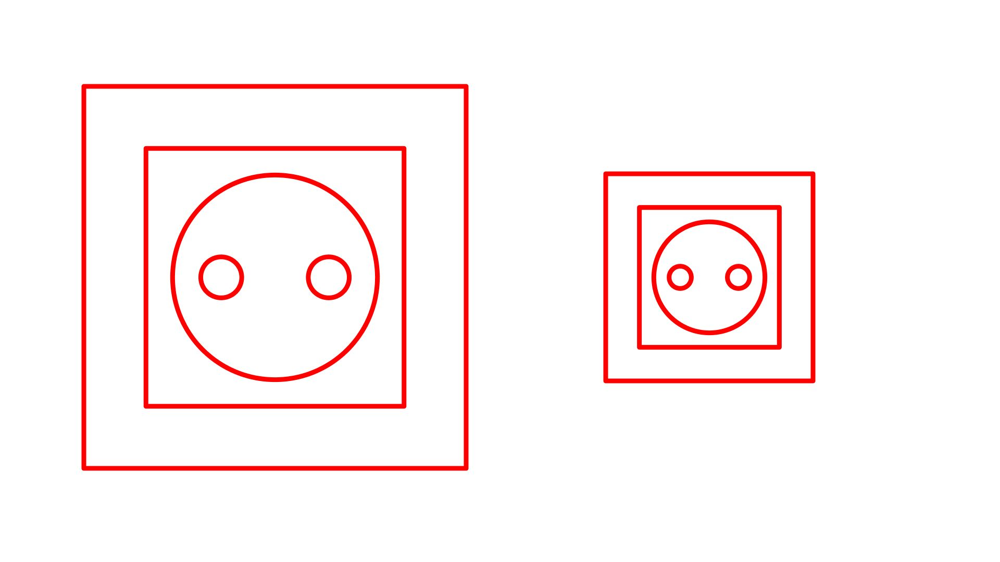

При помощи параметров типа **М План** и **М Фасад** можно изменять размер УГО для плана и фасада для низкого и среднего уровня детализации.

Если изменить параметр **Размер механизма и Толщина внешней рамки,** то будет меняться реальный размер розетки или выключателя. Это можно будет увидеть на высоком уровне детализации вида.

## 5. ОПЦИИ РАМКИ

### 1. Типоразмеры рамки

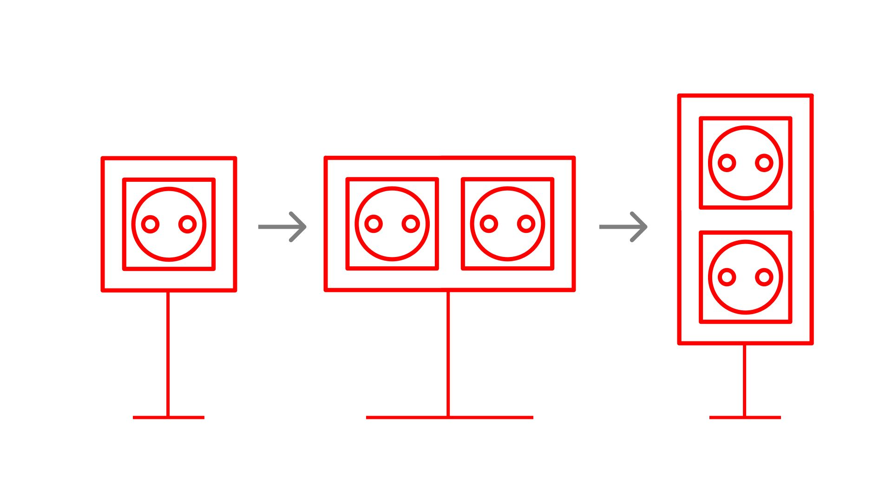

Количество элементов в рамке зависит от выбранного типоразмера:

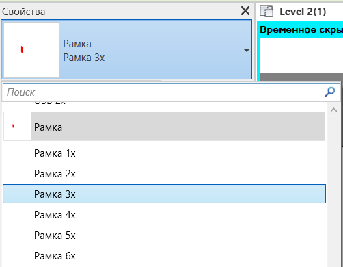

Чтобы выбрать наполнение рамки, нужно выбрать в выпадающем списке напротив параметров 1х, 2х, 3х, 4х, 5х, 6х нужное вам семейство розетки или выключателя с префиксами В (выключатель) или Р (розетка):

Если в рамке 2 поста, то в неё попадут только элементы, которые заданы в параметрах **1х и 2х.** Если в рамке 5 постов, то в неё попадут элементы, которые заданы в параметрах **1х, 2х, 3х, 4х и 5х.** Параметр 6х не будет влиять на наполнение рамки.

Чтобы горизонтальная рамка стала вертикальной, нужно отключить параметр Гор:

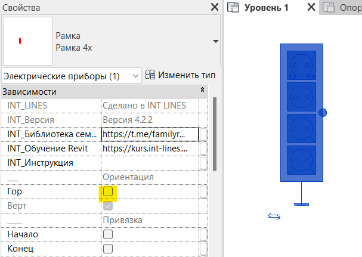

### 2. Розетки

Розетки вложены общими семействами в рамки. Полный список семейств розеток с типоразмерами представлены ниже:

Р 01 Прочее:

- Заглушка
- Заглушка кабель-канала
- Прочее 1
- Прочее 2
- Прочее 3

Р 01 Розетка:

- 220V
- IP20 с крышкой
- IP44
- USB

Р 01 Слаботочка:

- Audio 1x
- Audio 2x
- HDMI 1х
- RJ10 1x (Телефон)
- RJ45 1x (Интернет)
- RJ45 2x (Интернет)
- RJ45 + TV
- TV
- TV + SAT
- USB 1x
- USB 2x

Для ускоренного поиска нужного типа розетки введите заглавную Р

Розетки Р Прочее: Прочее 1, 2, 3 созданы для того, чтобы вы могли создать свой тип для недостающего элемента розеток. Для этих типоразмеров можно добавлять свой 3Д-текст и использовать в проекте

### 3. Выключатели

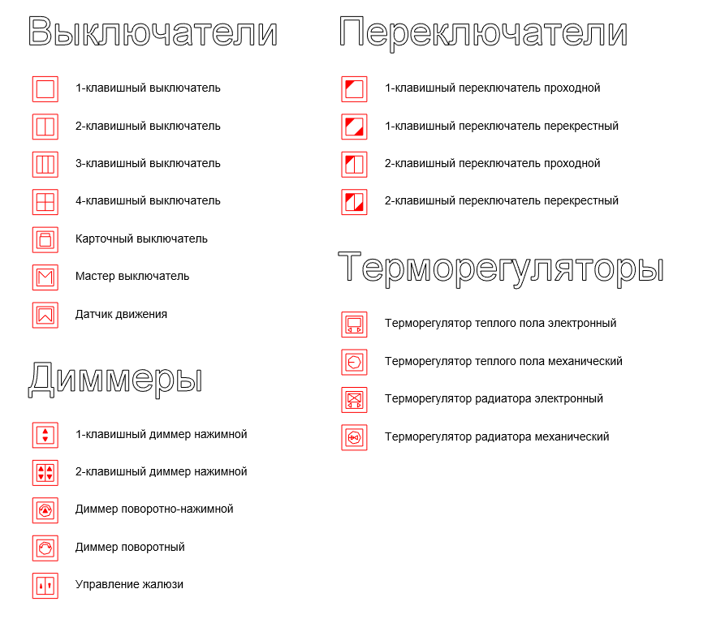

Выключатели вложены общими семействами в рамки. Полный список семейств выключателей с типоразмерами представлен ниже:

В 01 Выключатель:

- 1КЛ
- 2КЛ
- 3КЛ
- 4КЛ
- КАРТ
- МАСТЕР

В 01 Датчик движения

В 01 Диммер:

- 1КЛ НАЖИМ
- 2КЛ НАЖИМ
- ЖАЛЮЗИ
- ПОВ НАЖ
- ПОВОРОТНЫЙ

В 01 Переключатель:

- 1КЛ
- 1КЛ Перекрестный
- 2КЛ
- 2КЛ Перекрестный

В 01 Терморегулятор:

- РАДИАТОР МЕХ
- РАДИАТОР ЭЛЕКТР
- ТЕПЛ ПОЛ МЕХ
- ТЕПЛ ПОЛ ЭЛЕКТР

Для ускоренного поиска нужного типа выключателя введите заглавную В

### 4. Привязки (центр, низ, верх)

Горизонтальные рамки на плане можно привязывать выноской:

- к центру рамки
- к началу (1й элемент в рамке)
- к концу (последний элемент в рамке)

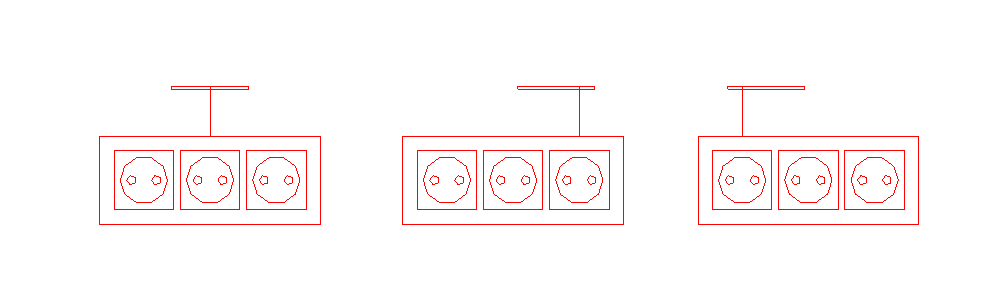

Вертикальные рамки на фасаде можно привязывать:

- к центру рамки
- к нижнему элементу в рамке
- к верхнему элементу в рамке.

Обозначение привязки на фасаде - круг.

### 5. Материалы

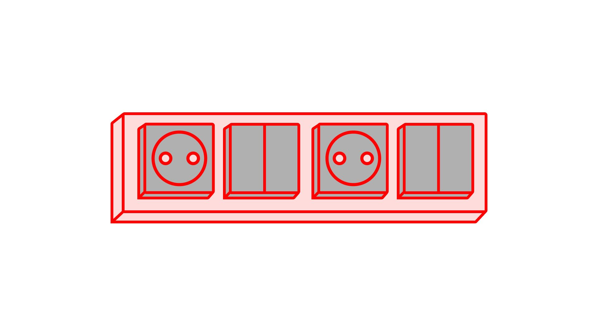

Чтобы изменить материал Рамки и вложенных в неё элементов на высоком уровне детализации, необходимо изменить параметр экземпляра INT_Материал рамки и INT_Материал розетки, назначив материал из диспетчера.

## 6. РАЗМЕЩЕНИЕ

### 1. Вынос УГО план/фасад

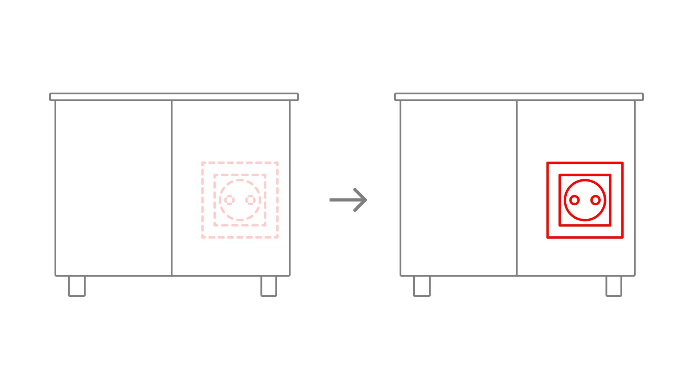

Параметры **Вынос УГО План** и **Вынос УГО Фасад** нужны для того, чтобы показать рамку с розетками или выключателями, даже если они перекрываются мебелью или другими элементами на плане или фасаде (если вы не используете высокий уровень детализации на развёртках).

<u>ЧАСТАЯ ОШИБКА:</u>

Для Revit высота семейства Рамка - это сумма **INT отступ от пола + Вынос УГО План**

То есть если у вас есть выключатель на высоте 900 мм и для него задан вынос 2500, то на плане Revit ваш выключатель будет виден аж до отметки +2.400 от уровня чистого пола.

Если план второго этажа ниже, чем сумма **INT отступ от пола + Вынос УГО План,** то выключатель виден и на втором этаже. Если меньше - то только на первом.

### 2. Отступ от стены

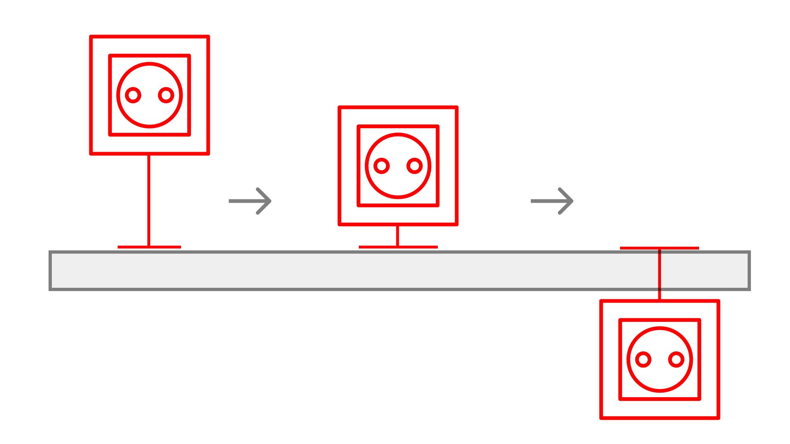

Вынос элемента от стены управляется параметром **Отступ от основы.**

Чем он больше, тем дальше от стены находится УГО рамки.

Можно задавать **отрицательные значения** и выносить УГО на другую сторону стены. Это особенно актуально для небольших помещений.

На фасаде и разрезе УГО размещаются без смещения, по центру реального расположения рамки.

## 7. МАРКИРОВКА

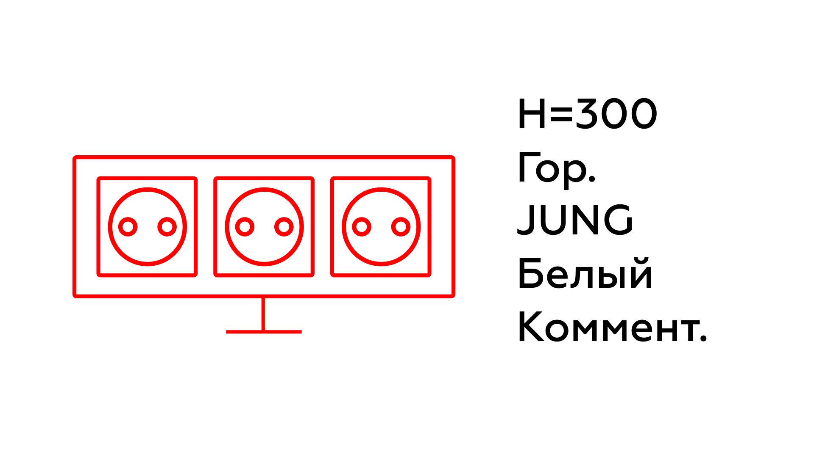

Для маркировки рамок семейств подготовлена марка **INT 01 Марка розеток,** в которой есть несколько типоразмеров:

Краткая

Только высота прибора (Значение параметра **INT_отступ от пола**) + Комментарий

! Для семейства Рамка грань значение всегда равно 0, семейство всегда лежит на поверхности с 0 смещением.

Краткая + Ориентация

Высота прибора (Значение параметра **INT_отступ от пола**) + ориентация рамки (INT_Ориентация)+ Комментарий

Полная

INT_Отступ от пола + INT_Ориентация + INT_Производитель + INT_Серия + INT_Цвет + INT_Цвет рамки + Комментарий

Только комментарий

Только комментарий

Также в рамках зашит параметр _Марка_, он включает на плане рядом с розеткой марку, в которой отображается высота размещения рамки (Параметр INT Отступ от пола). НО если вы используете отдельное семейство для маркировки, а не параметр, стоит выключить галочку Марка.

## 8. ПЛАН ПОТОЛКА

На плане будут отображаться элементы, которые находятся выше секущей плоскости плана потолка. Если вы ходите увидеть элементы, которые находятся ниже секущей плоскости или закрыты мебелью, то отредактируйте параметр Вынос УГО план так, чтобы INT отступ от пола + Вынос УГО План был больше, чем Высота секущей плоскости.

Или воспользуйтесь стандартным инструментом Revit **Фрагмент плана.**

Чтобы розетки и выключатели на плане потолков выглядели так же, как на плане этажа на среднем уровне детализации, нужно задать **Прозрачность 100%** в переопределении видимости/графики на виде. На низком уровне детализации элементы отображаются корректно и без прозрачности.

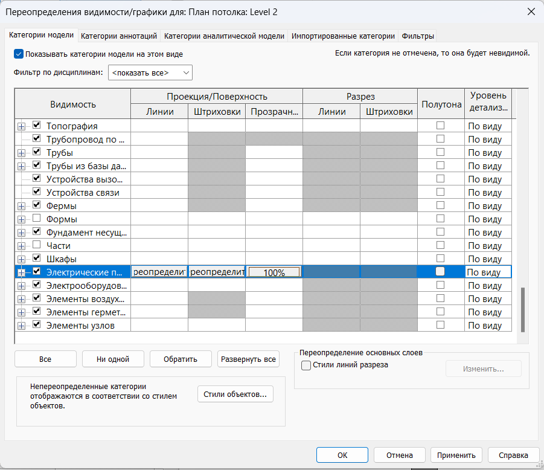

## 9. ОТДЕЛЬНЫЕ МЕХАНИЗМЫ

Полный список семейств механизмов с типоразмерами представлен ниже:

INT 01 WIFI:

- Роутер
- Точка доступа

INT 01 Вывод электрический:

- Слаботочный
- 12V
- 24V
- 220V
- 380V

INT 01 Домофоны:

- Аудиодомофон
- Видеодомофон

INT 01 Механизмы и INT 01 Механизмы по грани:

- IP Камера
- Вентилятор
- Датчик движения
- Звонок
- Пожарный извещатель дымовой

INT 01 Пульты управления:

- Контроллер умного дома
- Пульт управления вентиляцией
- Пульт управления климатом (Метеостанция)

INT 01 Розетка силовая 380V:

- Скрытая 3Р+Е+N 16А 380В IP44
- Стационарная 3Р+Е+N 16А 380В IP44

INT 01 Терморегуляторы:

- Терморегулятор радиатора - Механический
- Терморегулятор радиатора - Электронный
- Терморегулятор теплого пола - Механический
- Терморегулятор теплого пола - Электронный

INT 01 Усилитель сотового сигнала

**Механизмы по грани** размещаются на выбранной поверхности, остальные - на плане.

Если включить параметр экземпляра **Марка**, то для механизма в Марке отразится высота элемента и параметр Типа **INT_Комментарий по типу:**

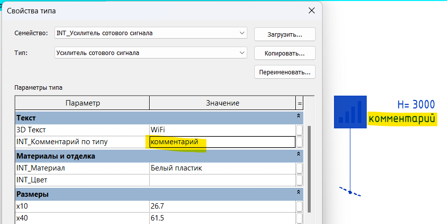

### Электровыводы

Электровыводы отображаются на плане, независимо от того, на какой высоте расположены на среднем и низком уровне детализации.

## 10. ГРАФИКА

### 1. Стили линий

Чтобы изменить цвет розеток и выключателей во всём проекте, вам необходимо Перейти на вкладку Управление - Инструмент Стили объектов.

Изменяя цвет подкатегории можно изменить цвет элемента <u>во всём проекте</u>. Настраивать следует категорию Электрические приборы и её подкатегории. У вас в проекте могут остаться лишние подкатегории из старых версий, их можно удалить.

Чтобы изменить цвет розеток и выключателей <u>на одном виде</u>, надо зайти в _Переопределение видимости/графики_ и настроить цвета для категории Электрические приборы и её подкатегорий.

Также, для того, чтобы изменить цвет розеток или выключателей на виде можно использовать Фильтры в окне Переопределение видимости/графики.

Параметр _INT Блоки_ включает обозначение рамки на низком уровне детализации.

Параметр _Выноска_ показывает линии выноски на плане от стены до УГО.

Параметр _Привязка_ для вертикальных розеток включает обозначение привязки (центр, верх, низ) на фасаде.

### 2. Заливка

Для того, чтобы изменить цвет заливки розетки или выключателя на плане, необходимо выбрать через Tab вложенное общее семейство и изменить параметр INT_УГО Заливка в типе, назначив материал из диспетчера:

Для того, чтобы УГО приборов в спецификации соответствовали тому, что задано в проекте, необходимо обновить УГО jpeg в свойствах типоразмеров.

### 3. УГО и Figma

В случае, если вам необходимо изменить УГО прибора в спецификации, вы можете отредактировать векторный файл с изображением электроприбора на страничке в Figma.

ссылка на Figma: [<u>https://www.figma.com/design/C53Y49XcTp6BOhbNSROxqs/%D0%A3%D0%93%D0%9E-%D0%A0%D0%9E%D0%97%D0%95%D0%A2%D0%9A%D0%98-V4?node-id=0-1&t=fJL1bR7jzSHFrgc3-1</u>](https://www.figma.com/design/C53Y49XcTp6BOhbNSROxqs/%D0%A3%D0%93%D0%9E-%D0%A0%D0%9E%D0%97%D0%95%D0%A2%D0%9A%D0%98-V4?node-id=0-1&t=fJL1bR7jzSHFrgc3-1)

Просмотр файлов доступен в любом браузере, но редактировать на странице от INT LINES нельзя, нужно выделить всё и скопировать к себе на страницу.

<u>Алгоритм замены изображения в проекте:</u>

- Чтобы загрузить обновлённое изображение в семейство необходимо найти в Диспетчере проекта нужное семейство и нажать Правка. Вы попадёте в редактор семейства.
- Здесь вам нужно открыть окно Типоразмеры в семействе и заменить значения параметров _INT_Условное обозначение_ для низкого уровня детализации или _INT_Условное обозначение 2_ для среднего уровня.
- После этого необходимо заменить загрузить семейство в проект и выбрать  !!!Заменить существующую версию и значения параметров!!!

Если вы хотите использовать изменённые УГО в следующих проектах, перед загрузкой обновлённого семейства в проект, вам сначала нужно открыть семейство Рамка и Рамка грань и заменить обновлённое семейство и в проекте, и в семействах Рамка и Рамка грань. А после этого вам нужно сохранить семейства Рамка и Рамка грань на своём компьютере.

<CTA type="guide" />
