## 1. ОБЩИЕ ДАННЫЕ

-   Название набора: Диваны
-   Версия набора 1.0.0
-   Версия Revit: 2019

### Описание

Этот набор семейств для Revit предназначен для моделирования диванов в Autodesk Revit.

С помощью семейств можно создать прямые и угловые диваны, кушетки и пуфы по точным размерам.

Подходит дизайнерам интерьера и архитекторам.

### Загрузка и размещение

Для того чтобы посмотреть и загрузить нужные семейства из набора, можно открыть **Проект с диванами** и скопировать семейства при помощи комбинации клавиш Ctrl+C, а затем вставить в свой проект Ctrl+V. Или открыть папку с файлами семейств и перетащить мышкой в проект.

## 2. СОСТАВ НАБОРА

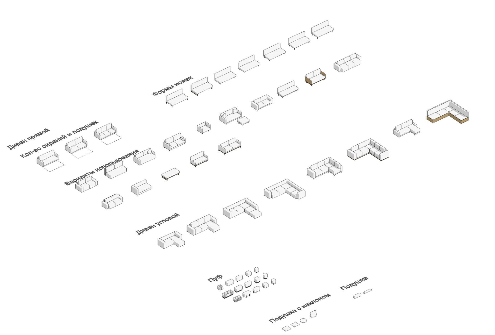

В состав набора входят следующие семейства:

-   Диван прямой;
-   Диван угловой;
-   Пуф;
-   Подушка;
-   Подушка с наклоном.

## 3. СЕМЕЙСТВА

### Диван прямой

Семейство “Диван прямой” используется для построения диванов, кушеток и оттоманок прямой формы.

Здесь можно включить или выключить следующие элементы:

-   подставка;
-   основание;
-   спинка;
-   подушка;
-   левый подлокотник;
-   правый подлокотник;
-   УГО Раскладной диван (на плане сверху).

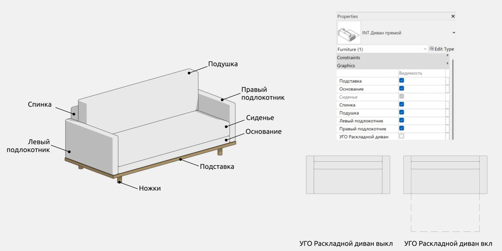

Параметры “Сиденье” и “Ножки” по умолчанию всегда включены.

#### Опции

В семействе можно независимо регулировать количество подушек (от 1 до 3) и количество сидений (от 1 до 3). Эта информация также доступна при наведении на соответствующие параметры в виде подсказок.

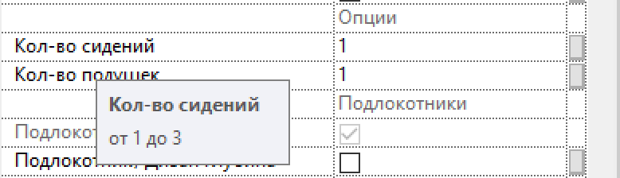

Также в секции “Графика” можно работать с подлокотниками: их глубина может совпадать или не совпадать с глубиной дивана. По умолчанию установлен первый вариант. В случае, если глубина подлокотников не совпадает с глубиной дивана, она может редактироваться в параметре “Подлокотники глубина”. Данный параметр управляет обоими подлокотниками, изменение глубин подлокотников независимо друг от друга в семействе не предусмотрено.

Типы ножек можно выбрать в выпадающем списке. Существуют следующие варианты:

-   Г-образные;
-   П-образные;
-   классические;
-   конус;
-   конус под углом;
-   прямоугольник;
-   цилиндр.

Высота ножек классической формы всегда 150 мм.

При выборе типа ножек “Форма прямоугольник” появляется возможность редактировать глубину ножек.

В данном разделе можно выбирать место размещения ножек: под подлокотниками или под сидением. По умолчанию выбран последний вариант.

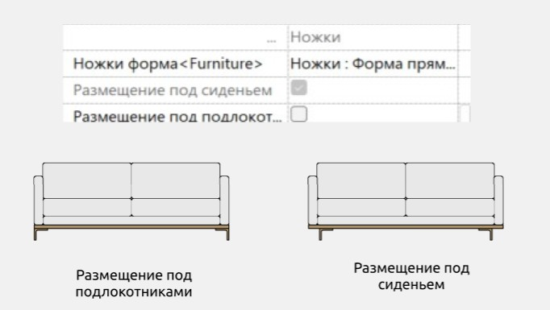

#### Материалы

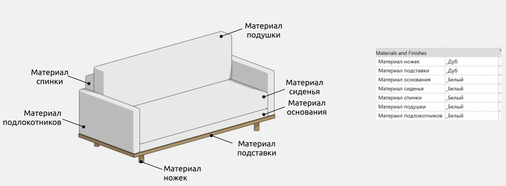

#### Размеры

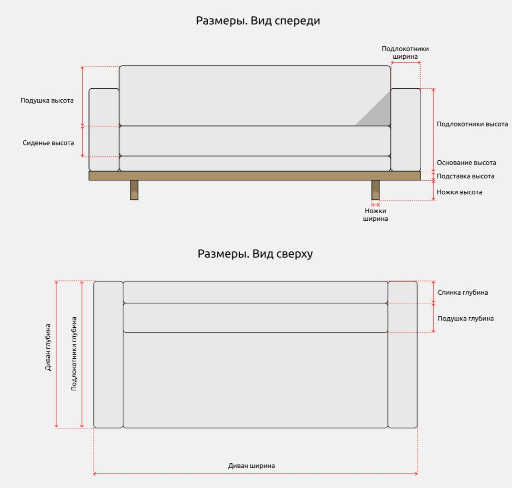

“Диван ширина” - это параметр ширины, в котором есть другие мелкие параметры ширины элементов, если они включены по галочке, например, “Подлокотники ширина”. Если подлокотники выключены, корпус сдвигается на ширину подлокотников. То же верно для параметра “Диван высота” и более мелких параметров высоты (“Подлокотники  высота”, “Подставка высота”, “Основание высота”), а также для параметра “Диван глубина” и более мелких параметров глубины, например, “Спинка глубина”.

Параметр “УГО глубина” позволяет регулировать глубину символа раскладного дивана.

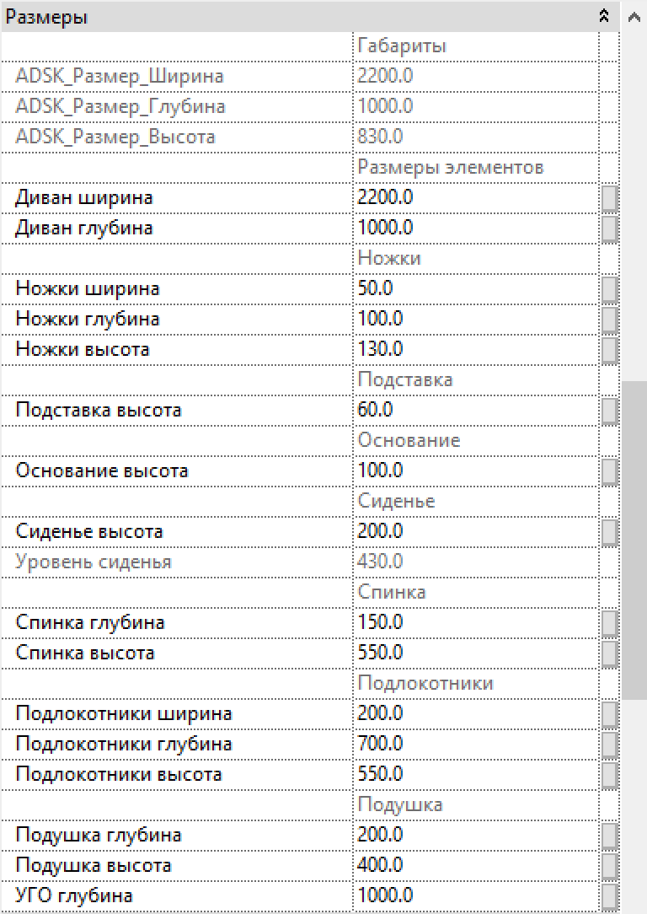

Есть параметры серого цвета, которыми нельзя управлять (например, *ADSK_Размер_Ширина)*. Они нужны для понимания расчётов размеров и корректной работы формул и не предназначены для пользовательского редактирования.

### Диван угловой

Семейство “Диван угловой” используется для построения угловых диванов разных конфигураций.

Здесь можно включить или выключить следующие элементы:

-   подставка;
-   основание;
-   спинка
-   подушка;
-   левый подлокотник;
-   правый подлокотник.

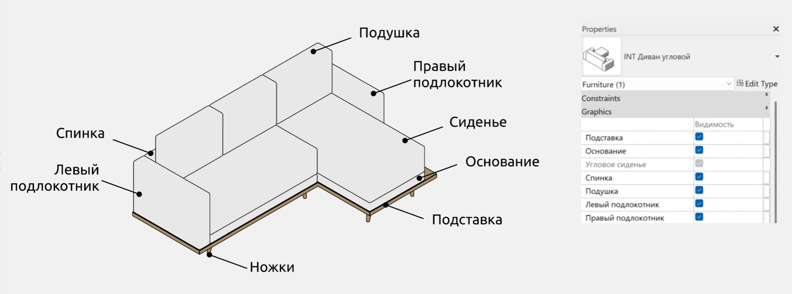

#### Опции

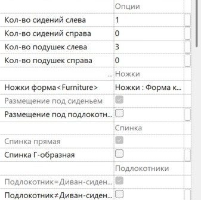

В подразделе “Опции” можно выбрать нужное количество подушек и сидений в диване. Количество сидений и подушек слева считается от углового сиденья влево, а количество сидений и подушек справа считается от углового сиденья вниз справа.

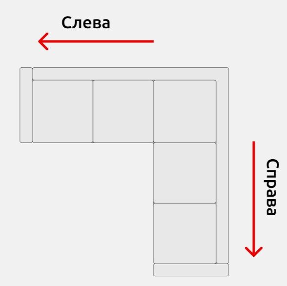

В семействе можно независимо регулировать количество сидений (от 1 до 2 слева, от 0 до 2 справа) и количество подушек (от 1 до 3). Эта информация также доступна при наведении на соответствующие параметры в виде подсказок.

В подразделе “Ножки” можно управлять формой ножек дивана.

Варианты форм ножек и все параметры их редактирования идентичны в прямом и угловом диванах.

Спинка

Здесь можно переключаться между прямой и Г-образной спинкой дивана. По умолчанию установлен первый вариант.

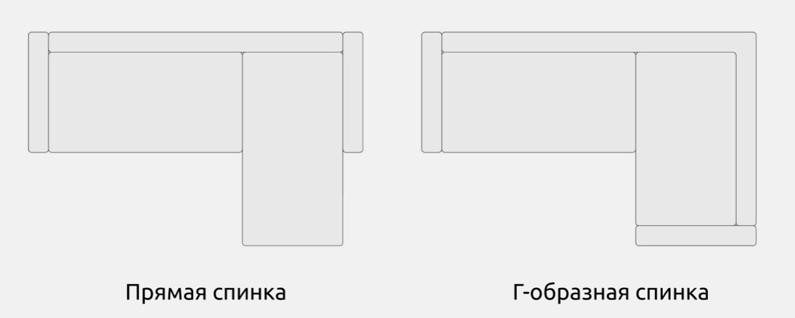

Подлокотники

В подразделе “Подлокотники” можно управлять размещением подлокотников углового дивана. Варианты их размещения идентичны в прямом и угловом диванах, однако есть одно отличие: возможна независимая настройка глубин подлокотников. Более подробно это описано в разделе “Размеры”.

#### Материалы

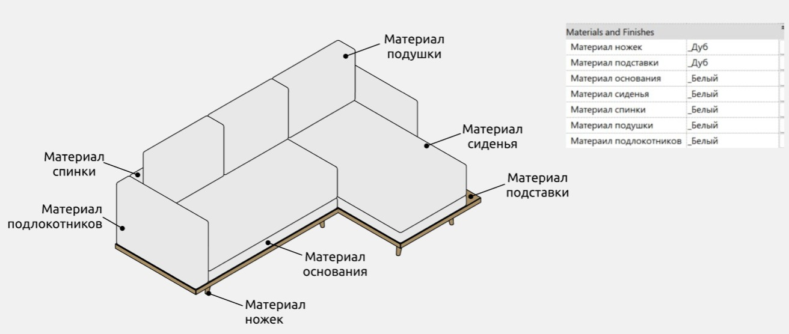

#### Размеры

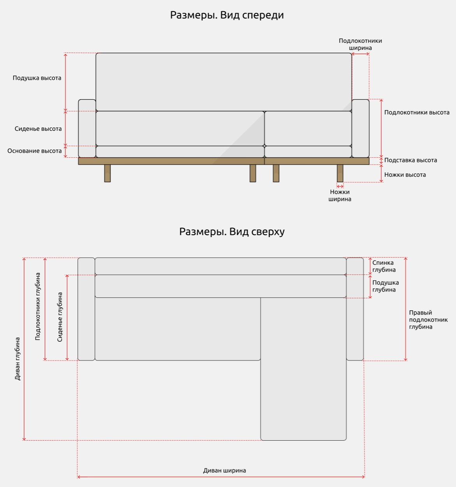

Параметры “Диван ширина” и “Диван глубина” управляют общими размерами дивана. Они содержат в себе другие мелкие параметры ширины элементов, если они включены по галочке, например, “Подлокотники ширина”. Если подлокотники выключены, корпус сдвигается на ширину подлокотников. То же верно для других более мелких параметров.

В конструкции семейства подушки расположены на сидениях, поэтому глубина сидения определяется не по нижней, а по верхней границе подушки.

Параметры “Подлокотники ширина” и “Подлокотники высота” управляют шириной и высотой обоих подлокотников соответственно.  В случаях если в параметрах графики была выбрана Г-образная спинка или глубина подлокотников совпадает с глубиной дивана, то параметр “Подлокотники глубина” будет управлять глубиной обоих подлокотников. Если же глубина подлокотников не совпадает с глубиной дивана, в семействе возможно изменение глубин подлокотников независимо друг от друга. Глубина подлокотников может редактироваться в параметрах “Подлокотники глубина” для левого подлокотника и “Правый подлокотник глубина” для правого.

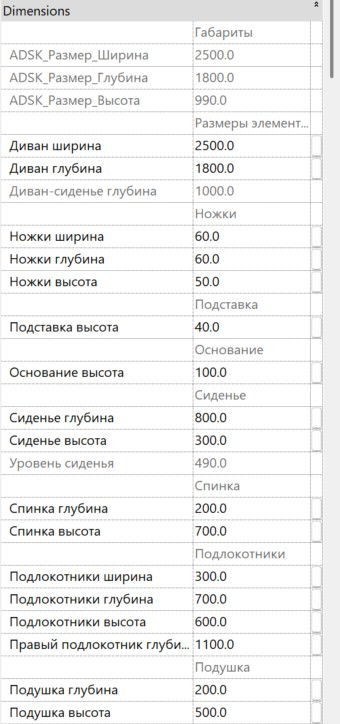

Есть параметры серого цвета, которыми нельзя управлять (например, *ADSK_Размер_Ширина)*. Они нужны для понимания расчётов размеров и корректной работы формул и не предназначены для пользовательского редактирования.

### Пуф

Семейство “Пуф” используется для отображения пуфов и банкеток.

Семейство “Пуф” поддерживает 4 формы:

-   овал;
-   квадрат;
-   круг;
-   гофрированный прямоугольник (при выборе этого варианта поддерживается редактирование количества делений массива в подразделе “Пуф гофрированный”).

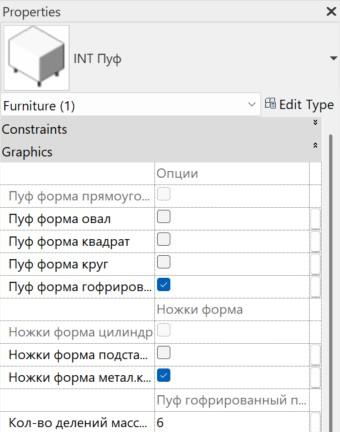

Также в данном разделе можно переключаться между 3 вариантами ножек:

-   цилиндр (выбрана по умолчанию, если остальные варианты отключены);
-   подставка;
-   металлический каркас.

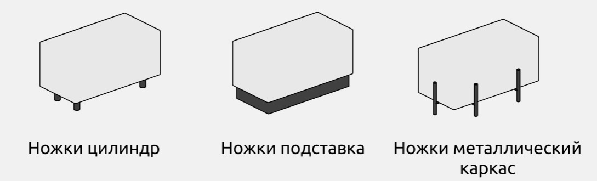

Использование без ножек в семействе не поддерживается.

#### Материалы и размеры

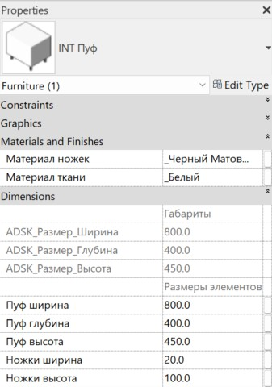

В семействе можно редактировать материалы ткани и ножек пуфа.

Также поддерживается изменение размеров пуфа и изменение высоты ножек. В случае, если были выбраны ножки цилиндрической формы, поддерживается возможность изменять ширину ножек.

### Подушка

Семейство “Подушка” предназначено в декоративных целях. Параметры семейства позволяют редактировать размеры и материал подушки, а также переключаться между цилиндрической и трапециевидной формами.

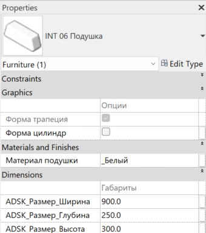

### Подушка с наклоном

Семейство “Подушка с наклоном” обладает теми же параметрами, что и семейство “Подушка”, а также позволяет:

-   переключаться между 3 формами подушки (круг/прямоугольник/прямоугольник с ушками);
-   включать или отключать подставку (в случае, если подставка включена, ее материал также можно редактировать);
-   регулировать угол наклона подушки.

<CTA type="guide" />
