## 1. ОБЩИЕ ДАННЫЕ

- Название набора: Столы
- Версия набора 1.2.0
- Версия Revit: 2019

### Описание

Набор семейств столов для Revit предназначен для работы в Autodesk Revit и использования в BIM-проектах интерьеров и архитектуры. Библиотека включает параметрические семейства столов.

Набор предназначен для дизайнеров интерьера, архитекторов и проектировщиков, работающих в Autodesk Revit над жилыми и общественными пространствами.

### Загрузка и размещение

Для того чтобы посмотреть и загрузить нужные семейства из набора, можно открыть **Проект со столами** и скопировать семейства при помощи комбинации клавиш Ctrl+C, а затем вставить в свой проект Ctrl+V. Или открыть папку с файлами семейств и перетащить мышкой в проект.

## 2. СОСТАВ НАБОРА

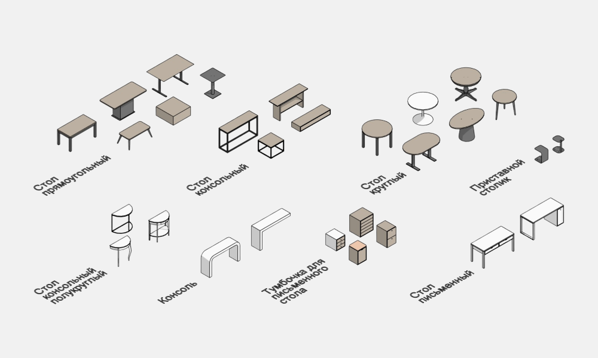

В состав набора входят следующие семейства параметрических столов:

- Консоль
- Приставной столик
- Стол консольный полукруглый
- Стол консольный
- Стол круглый
- Стол письменный
- Стол прямоугольный
- Тумбочка для письменного стола

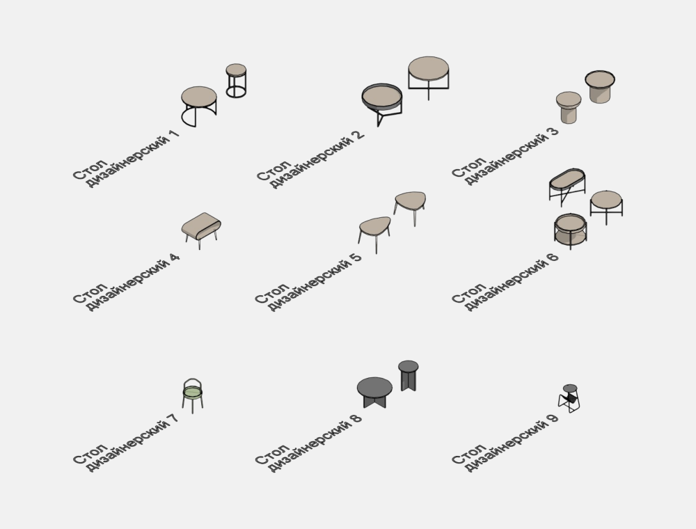\
Семейства дизайнерских столов:

- Стол дизайнерский 1
- Стол дизайнерский 2
- Стол дизайнерский 3
- Стол дизайнерский 4
- Стол дизайнерский 5
- Стол дизайнерский 6
- Стол дизайнерский 7
- Стол дизайнерский 8
- Стол дизайнерский 9

## 3. СЕМЕЙСТВА

### Общее. Размеры

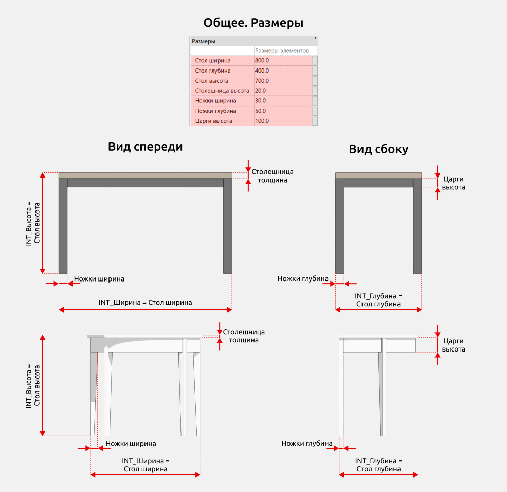

У большей части параметрических столов есть следующие общие параметры, которые управляют габаритами:

INT_Ширина = Стол ширина

INT_Глубина = Стол глубина

INT_Высота = Стол высота

Также у столов можно изменять значения у параметров ”Ножки ширина”, ”Ножки глубина”, ”Столешница толщина” и ”Царги высота”.

### УГО

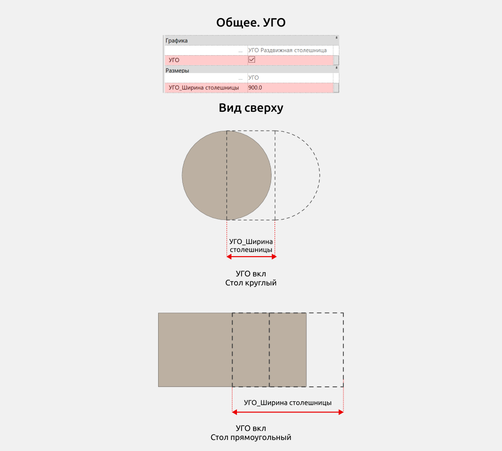

На виде сверху можно включить условно-графическое обозначение (УГО) для раздвижной столешницы с помощью параметра “УГО”.

Ширину УГО можно поменять с помощью параметра “УГО_Ширина столешницы”.

### Консоль

Здесь можно включить/выключить следующие элементы:

- Одна опора
- Две опоры

Помимо изменения габаритов для консоли доступно изменение толщины консоли с помощью параметра ”Консоль ширина” и радиуса перехода опоры в столешницу с помощью параметра ”Радиус внутренний”.

Если Радиус внутренний равен 0, то скругление консоли выключается.

### Приставной столик

Здесь можно включить/выключить следующие элементы:

- Форма прямоугольник
- Форма прямоугольник скруглённый

### Стол консольный полукруглый

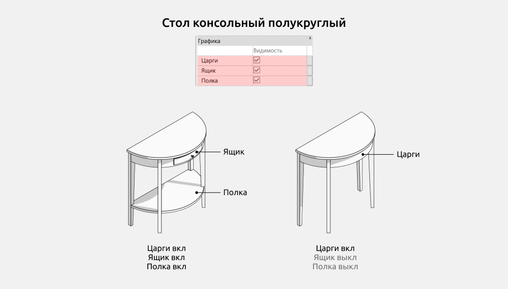

Здесь можно включить/выключить следующие элементы:

- Царги
- Ящик
- Полка

Чтобы включить Ящик, необходимо сначала включить Царги.

#### Опции

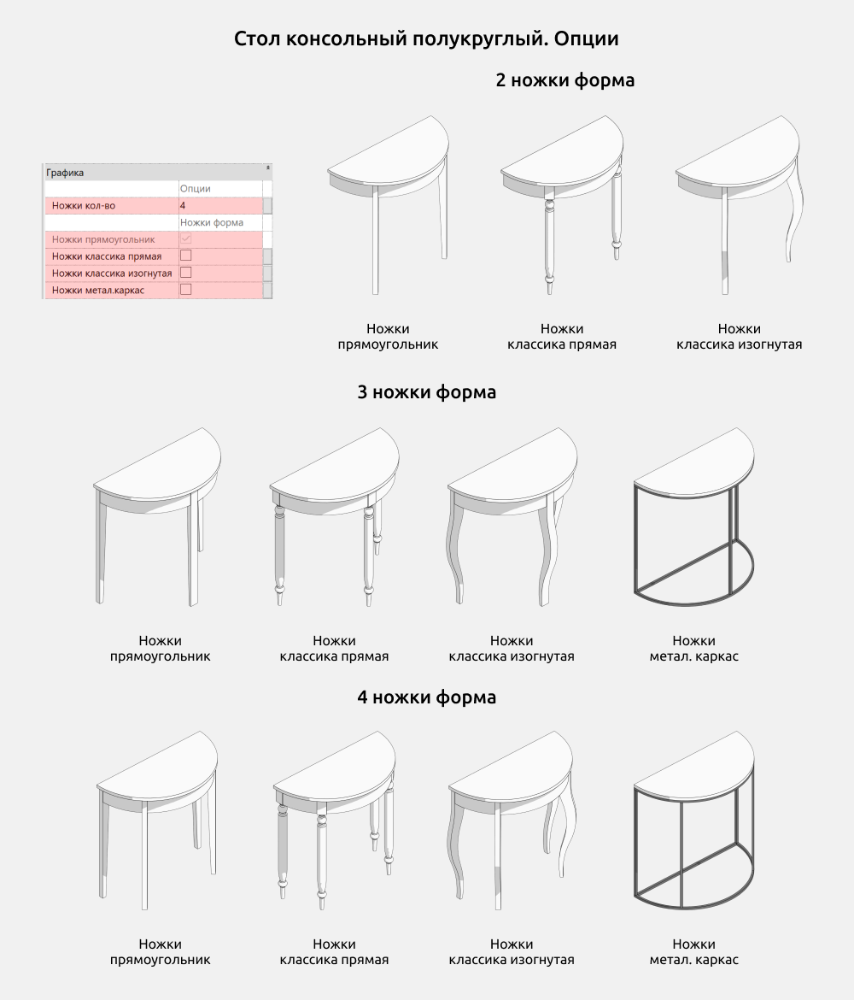

Здесь можно выбрать количество ножек от 2 до 4.

Также доступен выбор формы ножек:

- Ножки прямоугольник
- Ножки классика прямая
- Ножки классика изогнутая
- Ножки метал. каркас (недоступен для 2 ножек)

#### Размеры

Все изменяющиеся размеры стола указаны в разделе Общее. Размеры.

Нюансы параметров:

Стол высота: от 700мм и выше

Ножки классика прямая: ширина и глубина ножек не меняется.

Ножки метал.каркас: размеры меняются параметром “Ножки каркас толщина”.

### Стол консольный

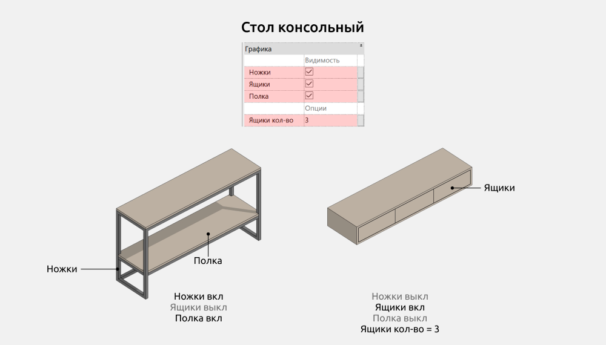

Здесь можно включить/выключить следующие элементы:

- Ножки
- Ящики
- Полка

Количество ящиков от 1 до 3.

Полку можно включить у всех форм ножек, кроме “Ножки прямоугольник скошенный”.

#### Опции

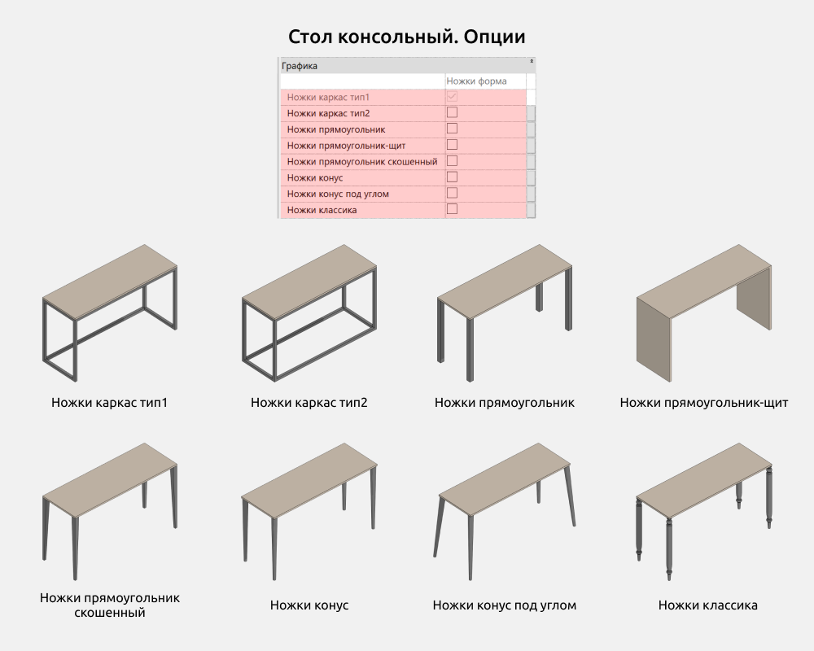

Доступен выбор формы ножек:

- Ножки каркас тип1
- Ножки каркас тип2
- Ножки прямоугольник
- Ножки прямоугольник-щит
- Ножки прямоугольник скошенный
- Ножки конус
- Ножки конус под углом
- Ножки классика

#### Размеры

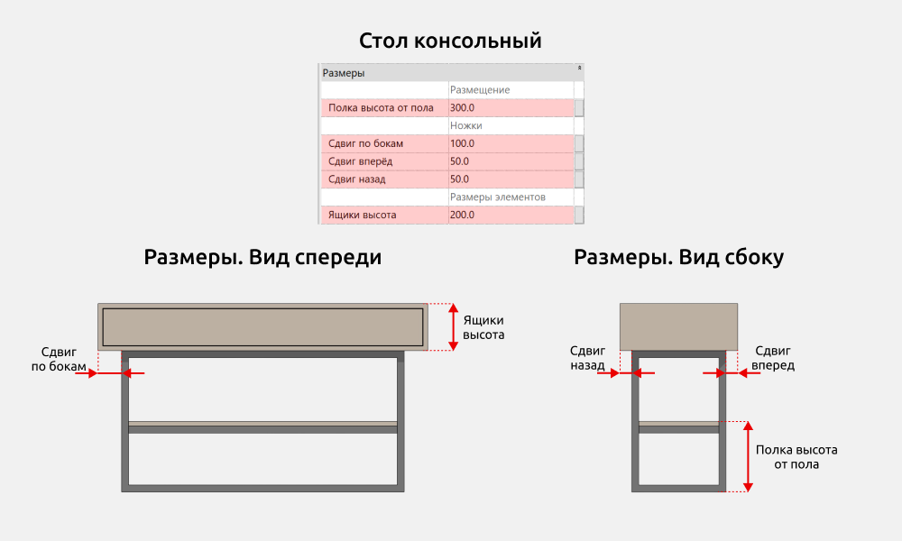

Помимо основных габаритов, доступно изменение отступа ножек от краев столешницы с помощью параметров “Сдвиг по бокам”, “Сдвиг назад” и “Сдвиг вперед”.

Также можно управлять высотой полки с помощью параметра “Полка высота от пола” и высотой ящика с помощью параметра “Ящик высота”.

У формы ножек “Ножки прямоугольник скошенный” ширина от 40 до 100мм

Ножки классика - фиксированные размеры (кроме высоты). Высота ножек от 300мм и выше.

### Стол круглый

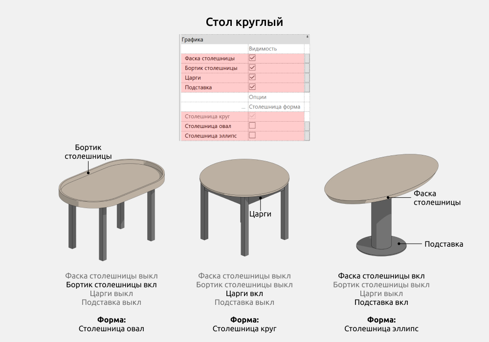

Здесь можно включить/выключить следующие элементы:

- Фаска столешницы
- Бортик столешницы
- Царги
- Подставка

Также доступен выбор формы столешницы:

- Столешница круг
- Столешница овал
- Столешница эллипс

Царги включаются у типа ножек: 4 ножки и 1 ножка.

#### Опции

Здесь можно выбрать количество ножек:\
- 4 ножки
- 3 ножки
- 2 ножки
- 1 ножка

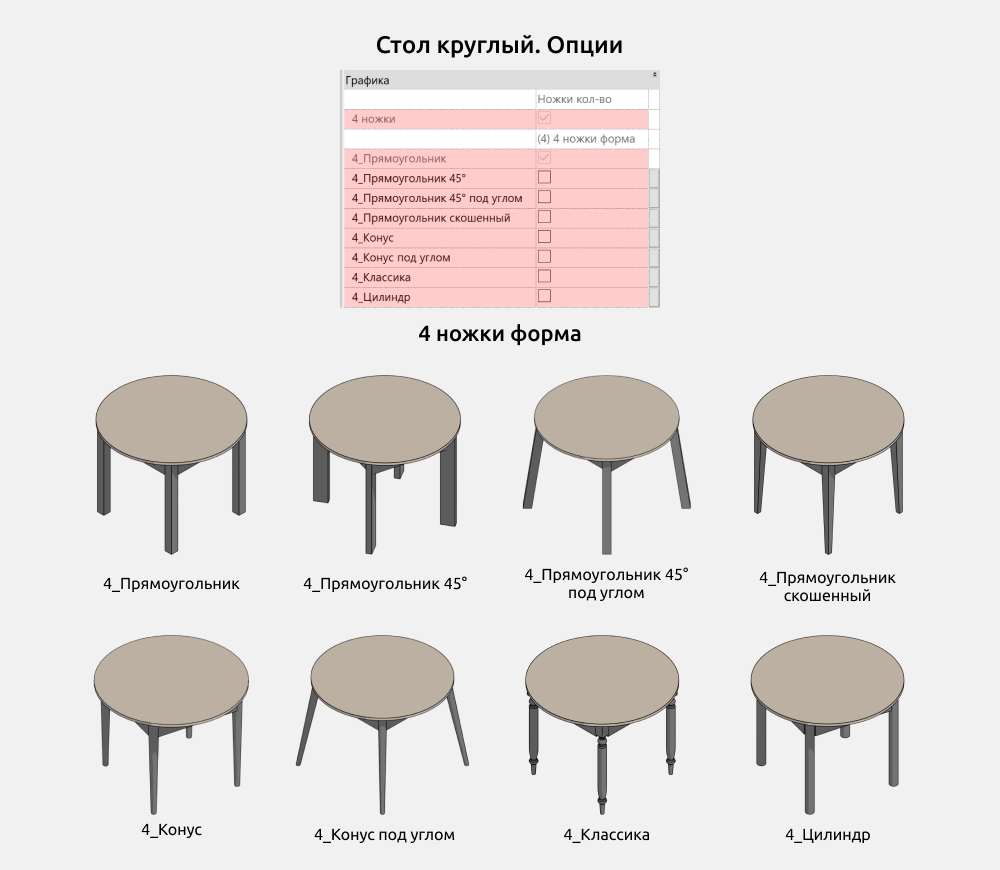

Для 4 ножек доступен выбор формы:

- 4_Прямоугольник
- 4_Прямоугольник 45°
- 4_Прямоугольник 45° под углом
- 4_Прямоугольник скошенный
- 4_Конус
- 4_Конус под углом
- 4_Классика
- 4_Цилиндр

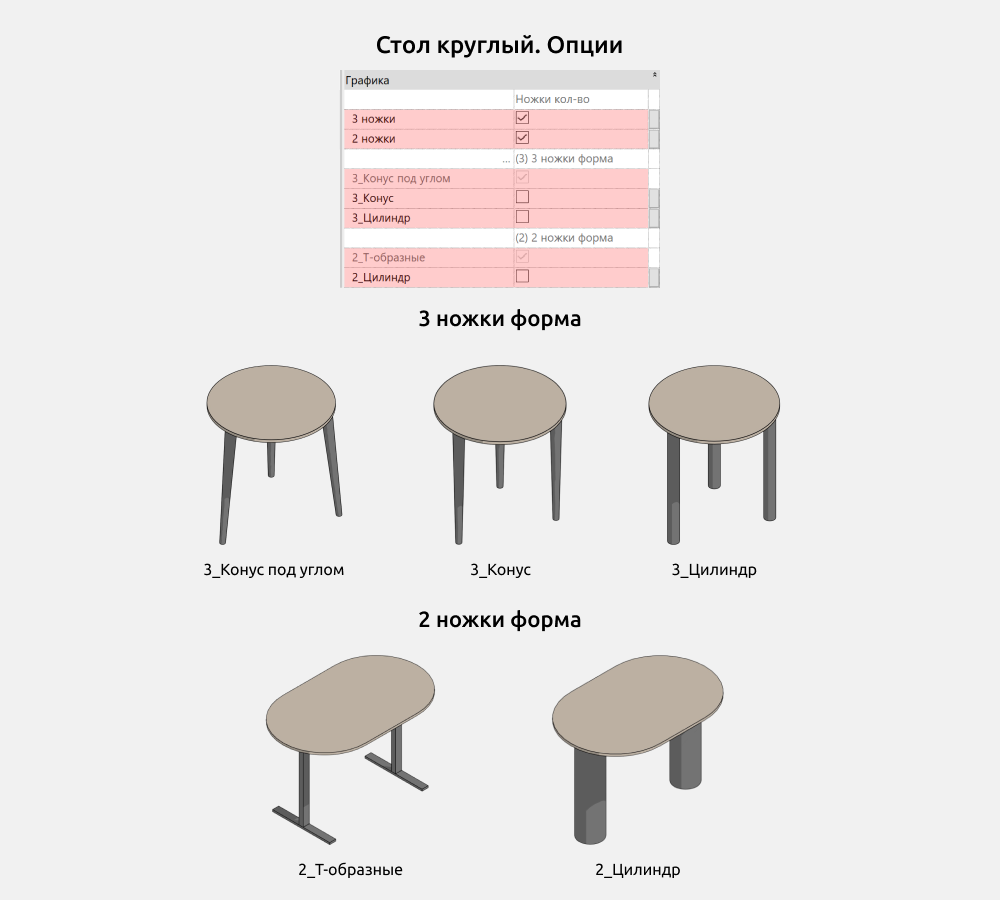

Для 3 ножек доступен выбор формы:

- 3_Конус под углом
- 3_Конус
- 3_Цилиндр

Для 2 ножек доступен выбор формы:

- 2_Т-образные
- 2_Цилиндр

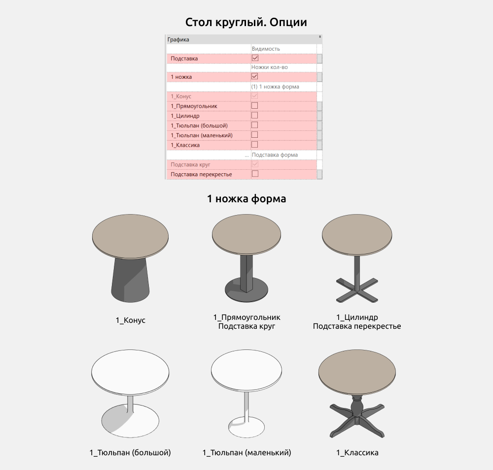

Для 1 ножки доступен выбор формы:

- 1_Конус
- 1_Прямоугольник
- 1_Цилиндр
- 1_Тюльпан (большой)
- 1_Тюльпан (маленький)
- 1_Классика

При включенном параметре “Подставка”, для ножки можно выбрать форму подставки:

- Подставка круг
- Подставка перекрестье

#### Размеры

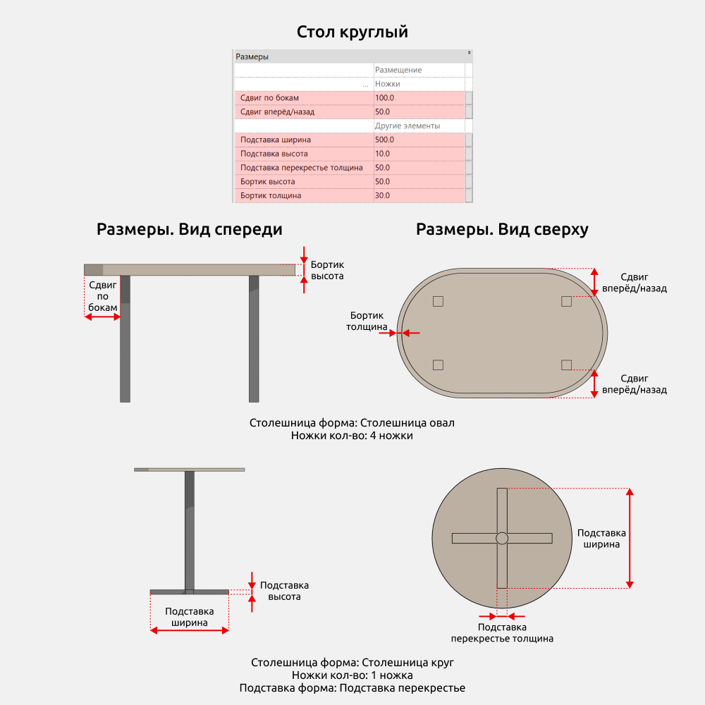

Для 2, 3 и 4 ножек можно управлять их отступом от края стола с помощью параметров “Сдвиг по бокам” и “Сдвиг вперёд/назад”.

При включенном параметре “Подставка” можно управлять ее шириной и высотой. Если выбрана подставка “Перекрестье”, можно изменять толщину с помощью параметра “Подставка перекрестье толщина”.

При включенном параметре “Бортик столешницы”, можно управлять его высотой и толщиной.

Размеры форм ножек:

У формы ножек “4_Прямоугольник скошенный” ширина от 40 до 100 мм.

“4_Классика” имеет фиксированные размеры (кроме высоты). Высота ножек от 400 мм и выше.

Формы ножек “1_Классика”, “1_Тюльпан (большой)” и “1_Тюльпан (маленький)” тоже имеют фиксированные размеры.

Высота у “1_Классика” от 600 мм.

Когда выбрана форма столешницы **круг**, управление диаметром столешницы происходит только через “Столешница ширина”.

### Стол письменный

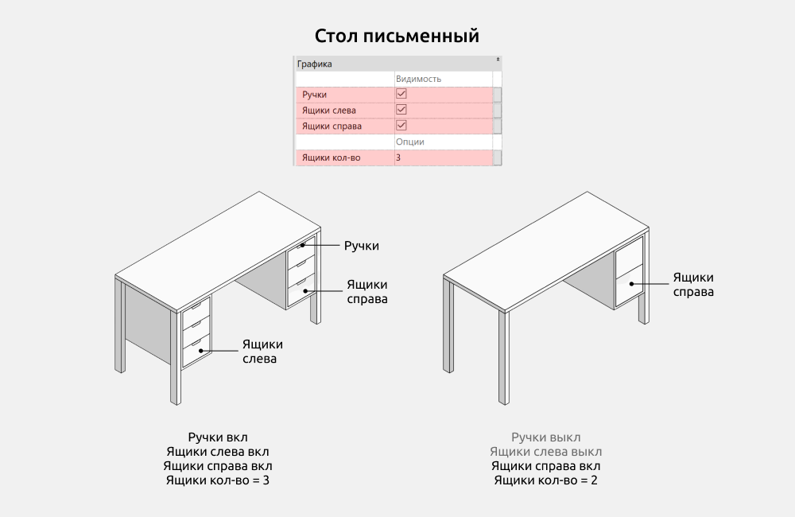

Здесь можно включить/выключить следующие элементы:

- Ручки
- Ящики слева
- Ящики справа

Количество ящиков от 1 и более.

#### Опции

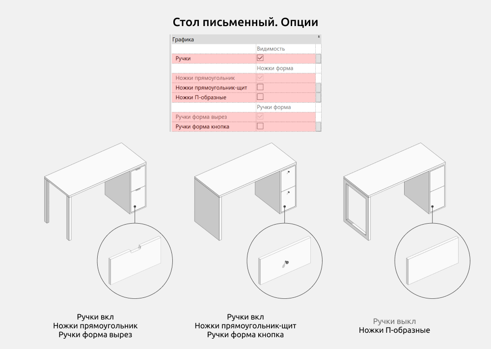

Здесь можно выбрать форму ножек:

- Ножки прямоугольник
- Ножки прямоугольник-щит
- Ножки П-образные

При включенном параметре “Ручки”, можно выбрать форму ручек:

- Ручки форма вырез
- Ручки форма кнопка

Параметр “Ручки” можно не включать, тогда у стола будут отображаться плоские фасады.

#### Размеры

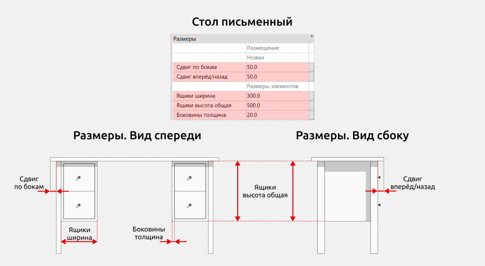

Можно управлять отступом ножек от края стола с помощью параметров “Сдвиг по бокам” и “Сдвиг вперёд/назад”.

Также при включенном параметре “Ящики справа” или “Ящики слева” можно управлять их габаритами и толщиной стенки с помощью параметров: “Ящики ширина”, “Ящики высота общая” и “Боковины толщина”.

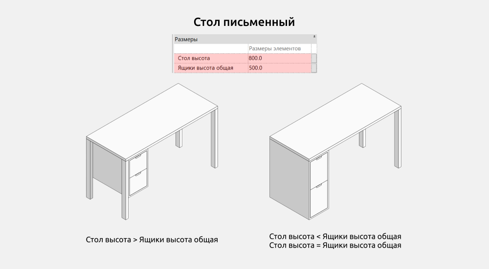

Если “Ящики высота общая” меньше “Стол высота”, то ящики сдвигаются от края на ширину ножек и появляются ножки.

А если больше или равно “Стол высота” - ножки исчезают и на их место встают ящики.

Значение параметра “Ящики высота общая” можно вводить любое, ящики всё равно зафиксируются у уровня пола.

### Стол прямоугольный

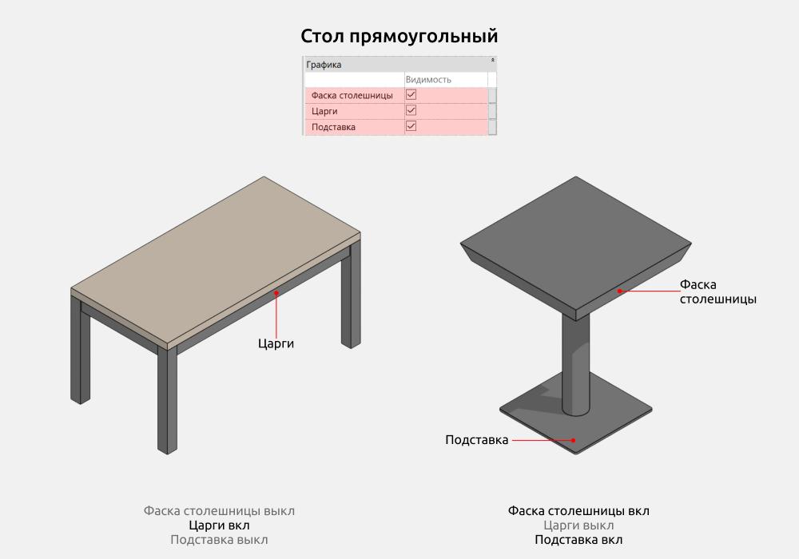

Здесь можно включить/выключить следующие элементы:

- Фаска столешницы
- Царги
- Подставка

Царги включаются только у одного типа ножек: 4 ножки

#### Опции

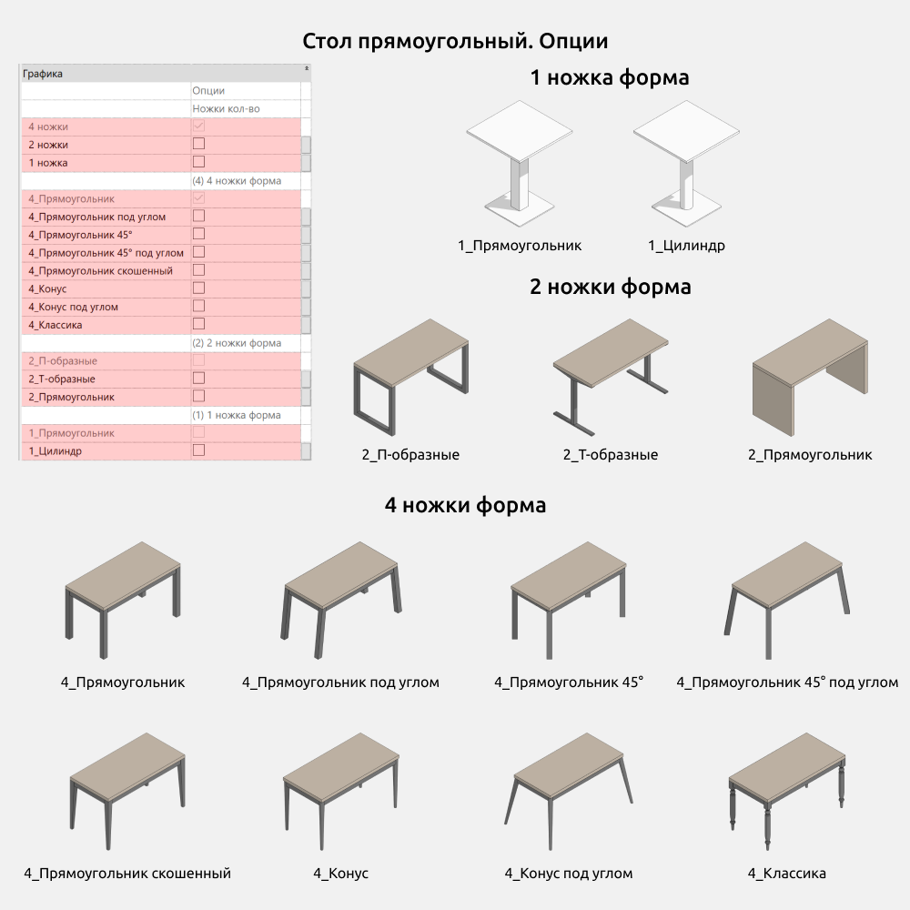

Здесь можно выбрать количество ножек:\
- 4 ножки
- 2 ножки
- 1 ножка

Для 4 ножек доступен выбор формы:

- 4_Прямоугольник
- 4_Прямоугольник под углом
- 4_Прямоугольник 45°
- 4_Прямоугольник 45° под углом
- 4_Прямоугольник скошенный
- 4_Конус
- 4_Конус под углом
- 4_Классика

Для 2 ножек доступен выбор формы:

- 2_П-образные
- 2_Т-образные
- 2_Прямоугольник

Для 1 ножки доступен выбор формы:

- 1_Прямоугольник
- 1_Цилиндр

#### Размеры

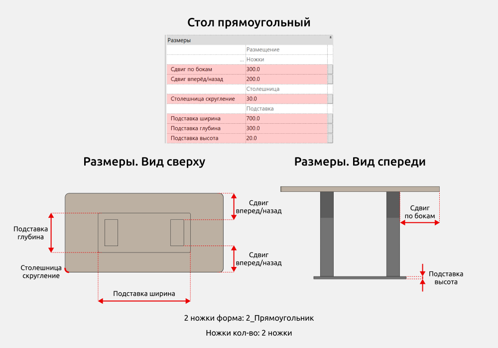

Для 2 и 4 ножек можно управлять их отступом от края стола с помощью параметров ”Сдвиг по бокам” и ”Сдвиг вперёд/назад”.

С помощью параметра ”Столешница скругление” задается скругление углов столешницы.

Также при включенной подставке доступно изменение ее габаритов: ”Подставка ширина”, ”Подставка глубина” и ”Подставка высота”.\
У формы ножек ”4_Прямоугольник скошенный” параметр ”Ножки ширина” от 40 до 100мм

У формы ножек ”4_Классика” - фиксированные размеры (кроме высоты). Высота ножек от 400мм и выше.

### Тумбочка для письменного стола

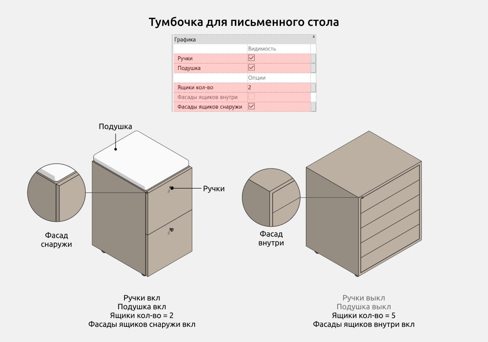

Здесь можно включить/выключить следующие элементы:

- Ручки
- Подушка

Выбрать неограниченное количество ящиков.

Также доступен выбор расположения фасадов:\
- Фасады ящиков внутри
- Фасады ящиков снаружи

#### Опции

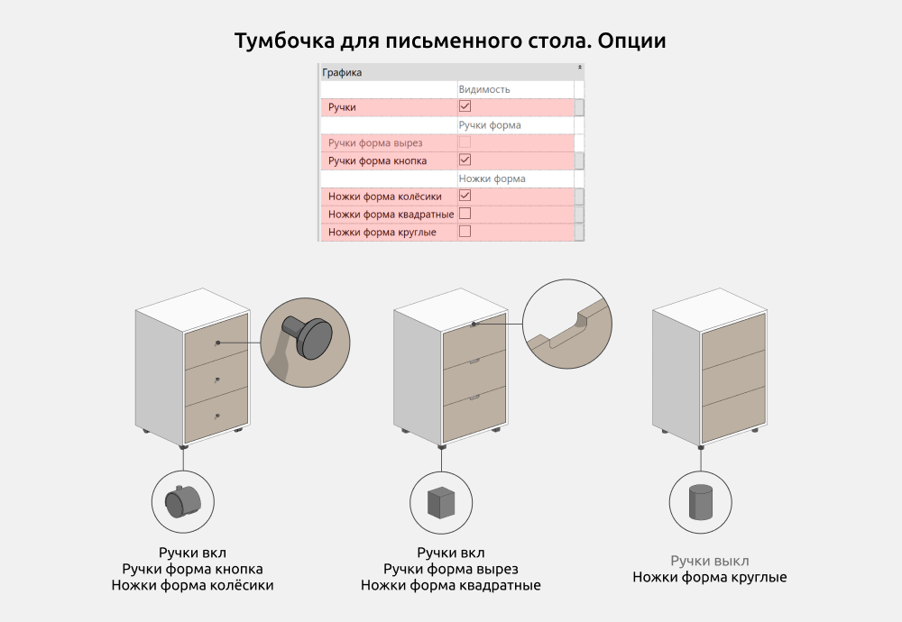

При включенном параметре “”Ручки”, доступен выбор ее формы:

- Ручки форма вырез
- Ручки форма кнопка

Можно выбрать форму ножек:

- Ножки форма колёсики
- Ножки форма квадратные
- Ножки форма круглые

#### Размеры

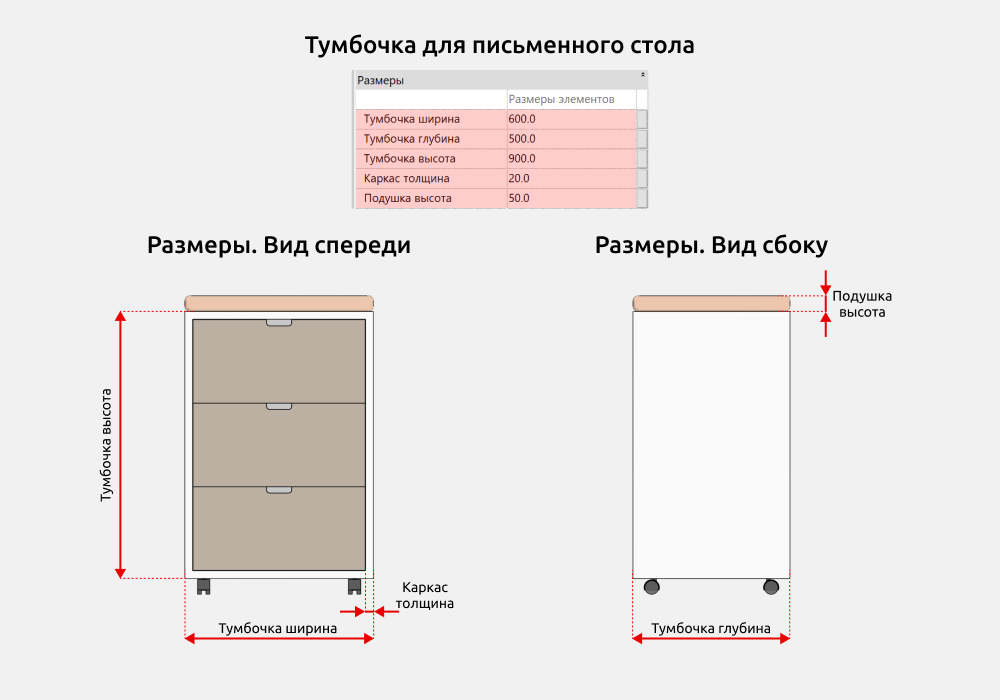

Габаритами тумбочки можно управлять с помощью параметров “Тумбочка ширина”, “Тумбочка глубина” и “Тумбочка высота”.

Параметр “Тумбочка высота” состоит из высоты корпуса тумбочки и фиксированной высоты ножек.

Также можно управлять толщиной каркаса с помощью параметра “Каркас толщина”.

При включенном параметре “Подушка” доступно управление ее высотой с помощью параметра “Подушка высота”.

### Дизайнерские столы

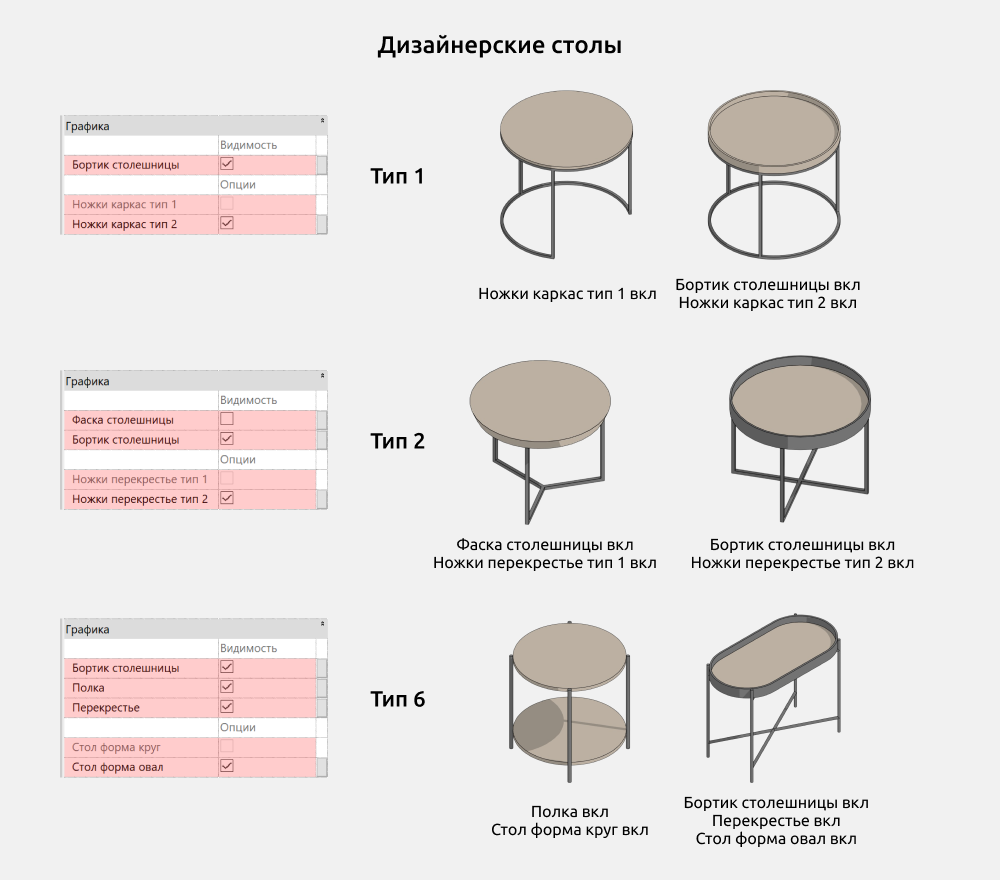

Для дизайнерского стола 1 включаются\выключаются следующие элементы:

- Бортик столешницы

Форма ножек:

- Ножки каркас тип 1
- Ножки каркас тип 2

Для дизайнерского стола 2 включаются\выключаются следующие элементы:

- Фаска столешницы
- Бортик столешницы

Форма ножек:

- Ножки перекрестье тип 1
- Ножки перекрестье тип 2

Для дизайнерского стола 6 включаются\выключаются следующие элементы:

- Бортик столешницы
- Полка
- Перекрестье

Форма столешницы:

- Стол форма круг
- Стол форма овал

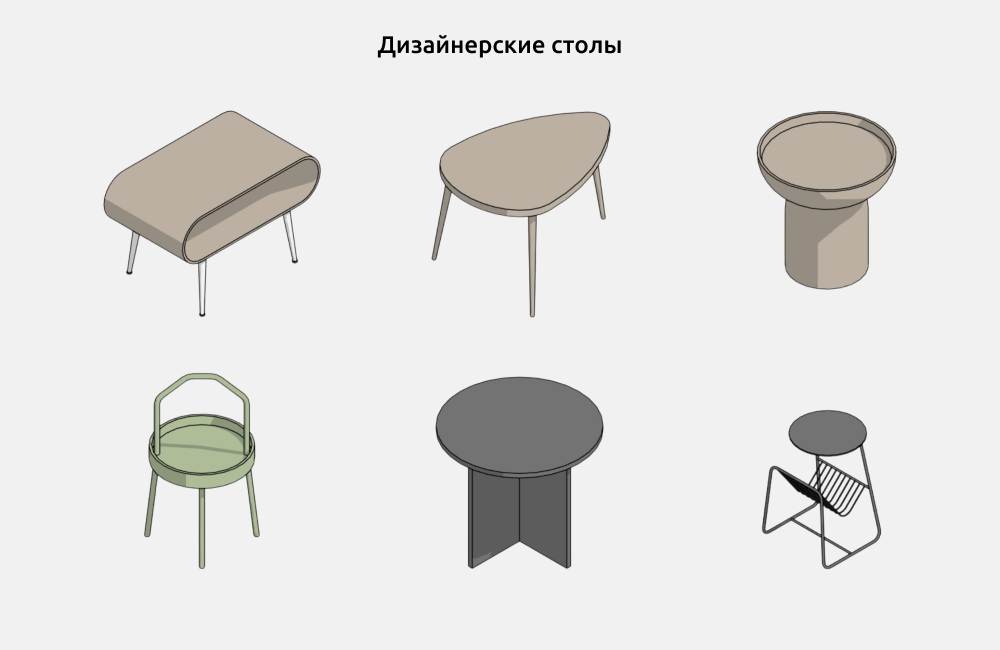

У остальных дизайнерских столов можно управлять размерами элементов, кроме типа 9.

## 4. ОФОРМЛЕНИЕ

### Настройки графики

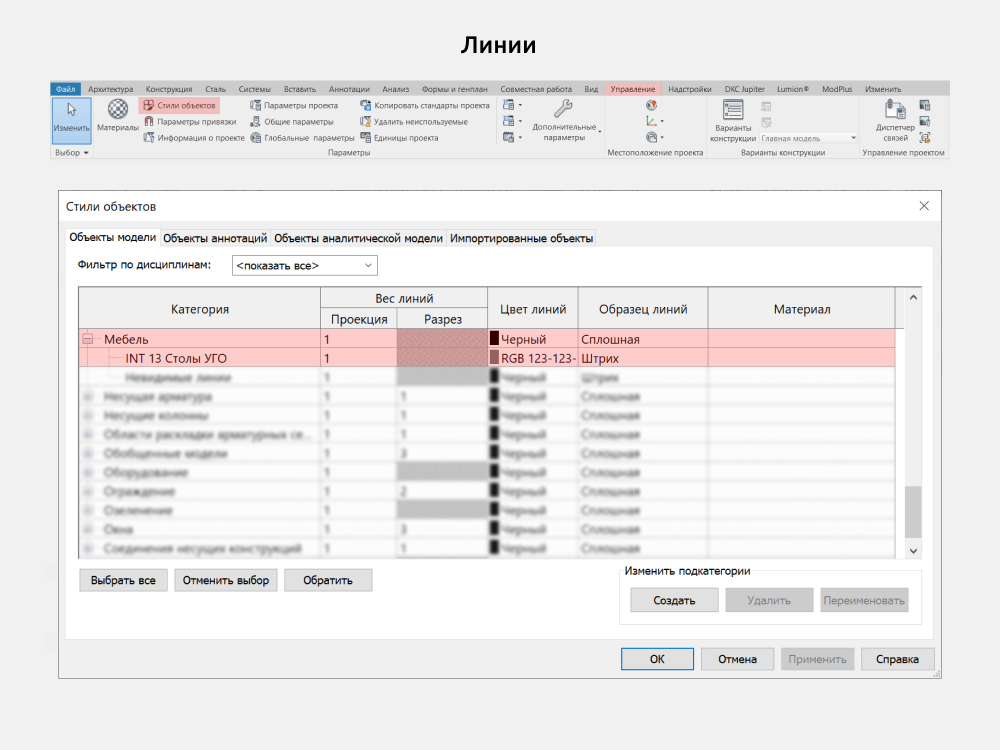

Чтобы поменять цвет/вес/тип линий УГО семейств с раздвижной столешницей, нужно перейти в Управление - Стили объектов - Категория Мебель.

<CTA type="guide" />
