import productPreview from '@site/docs/guides/families/windows-for-revit/product.jpg';

<ProductCard
  name="Окна для Revit"
  eyebrow="Набор семейств Revit"
  description="Распашные, раздвижные, угловые и другие окна разных форм — готовы к размещению в Revit."
  image={productPreview}
  imageAlt="Окна для Revit — превью набора"
  buyUrl="https://bimcore.one/products/windows"
  ecwidProductId="794237685"
  buyLabel="Купить"
  shopLabel="В магазин"
/>

<YouTube id="lAeMqg73Wg8" title="Окна для Revit" />

## 1. ОБЩИЕ ДАННЫЕ

-   Название набора: Окна
-   Версия набора 1.0.1
-   Версия Revit: 2019

### Описание

Этот набор семейств для Revit предназначен для моделирования окон различных форм, балконных блоков, мансардных, раздвижных, угловых и эркерных окон с фрамугами сверху или снизу в Autodesk Revit.

Подходит дизайнерам интерьера. Геометрия рамы, створок, стекла и других деталей сделана упрощенно инструментами программы Revit.

### Загрузка и размещение

Для того чтобы посмотреть и загрузить нужные семейства из набора, можно открыть **Проект с окнами** и скопировать семейства при помощи комбинации клавиш Ctrl+C, а затем вставить в свой проект Ctrl+V. Но семейство не разместится в проекте, а лишь появится в диспетчере в списке семейств.

Также можно открыть папку с файлами семейств и перетащить мышкой в проект.

ВАЖНО! Размещать окна нужно только на плане сверху, не в 3д (иначе может выскакивать ошибка и Revit не даст разместить окно).

## 2. СОСТАВ НАБОРА

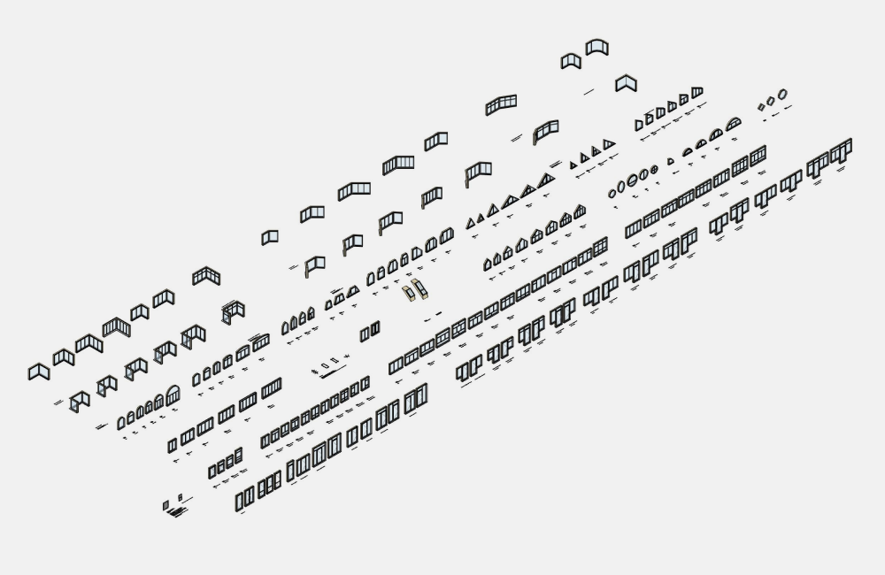

В состав набора входят следующие группы с семействами категории Окна:

-   Оконные проёмы
-   Окна (прямоугольные, арочные, трапециевидные, треугольные, круглые, многоугольные)
-   Балконные блоки
-   Угловые окна и эркеры
-   Раздвижные окна
-   Мансардные окна
-   Шпросы
-   Створки
-   Марка окна

Также в состав набора входят семейства категории Панели витража, которые подойдут для вставки в Витражное окно:

-   Витраж Дверь
-   Витраж Створка

Общее количество семейств - около 170 шт.

## 3. ОБЩИЕ ЭЛЕМЕНТЫ

Общие элементы - элементы, которые часто повторяются в семействах.

### Размеры

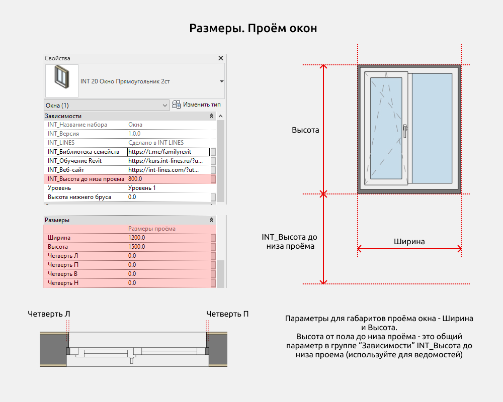

В семействах окон можно менять Ширину, Высоту и Четверти проёма. Расстояние до подоконника меняется параметром INT_Высота до низа проёма, который попадает в таблицу ведомостей и марку.

Ширина и Высота - это размеры проёма.

Примерная ширина и Примерная высота - это размеры окна (Ширина-МЗ_Л-МЗ_П, Высота-МЗ_В-МЗ_Н).

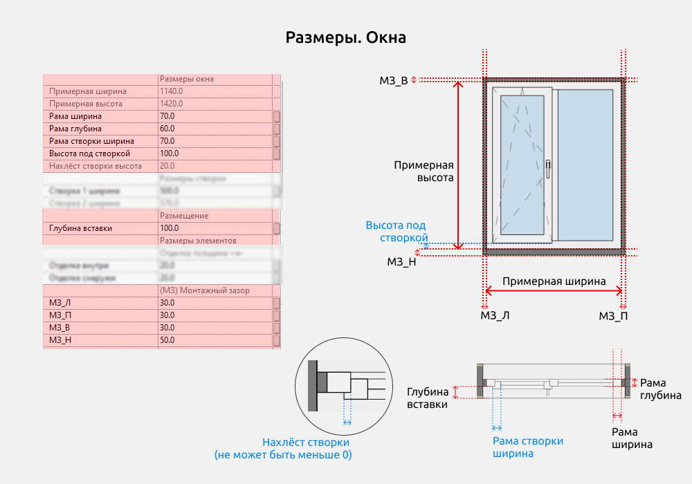

Глубина вставки - глубина смещения рамы окна внутрь проёма.

Монтажные зазоры (МЗ) можно уменьшить до 0. Нахлёст створки не может быть меньше 0.

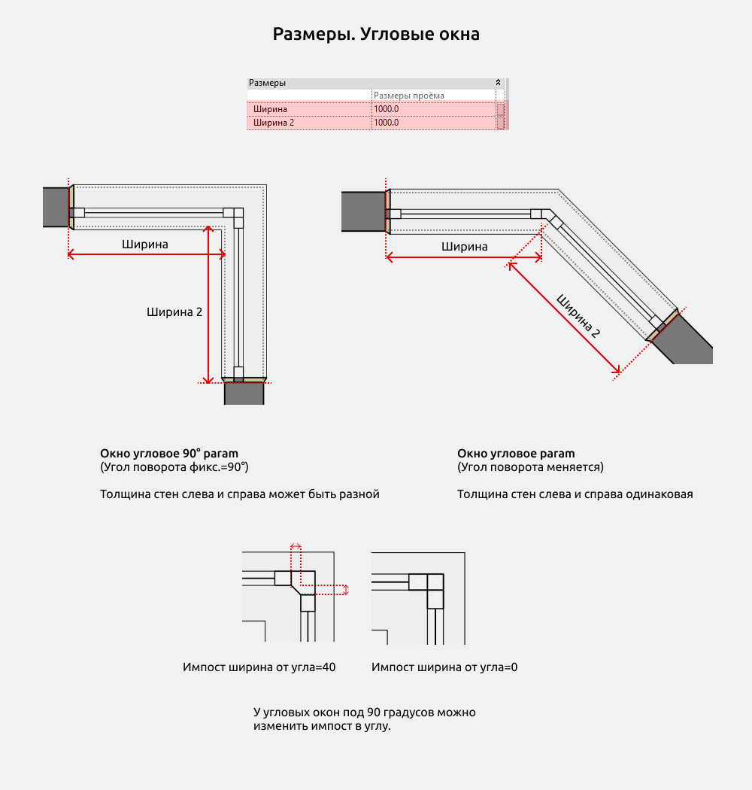

Ширина проёма у угловых окон считается от основной стены (по серой пунктирной линии), не по откосам.

Угловые окна под 90 градусов: угол поворота фиксированный, Толщина стен может быть разной.

Угловые окна: угол поворота меняется, Толщина стен одинаковая.

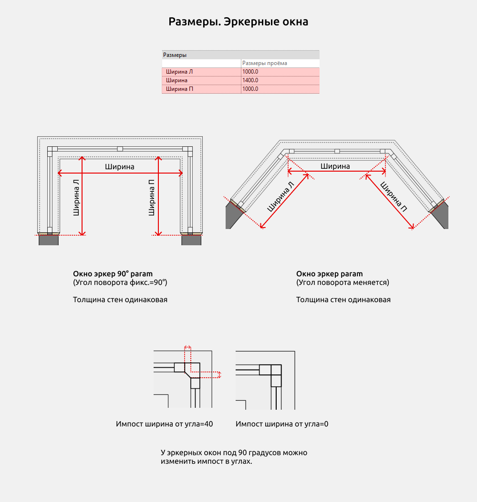

Ширина проёма у эркерных окон считается от основной стены (по серой пунктирной линии), не по откосам.

Эркерные окна под 90 градусов: угол поворота фиксированный, Толщина стен одинаковая.

Эркерные окна: угол поворота меняется, Толщина стен одинаковая.

### Отделка

Если в проекте отделка сделана дополнительными тонкими стенами, которые присоединяются к основной стене, необходимо чтобы окно сдвигалось на эту толщину отделки и попадало в размеры.

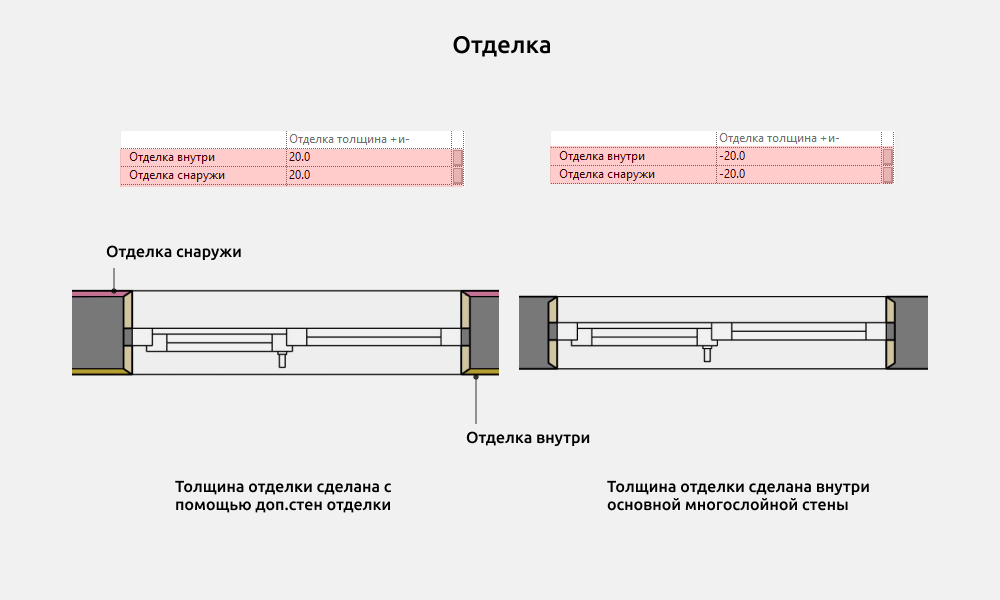

Отделка может быть как снаружи, так и внутри.

Если отделка сделана дополнительными стенами, то нужно ставить положительное значение толщины отделки в окнах, а если стена многослойная - отрицательное значение толщины.

### Откосы

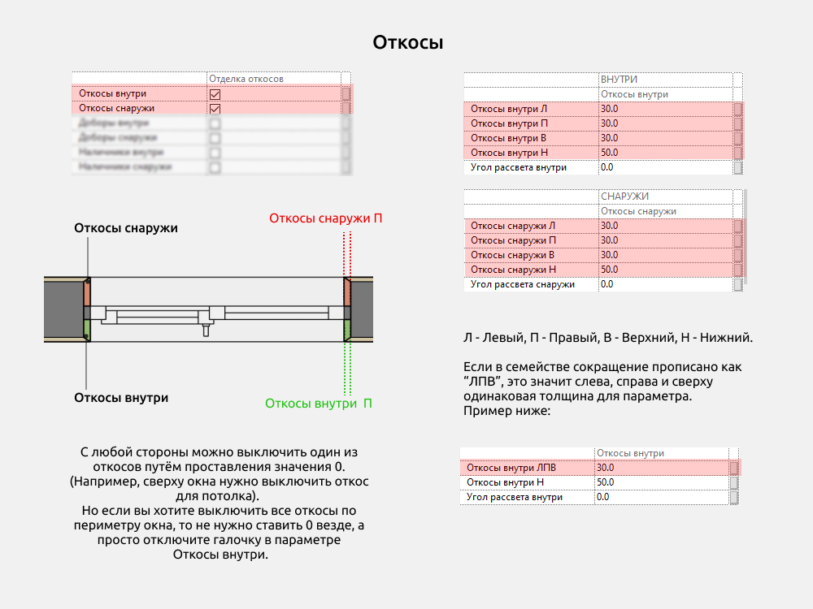

Откосы выполнены во всех семействах окон общими вложенными семействами*.* Они находятся в группе Стены. Их можно включить либо выключить нажав на параметры Откосы снаружи и Откосы внутри.

Используемые сокращения: Л - левый, П - правый, В - верхний, Н- нижний.
Если в семействе сокращение прописано как “ЛПВ”, это значит слева, справа и сверху одинаковая толщина для параметра.

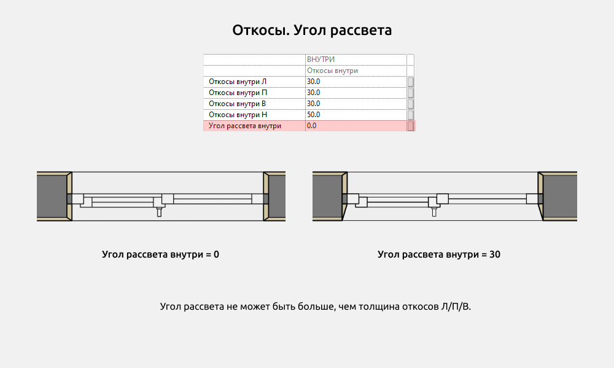

Угол рассвета не может быть больше, чем толщина откосов слева, справа и сверху.

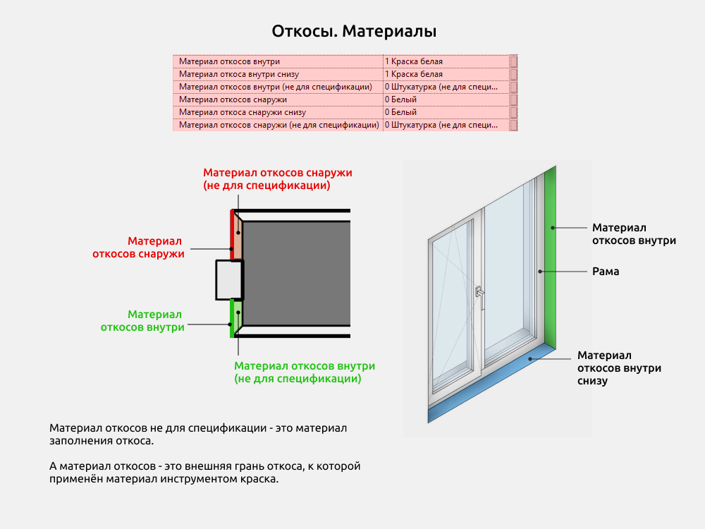

Чтобы площадь откосов считалась по одной грани, а не по всему объёму (что будет давать некорректные данные в ведомость), сделана разбивка по материалам.

*Материал откосов не для спецификации* - это материал заполнения откоса. Он не нужен для спецификации.

А *материал откосов* - это внешняя грань откоса, к которой применён материал инструментом краска. Материал можно использовать для подсчёта площади.

### Подоконники (ПД)

Подоконники сделаны общим вложенным семейством с двумя типоразмерами:

-   Подоконник внутри
-   Подоконник снаружи

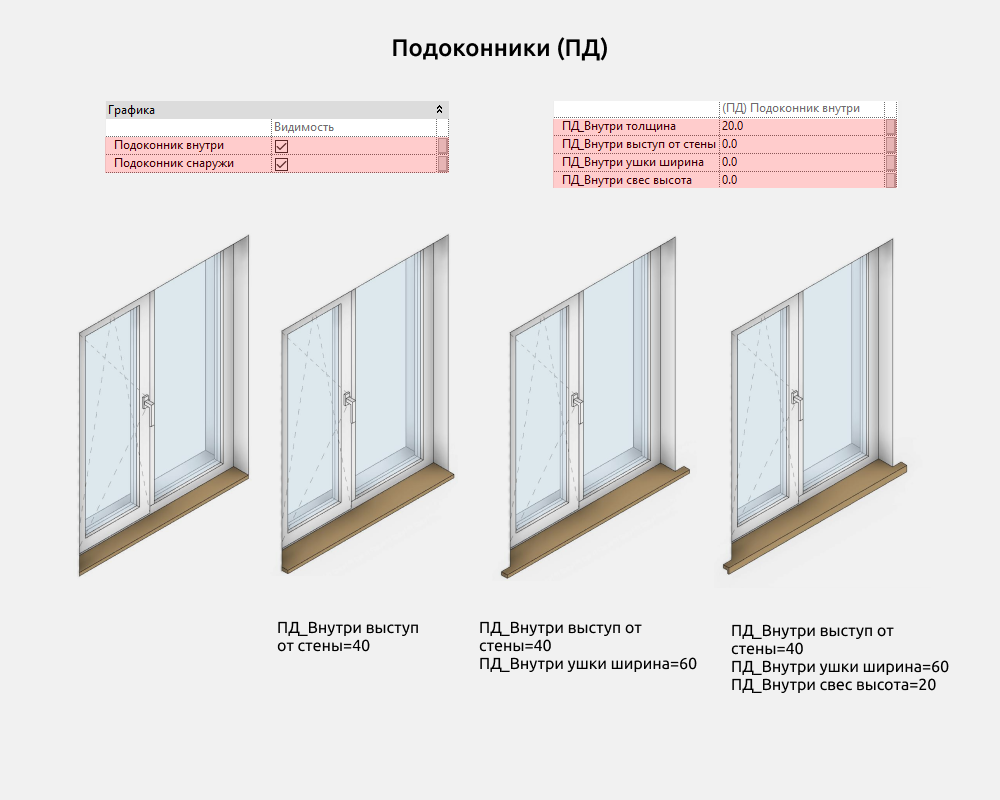

По умолчанию в параметрах для подоконников Выступ от стены, Ушки ширина и Свес высота равны 0.

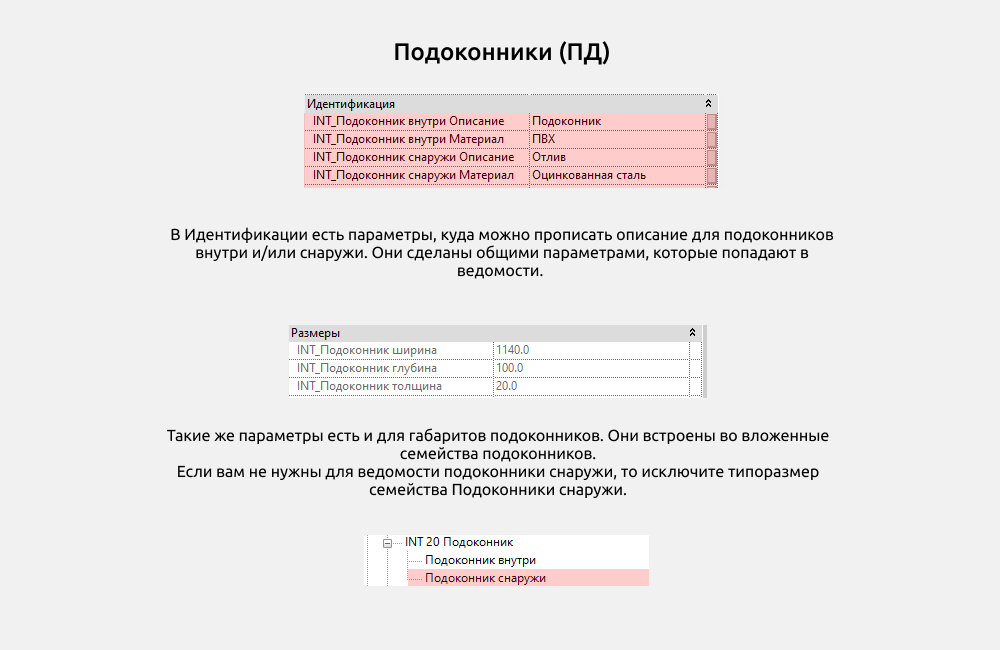

В Идентификации есть параметры, куда можно прописать описание для подоконников внутри и/или снаружи. Они сделаны общими параметрами, которые попадают в ведомости.

Такие же параметры есть и для габаритов подоконников. Они встроены во вложенные семейства подоконников.
Если вам не нужны для ведомости подоконники снаружи, то исключите типоразмер семейства Подоконники снаружи.

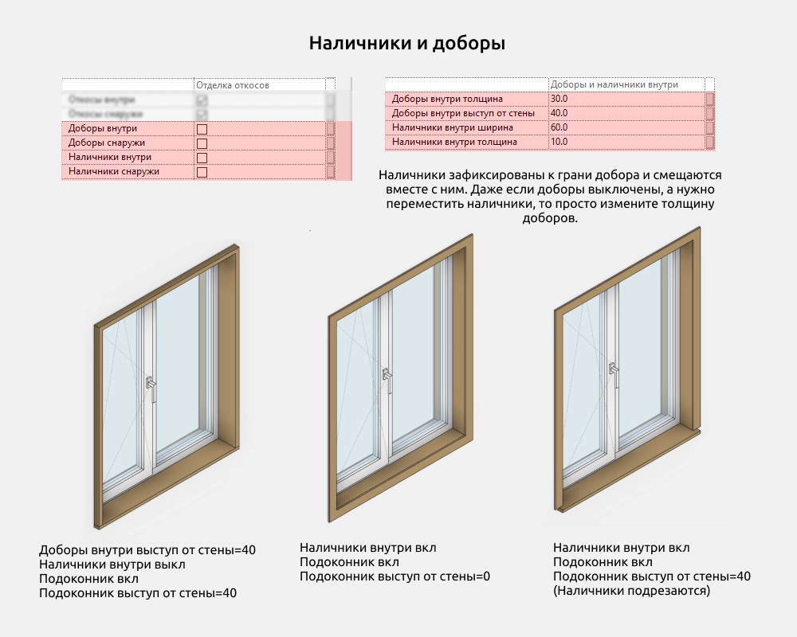

Наличники зафиксированы к грани добора и смещаются вместе с ним. Даже если доборы выключены, а нужно переместить наличники, то просто измените толщину доборов.

### Материалы окна внутри и снаружи

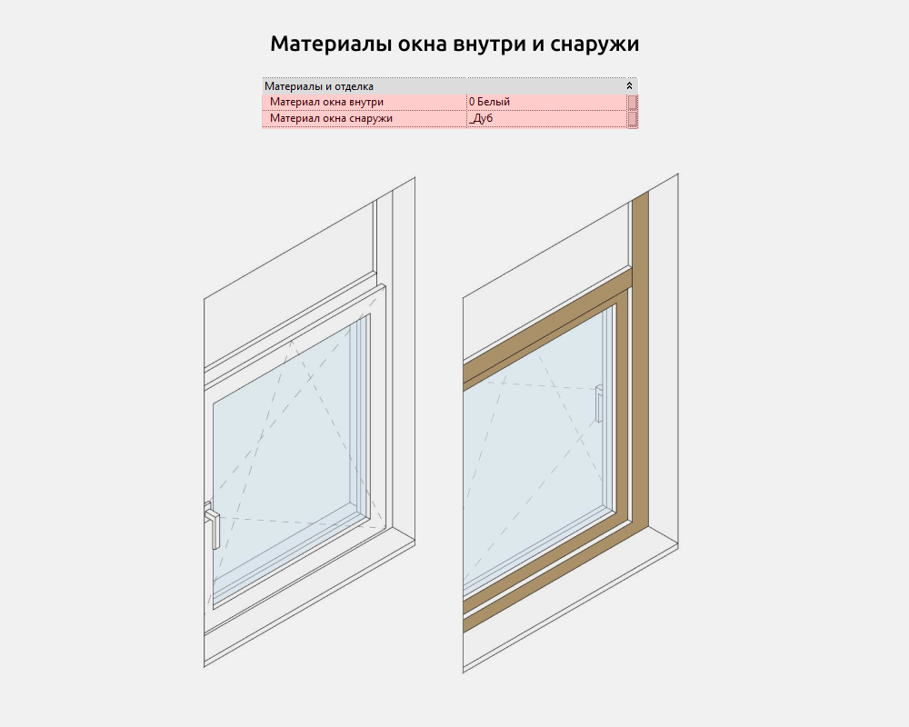

### Створки

Семейства створок подгружаются в проект дополнительно, а по умолчанию в семействах есть только семейство Стекла.

Если достаточно показать только раскладку окна, то створку можно и не загружать.

После загрузки в проект нужно заменить в выпадающем списке тип открывания вместо Стекла.

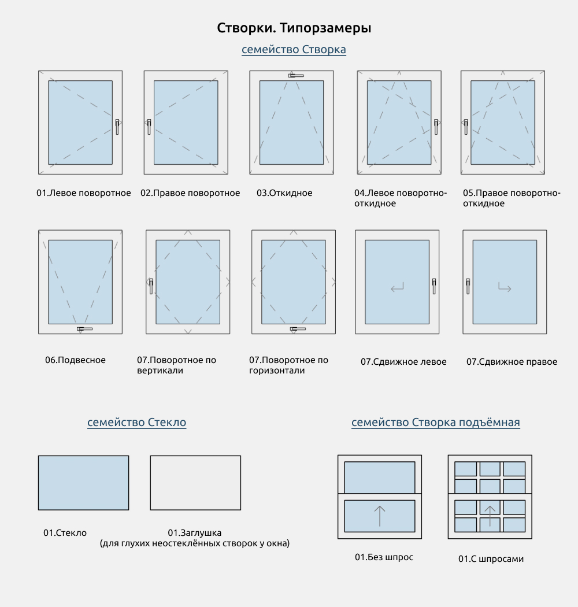

Семейство Стекло содержит в себе два типоразмера:

-   01.Стекло
-   02.Заглушка (используется для глухих неостеклённых створок у окна)

Семейство Створка содержит в себе следующие типоразмеры:

-   01.Левое поворотное
-   02.Правое поворотное
-   03.Откидное
-   04.Левое поворотно-откидное
-   05.Правое поворотно-откидное
-   06.Подвесное
-   Поворотное по вертикали
-   Поворотное по горизонтали
-   Сдвижное левое (в типе можно двигать стрелку на плане сверху)
-   Сдвижное правое (в типе можно двигать стрелку на плане сверху)

Семейство Створка подъёмная содержит в себе два типоразмера:

-   01.Без шпрос
-   02.С шпросами (шпросы сделаны одного вида, если нужна другая раскладка, то используйте семейства шпрос из папки 06.Шпросы)

### Открывание

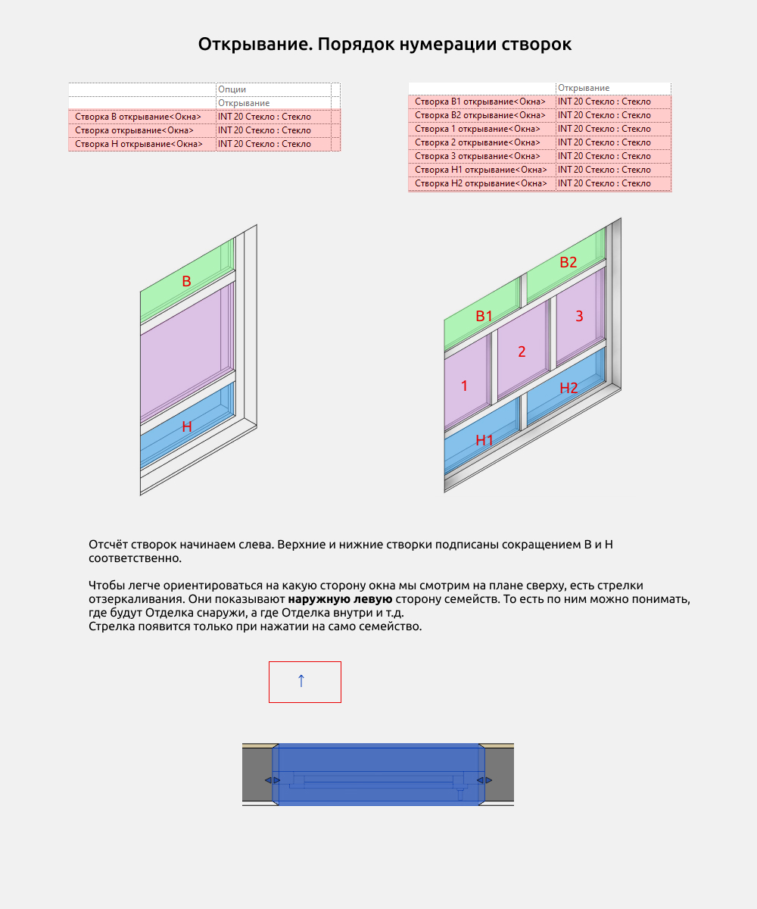

Отсчёт створок начинаем слева. Верхние и нижние створки подписаны сокращением В и Н соответственно.
Левые и Правые - Л и П.

Чтобы легче ориентироваться на какую сторону окна мы смотрим на плане сверху, есть стрелки отзеркаливания. Они показывают **наружную левую** сторону семейств. То есть по ним можно понимать, где будут Отделка снаружи, а где Отделка внутри и т.д. 
Стрелка появится только при нажатии на само семейство.

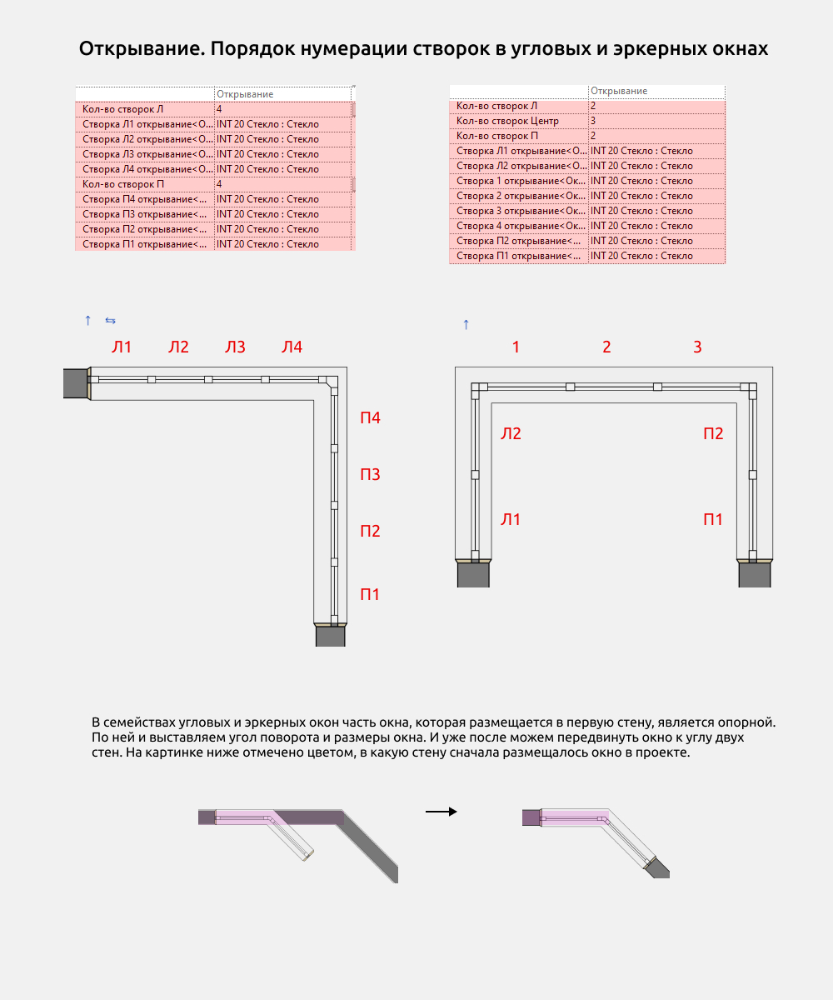

### Уровни детализации

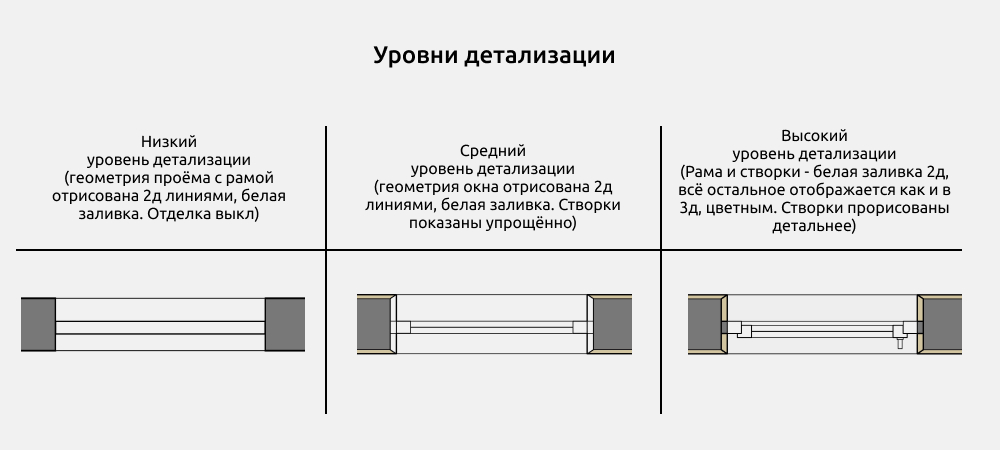

Низкий уровень детализации: проём с линиями рамы. Доп стены отделки желательно выключить, т.к. проём отрисован по основной стене.

Средний уровень детализации: геометрия окна отрисована 2д линиями, белая заливка. Створки показаны упрощённо. Окна нестандартной формы часто отображаются с подрезкой на плане сверху, и для этого удобнее использовать средний уровень детализации.

Высокий уровень детализации: Рама и створки - белая заливка 2д, всё остальное отображается как и в 3д, цветным. Створки прорисованы детальнее.

### Марка окна

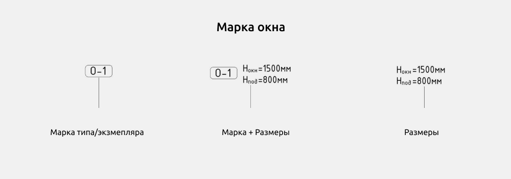

Семейство Марка окна содержит в себе следующие типоразмеры:

-   Марка типа
-   Марка типа+Размеры
-   Марка экземпляра
-   Марка экземпляра+Размеры
-   Размеры

## 4. ОФОРМЛЕНИЕ

### Настройки графики

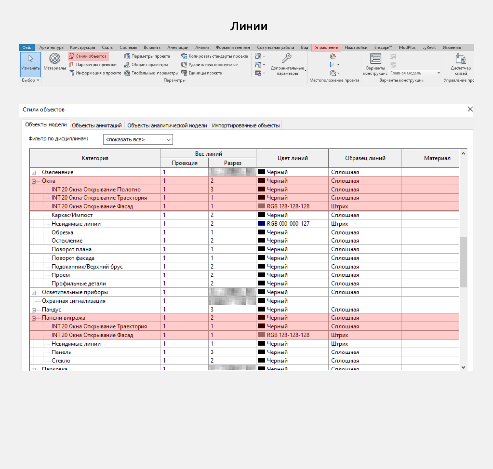

Чтобы поменять цвет/вес/тип линий семейств, нужно перейти в Управление - Стили объектов - Окна или Панели витража.

Также можно отключить линии открывания в Переопределении видимости/графики.

<CTA type="guide" />
