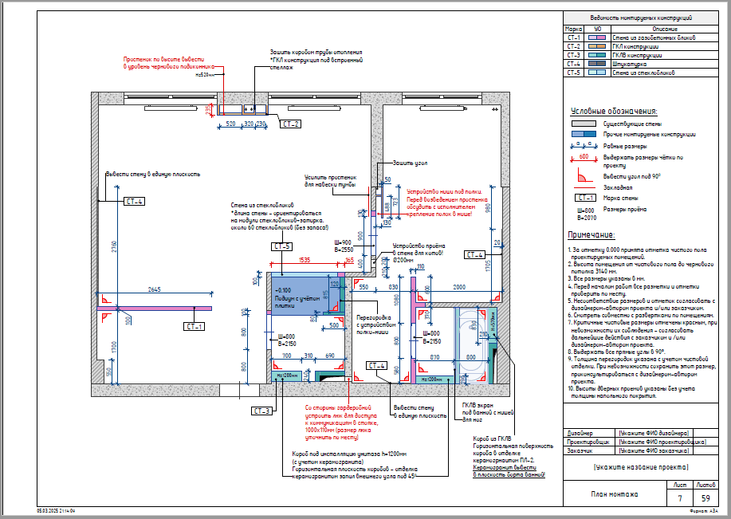
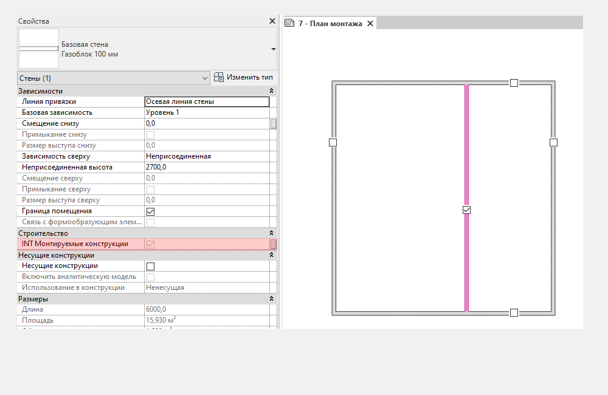

## Назначение

План монтажа в дизайн-проекте нужен для точного возведения новых перегородок, ниш, проёмов и других конструкций. Он даёт строителям четкую инструкцию, помогает рассчитать объем материалов, а также исключает ошибки при перепланировке пространства.

## Что уже настроено

На листе кроме плана также добавлены Ведомость монтируемых конструкций, легенда Условных обозначений и Примечание.

## Что нужно настроить

### Цвет монтируемых стен

Перед тем как создавать Монтируемые стены, необходимо выбрать все **Существующие стены** на виде и для них снять галочку с параметра INT Монтируемые конструкции (находится в параметрах экземпляра, **Свойства - Строительство - INT Монтируемые конструкции**). Нажмите два раза, т.к. первое нажатие лишь активирует работу с параметром, а вот уже второе – выключит полностью галочку.

И далее у всех Новых стен по умолчанию будет работать галочка в параметре INT Монтируемые конструкции. Штриховка стен поменяется на преднастроенные цвета из фильтра.

<CTA type="template" />
