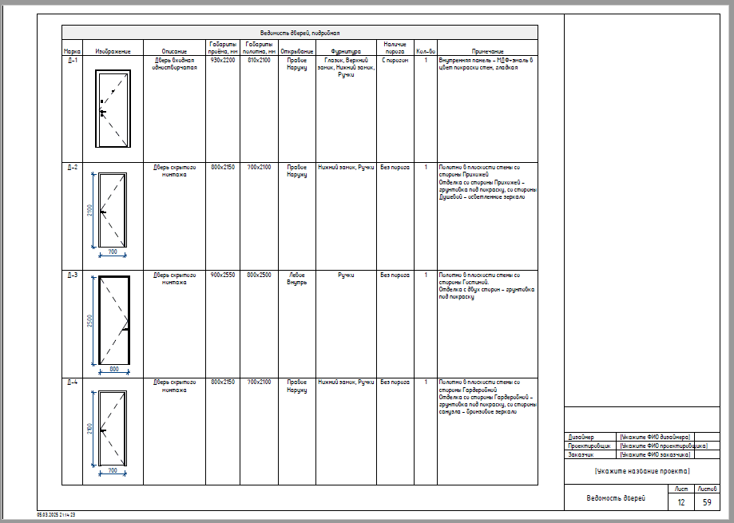
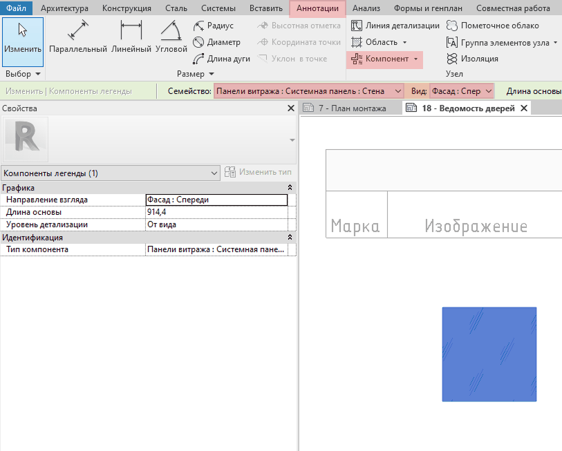
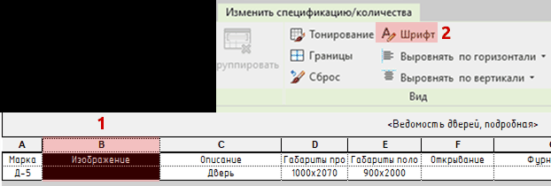
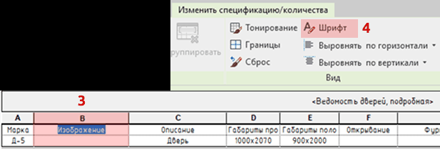

## Назначение

Лист Ведомость дверей нужен для понимания общего количества и в дальнейшем закупки всех дверных полотен в квартире или доме. Это итоговая таблица-ведомость, где дизайнер собирает точные технические характеристики для каждой двери, чтобы строители правильно подготовили проемы, а поставщик изготовил нужные полотна.

## Что уже настроено

Сейчас в столбце **Изображение** дверей в ведомости для примера проставлен Витраж-Фасад спереди (чтобы его просто было видно на листе), вы измените на нужный тип двери в выпадающем списке.

## Что нужно настроить

### Компонент легенды в столбце Изображение

Для каждого отдельного типа дверей выбирайте свой **Компонент легенды** (Аннотации - Компонент - Компонент легенды - Тип компонента).

### Высота строк в таблице

Чтобы изменить высоту строк в таблице, существует отдельный параметр INT Пустая строка (переименован на **Изображение**).

1. Сначала уберите **Шаблон вида: Ведомости**, чтобы разблокировать параметр Шрифт.

   

2. Затем выберите столбец Изображение (1) и измените размер шрифта (2). Сейчас это 31 мм для столбца. Если нужно увеличить высоту строк делайте значение больше 31мм.

   

3. А затем выберите название заголовка (3) и проставьте 2.5мм (4). Чтобы вернуть высоту заголовков к стандартным.

<CTA type="template" />
