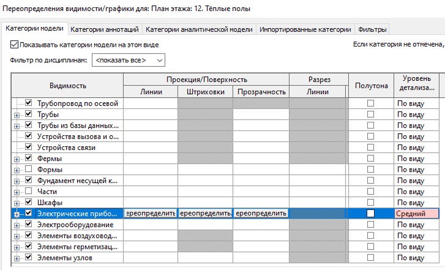

## Шаблоны на 2 и 3 этажа. Как настроены ведомости?

В шаблоны добавлен общий параметр **INT_Уровень** (по экземпляру), для фильтрации по Уровням ведомостей на 2 и 3 этажа. Например, если семейство по грани. Оно НЕ БУДЕТ считаться по стандартному уровню Revit. А значит не попадёт в ведомость. Используем только INT_Уровень.

Все ведомости в шаблонах на 2 и 3 этажа отфильтрованы по этому параметру INT_Уровень:

- **Ведомости 1 этаж:** не равно уровню Библиотека
- **Ведомости 1и2 этажа:** INT_Уровень=1, INT_Уровень=2
- **Ведомости 1и2и3 этажа:** INT_Уровень=1, INT_Уровень=2, INT_Уровень=3

Для проверки используем два проверочных 3д-вида:

- **"ПРОВ. INT_Уровень (пустой параметр=красный)".** Здесь вы можете проверить в каких элементах не заполнена цифра INT_Уровня, 1 2 или 3.
- **"ПРОВ. INT_Уровень по цветам (1=зелёный,2=фиолет,3=жёлт)".** Здесь разные уровни окрашиваются в разные цвета.

## Как настроить уровень детализации отдельно для одной категории, независимо от вида?

Если для всего вида настроен высокий уровень детализации, а вам нужно сделать, например, средний уровень детализации для розеток, то это можно сделать в **Переопределении видимости/графики** для любой категории.

<CTA type="template" />
