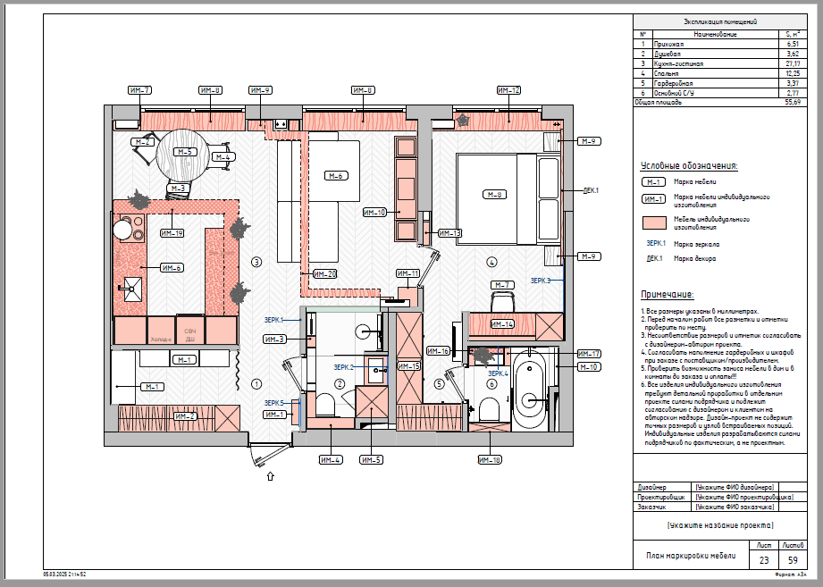
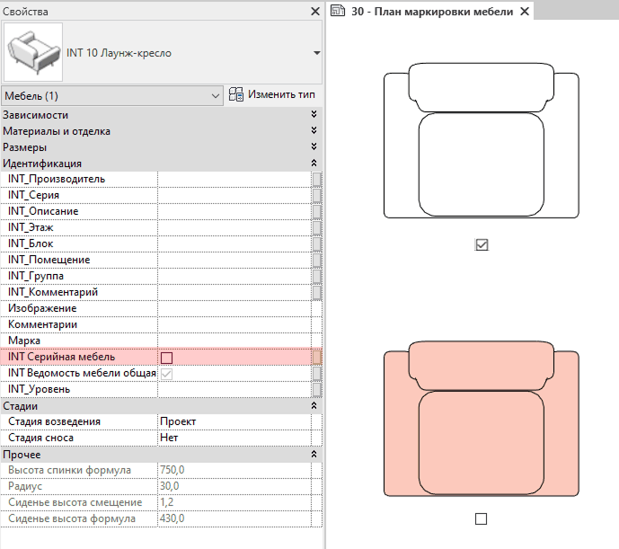

## Назначение

План маркировки мебели нужен для того, чтобы четко разделить всю мебель в проекте на покупную (серийная) и заказную (индивидуального изготовления), а также зафиксировать ее точные габариты и расположение на объекте.

## Что уже настроено

На листе кроме плана также добавлены Экспликация помещений, легенда Условных обозначений и Примечание.

## Что нужно настроить

### Цвет мебели индивидуального изготовления

Вся мебель на плане изначально будет одного цвета. А уже далее для мебели индивидуального изготовления нужно выключить галочку в параметре **INT Серийная мебель**, а для готовой серийной мебели - не выключаем. Нажмите два раза, т.к. первое нажатие лишь активирует работу с параметром, а вот уже второе – выключит полностью галочку.

<CTA type="template" />
