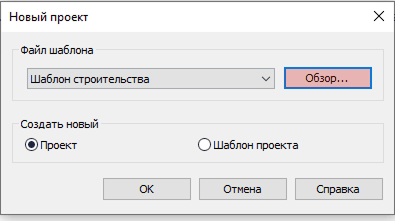
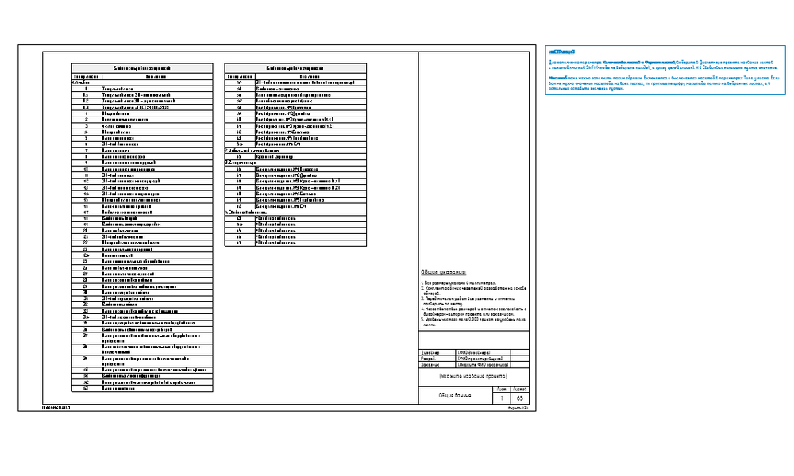

## Как открыть шаблон?

При создании нового проекта нужно нажать “Обзор…” и выбрать один из файлов шаблона от INT LINES.

## Как выбрать нужный файл?

INT_Шаблон интерьера в Revit 1 этаж v2.4 — выбираем, если в проекте будет один этаж.

INT_Шаблон интерьера в Revit 2 этажа v2.4 — выбираем, если в проекте будет два этажа.

INT_Шаблон интерьера в Revit 3 этажа v2.4 — выбираем, если в проекте будет три этажа.

## Где искать текстовые инструкции внутри самого шаблона?

Откройте Диспетчер проекта – Листы. Для листов прописаны текстовые инструкции, которые находятся рядом справа и выделены синими цветом. Для наилучшего понимания шаблона мы рекомендуем сначала пройтись по листам и ознакомиться с текстом.

<CTA type="template" />
