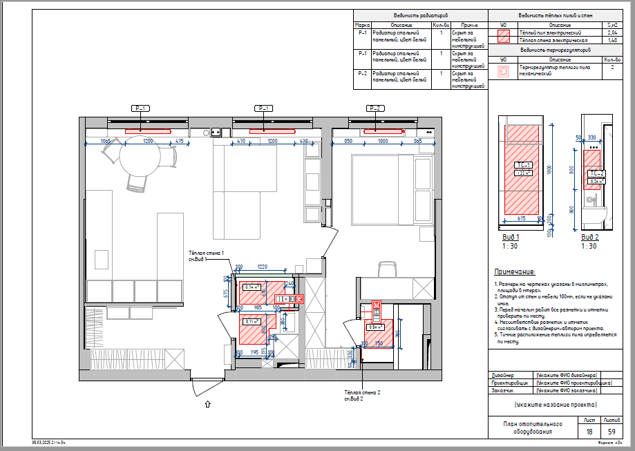
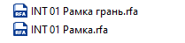
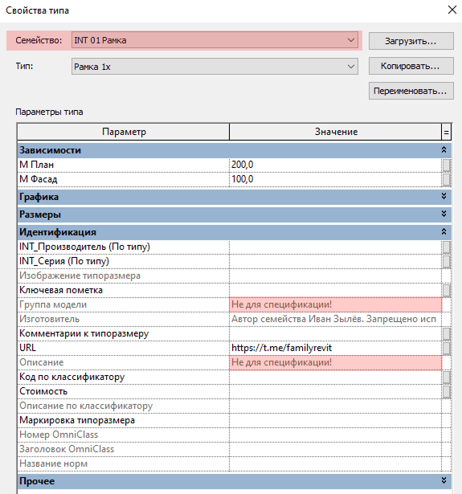
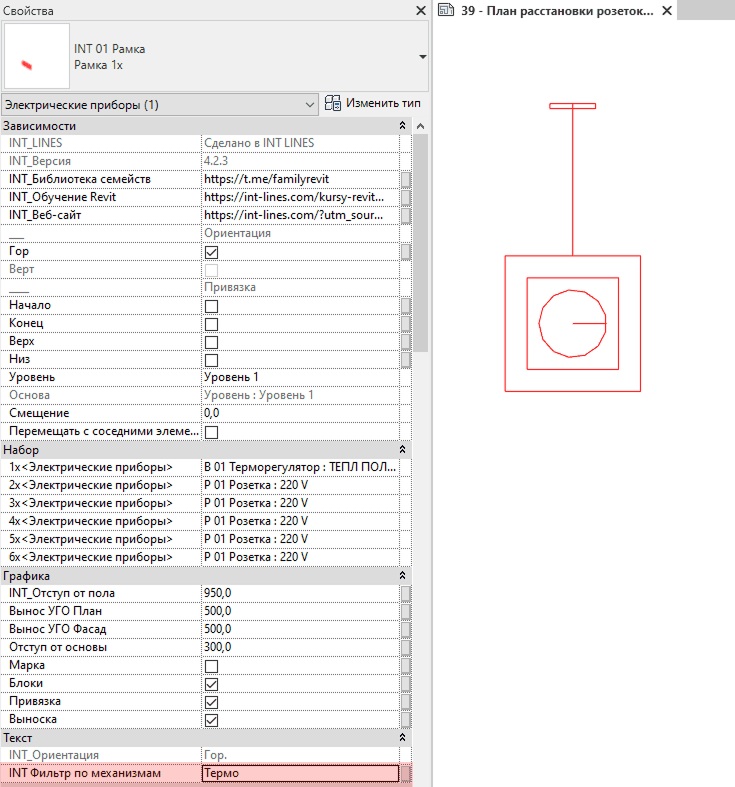

## Назначение

План отопительного оборудования нужен для того, чтобы создать в доме комфортный микроклимат и правильно развести все инженерные коммуникации до начала отделочных работ. Этот чертеж связывает техническую систему отопления с дизайном интерьера, защищая мебель и отделку от порчи.

## Что уже настроено

На листе кроме плана также добавлены Ведомость тёплых полов и стен, Ведомость терморегуляторов, Ведомость радиаторов, Детальные виды-развёртки для отображения тёплых стен и Примечание.

## Что нужно настроить

### Терморегуляторы на листе

Сразу на листе не видна электрика. Чтобы рамки с терморегуляторами попали на лист, зайдите на План расстановки розеток и выключателей, где видна вся размещённая электрика, и сделайте следующее:

1. Выделите рамки, в которых есть терморегулятор. Это именно те рамки, которые Не для спецификации (не выбираем через Tab вложенные рамки).

   

   

2. В параметр по экземпляру **INT Фильтр по механизмам** (Свойства - Текст - INT Фильтр по механизмам) пропишите **Термо**, что является сокращением от Терморегулятор.

   

## Ответы на вопросы

### На листе видна только красная линия привязки рамки

Этот баг в Revit можно сбросить, переключив уровень детализации для вида и обратно.

<CTA type="template" />
