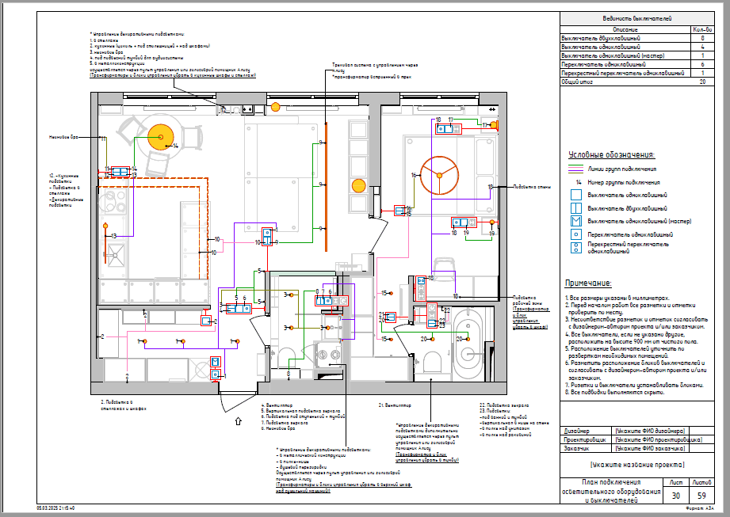
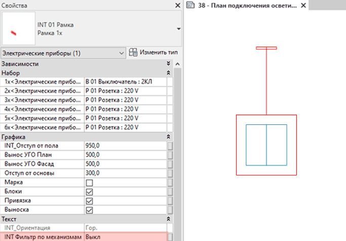

## Назначение

План подключения осветительного оборудования и выключателей нужен для того, чтобы связать все светильники в доме с логикой управления ими и задать строителям точную схему подключения. Без этого чертежа электрики не смогут собрать распределительные коробки, а выключатели будут включать не те лампы или окажутся в неудобных местах.

## Что уже настроено

На листе кроме плана также добавлены Ведомость выключателей, легенда Условных обозначений и Примечание. Линии групп подключения сделаны цветными линиями, а номера групп подключения – текстовыми аннотациями.

## Что нужно настроить

### Выключатели на листе

Сразу на листе не видна электрика. Чтобы рамки с выключателями попали на лист, зайдите на План расстановки розеток и выключателей, где видна вся размещённая электрика, и сделайте следующее:

1. Выделите рамки, в которых есть выключатели. Это именно те рамки, которые Не для спецификации (не выбираем через Tab вложенные рамки).

2. В параметр по экземпляру **INT Фильтр по механизмам** (Свойства - Текст - INT Фильтр по механизмам) пропишите **Выкл**, что является сокращением от Выключатель.

   

## Ответы на вопросы

### На листе видна только красная линия привязки рамки

Этот баг в Revit можно сбросить, переключив уровень детализации для вида и обратно.

<CTA type="template" />
