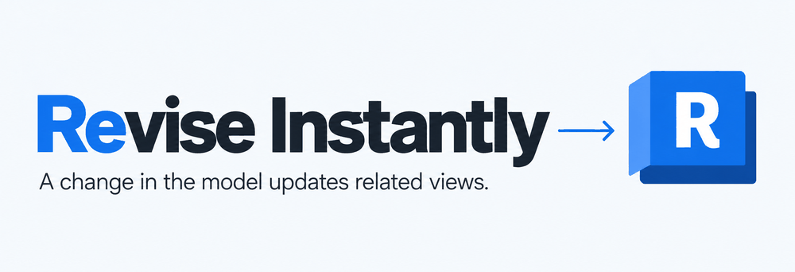
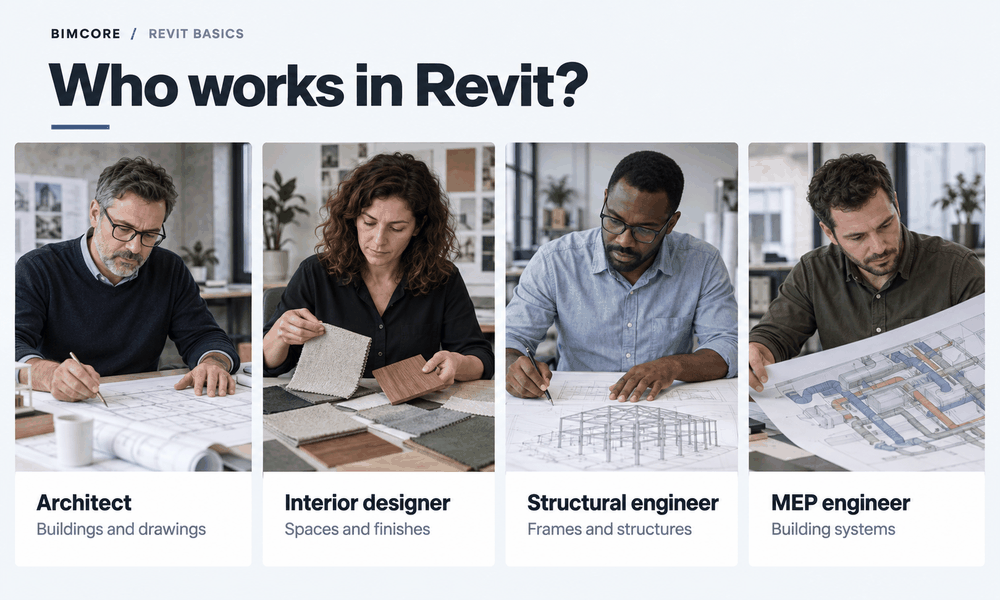
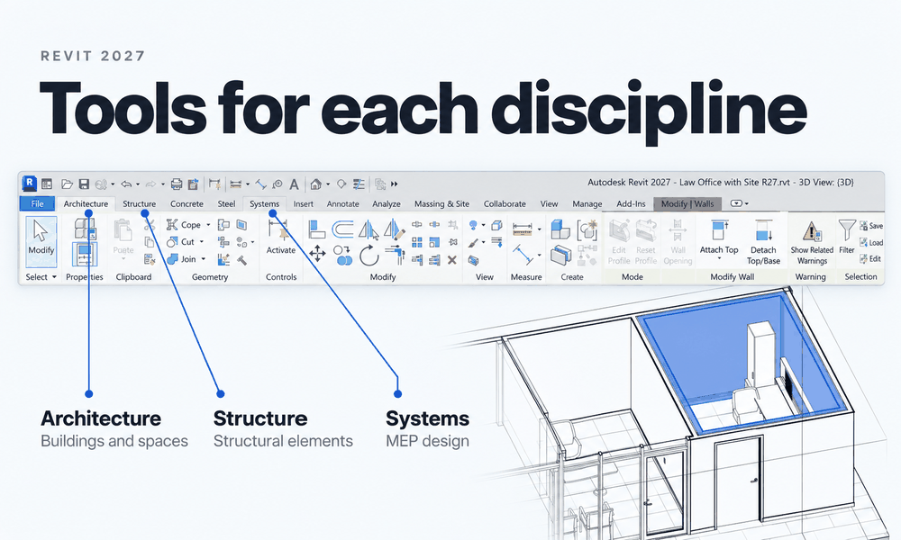
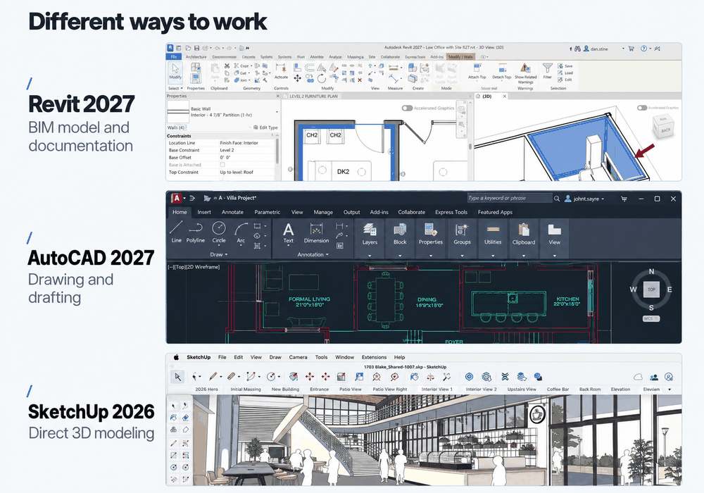
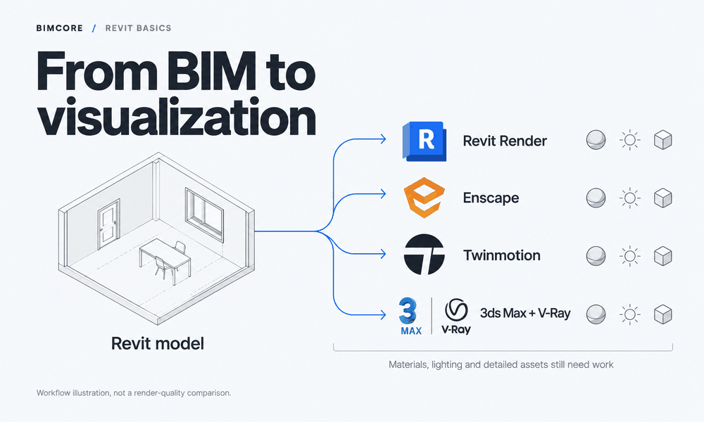
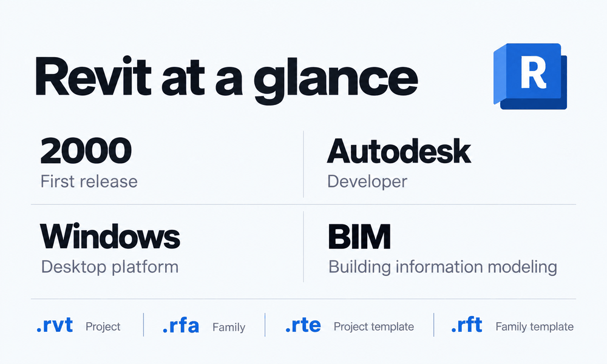

Autodesk Revit это программа, которая позволяет создать информационную модель здания и на её основе сформировать чертежи для строительства. Если вы строитель, архитектор, дизайнер интерьера или инженер, но это определение вам ничего не говорит, то в статье ниже я расскажу простым языком об этой программе. Для чего и кому она нужна? Какие задачи решает идеально, а какие со скрипом? Насколько тяжело и долго её учить и как на ней можно зарабатывать? Ну и конечно же, стоит ли переходить на Revit именно вам. Давайте разберёмся!

## 1. Что такое Revit простым языком

Revit это программа, в которой проектируют всё, что можно построить, от частных домов до небоскрёбов. Особенность программы в том, что вы проектируете сразу в 3D. Фактически вы создаёте цифровую копию реального будущего здания в действительных размерах. Revit позволяет сразу переносить в проект готовые объекты, такие как стены, окна и крыша. Вам не нужно использовать линии (AutoCAD) или самим создавать 3D-геометрию (SketchUp) с нуля, чтобы придать элементу внешнее сходство со стеной или окном. Это чем-то похоже на игру The Sims, но не спешите радоваться, что проектировать в Revit так же легко. Проектирование объектами, а не линиями и 3D-геометрией, это ключевое отличие BIM от CAD-программ.

:::info[Что означает BIM]

**BIM расшифровывается как Building Information Modeling.**

То есть буквально вы строите в этих программах информационную модель. Информация это то, что появляется после того, как вы разместили объект, будь то стена или окно. Это информация о размерах, материале и других атрибутах, которые вы сами решите добавить. Все программы, которые оперируют не линиями, а объектами, это BIM-программы.

:::

:::info[Что означает CAD]

**CAD расшифровывается как Computer-Aided Design, то есть проектирование с помощью компьютера.**

Такие программы помогают вам перейти от создания чертежей карандашом от руки к созданию чертежей линиями и 3D-геометрией на компьютере. То есть это первый шаг после черчения на бумаге.

:::

После создания информационной 3D-модели здания для подготовки документации в Revit используются специальные сущности, виды. На видах отображается определённая проекция объекта сверху, снизу, спереди, сзади или сбоку либо разрез. Вид меняется мгновенно, если меняется информационная модель, поэтому не нужно вручную отслеживать изменения на каждом листе.

:::note[Откуда название Revit]

Название Revit происходит от выражения Revise Instantly именно благодаря тому, что при любом изменении в модели меняется отображение сразу на всех видах. Это действительно очень удобно и полезно.
:::

На видах можно использовать инструменты для простановки размеров и маркировки элементов, чтобы на стройке было понятно, как и из чего собирать наше здание. Эти инструменты называются аннотациями и находятся на соответствующей вкладке.

## 2. Конкретный результат, который можно получить в Revit

Используя Revit для проектирования, в результате вы получаете набор чертежей, по которым будет строиться здание. Если уходить в детали, то вы сможете создавать планы здания, фасады, разрезы, ведомости мебели и оборудования. Да, Revit сам считает площади и количество объектов, из которых состоит проект, и после AutoCAD это настоящее чудо! И да, его нужно проверять и задавать ему правила подсчёта, какие элементы считать, какие атрибуты использовать. Это не так просто, как кажется, но оно того стоит. Настроенный шаблон экономит тонну времени на подсчёте ведомостей. В Revit даже можно получить архитектурную визуализацию на достойном уровне. Но для визуализации интерьера нужно использовать сторонние программы, такие как Enscape и Twinmotion (доступен с подпиской начиная с Revit 2023.1 и устанавливается отдельно) или 3ds Max от Autodesk.

## 3. Кому Revit может быть полезен?

Revit может быть полезен архитекторам, конструкторам, проектировщикам инженерных сетей и дизайнерам интерьера. Архитекторы были первыми, для кого Revit создавался, но не обошли стороной конструкторов и проектировщиков инженерных сетей.

Для каждой профессии свои инструменты. Для архитекторов на вкладке **Архитектура**, для конструкторов на вкладке **Конструкция**, для инженеров на вкладке **Системы**.
Но как же быть с дизайнерами интерьера? Тут дизайнеры, увидев, как легко стало жить архитекторам, решили попробовать работать в Revit, и у них получилось. Да, не всё проходит идеально, иногда приходится придумывать способы решения той или другой задачи, но в целом задача решаема и профит есть.

## 4. Чем Revit отличается от AutoCAD и SketchUp

Главное отличие Revit от AutoCAD и SketchUp в том, что его информационная модель и документация связаны между собой. Все элементы внутри модели - точно известные и понятные и вам, и программе объекты. Каждое изменение внутри Revit отображается мгновенно и в 3D, и на чертежах, и в ведомостях. Для того чтобы полностью описать отличия в работе от других программ, нужны отдельные статьи, и [одна из них уже есть](/ru/blog/revit-vs-sketchup-interior-design/). Но важные различия можно описать здесь.

AutoCAD и SketchUp относятся к [CAD-программам](#1-что-такое-revit-простым-языком). Поэтому всё, что вы в них создаёте, представляет собой набор линий или граней. О том, что вот эта часть окно, а эта стена, знаете только вы, программа об этом не знает и (барабанная дробь) не может это автоматически посчитать. Поэтому количество окон, площадь и объём стен вам нужно считать вручную. Если вы случайно сдвинете или удалите линию и окно исчезнет из плана (или это сделает ваш вредный коллега), то в ведомости останется неверное количество окон, и на стройке вас за это по голове не погладят.

У AutoCAD и SketchUp есть разные надстройки, которые позволяют частично закрывать эти боли. В AutoCAD вы можете создавать группы из набора линий и называть её «стулом», но если вы ошибётесь, забудете создать группу, никто вас не поправит.

Revit же просто не даст вам ошибиться. Если вы случайно удалили окно, оно исчезло и из ведомости, если переместили стену - пересчиталась площадь. Вы всегда можете быть уверены, если внесли изменение на одном чертеже, оно отобразилось везде. Revit помогает вам не совершать ошибки, но что же просит взамен? Об этом в разделе [«Минусы Revit»](#6-минусы-revit).

## 5. Прямые конкуренты, или Revit vs Archicad

Мне Revit нравится больше, но если вы уже хорошо знаете Archicad, Revit вам нужен только для расширения опыта и увеличения зарплаты, но не ради нового функционала. Программы очень похожи и решают одни и те же задачи разными путями и немного отличающимися инструментами.

У Autodesk Revit более серьезный подход к инженерным сетям и конструкциям. Корпорация хочет закрыть все потребности строительного проектирования. Archicad это больше архитектурная программа.

Одно из ключевых отличий меняющиеся мгновенно виды в Revit. В Archicad мгновенно виды не меняются, и это многих бесит, но работать с этим можно, просто не забывайте обновлять виды :)

Ещё Archicad пошёл по пути «всё сделаю сам» и создал больше моделей для пользователей, а Revit решил создать «удочку», чтобы архитекторы сами создавали все модели, что им нужны, и назвал эту удочку редактором семейств. И вот уже пять лет я зарабатываю благодаря этой удочке, создавая [семейства для дизайнеров и архитекторов](https://bimcore.one/). Спасибо Autodesk!

## 6. Минусы Revit

Минусы Revit в одном предложении:

- мало моделей из коробки
- высокая стоимость
- отсутствие версии для macOS
- 3D создавать дольше и сложнее
- нужно следить за параметрами

Первый минус — отсутствие большой библиотеки моделей. Создать реальный проект с семействами (так называются объекты в Revit), которые вы получаете вместе с установкой программы, просто не выйдет. Нужно изучать, как их создавать, либо использовать бесплатные семейства, которых полно в интернете. Мы собрали их в [подборке источников](/ru/blog/free-revit-family-websites/). Но нужно понимать, что для серьёзного проекта их придётся долго и мучительно настраивать под себя. Поэтому следующий минус для вас и плюс для меня, платные профессиональные семейства. Вот тут этот недостаток нивелируется, и Revit даже превосходит Archicad. С профессиональными моделями проектировать в Revit сплошное удовольствие.

2. Второй минус — цена. Вы действительно должны взвесить свои финансовые возможности, чтобы покупать эту программу. На сентябрь 2026 года Autodesk указывает стоимость годовой подписки Revit около 3 000 долларов США за одного пользователя при оплате за год. Цена зависит от региона и условий покупки, поэтому перед оплатой проверьте её на [сайте Autodesk](https://www.autodesk.com/solutions/revit-subscription-faq).

3. Третий минус — Revit работает только на Windows. Для полноценной профессиональной работы лучше не пытайтесь устанавливать его на Mac через виртуальную машину, например Parallels Desktop. Программа запустится, и работать вы сможете, но серьёзные проекты она не вытянет и, по отзывам, будет часто вылетать. Лучше покупайте отдельный компьютер на Windows для работы в Revit.

4. Четвёртый минус - вам теперь нужно создавать 3D вместо 2D, а это дольше! Это свойственно не только Revit, но и любой другой BIM-программе. Вы тратите больше времени на создание чертежей. И что бы кто ни говорил, сразу после изучения Revit вы не станете быстрее проектировать. Скорость придёт только с опытом, шаблоном, заточенным под ваши задачи и необходимыми семействами. Вы можете ускорить создание проекта в 2 раза, но для этого вам нужно настроить систему под ваши задачи.

:::warning[Предупреждение]
На поиск и настройку семейств тратится 50% времени проектирования в Revit. Поэтому, если вы дизайнер или архитектор, сразу могу предложить свой [полный набор](https://bimcore.one/), чтобы закрыть этот минус. Посмотреть состав наборов и их возможности можно в [инструкциях к семействам](/ru/guides/families/).
:::

5. Пятый минус - нужно контролировать значения параметров. Вы вынуждены теперь держать в голове то, что не видно на чертежах - значения параметров. В AutoCAD вам достаточно было взглянуть на чертежи, чтобы проверить правильность их выполнения, здесь ещё нужно зайти в свойства и проверить, какая марка назначена стене, по какому принципу скрывается мебель на планах, где она не нужна.

Это создаёт дополнительную нагрузку на проектировщиков и вынуждает нанимать BIM-специалистов для организации работы в Revit.

## 7. Визуализация в Revit

В Revit не очень хорошая визуализация. Вы можете получить неплохую визуализацию архитектурного проекта, но визуализацию интерьера - точно нет. Я не включил визуализацию в Revit в минусы, так как это не основное назначение этой программы. Вы сможете добиться приемлемого результата при большом количестве потраченных часов, но лучше использовать другие программы.

Кто-то использует SketchUp, кто-то 3ds Max,
кто-то Enscape или Twinmotion, но тут появляется один неприятный момент:

:::warning[Предупреждение]
Модели Revit не подходят для визуализации. Они условные, часто грубые и нереалистичные. Текстуры настраиваются очень ограниченно, нельзя сделать так, чтобы на визуализации деревянный стул или мягкое кресло выглядели фотореалистично.
:::

Поэтому появляется дублирование работы, которое никто не любит, но до сих пор оно сопровождает профессию архитектора интерьеров. Приходится создавать модель для визуализации. И это нужно сделать ещё на самом первом этапе, на этапе концепции, а это большой объём работы, и не хотелось бы его переделывать потом снова в Revit, но приходится.

Эту проблему пытаются решить, но не очень активно. В Twinmotion есть возможность заменить семейство дивана на его фотореалистичную модель, но есть проблема с размерами. Если изменить размеры дивана в Revit, в Twinmotion размер останется прежним. А контроль актуальности двух моделей, это та ещё работа.

На сегодняшний день решения дублирования моделирования нет, поэтому смиряемся и делаем. ИИ, конечно, может немного помочь, сгенерировав из условной схемы из Revit фотореалистичную картинку. Но следите за деталями и, если захотите внести правки, будьте готовы встать на тропу войны с ИИ.

## 8. Revit или Revit LT

Revit LT может подойти для архитектурной модели и чертежей, если вам не нужны плагины, инженерные сети и совместная работа в одной модели. Часто из-за большой цены на Revit некоторые компании задумываются о Revit LT, но в этой версии программы нет поддержки плагинов, а это 50% всей автоматизации работы.
Есть и другие ограничения. Из [официального обзора Autodesk](https://www.autodesk.com/products/revit/compare) в Revit LT нет следующих возможностей:

- Сторонних плагинов через API и Dynamo.
- Совместной работы нескольких пользователей в одной модели через рабочие наборы.
- Полноценного моделирования инженерных сетей MEP и расширенных инструментов для конструкций, например аналитической модели и армирования.
- Работы с облаками точек.
- Проверки пересечений и инструментов копирования и мониторинга.
- Встроенного фотореалистичного рендеринга.

При этом в LT есть редактор семейств, планы, разрезы, фасады, спецификации и листы. Для самостоятельной работы над небольшими архитектурными проектами этого может хватить. Но если ваша команда зависит от плагинов или общей модели, экономия на подписке может обернуться ограничениями в работе.

## 9. Сложно ли учить Revit и сколько это занимает?

Честно отвечу, в зависимости от ваших особенностей освоить базовый функционал и начать реальную профессиональную работу можно за срок от двух недель до двух месяцев. Но набить все шишки и перестать судорожно задавать вопросы ИИ вы сможете где-то через год. За это время вы столкнётесь со всеми критическими вопросами и научитесь их решать.

:::tip[Как учиться эффективнее]

Есть ли что-то, что ускорит обучение? Нет, тут волшебной таблетки нет, и лёгким обучение не будет, так как наши нейроны до последнего сопротивляются и не хотят соединяться. Но могу посоветовать учиться интерактивно. Повторять всё, что найдёте, экспериментировать, искать свой подход, придумывать. Это сделает процесс обучения немного длиннее, зато намного эффективнее. Начать можно с бесплатного курса Revit для дизайнеров интерьера.

:::

Кроме создания проекта, ещё нужно будет научиться разрабатывать семейства. Это необязательно, если у вас есть в команде разработчик семейств, но навык полезный. Освоить можно за один-два месяца. Это больше, чем на освоение разработки проекта, и немного сложнее, но для некоторых людей, типа меня, это чистый кайф :)

## 10. Как зарабатывать на Revit и какие профессии требуют его знания
Зарабатывать на Revit можно либо в корпоративной среде, либо на фрилансе.

Ниже названия корпоративных профессий, где требуется Revit:

- Архитектор, дизайнер интерьера, конструктор или инженер. Вы принимаете проектные решения в своей специальности и оформляете их в модели и документации. Revit помогает в работе, но не заменяет профессиональных знаний.
- BIM-моделлер, BIM-мастер или BIM-специалист. Обычно вы поднимаете 3D-модели, заполняете параметры, создаёте семейства, готовите виды, листы и спецификации.
- BIM-координатор. Вы проверяете, как согласованы модели разных разделов, находите пересечения, передаёте замечания исполнителям и следите за их устранением.
- BIM-менеджер. Вы организуете работу команды с моделями, разрабатываете правила и шаблоны, выбираете инструменты автоматизации и помогаете сотрудникам работать по общим требованиям.

На все профессии, начинающиеся с BIM, часто идут архитекторы и инженеры, которым стало тесно в своей профессии и им нравится автоматизировать процесс. Учатся они либо на практике, либо на узкоспециализированных курсах. Кроме Revit там нужно знать некоторые дополнительные узкоспециализированные программы, например Navisworks.

А вот как можно использовать Revit во фрилансе:

- Поднимать BIM-модель в Revit по 2D-чертежам.
- Разрабатывать семейства.
- Создавать BIM-модели по облакам точек.
- Разрабатывать чертежи для дизайнеров интерьера и архитекторов.

- Автоматизировать повторяющиеся операции, если вы знаете Dynamo или программирование для Revit.

Самый простой вход в создание информационных моделей по 2D-чертежам. Но если постараться, можно выучить любое из этих направлений.

## 11. Короткие факты о Revit
Revit предназначен для информационного моделирования зданий и подготовки проектной документации в строительстве. Ниже пройдёмся чисто по фактам о Revit.

| Что | Данные |
|---|---|
| Первый выпуск | 2000 год |
| Компания | Autodesk, приобрела Revit Technology Corporation в 2002 году |
| Текущая версия | Revit 2027 |
| Операционная система | Windows, отдельной версии для macOS нет |
| .rvt | Файл проекта |
| .rfa | Файл загружаемого семейства |
| .rte | Шаблон проекта |
| .rft | Шаблон семейства |
| Годовая подписка | ~3 000 долларов США за одного пользователя |
| Для кого | Архитекторы, дизайнеры интерьера, конструкторы, инженеры и BIM-специалисты |

Источники сведений о [подписке и версии](https://www.autodesk.com/solutions/revit-subscription-faq), [форматах файлов](https://www.autodesk.com/support/technical/article/caas/sfdcarticles/sfdcarticles/Revit-file-types.html) и [происхождении названия](https://www.autodesk.com/support/technical/article/caas/sfdcarticles/sfdcarticles/How-did-Revit-get-its-name.html) доступны на сайте Autodesk.

## Стоит ли вам учить Revit?

Когда нужно учить Revit:
1. Хотите работать в крупной компании архитектором, дизайнером или инженером или BIM-специалистом
2. Хотите автоматизировать работу архитекторов, дизайнеров и проектировщиков
3. Хотите выпускать рабочую документацию с минимумом ошибок
4. Хотите настроить удобную совместную работу по выпуску документации
5. Хотите зарабатывать на Revit-услугах на фрилансе

## Вопросы и ответы
Ниже короткие ответы на вопросы о стоимости, обучении и выборе версии Revit.

### Revit бесплатный?

Для коммерческой работы Revit требует платной лицензии. Autodesk предлагает пробный доступ и образовательный доступ для тех, кто соответствует его условиям, но образовательная лицензия не предназначена для коммерческих проектов.

### Как скачать студенческую версию Revit бесплатно?

Откройте [страницу Revit для студентов и преподавателей на сайте Autodesk](https://www.autodesk.com/education/edu-software/revit), войдите в свой аккаунт или создайте его, выберите студенческий доступ и подтвердите право на него. После подтверждения выберите доступную версию Revit и скачайте установщик, следуя инструкциям Autodesk.

### На какой срок предоставляется бесплатный студенческий доступ?

Autodesk предоставляет подходящим под условия программы студентам и преподавателям бесплатный доступ на один год с возможностью продления, пока сохраняется право на него. Этот доступ предназначен для образовательных целей, а не для коммерческой работы.

### Что значит слово Revit?

Название Revit происходит от выражения Revise Instantly, которое можно передать как «изменять мгновенно». Оно связано с обновлением модели и связанных с ней представлений при внесении изменений.

### Revit работает на Mac?

Отдельной версии Revit для macOS нет. Для запуска на Mac требуется среда Windows, и совместимость конкретной конфигурации нужно проверять до покупки оборудования.

### Revit подходит для интерьера?

Да, в Revit можно разрабатывать документацию и 3D-схемы интерьеров. Для удобной работы вам понадобятся [подходящие семейства](https://bimcore.one/), настройки видов и интерьерный шаблон. Также потребуется разобраться с подходом именно к проектированию интерьеров, о котором мы рассказываем в наших [уроках](/ru/lessons/) и планируем рассказать в будущем курсе по созданию интерьера в Revit.

### Что выбрать, Revit или SketchUp?

Выбирайте под результат, который вам нужен. Revit стоит рассмотреть для документации, а SketchUp для быстрого объёмного моделирования и поиска формы.

### Сколько учить Revit?

На базовое освоение Revit уходит от двух недель до двух месяцев при регулярной практике. Срок зависит от ваших проектных знаний, задач и времени на обучение.

### Хватит ли Revit LT?

Да, если ваш рабочий процесс укладывается в его возможности. Для плагинов, инженерных сетей и одновременной работы команды в одной модели понадобится полный Revit.

Если остались вопросы, добро пожаловать в наше сообщество.

<CTA type="lesson" />
